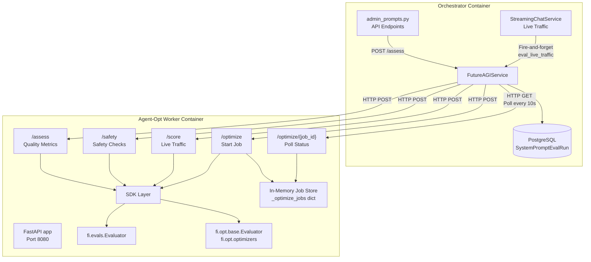
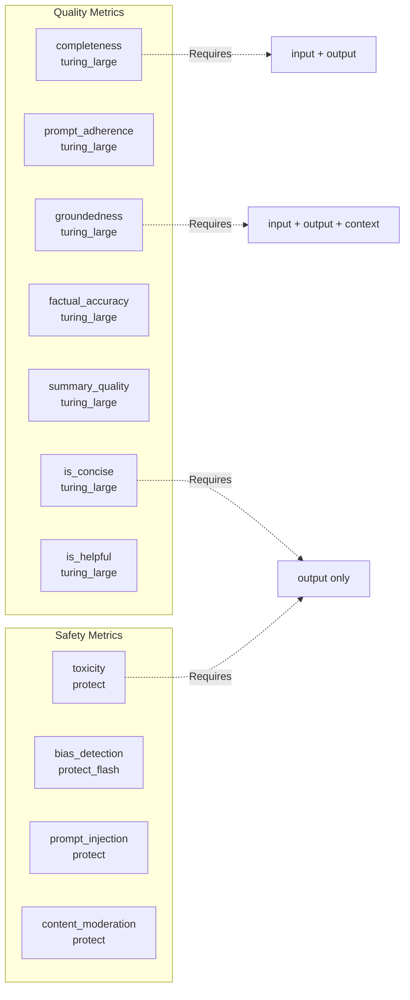
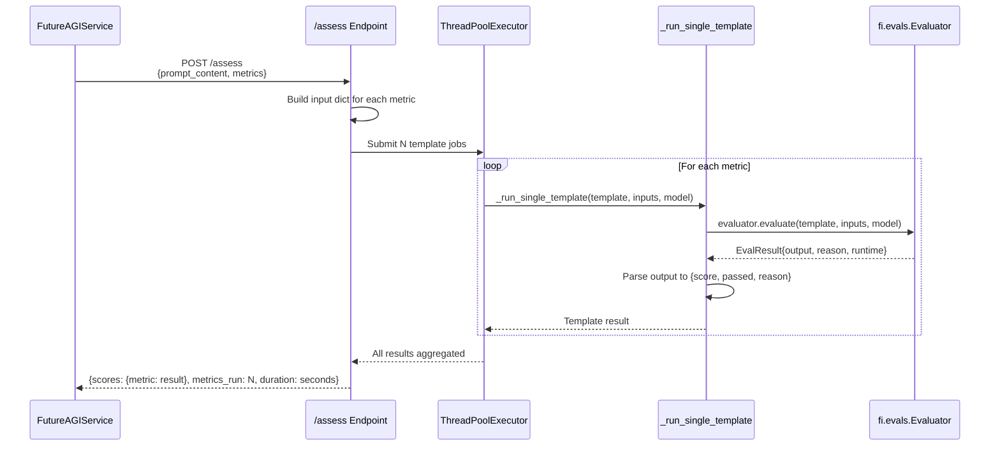
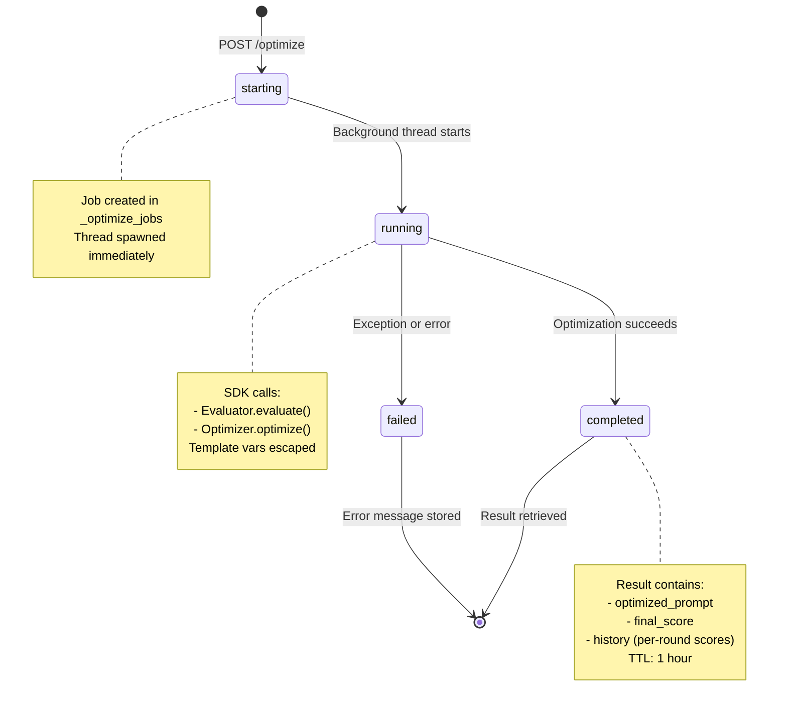
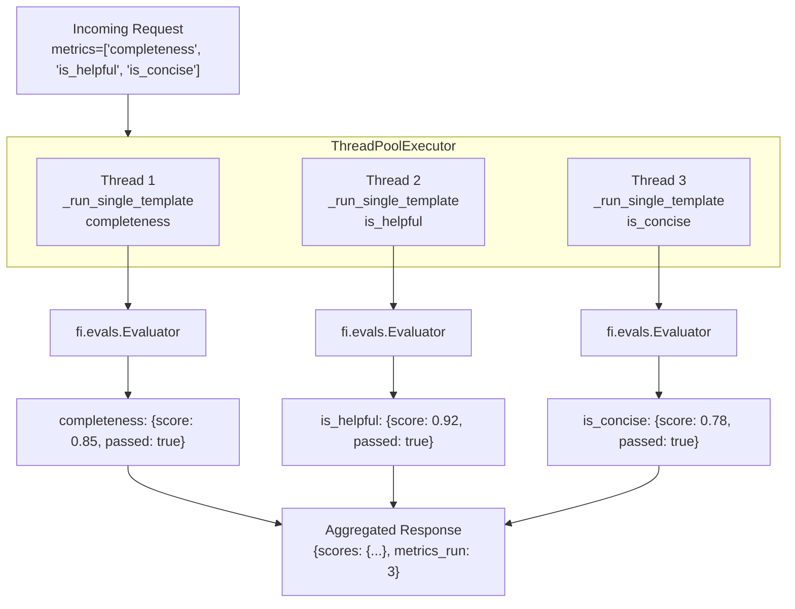
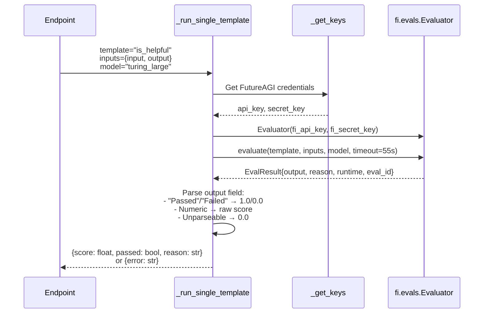
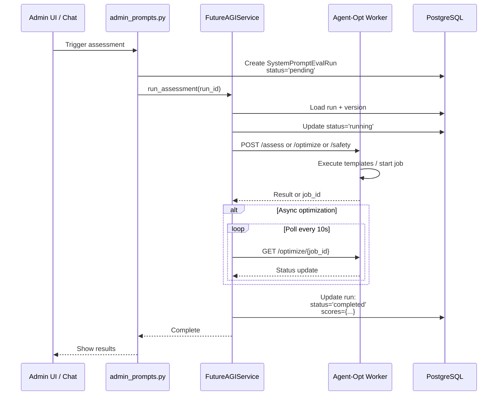

# Agent-Opt Worker Service

<details>
<summary>Relevant source files</summary>

The following files were used as context for generating this wiki page:

- [frontend/components/settings/SystemPromptsTab.tsx](frontend/components/settings/SystemPromptsTab.tsx)
- [orchestrator/core/services/futureagi_service.py](orchestrator/core/services/futureagi_service.py)
- [services/agent-opt-worker/Dockerfile](services/agent-opt-worker/Dockerfile)
- [services/agent-opt-worker/main.py](services/agent-opt-worker/main.py)
- [services/agent-opt-worker/requirements.txt](services/agent-opt-worker/requirements.txt)

</details>


The Agent-Opt Worker Service is an isolated FastAPI microservice that encapsulates all FutureAGI SDK operations (prompt assessment, safety checking, and optimization) in a separate container. This architecture prevents the heavy `agent-opt` and `ai-evaluation` SDK dependencies from being loaded into the main orchestrator process, improving startup time and memory footprint.

**Scope**: This page covers the worker service implementation, its HTTP API, template execution engine, and async job management. For the orchestrator-side client that communicates with this worker, see [Prompt Optimization](#11.4). For system prompt management UI, see [System Prompt Management](#11.1).

---

## Architecture Overview

The agent-opt worker follows a strict isolation pattern where the orchestrator delegates all FutureAGI operations via HTTP, keeping SDK imports confined to the worker container.



**Sources**: services/agent-opt-worker/main.py:1-16, orchestrator/core/services/futureagi_service.py:1-10, docker-compose.yml (not shown but referenced in architecture)

---

## Service Configuration

### Environment Variables

The worker requires FutureAGI API credentials and OpenAI keys for optimization:

| Variable | Required By | Purpose |
|----------|-------------|---------|
| `FUTUREAGI_API_KEY` or `FI_API_KEY` | All endpoints | FutureAGI API authentication |
| `FUTUREAGI_SECRET_KEY` or `FI_SECRET_KEY` | All endpoints | FutureAGI secret key |
| `OPENAI_API_KEY` | `/optimize` only | Teacher model for prompt optimization |

The `_get_keys()` helper normalizes environment variable names and sets `FI_*` variants to ensure SDK auto-detection:

[services/agent-opt-worker/main.py:41-51]()

**Sources**: services/agent-opt-worker/main.py:41-51

### Template Configuration

The worker defines 11 evaluation templates with their required input keys and optimal models:



The `TEMPLATE_CONFIG` dictionary maps each template to its requirements:

[services/agent-opt-worker/main.py:124-136]()

**Sources**: services/agent-opt-worker/main.py:124-136

---

## HTTP API Endpoints

### GET /health

Simple health check endpoint.

**Response**:
```json
{
  "status": "ok",
  "service": "futureagi-worker",
  "version": "3.0.0"
}
```

[services/agent-opt-worker/main.py:193-195]()

### GET /test

Smoke test endpoint that runs three quick evaluations to verify SDK connectivity.

**Tests**: `is_concise`, `is_helpful`, `toxicity`

[services/agent-opt-worker/main.py:198-211]()

**Sources**: services/agent-opt-worker/main.py:193-211

---

### POST /assess

Evaluates a prompt using multiple quality metric templates concurrently. Used for synchronous prompt assessment in the admin UI.

**Request Schema**:
```python
class AssessRequest(BaseModel):
    prompt_content: str
    test_input: Optional[str] = None
    test_output: Optional[str] = None
    metrics: Optional[List[str]] = None  # Defaults to ["completeness", "is_helpful", "is_concise"]
```

**Execution Flow**:



**Concurrent Execution**: Uses `ThreadPoolExecutor` with `max_workers=len(metrics)` to run all templates in parallel:

[services/agent-opt-worker/main.py:227-239]()

**Output Parsing**: Handles both Pass/Fail templates (output="Passed"/"Failed") and numeric score templates (output=0.0-1.0):

[services/agent-opt-worker/main.py:89-114]()

**Sources**: services/agent-opt-worker/main.py:161-166, 218-241, 54-121

---

### POST /safety

Runs safety-focused templates (toxicity, prompt_injection, content_moderation) concurrently. Prepends a preamble to contextualize system prompts and reduce false positives.

**Request Schema**:
```python
class SafetyRequest(BaseModel):
    prompt_content: str
```

**Safety Preamble**:

The worker prepends instructional context to distinguish system prompts from user content:

[services/agent-opt-worker/main.py:247-251]()

This significantly reduces false positives when scanning prompts that contain instructional language about handling sensitive topics.

**Response Structure**:
```json
{
  "safe": true,
  "checks": {
    "toxicity": {"score": 0.0, "safe": true, "reason": "..."},
    "prompt_injection": {"score": 0.0, "safe": true, "reason": "..."},
    "content_moderation": {"score": 0.0, "safe": true, "reason": "..."}
  },
  "duration": 2.3
}
```

**Aggregate Safety Decision**: Returns `safe: true` only if all checks pass:

[services/agent-opt-worker/main.py:288-290]()

**Sources**: services/agent-opt-worker/main.py:168-170, 247-292

---

### POST /score

Scores a real chat exchange (input/output pair) from live traffic. Used by `FutureAGIService.eval_live_traffic()` for fire-and-forget continuous quality monitoring.

**Request Schema**:
```python
class ScoreRequest(BaseModel):
    input_text: str
    output_text: str
    context_text: Optional[str] = None
    metrics: Optional[List[str]] = None  # Defaults to ["completeness", "is_helpful", "is_concise"]
```

**Live Traffic Integration**:

The orchestrator calls this endpoint after every chat response when `SystemPrompt.futureagi_eval_enabled == True`:

[orchestrator/core/services/futureagi_service.py:233-303]()

**Sources**: services/agent-opt-worker/main.py:172-177, 298-327, orchestrator/core/services/futureagi_service.py:233-303

---

### POST /optimize

Starts an asynchronous prompt optimization job using the `agent-opt` SDK. Returns a `job_id` immediately for polling.

**Request Schema**:
```python
class OptimizeRequest(BaseModel):
    prompt_content: str
    dataset: List[Dict[str, str]]  # Min 1 example, [{input: str, output: str}, ...]
    scoring_template: str = "is_helpful"
    algorithm: str = "meta_prompt"  # Options: meta_prompt, bayesian, protegi, random
    num_rounds: int = 3  # 1-20 rounds
    teacher_model: str = "gpt-4o-mini"
    task_description: Optional[str] = None
```

**Optimization Job Lifecycle**:



**Template Variable Escaping**:

The worker escapes `{variable}` placeholders before passing prompts to the SDK to prevent `.format()` crashes:

[services/agent-opt-worker/main.py:351-372]()

Placeholders like `{agent_name}` are replaced with `__TMPL_AGENT_NAME__` during optimization, then restored in the final result.

**Background Thread Execution**:

Jobs run in daemon threads to avoid blocking the HTTP response:

[services/agent-opt-worker/main.py:490-494]()

**In-Memory Job Store**:

Jobs are stored in a module-level dictionary with automatic cleanup after 1 hour:

[services/agent-opt-worker/main.py:333-349]()

**Sources**: services/agent-opt-worker/main.py:179-187, 333-349, 351-372, 375-466, 468-494

---

### GET /optimize/{job_id}

Polls the status of an optimization job. The orchestrator calls this endpoint every 10 seconds until completion (up to 25 minutes).

**Response States**:

| Status | Description | Response Keys |
|--------|-------------|---------------|
| `starting` | Thread spawned, not yet running | `job_id`, `status`, `elapsed_seconds` |
| `running` | Optimization in progress | `job_id`, `status`, `elapsed_seconds` |
| `completed` | Optimization succeeded | `job_id`, `status`, `optimized_prompt`, `final_score`, `initial_score`, `rounds_completed`, `algorithm`, `history`, `duration_seconds` |
| `failed` | Optimization failed | `job_id`, `status`, `error`, `duration_seconds` |
| `404` | Job not found or cleaned up | HTTP 404 error |

**Orchestrator Polling Logic**:

The `FutureAGIService.optimize_prompt()` method polls this endpoint with exponential patience:

[orchestrator/core/services/futureagi_service.py:192-227]()

**Job Cleanup**: Completed/failed jobs are removed after 1 hour to prevent memory leaks:

[services/agent-opt-worker/main.py:338-349]()

**Sources**: services/agent-opt-worker/main.py:497-523, orchestrator/core/services/futureagi_service.py:192-227

---

## Template Execution Engine

### Concurrent Template Execution

All endpoints (`/assess`, `/safety`, `/score`) use the same concurrent execution pattern:



**Benefits**:
- Reduces total latency from ~6s (3×2s) to ~2s (max of 3×2s)
- Uses `concurrent.futures.as_completed()` to process results as they arrive
- Max workers set to template count for full parallelization

[services/agent-opt-worker/main.py:227-239]()

**Sources**: services/agent-opt-worker/main.py:227-239, 264-276, 305-325

---

### Single Template Execution

The `_run_single_template()` function encapsulates the SDK call and result parsing:



**Output Parsing Logic**:

The SDK returns various output formats depending on the template type:

1. **Pass/Fail templates**: `output="Passed"` or `output="Failed"`
2. **Score templates**: `output=0.85` (numeric)
3. **Unparseable**: Defaults to `score=0.0`

[services/agent-opt-worker/main.py:89-114]()

**Error Handling**: All exceptions are caught and returned as `{"error": str(e)}` to prevent thread crashes:

[services/agent-opt-worker/main.py:70-72, 118-120]()

**Sources**: services/agent-opt-worker/main.py:54-121

---

## Optimization Job Management

### Job Store Architecture

Optimization jobs are stored in a module-level dictionary with TTL-based cleanup:

```python
_optimize_jobs: Dict[str, Dict[str, Any]] = {}
_JOB_TTL = 3600  # 1 hour
```

**Job Structure**:
```python
{
    "status": "starting" | "running" | "completed" | "failed",
    "created_at": timestamp,
    "result": {
        "optimized_prompt": str,
        "final_score": float,
        "initial_score": float,
        "rounds_completed": int,
        "algorithm": str,
        "history": [...],
        "duration_seconds": float
    } | None,
    "error": str | None,
    "duration_seconds": float | None
}
```

[services/agent-opt-worker/main.py:333-349]()

**Cleanup Strategy**:

Stale jobs (completed/failed for >1 hour) are removed on each new optimization request:

[services/agent-opt-worker/main.py:338-349]()

**Sources**: services/agent-opt-worker/main.py:333-349

---

### Optimization Algorithms

The worker supports four optimization algorithms via the `agent-opt` SDK:

| Algorithm | Implementation | Description |
|-----------|----------------|-------------|
| `meta_prompt` | `MetaPromptOptimizer` | Default. Uses meta-prompting for iterative refinement |
| `bayesian` | `BayesianSearchOptimizer` | Bayesian optimization with 2-5 examples per iteration |
| `protegi` | `ProTeGi` | Prompt Engineering via Gradients with 4 gradients/beam size |
| `random` | `RandomSearchOptimizer` | Random search baseline |

**Algorithm Creation**:

[services/agent-opt-worker/main.py:525-544]()

**Optimization Execution Flow**:

```mermaid
graph TB
    Start["`POST /optimize`<br/>Dataset + Template"]
    Escape["`_escape_template_vars()`<br/>{agent_name} → __TMPL_AGENT_NAME__"]
    CreateEval["Create Evaluator<br/>template=is_helpful<br/>model=turing_flash"]
    CreateMapper["Create BasicDataMapper<br/>key_map={input, output}"]
    CreateTeacher["Create LiteLLMGenerator<br/>model=gpt-4o-mini"]
    CreateOptimizer["Create Optimizer<br/>algorithm=meta_prompt"]
    
    Run["optimizer.optimize()<br/>- initial_prompts=[escaped]<br/>- num_rounds=3<br/>- eval_subset_size=min(dataset, 10)"]
    
    Restore["`_restore_template_vars()`<br/>__TMPL_AGENT_NAME__ → {agent_name}"]
    
    BuildResult["Build result:<br/>- optimized_prompt<br/>- final_score<br/>- history (per-round)"]
    
    Store["Store in _optimize_jobs[job_id]<br/>status='completed'"]
    
    Start --> Escape
    Escape --> CreateEval
    CreateEval --> CreateMapper
    CreateMapper --> CreateTeacher
    CreateTeacher --> CreateOptimizer
    CreateOptimizer --> Run
    Run --> Restore
    Restore --> BuildResult
    BuildResult --> Store
```

**Key Implementation Details**:

1. **Task Description**: Instructs the optimizer to preserve template placeholders:
   [services/agent-opt-worker/main.py:408-412]()

2. **Eval Subset**: Limits evaluation to 10 examples per round for speed:
   [services/agent-opt-worker/main.py:430]()

3. **History Tracking**: Extracts per-round scores from `result.history`:
   [services/agent-opt-worker/main.py:437-444]()

**Sources**: services/agent-opt-worker/main.py:375-466, 525-544

---

## Deployment

### Docker Container

The worker runs in a minimal Python 3.11 container:

[services/agent-opt-worker/Dockerfile:1-16]()

**Key characteristics**:
- Non-root user (`worker:1000`) for security
- Exposes port 8080
- No persistent volumes (jobs are in-memory)
- Runs via `uvicorn` with default workers

### Dependencies

The worker requires three primary SDKs:

[services/agent-opt-worker/requirements.txt:1-7]()

**SDK Versions**:
- `agent-opt==0.0.1`: Prompt optimization algorithms
- `ai-evaluation>=0.1.9`: FutureAGI evaluation templates
- `litellm>=1.61.0`: Teacher model interface for optimization

**Sources**: services/agent-opt-worker/Dockerfile:1-16, services/agent-opt-worker/requirements.txt:1-7

---

## Error Handling

### Template Execution Errors

Template execution errors are caught and returned as `{"error": str}` to prevent thread pool crashes:

[services/agent-opt-worker/main.py:70-72]()

**Common Errors**:
- SDK timeout (55s limit)
- Invalid template name
- Missing required input keys
- API key validation failures

### Optimization Job Errors

Optimization failures are captured in the job record with status `"failed"`:

[services/agent-opt-worker/main.py:460-465]()

**Failure Scenarios**:
- OpenAI API key not configured
- Dataset too small (<1 example)
- SDK exception during optimization
- Template variable restoration failures

### Orchestrator-Side Error Handling

The `FutureAGIService` handles worker connectivity failures gracefully:

[services/agent-opt-worker/main.py:79-98]()

**Fallback Behavior**:
- Connection errors: `{"error": "FutureAGI worker not available"}`
- Timeouts: `{"error": "Worker timed out after Ns"}`
- HTTP errors: `{"error": "Worker error (status): text"}`

**Sources**: services/agent-opt-worker/main.py:70-72, 79-98, 460-465, orchestrator/core/services/futureagi_service.py:79-98

---

## Performance Characteristics

### Latency Benchmarks

| Endpoint | Typical Duration | Max Workers | Notes |
|----------|------------------|-------------|-------|
| `/assess` | 2-4s | len(metrics) | 3 metrics = ~2-3s total |
| `/safety` | 2-3s | 3 | Fixed 3 checks |
| `/score` | 2-4s | len(metrics) | Fire-and-forget from orchestrator |
| `/optimize` | <100ms | N/A | Returns job_id immediately |
| `/optimize/{id}` | <50ms | N/A | In-memory lookup |

**Optimization Duration**: Full optimization job takes 5-20 minutes depending on:
- Dataset size (1-20 examples)
- Number of rounds (1-20)
- Algorithm complexity (meta_prompt is fastest)
- Teacher model speed (gpt-4o-mini recommended)

### Memory Usage

**Per-Request**: ~50-100MB for SDK overhead + model inference

**Optimization Jobs**: ~200-500MB peak during optimization, released after completion

**Job Store**: Negligible (<1MB per job) until cleanup

**Sources**: services/agent-opt-worker/main.py:26, 218-241, 375-466

---

## Integration with Orchestrator

### Request Flow

The `FutureAGIService` in the orchestrator acts as the sole client of the worker:



**Dataset Collection**: The service collects recent chat I/O pairs for optimization:

[orchestrator/core/services/futureagi_service.py:308-344]()

**Fire-and-Forget Live Scoring**: After each chat response, the service asynchronously scores the exchange:

[orchestrator/core/services/futureagi_service.py:233-303]()

**Sources**: orchestrator/core/services/futureagi_service.py:79-428, services/agent-opt-worker/main.py:1-544

---