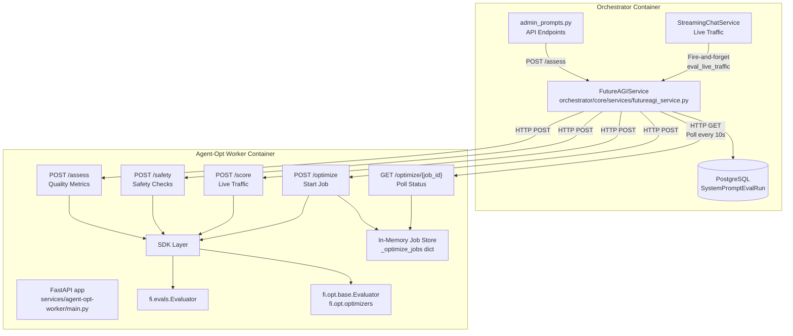
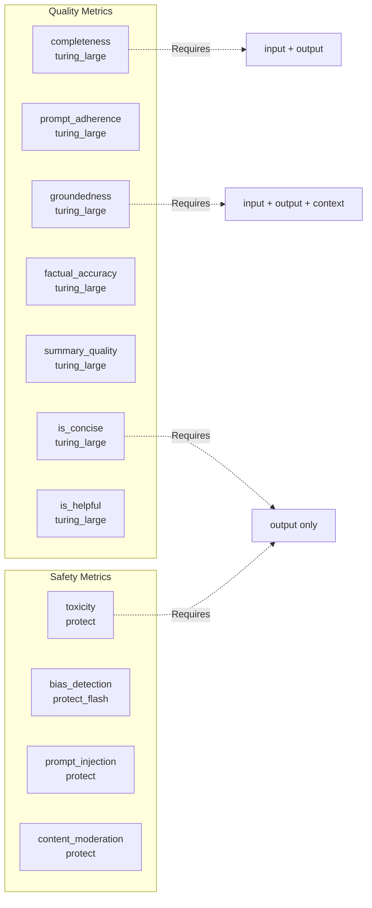

# Agent-Opt Worker Service

Relevant source files

The following files were used as context for generating this wiki page:

- [frontend/components/settings/SystemPromptsTab.tsx](frontend/components/settings/SystemPromptsTab.tsx)
- [orchestrator/core/services/futureagi_service.py](orchestrator/core/services/futureagi_service.py)
- [services/agent-opt-worker/Dockerfile](services/agent-opt-worker/Dockerfile)
- [services/agent-opt-worker/automatos_logging.py](services/agent-opt-worker/automatos_logging.py)
- [services/agent-opt-worker/automatos_metrics.py](services/agent-opt-worker/automatos_metrics.py)
- [services/agent-opt-worker/main.py](services/agent-opt-worker/main.py)
- [services/agent-opt-worker/requirements.txt](services/agent-opt-worker/requirements.txt)
- [services/shared/automatos_logging.py](services/shared/automatos_logging.py)
- [services/shared/automatos_metrics.py](services/shared/automatos_metrics.py)
- [services/workspace-worker/automatos_logging.py](services/workspace-worker/automatos_logging.py)
- [services/workspace-worker/automatos_metrics.py](services/workspace-worker/automatos_metrics.py)

The Agent-Opt Worker Service is an isolated FastAPI microservice that encapsulates all FutureAGI SDK operations (prompt assessment, safety checking, and optimization) in a separate container. This architecture prevents the heavy `agent-opt` and `ai-evaluation` SDK dependencies from being loaded into the main orchestrator process, improving startup time and memory footprint.

**Scope**: This page covers the worker service implementation, its HTTP API, template execution engine, and async job management. For the orchestrator-side client that communicates with this worker, see [Prompt Optimization](). For system prompt management UI, see [System Prompt Management]().

---

## Architecture Overview

The agent-opt worker follows a strict isolation pattern where the orchestrator delegates all FutureAGI operations via HTTP, keeping SDK imports confined to the worker container.

Title: Agent-Opt Worker System Architecture

Sources: [orchestrator/core/services/futureagi_service.py:1-10](), [services/agent-opt-worker/main.py:1-16]()

---

## Service Configuration

### Environment Variables

The worker requires FutureAGI API credentials and OpenAI keys for optimization:

| Variable | Required By | Purpose |
|----------|-------------|---------|
| `FUTUREAGI_API_KEY` or `FI_API_KEY` | All endpoints | FutureAGI API authentication |
| `FUTUREAGI_SECRET_KEY` or `FI_SECRET_KEY` | All endpoints | FutureAGI secret key |
| `OPENAI_API_KEY` | `/optimize` only | Teacher model for prompt optimization |

The `_get_keys()` helper normalizes environment variable names and sets `FI_*` variants to ensure SDK auto-detection: [services/agent-opt-worker/main.py:46-56]().

Sources: [services/agent-opt-worker/main.py:46-56]()

### Template Configuration

The worker defines 11 evaluation templates with their required input keys and optimal models:

Title: Quality and Safety Metric Templates

The `TEMPLATE_CONFIG` dictionary maps each template to its requirements and target models like `turing_large` or `protect`: [services/agent-opt-worker/main.py:129-141]().

Sources: [services/agent-opt-worker/main.py:129-141](), [services/agent-opt-worker/main.py:158-159]()

---

## HTTP API Endpoints

### GET /health

Simple health check endpoint returning service status and version. [services/agent-opt-worker/main.py:15-16]().

### POST /assess

Evaluates a prompt using multiple quality metric templates concurrently. Used for synchronous prompt assessment in the admin UI [frontend/components/settings/SystemPromptsTab.tsx:114-114]().

**Execution Flow**:
The endpoint uses a `ThreadPoolExecutor` to run multiple SDK templates in parallel, significantly reducing total latency for multi-metric assessments.

**Output Parsing**:
The `_run_single_template` function handles both Pass/Fail templates (output="Passed"/"Failed") and numeric score templates (output=0.0-1.0): [services/agent-opt-worker/main.py:59-126](). It uses the `fi.evals.Evaluator` from the FutureAGI SDK: [services/agent-opt-worker/main.py:63-65]().

Sources: [services/agent-opt-worker/main.py:59-126](), [services/agent-opt-worker/main.py:166-171](), [frontend/components/settings/SystemPromptsTab.tsx:114-114]()

---

### POST /safety

Runs safety-focused templates (`toxicity`, `prompt_injection`, `content_moderation`) concurrently.

**Aggregate Safety Decision**: Returns `safe: true` only if all checks pass. The orchestrator triggers this via `FutureAGIService.safety_check()`: [orchestrator/core/services/futureagi_service.py:151-155]().

Sources: [services/agent-opt-worker/main.py:173-175](), [orchestrator/core/services/futureagi_service.py:151-155]()

---

### POST /score

Scores a real chat exchange (input/output pair) from live traffic. Used by `FutureAGIService.assess_prompt()` or similar live traffic scoring triggers.

**Live Traffic Integration**:
The orchestrator calls this endpoint to pull real chat exchanges so scoring is meaningful: [orchestrator/core/services/futureagi_service.py:131-145]().

Sources: [services/agent-opt-worker/main.py:177-182](), [orchestrator/core/services/futureagi_service.py:131-145]()

---

### POST /optimize

Starts an asynchronous prompt optimization job using the `agent-opt` SDK. Returns a `job_id` immediately for polling.

**Background Thread Execution**:
Jobs run in daemon threads to avoid blocking the HTTP response. The orchestrator initiates this via `FutureAGIService.optimize_prompt()`: [orchestrator/core/services/futureagi_service.py:161-187]().

Sources: [services/agent-opt-worker/main.py:185-192](), [orchestrator/core/services/futureagi_service.py:161-187]()

---

### GET /optimize/{job_id}

Polls the status of an optimization job. The orchestrator calls this endpoint every few seconds until completion.

**Orchestrator Polling Logic**:
The `FutureAGIService` handles polling logic on the backend side, making calls to the worker's optimization status path: [orchestrator/core/services/futureagi_service.py:100-112]().

Sources: [services/agent-opt-worker/main.py:13](), [orchestrator/core/services/futureagi_service.py:100-112]()

---

## Observability and Infrastructure

### Logging and Metrics

The worker integrates with the shared `automatos_logging` and `automatos_metrics` modules for centralized observability.

*   **Logging**: Uses `setup_logging` to initialize structured logging for the `agent-opt-worker` service: [services/agent-opt-worker/main.py:34-35](). The `LogRelayHandler` ships these to a central relay: [services/agent-opt-worker/automatos_logging.py:132-161]().
*   **Metrics**: Exposes a `/metrics` endpoint via `add_fastapi_metrics` for Prometheus scraping: [services/agent-opt-worker/main.py:40](). This includes request counts and duration histograms: [services/agent-opt-worker/automatos_metrics.py:49-60]().

Sources: [services/agent-opt-worker/main.py:32-40](), [services/agent-opt-worker/automatos_logging.py:132-161](), [services/agent-opt-worker/automatos_metrics.py:49-129]()

### Deployment

The service is containerized using a slim Python 3.11 base image: [services/agent-opt-worker/Dockerfile:1-16]().

**Key Characteristics**:
*   **Non-root User**: Created at build time for security: [services/agent-opt-worker/Dockerfile:10-11]().
*   **Dependencies**: Includes `agent-opt`, `ai-evaluation`, and `litellm`: [services/agent-opt-worker/requirements.txt:1-8]().
*   **Runtime**: Executed via `uvicorn` on port 8080: [services/agent-opt-worker/Dockerfile:15]().

Sources: [services/agent-opt-worker/Dockerfile:1-16](), [services/agent-opt-worker/requirements.txt:1-8]()

---