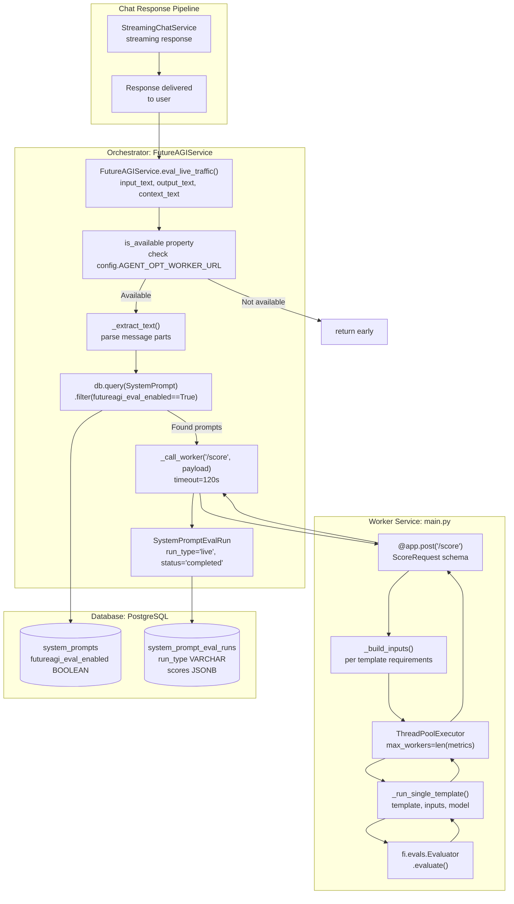
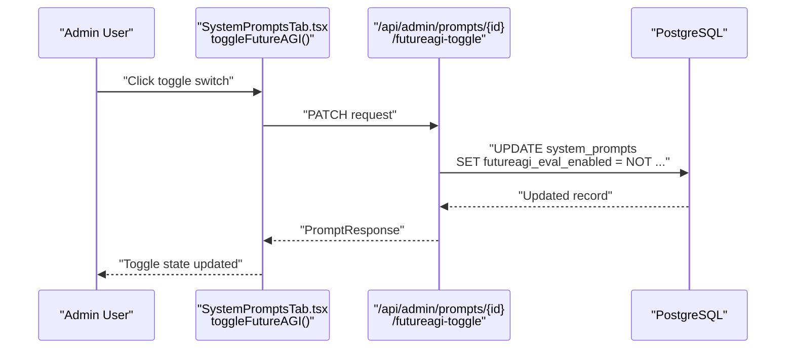
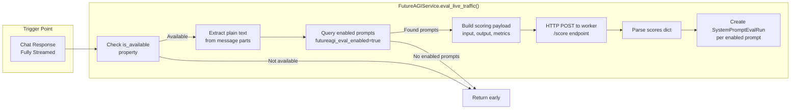
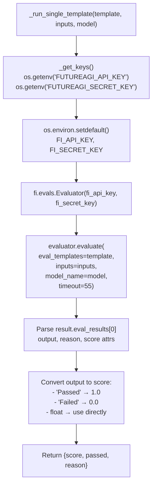

# Live Traffic Scoring

Relevant source files

The following files were used as context for generating this wiki page:

- [frontend/components/settings/SystemPromptsTab.tsx](frontend/components/settings/SystemPromptsTab.tsx)
- [orchestrator/core/services/futureagi_service.py](orchestrator/core/services/futureagi_service.py)
- [services/agent-opt-worker/Dockerfile](services/agent-opt-worker/Dockerfile)
- [services/agent-opt-worker/automatos_logging.py](services/agent-opt-worker/automatos_logging.py)
- [services/agent-opt-worker/automatos_metrics.py](services/agent-opt-worker/automatos_metrics.py)
- [services/agent-opt-worker/main.py](services/agent-opt-worker/main.py)
- [services/agent-opt-worker/requirements.txt](services/agent-opt-worker/requirements.txt)
- [services/shared/automatos_logging.py](services/shared/automatos_logging.py)
- [services/shared/automatos_metrics.py](services/shared/automatos_metrics.py)
- [services/workspace-worker/automatos_logging.py](services/workspace-worker/automatos_logging.py)
- [services/workspace-worker/automatos_metrics.py](services/workspace-worker/automatos_metrics.py)

**Purpose**: This page documents the FutureAGI live traffic scoring system, which automatically evaluates every chat interaction against quality metrics in real-time. This feature builds a dataset of scored input/output pairs that powers prompt optimization and provides continuous quality monitoring.

For information about the broader prompt optimization system, see **15.4 Prompt Optimization**. For details on the worker service that executes scoring, see **15.5 Agent-Opt Worker Service**. For prompt management and versioning, see **15.1 System Prompt Management**.

---

## Overview

Live traffic scoring is a fire-and-forget evaluation system that runs after each chat response is generated. The `FutureAGIService.eval_live_traffic()` method is invoked asynchronously from the chat pipeline and performs the following steps:

1.  Captures user input and assistant output from real conversations. [orchestrator/core/services/futureagi_service.py:234-245]()
2.  Queries all `SystemPrompt` records where `futureagi_eval_enabled=True`. [orchestrator/core/services/futureagi_service.py:251-255]()
3.  Sends input/output pairs to the `agent-opt-worker` service `/score` endpoint. [orchestrator/core/services/futureagi_service.py:265-272]()
4.  Receives scores for quality metrics (completeness, helpfulness, conciseness). [services/agent-opt-worker/main.py:303-331]()
5.  Creates `SystemPromptEvalRun` records with `run_type='live'` for each enabled prompt. [orchestrator/core/services/futureagi_service.py:277-296]()
6.  Builds a dataset for future prompt optimization via `_collect_optimization_dataset()`. [orchestrator/core/services/futureagi_service.py:308-344]()

The system is designed to have **zero impact** on user-facing latency—scoring happens asynchronously after the response is already delivered. If the worker is unavailable or scoring fails, errors are logged but never propagated. [orchestrator/core/services/futureagi_service.py:299-302]()

**Sources**: [orchestrator/core/services/futureagi_service.py:234-344](), [services/agent-opt-worker/main.py:303-331]()

---

## System Architecture

**Diagram: Live Traffic Scoring Data Flow**

**Sources**: [orchestrator/core/services/futureagi_service.py:45-70](), [orchestrator/core/services/futureagi_service.py:234-301](), [services/agent-opt-worker/main.py:10-16](), [services/agent-opt-worker/main.py:298-331]()

---

## Enabling Live Scoring

Live traffic scoring is controlled by the `futureagi_eval_enabled` flag on the `SystemPrompt` model. [frontend/components/settings/SystemPromptsTab.tsx:53]()

### Database Model

| Field | Type | Description |
| :--- | :--- | :--- |
| `futureagi_eval_enabled` | Boolean | When `true`, every chat interaction scores this prompt [frontend/components/settings/SystemPromptsTab.tsx:53]() |
| `slug` | String | Unique identifier (e.g., "chatbot-friendly") [frontend/components/settings/SystemPromptsTab.tsx:47]() |
| `category` | String | Grouping (personality, orchestrator, specialized) [frontend/components/settings/SystemPromptsTab.tsx:49]() |

### Frontend Toggle

The `SystemPromptsTab` admin UI includes a toggle switch for each prompt to enable or disable FutureAGI evaluation. [frontend/components/settings/SystemPromptsTab.tsx:554-572]()

**Sources**: [frontend/components/settings/SystemPromptsTab.tsx:52-59](), [frontend/components/settings/SystemPromptsTab.tsx:249-259](), [frontend/components/settings/SystemPromptsTab.tsx:554-572]()

---

## Scoring Flow

### Invocation

The `eval_live_traffic()` method is called from the chat streaming pipeline after a response completes. [orchestrator/core/services/futureagi_service.py:234-245]()

**Sources**: [orchestrator/core/services/futureagi_service.py:234-301]()

### Text Extraction

Messages are stored as JSON arrays of parts. The `_extract_text()` helper extracts plain text from these complex structures by iterating through parts and filtering for `type: "text"`. [orchestrator/core/services/futureagi_service.py:30-42]()

### Worker Communication

The orchestrator's `_call_worker()` method wraps HTTP communication with error handling, connection retries, and timeouts using `httpx.AsyncClient`. [orchestrator/core/services/futureagi_service.py:79-98]()

**Request Schema** (`ScoreRequest`): [services/agent-opt-worker/main.py:177-181]()

| Field | Type | Required | Description |
| :--- | :--- | :--- | :--- |
| `input_text` | String | Yes | User's input message |
| `output_text` | String | Yes | Assistant's response |
| `context_text` | String | No | Additional context |
| `metrics` | List[String] | No | Defaults to `["completeness", "is_helpful", "is_concise"]` |

**Sources**: [orchestrator/core/services/futureagi_service.py:79-98](), [orchestrator/core/services/futureagi_service.py:258-272](), [services/agent-opt-worker/main.py:177-181](), [services/agent-opt-worker/main.py:303-331]()

---

## Metrics and Templates

### Default Metrics

Live scoring uses three core quality metrics by default. [orchestrator/core/services/futureagi_service.py:232]()

| Metric | Template | Model | Description |
| :--- | :--- | :--- | :--- |
| `completeness` | Quality metric | `turing_large` | Does the output fully address the input? |
| `is_helpful` | Quality metric | `turing_large` | Is the response genuinely useful? |
| `is_concise` | Quality metric | `turing_large` | Is it brief without losing clarity? |

**Sources**: [orchestrator/core/services/futureagi_service.py:232](), [services/agent-opt-worker/main.py:129-141]()

### Scoring Engine

**Diagram: Worker _run_single_template() Execution**

The worker's `_run_single_template()` function handles multiple output types from the FutureAGI SDK, converting string results ("Passed"/"Failed") or numeric scores into a unified format. [services/agent-opt-worker/main.py:59-126]()

**Sources**: [services/agent-opt-worker/main.py:46-56](), [services/agent-opt-worker/main.py:59-126]()

### Concurrent Execution

All requested metrics run **concurrently** using Python's `ThreadPoolExecutor` within the worker service to minimize total scoring latency. [services/agent-opt-worker/main.py:313-316]()

---

## Data Storage

### SystemPromptEvalRun Model

Each live scoring event creates one database record **per enabled prompt** with `run_type='live'`. [orchestrator/core/services/futureagi_service.py:277-296]()

| Field | Type | Description |
| :--- | :--- | :--- |
| `run_type` | String | `"live"` for live traffic scoring |
| `scores` | JSONB | Full scoring results from worker (metrics, scores, reasons) |
| `status` | String | Typically `"completed"` for live runs |

**Sources**: [orchestrator/core/services/futureagi_service.py:277-296]()

---

## Integration with Prompt Optimization

Live traffic scoring builds the dataset used for prompt optimization by logging real user interactions. [orchestrator/core/services/futureagi_service.py:308-344]()

### Dataset Collection

The `_collect_optimization_dataset()` method queries historical chat messages to build training data for the Meta-Prompting algorithms. It extracts text from message parts and pairs user messages with the subsequent assistant response. [orchestrator/core/services/futureagi_service.py:308-344]()

**Sources**: [orchestrator/core/services/futureagi_service.py:30-42](), [orchestrator/core/services/futureagi_service.py:308-344]()

---

## Performance Considerations

### Fire-and-Forget Pattern

Live scoring is implemented as a fire-and-forget operation to ensure **zero user-facing latency**. The orchestrator dispatches the task asynchronously after the chat stream is finalized. [orchestrator/core/services/futureagi_service.py:234-245]()

### Error Handling

The `eval_live_traffic()` method implements multiple layers of error handling to ensure scoring failures (e.g., worker timeout, SDK errors) never impact chat functionality. [orchestrator/core/services/futureagi_service.py:268-272](), [orchestrator/core/services/futureagi_service.py:299-302]()

**Sources**: [orchestrator/core/services/futureagi_service.py:79-98](), [orchestrator/core/services/futureagi_service.py:234-245](), [orchestrator/core/services/futureagi_service.py:268-272](), [orchestrator/core/services/futureagi_service.py:299-302]()

---

## Frontend Visualization

### Assessment Runs Display

The `SystemPromptsTab` admin UI displays live scoring results in the "Assessments" tab, allowing admins to see real-world performance. [frontend/components/settings/SystemPromptsTab.tsx:551-723]()

**Sources**: [frontend/components/settings/SystemPromptsTab.tsx:551-723]()

### Score Rendering

Each metric displays a color indicator, the metric name, score percentage, and a collapsible reason explanation derived from the worker's SDK response. [frontend/components/settings/SystemPromptsTab.tsx:617-635]()

**Sources**: [frontend/components/settings/SystemPromptsTab.tsx:617-635]()

---

## Configuration

### Environment Variables

**Orchestrator** (`config.py`):

| Variable | Required | Default | Description |
| :--- | :--- | :--- | :--- |
| `AGENT_OPT_WORKER_URL` | Yes | N/A | Worker service base URL [orchestrator/core/services/futureagi_service.py:25]() |

**Worker Service** (`services/agent-opt-worker/main.py`):

| Variable | Required | Description |
| :--- | :--- | :--- |
| `FUTUREAGI_API_KEY` | Yes | FutureAGI platform API key [services/agent-opt-worker/main.py:47]() |
| `FUTUREAGI_SECRET_KEY` | Yes | FutureAGI platform secret key [services/agent-opt-worker/main.py:48]() |

**Sources**: [orchestrator/core/services/futureagi_service.py:21-26](), [orchestrator/core/services/futureagi_service.py:63-69](), [services/agent-opt-worker/main.py:46-56]()

### Worker Dependencies

The `agent-opt-worker` requires the `agent-opt` and `ai-evaluation` packages to interface with the FutureAGI platform. [services/agent-opt-worker/requirements.txt:3-4]()

**Sources**: [services/agent-opt-worker/requirements.txt:3-4]()

### Docker Setup

The worker runs as an isolated service with its own container, exposing port 8080 and using `uvicorn` as the server. [services/agent-opt-worker/Dockerfile:1-16]()

**Sources**: [services/agent-opt-worker/Dockerfile:1-16](), [services/agent-opt-worker/main.py:32-40]()

---