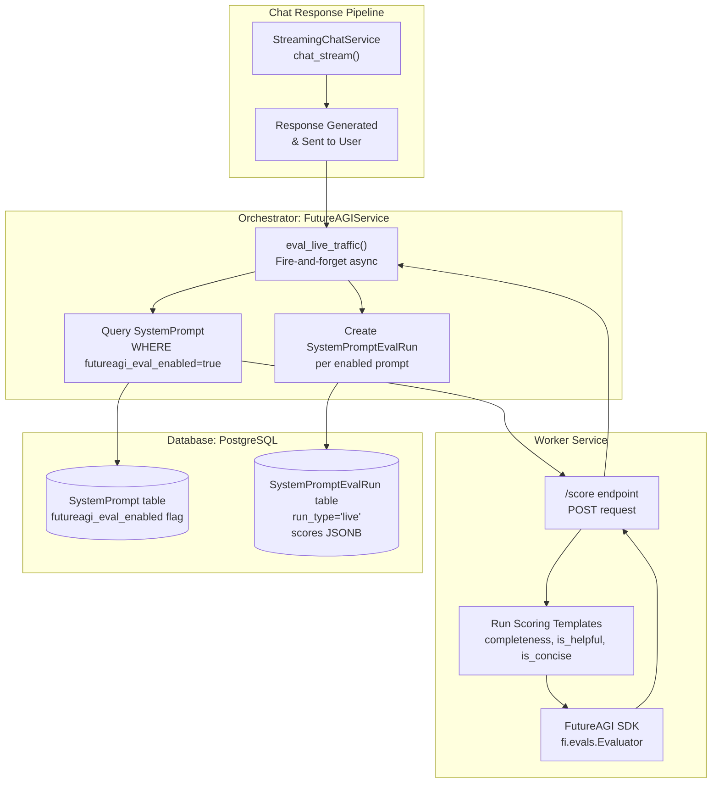
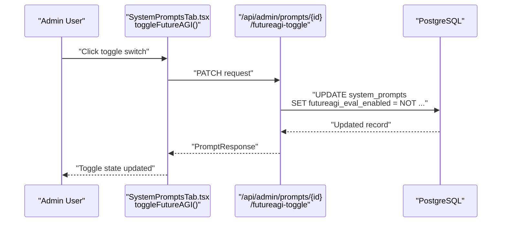
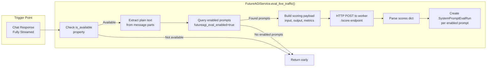
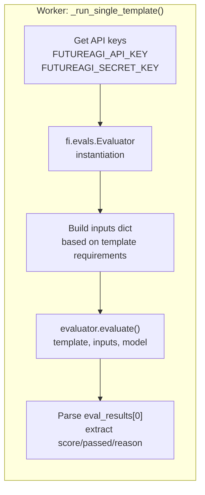
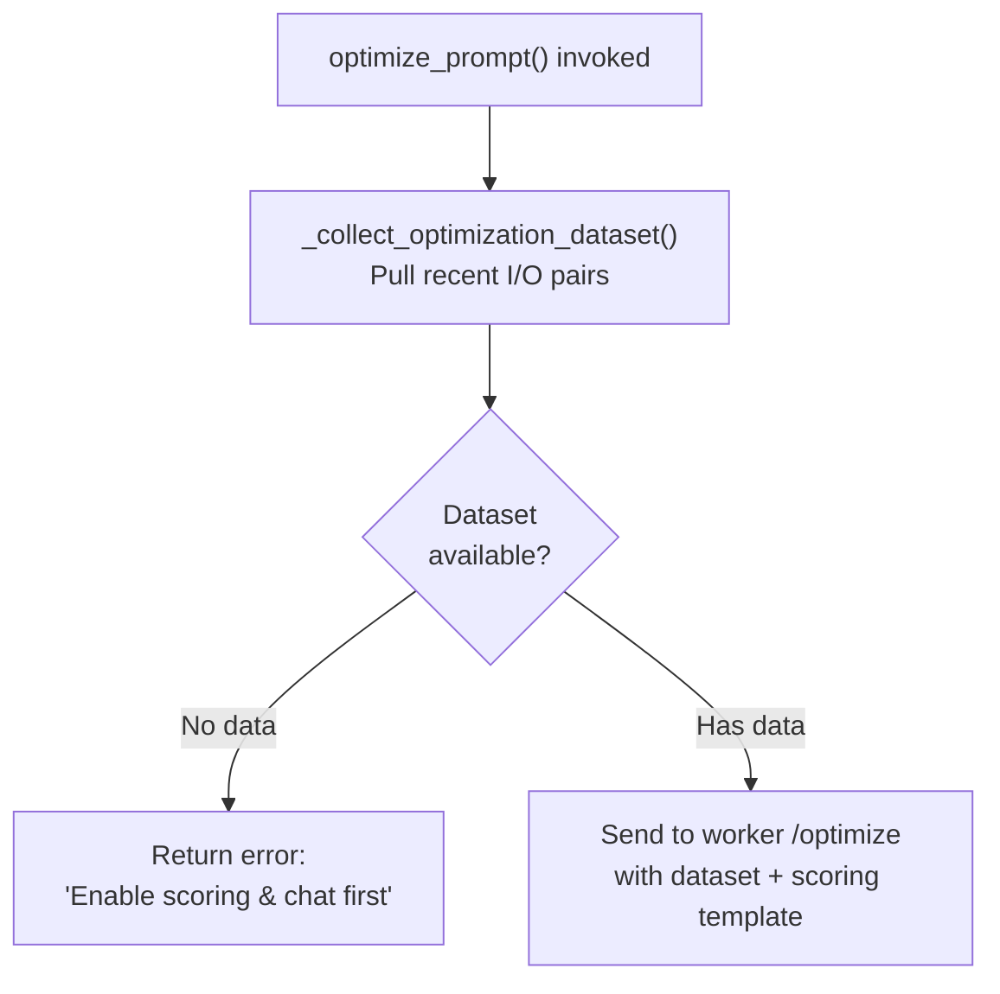
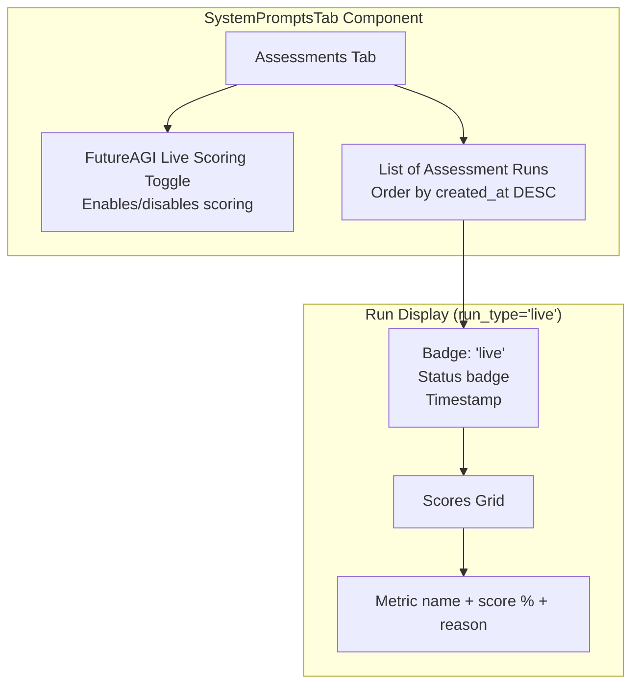

# Live Traffic Scoring

<details>
<summary>Relevant source files</summary>

The following files were used as context for generating this wiki page:

- [frontend/components/settings/SystemPromptsTab.tsx](frontend/components/settings/SystemPromptsTab.tsx)
- [orchestrator/core/services/futureagi_service.py](orchestrator/core/services/futureagi_service.py)
- [services/agent-opt-worker/Dockerfile](services/agent-opt-worker/Dockerfile)
- [services/agent-opt-worker/main.py](services/agent-opt-worker/main.py)
- [services/agent-opt-worker/requirements.txt](services/agent-opt-worker/requirements.txt)

</details>


**Purpose**: This page documents the FutureAGI live traffic scoring system, which automatically evaluates every chat interaction against quality metrics in real-time. This feature builds a dataset of scored input/output pairs that powers prompt optimization and provides continuous quality monitoring.

For information about the broader prompt optimization system, see [Prompt Optimization](#11.4). For details on the worker service that executes scoring, see [Worker Service Architecture](#11.5). For prompt management and versioning, see [System Prompt Management](#11.1).

---

## Overview

Live traffic scoring is a fire-and-forget evaluation system that runs after each chat response is generated. When enabled for a system prompt, it:

1. Captures the user input and assistant output from real conversations
2. Sends them to the `agent-opt-worker` service for scoring
3. Evaluates the exchange against quality metrics (completeness, helpfulness, conciseness)
4. Stores scores in the database as evaluation runs
5. Builds a dataset for future prompt optimization

The system is designed to have **zero impact** on user-facing latency—scoring happens asynchronously after the response is already delivered.

**Sources**: [orchestrator/core/services/futureagi_service.py:229-301]()

---

## System Architecture



**Sources**: [orchestrator/core/services/futureagi_service.py:44-49](), [orchestrator/core/services/futureagi_service.py:229-301](), [services/agent-opt-worker/main.py:298-326]()

---

## Enabling Live Scoring

Live traffic scoring is controlled by the `futureagi_eval_enabled` flag on the `SystemPrompt` model. Admins can toggle this flag via the UI or API.

### Database Model

| Field | Type | Description |
|-------|------|-------------|
| `futureagi_eval_enabled` | Boolean | When `true`, every chat interaction scores this prompt |
| `slug` | String | Unique identifier (e.g., "chatbot-friendly") |
| `category` | String | Grouping (personality, orchestrator, specialized) |

**Sources**: [orchestrator/core/models/system_prompts.py:32-69]()

### Frontend Toggle

The System Prompts admin UI includes a toggle switch for each prompt:



**Sources**: [frontend/components/settings/SystemPromptsTab.tsx:249-259](), [frontend/components/settings/SystemPromptsTab.tsx:554-572](), [orchestrator/api/admin_prompts.py:341-357]()

### API Endpoint

```
PATCH /api/admin/prompts/{prompt_id}/futureagi-toggle
```

Toggles the flag and returns the updated `PromptResponse`. Requires admin authentication.

**Sources**: [orchestrator/api/admin_prompts.py:341-357]()

---

## Scoring Flow

### Invocation

The `eval_live_traffic()` method is called from the chat streaming pipeline after a response completes. It runs asynchronously and never blocks the user response.



**Sources**: [orchestrator/core/services/futureagi_service.py:234-301]()

### Text Extraction

Messages are stored as JSON arrays of parts (text, tool calls, etc.). The `_extract_text()` helper extracts plain text:

```python
# Example message parts format:
[
    {"type": "text", "text": "What is 2+2?"},
    {"type": "tool_call", "id": "call_123", ...}
]
```

**Sources**: [orchestrator/core/services/futureagi_service.py:29-41]()

### Worker Communication

The orchestrator sends a POST request to the worker's `/score` endpoint:

```json
{
  "input_text": "What is 2+2?",
  "output_text": "2+2 equals 4.",
  "context_text": null,
  "metrics": ["completeness", "is_helpful", "is_concise"]
}
```

The worker responds with scores:

```json
{
  "scores": {
    "completeness": {"score": 1.0, "passed": true, "reason": "..."},
    "is_helpful": {"score": 0.9, "passed": true, "reason": "..."},
    "is_concise": {"score": 0.8, "passed": true, "reason": "..."}
  },
  "metrics_run": 3,
  "source": "live_traffic",
  "duration": 2.1
}
```

**Sources**: [orchestrator/core/services/futureagi_service.py:258-272](), [services/agent-opt-worker/main.py:298-326]()

---

## Metrics and Templates

### Default Metrics

Live scoring uses three core quality metrics defined in `FutureAGIService.LIVE_METRICS`:

| Metric | Template | Model | Description |
|--------|----------|-------|-------------|
| `completeness` | Quality metric | `turing_large` | Does the output fully address the input? |
| `is_helpful` | Quality metric | `turing_large` | Is the response genuinely useful? |
| `is_concise` | Quality metric | `turing_large` | Is it brief without losing clarity? |

**Sources**: [orchestrator/core/services/futureagi_service.py:232](), [services/agent-opt-worker/main.py:124-136]()

### Scoring Engine

The worker uses the FutureAGI SDK to run scoring templates:



**Sources**: [services/agent-opt-worker/main.py:54-121](), [services/agent-opt-worker/main.py:298-326]()

### Input Building

Each template requires specific input keys. The `_build_inputs()` function maps the provided text to template requirements:

```python
# Template config example:
"completeness": {"keys": ["input", "output"], "model": "turing_large"}
"is_helpful": {"keys": ["input", "output"], "model": "turing_large"}
"is_concise": {"keys": ["output"], "model": "turing_large"}
```

**Sources**: [services/agent-opt-worker/main.py:124-150]()

### Concurrent Execution

All metrics run **concurrently** using `ThreadPoolExecutor` to minimize total latency:

```python
with ThreadPoolExecutor(max_workers=len(metrics)) as pool:
    futures = {}
    for template in metrics:
        inputs = _build_inputs(template, req.input_text, req.output_text)
        model = _get_model(template)
        futures[pool.submit(_run_single_template, template, inputs, model)] = template
    for future in as_completed(futures):
        # Collect results
```

**Sources**: [services/agent-opt-worker/main.py:303-324]()

---

## Data Storage

### SystemPromptEvalRun Model

Each live scoring event creates one database record **per enabled prompt**:

| Field | Type | Description |
|-------|------|-------------|
| `id` | UUID | Primary key |
| `prompt_id` | UUID | FK to SystemPrompt |
| `version_id` | UUID | FK to SystemPromptVersion (active version at time of scoring) |
| `run_type` | String | `"live"` for live traffic scoring |
| `status` | String | `"completed"` (set immediately) |
| `scores` | JSONB | Full scoring results from worker |
| `started_at` | DateTime | Scoring start time |
| `completed_at` | DateTime | Scoring end time |
| `created_at` | DateTime | Record creation time |

**Sources**: [orchestrator/core/models/system_prompts.py:108-139]()

### Scores JSONB Structure

The `scores` field stores the complete scoring response:

```json
{
  "scores": {
    "completeness": {
      "score": 1.0,
      "passed": true,
      "reason": "The output fully addresses the input question..."
    },
    "is_helpful": {
      "score": 0.9,
      "passed": true,
      "reason": "The response provides clear, actionable information..."
    },
    "is_concise": {
      "score": 0.8,
      "passed": true,
      "reason": "Brief and to the point without unnecessary elaboration..."
    }
  },
  "metrics_run": 3,
  "source": "live_traffic"
}
```

**Sources**: [orchestrator/core/services/futureagi_service.py:284-296]()

### Record Creation

A separate `SystemPromptEvalRun` is created for **each** enabled prompt, allowing comparison across different prompt configurations:

```python
for prompt in enabled_prompts:
    version = db.query(SystemPromptVersion).filter(
        SystemPromptVersion.prompt_id == prompt.id,
        SystemPromptVersion.status == "active",
    ).first()
    if not version:
        continue
    
    run = SystemPromptEvalRun(
        prompt_id=prompt.id,
        version_id=version.id,
        run_type="live",
        status="completed",
        scores={"scores": scores, "metrics_run": len(scores), "source": "live_traffic"},
        started_at=datetime.utcnow(),
        completed_at=datetime.utcnow(),
    )
    db.add(run)
```

**Sources**: [orchestrator/core/services/futureagi_service.py:276-294]()

---

## Integration with Prompt Optimization

Live traffic scoring builds the dataset used for prompt optimization. When an admin triggers optimization, the system:

1. Queries `SystemPromptEvalRun` records with `run_type="live"`
2. Extracts input/output pairs from recent chat messages
3. Uses these real examples to optimize the prompt

### Dataset Collection

The `_collect_optimization_dataset()` method queries the `messages` table to build training data:

```sql
SELECT m1.parts, m2.parts
FROM messages m1
JOIN messages m2
  ON m1.chat_id = m2.chat_id
  AND m2.role = 'assistant'
  AND m2.created_at = (
      SELECT MIN(created_at) FROM messages
      WHERE chat_id = m1.chat_id AND role = 'assistant'
      AND created_at > m1.created_at
  )
WHERE m1.role = 'user'
ORDER BY m1.created_at DESC
LIMIT :limit
```

This finds user/assistant pairs (the assistant message immediately following each user message) and extracts the text.

**Sources**: [orchestrator/core/services/futureagi_service.py:307-343]()

### Usage in Optimization

When `optimize_prompt()` is called, it:



**Sources**: [orchestrator/core/services/futureagi_service.py:160-226]()

The optimization worker uses this dataset to evaluate prompt variants, finding versions that score better on the target metrics.

---

## Performance Considerations

### Fire-and-Forget Pattern

Live scoring is implemented as a fire-and-forget operation to ensure **zero user-facing latency**:

```python
async def eval_live_traffic(
    self,
    input_text: str,
    output_text: str,
    context_text: Optional[str] = None,
) -> None:
    """
    Fire-and-forget after each chat response.
    Finds all prompts with eval enabled, scores via worker, stores results.
    """
    if not self.is_available:
        return  # Early exit, no work done
```

The method returns `None` immediately and never raises exceptions that would affect the chat pipeline.

**Sources**: [orchestrator/core/services/futureagi_service.py:234-245]()

### Error Handling

All exceptions are caught and logged as warnings, never bubbling up:

```python
try:
    enabled_prompts = db.query(SystemPrompt).filter(
        SystemPrompt.futureagi_eval_enabled == True
    ).all()
    # ... scoring logic ...
except Exception as e:
    logger.warning(f"[live] eval_live_traffic failed: {e}")
finally:
    db.close()
```

**Sources**: [orchestrator/core/services/futureagi_service.py:298-301]()

### Worker Timeout

The HTTP call to the worker uses a 120-second timeout (defined in `WORKER_TIMEOUT`):

```python
WORKER_TIMEOUT = 120  # seconds for assess/safety
```

If the worker is slow or unavailable, the call fails gracefully without blocking the orchestrator.

**Sources**: [orchestrator/core/services/futureagi_service.py:25](), [orchestrator/core/services/futureagi_service.py:78-97]()

### Database Session Isolation

Live scoring uses a **fresh database session** (`SessionLocal()`) to avoid interfering with the main chat transaction:

```python
from core.database.database import SessionLocal

db = SessionLocal()
try:
    # Scoring logic
finally:
    db.close()
```

**Sources**: [orchestrator/core/services/futureagi_service.py:247-301]()

---

## Frontend Visualization

### Assessment Runs Display

The System Prompts UI displays live scoring results in the "Assessments" tab:



**Sources**: [frontend/components/settings/SystemPromptsTab.tsx:551-723]()

### Score Rendering

Each metric displays:
- **Color indicator**: Green dot (passed), amber dot (failed), gray dot (unknown)
- **Metric name**: Converted from snake_case (e.g., `is_helpful` → "is helpful")
- **Score percentage**: Rounded to nearest integer
- **Reason**: Collapsible text explanation from the scoring engine

```typescript
{Object.entries(run.scores.scores as Record<string, any>).map(([key, val]) => {
  const v = val as any
  const passed = v?.passed
  const score = v?.score
  const pct = score != null ? Math.round(Number(score) * 100) : null
  return (
    <div key={key} className="text-xs">
      <div className="flex items-center gap-1.5 mb-0.5">
        <span className={cn('inline-block w-1.5 h-1.5 rounded-full', 
          passed ? 'bg-emerald-400' : 
          passed === false ? 'bg-amber-400' : 
          'bg-zinc-400')} />
        <span className="font-medium">{key.replace(/_/g, ' ')}</span>
        {pct != null && <span className="text-muted-foreground">({pct}%)</span>}
      </div>
      {v?.reason && <p className="text-muted-foreground ml-3 line-clamp-2">{v.reason}</p>}
    </div>
  )
})}
```

**Sources**: [frontend/components/settings/SystemPromptsTab.tsx:617-635]()

---

## Configuration

### Environment Variables

Live scoring requires the following environment variables:

| Variable | Required | Description |
|----------|----------|-------------|
| `AGENT_OPT_WORKER_URL` | Yes | Worker service URL (default: `http://agent-opt-worker.railway.internal:8080`) |
| `FUTUREAGI_API_KEY` | Yes (on worker) | FutureAGI platform API key |
| `FUTUREAGI_SECRET_KEY` | Yes (on worker) | FutureAGI platform secret key |

The orchestrator checks `AGENT_OPT_WORKER_URL` to determine if the service is available:

```python
def _init(self) -> None:
    # Check if worker URL is configured (keys live on the worker now)
    self._available = bool(os.getenv("AGENT_OPT_WORKER_URL") or os.getenv("FUTUREAGI_API_KEY"))
    if self._available:
        logger.info(f"FutureAGI service ready (worker at {WORKER_URL})")
    else:
        logger.info("FutureAGI service disabled (no worker URL or API keys)")
```

**Sources**: [orchestrator/core/services/futureagi_service.py:24](), [orchestrator/core/services/futureagi_service.py:62-68]()

### Worker Dependencies

The worker service requires specific SDK packages:

```
agent-opt==0.0.1
ai-evaluation>=0.1.9
litellm>=1.61.0
```

**Sources**: [services/agent-opt-worker/requirements.txt:3-5]()

---

## Summary

Live Traffic Scoring is a passive quality monitoring system that:

- **Captures** real user interactions automatically
- **Scores** them against quality metrics (completeness, helpfulness, conciseness)
- **Stores** results for analysis and optimization
- **Enables** continuous improvement of system prompts
- **Operates** without any user-facing latency impact

The system is fully decoupled from the chat pipeline—it's enabled per-prompt via a simple flag, runs asynchronously after responses complete, and gracefully handles all failure modes. The accumulated scoring data feeds directly into the prompt optimization workflow, creating a closed loop of continuous quality improvement.

**Sources**: [orchestrator/core/services/futureagi_service.py:1-432](), [services/agent-opt-worker/main.py:1-545](), [orchestrator/core/models/system_prompts.py:1-205]()

---