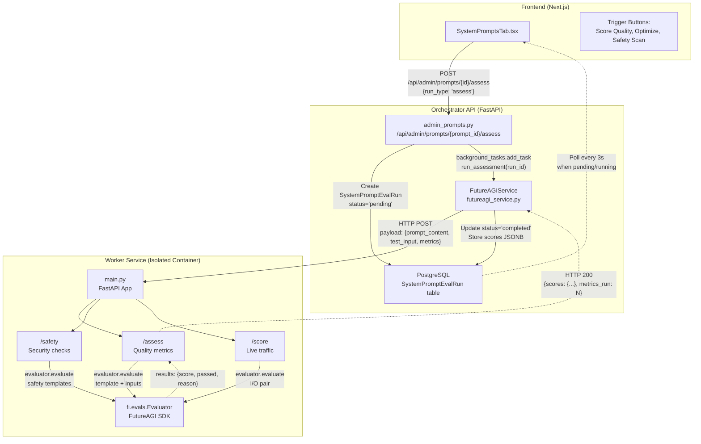
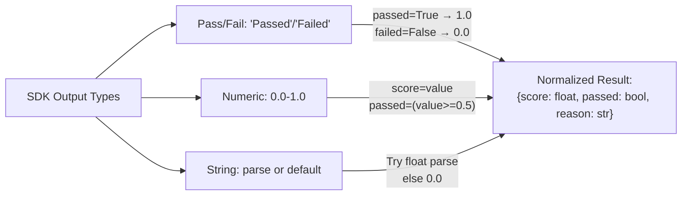
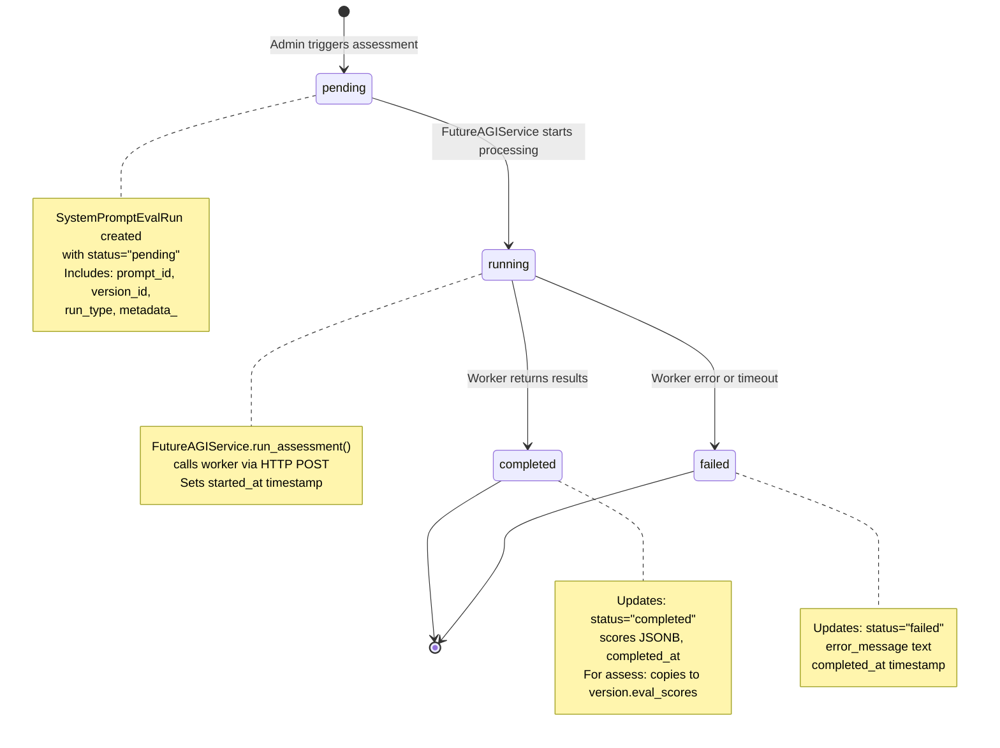
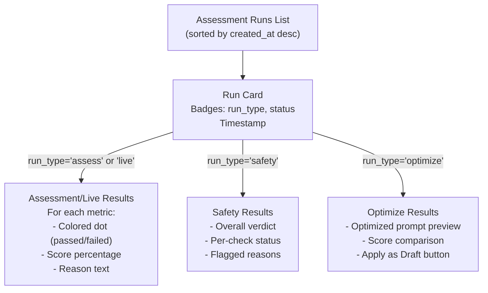

# Prompt Evaluation

<details>
<summary>Relevant source files</summary>

The following files were used as context for generating this wiki page:

- [frontend/components/settings/SystemPromptsTab.tsx](frontend/components/settings/SystemPromptsTab.tsx)
- [orchestrator/core/services/futureagi_service.py](orchestrator/core/services/futureagi_service.py)
- [services/agent-opt-worker/Dockerfile](services/agent-opt-worker/Dockerfile)
- [services/agent-opt-worker/main.py](services/agent-opt-worker/main.py)
- [services/agent-opt-worker/requirements.txt](services/agent-opt-worker/requirements.txt)

</details>


This page documents the prompt evaluation system, which scores system prompts using quality metrics and safety checks powered by the FutureAGI SDK. Evaluation runs are triggered on-demand via the admin UI or automatically on live chat traffic, with results stored in the `SystemPromptEvalRun` table.

For managing prompt versions and the registry, see [System Prompt Management](#11.1). For automatic live traffic evaluation, see [Live Traffic Scoring](#11.3). For optimization algorithms, see [Prompt Optimization](#11.4). For worker service architecture details, see [Worker Service Architecture](#11.5).

---

## Overview

The evaluation system provides three types of assessments:

| Type | Purpose | Metrics Used | Endpoint |
|------|---------|--------------|----------|
| **Assessment** | Quality scoring for prompt effectiveness | `completeness`, `is_helpful`, `is_concise`, `prompt_adherence`, `factual_accuracy` | `/assess` |
| **Safety** | Security and content moderation checks | `toxicity`, `prompt_injection`, `content_moderation`, `bias_detection` | `/safety` |
| **Live Scoring** | Real-time evaluation of chat interactions | Configurable subset (default: `completeness`, `is_helpful`, `is_concise`) | `/score` |

All evaluations are dispatched from the orchestrator (`FutureAGIService`) to the isolated worker service (`agent-opt-worker`), which handles SDK calls and returns structured results.

**Sources:** [orchestrator/core/services/futureagi_service.py:117-145](), [services/agent-opt-worker/main.py:218-241](), [services/agent-opt-worker/main.py:253-291]()

---

## Evaluation Architecture



**Sources:** [orchestrator/core/services/futureagi_service.py:44-73](), [orchestrator/api/admin_prompts.py:395-465](), [services/agent-opt-worker/main.py:16-35]()

---

## Assessment Endpoint

The `/assess` endpoint scores prompt quality using configurable metrics. Each metric runs as a separate evaluation template via the FutureAGI SDK.

### Request Flow

```mermaid
sequenceDiagram
    participant Admin as Admin UI
    participant API as admin_prompts.py
    participant Service as FutureAGIService
    participant Worker as agent-opt-worker
    participant SDK as fi.evals.Evaluator
    
    Admin->>API: POST /api/admin/prompts/{id}/assess<br/>{run_type: "assess"}
    API->>API: Load active SystemPromptVersion
    API->>API: Create SystemPromptEvalRun<br/>status="pending"
    API->>Service: background_tasks.add_task<br/>run_assessment(run_id)
    API-->>Admin: 201 Created<br/>{id, status: "pending"}
    
    Service->>Service: Load run from DB
    Service->>Service: Collect real I/O from messages table<br/>_collect_optimization_dataset(limit=1)
    Service->>Worker: POST /assess<br/>{prompt_content, test_input, test_output, metrics}
    
    Worker->>Worker: ThreadPoolExecutor(max_workers=N)
    loop For each metric
        Worker->>SDK: evaluate(template, inputs, model)<br/>e.g. "completeness", "is_helpful"
        SDK-->>Worker: {output, reason, score}
        Worker->>Worker: Parse output: score 0.0-1.0, passed bool
    end
    Worker-->>Service: {scores: {metric: {score, passed, reason}}}
    
    Service->>Service: Update run: status="completed"<br/>scores JSONB, completed_at
    Service->>Service: Update version.eval_scores<br/>(for active version)
    Service-->>Admin: Auto-poll sees completed status
```



**Sources:** [orchestrator/api/admin_prompts.py:395-465](), [orchestrator/core/services/futureagi_service.py:117-144](), [services/agent-opt-worker/main.py:218-241]()

### Metrics Configuration

The worker maintains a `TEMPLATE_CONFIG` dictionary mapping metric names to their required inputs and optimal models:

| Metric | Required Inputs | Model | Purpose |
|--------|----------------|-------|---------|
| `completeness` | `input`, `output` | `turing_large` | Checks if response fully addresses query |
| `is_helpful` | `input`, `output` | `turing_large` | Evaluates utility and actionability |
| `is_concise` | `output` | `turing_large` | Measures response brevity |
| `prompt_adherence` | `input`, `output` | `turing_large` | Checks instruction following |
| `factual_accuracy` | `input`, `output` | `turing_large` | Verifies correctness |
| `groundedness` | `input`, `output`, `context` | `turing_large` | Ensures context-based responses |
| `summary_quality` | `input`, `output` | `turing_large` | Evaluates summarization |

**Sources:** [services/agent-opt-worker/main.py:124-136]()

### Parallel Execution

All metrics are evaluated concurrently using `ThreadPoolExecutor` to minimize latency:

```python
# services/agent-opt-worker/main.py:226-238
with ThreadPoolExecutor(max_workers=len(metrics)) as pool:
    futures = {}
    for template in metrics:
        inputs = _build_inputs(template, input_text, output_text, context_text=req.prompt_content)
        model = _get_model(template)
        futures[pool.submit(_run_single_template, template, inputs, model)] = template
    for future in as_completed(futures):
        template = futures[future]
        results[template] = future.result()
```

**Sources:** [services/agent-opt-worker/main.py:226-238]()

### Result Parsing

The SDK returns varied output formats depending on template type. The worker normalizes all results to a consistent structure:



**Sources:** [services/agent-opt-worker/main.py:74-120]()

---

## Safety Checks

The `/safety` endpoint runs security and content moderation templates to detect harmful content in system prompts.

### Safety Templates

| Template | Input | Model | Purpose |
|----------|-------|-------|---------|
| `toxicity` | `output` | `protect` | Detects toxic, offensive, or harmful language |
| `prompt_injection` | `input` | `protect` | Identifies prompt injection attacks |
| `content_moderation` | `output` | `protect` | Flags inappropriate content |
| `bias_detection` | `output` | `protect_flash` | Detects biased language |

**Sources:** [services/agent-opt-worker/main.py:256-257]()

### Safety Preamble

To reduce false positives when evaluating system prompts (which contain instructional language), the worker prefixes the content with a preamble:

```python
# services/agent-opt-worker/main.py:247-250
SAFETY_PREAMBLE = (
    "NOTE: The following text is a SYSTEM PROMPT (instructions for an AI assistant), "
    "not user-generated content. It may contain instructional language about handling "
    "sensitive topics. Evaluate the actual intent, not the instructional framing.\n\n"
)
```

This context prevents the safety model from flagging legitimate instruction text (e.g., "Handle toxic user input gracefully") as unsafe.

**Sources:** [services/agent-opt-worker/main.py:247-260]()

### Safety Result Structure

Safety checks return a combined verdict:

```typescript
// Frontend display structure
interface SafetyResult {
  safe: boolean | null;  // Overall: true if ALL checks pass
  checks: {
    [template: string]: {
      safe: boolean | null;
      score: number | null;
      reason: string;
      error?: string;
    }
  };
  duration: number;
}
```

**Sources:** [services/agent-opt-worker/main.py:276-291](), [frontend/components/settings/SystemPromptsTab.tsx:638-661]()

---

## Evaluation Run Lifecycle



**Sources:** [orchestrator/core/services/futureagi_service.py:349-427](), [orchestrator/core/models/system_prompts.py:108-139]()

### Database Models

**SystemPromptEvalRun:**

```python
# orchestrator/core/models/system_prompts.py:108-139
class SystemPromptEvalRun(Base):
    __tablename__ = "system_prompt_eval_runs"
    
    id = Column(UUID(as_uuid=True), primary_key=True)
    prompt_id = Column(UUID(as_uuid=True), ForeignKey("system_prompts.id"))
    version_id = Column(UUID(as_uuid=True), ForeignKey("system_prompt_versions.id"))
    run_type = Column(String(30))  # "assess" | "optimize" | "safety" | "live"
    status = Column(String(20))    # "pending" | "running" | "completed" | "failed"
    scores = Column(JSONB)         # Nested results from worker
    metadata_ = Column(JSONB)      # Config (metrics, algorithm, etc.)
    error_message = Column(Text)
    started_at = Column(DateTime)
    completed_at = Column(DateTime)
    created_at = Column(DateTime)
```

**Sources:** [orchestrator/core/models/system_prompts.py:108-139]()

### Background Task Processing

The orchestrator uses FastAPI's `BackgroundTasks` to run evaluations asynchronously:

```python
# orchestrator/api/admin_prompts.py:442-448
def _run_assessment_sync(run_id: str):
    try:
        asyncio.run(futureagi_service.run_assessment(run_id))
    except Exception as e:
        logger.error(f"FutureAGI assessment run {run_id} failed: {e}")

background_tasks.add_task(_run_assessment_sync, str(run.id))
```

This prevents blocking the HTTP response while the worker processes the evaluation (which can take 10-60 seconds for multiple metrics).

**Sources:** [orchestrator/api/admin_prompts.py:442-448]()

---

## Results Display

### Frontend Polling

The UI polls assessment runs every 3 seconds when any are `pending` or `running`:

```typescript
// frontend/components/settings/SystemPromptsTab.tsx:166-173
useEffect(() => {
  const hasPending = assessmentRuns.some(r => r.status === 'pending' || r.status === 'running')
  if (!hasPending || !selectedPrompt) return
  const interval = setInterval(() => {
    fetchAssessmentRuns(selectedPrompt.id)
  }, 3000)
  return () => clearInterval(interval)
}, [assessmentRuns, selectedPrompt, fetchAssessmentRuns])
```

**Sources:** [frontend/components/settings/SystemPromptsTab.tsx:166-173]()

### Assessment Results Rendering



**Sources:** [frontend/components/settings/SystemPromptsTab.tsx:592-722]()

### Quality Score Visualization

For completed assessment runs, the UI displays each metric with a visual progress bar:

```typescript
// frontend/components/settings/SystemPromptsTab.tsx:619-634
{Object.entries(run.scores.scores as Record<string, any>).map(([key, val]) => {
  const v = val as any
  const passed = v?.passed
  const score = v?.score
  const pct = score != null ? Math.round(Number(score) * 100) : null
  return (
    <div key={key} className="text-xs">
      <div className="flex items-center gap-1.5 mb-0.5">
        <span className={cn('inline-block w-1.5 h-1.5 rounded-full', 
          passed ? 'bg-emerald-400' : passed === false ? 'bg-amber-400' : 'bg-zinc-400')} />
        <span className="font-medium">{key.replace(/_/g, ' ')}</span>
        {pct != null && <span className="text-muted-foreground">({pct}%)</span>}
      </div>
      {v?.reason && <p className="text-muted-foreground ml-3 line-clamp-2">{v.reason}</p>}
    </div>
  )
})}
```

**Sources:** [frontend/components/settings/SystemPromptsTab.tsx:619-634]()

---

## API Integration

### Triggering Assessments

**Endpoint:** `POST /api/admin/prompts/{prompt_id}/assess`

**Request:**
```json
{
  "version_id": "uuid-or-null",  // null = use active version
  "run_type": "assess",          // "assess" | "optimize" | "safety"
  "config": {
    "metrics": ["completeness", "is_helpful"],
    "test_cases": [{"input": "...", "output": "..."}]
  }
}
```

**Response:**
```json
{
  "id": "run-uuid",
  "prompt_id": "prompt-uuid",
  "version_id": "version-uuid",
  "run_type": "assess",
  "status": "pending",
  "scores": null,
  "error_message": null,
  "started_at": null,
  "completed_at": null,
  "created_at": "2024-01-15T12:00:00Z"
}
```

**Sources:** [orchestrator/api/admin_prompts.py:395-465]()

### Listing Assessment Runs

**Endpoint:** `GET /api/admin/prompts/{prompt_id}/assessment-runs`

Returns all runs for a prompt, sorted by `created_at DESC`:

```json
[
  {
    "id": "run-uuid",
    "run_type": "assess",
    "status": "completed",
    "scores": {
      "scores": {
        "completeness": {"score": 0.85, "passed": true, "reason": "..."},
        "is_helpful": {"score": 0.92, "passed": true, "reason": "..."}
      },
      "metrics_run": 2,
      "duration": 12.3
    },
    "created_at": "2024-01-15T12:00:00Z",
    "completed_at": "2024-01-15T12:00:12Z"
  }
]
```

**Sources:** [orchestrator/api/admin_prompts.py:364-392]()

---

## Worker HTTP Endpoints

### `/assess` - Quality Metrics

**Request:**
```json
{
  "prompt_content": "You are a helpful assistant...",
  "test_input": "What is 2+2?",
  "test_output": "2+2 equals 4.",
  "metrics": ["completeness", "is_helpful", "is_concise"]
}
```

**Response:**
```json
{
  "scores": {
    "completeness": {
      "score": 1.0,
      "passed": true,
      "reason": "Response fully answers the question"
    },
    "is_helpful": {
      "score": 0.85,
      "passed": true,
      "reason": "Clear and actionable"
    },
    "is_concise": {
      "score": 0.95,
      "passed": true,
      "reason": "Brief and to the point"
    }
  },
  "metrics_run": 3,
  "duration": 8.2
}
```

**Sources:** [services/agent-opt-worker/main.py:218-241]()

### `/safety` - Security Checks

**Request:**
```json
{
  "prompt_content": "You are a helpful assistant..."
}
```

**Response:**
```json
{
  "safe": true,
  "checks": {
    "toxicity": {
      "score": 0.02,
      "safe": true,
      "reason": "No toxic language detected"
    },
    "prompt_injection": {
      "score": 0.01,
      "safe": true,
      "reason": "No injection patterns found"
    },
    "content_moderation": {
      "score": 0.0,
      "safe": true,
      "reason": "Content is appropriate"
    }
  },
  "duration": 6.5
}
```

**Sources:** [services/agent-opt-worker/main.py:253-291]()

### `/score` - Live Traffic

**Request:**
```json
{
  "input_text": "What is the weather today?",
  "output_text": "I don't have access to real-time weather data...",
  "context_text": "You are a helpful assistant...",
  "metrics": ["completeness", "is_helpful", "is_concise"]
}
```

**Response:**
```json
{
  "scores": {
    "completeness": {"score": 0.7, "passed": true, "reason": "..."},
    "is_helpful": {"score": 0.75, "passed": true, "reason": "..."},
    "is_concise": {"score": 0.8, "passed": true, "reason": "..."}
  },
  "metrics_run": 3,
  "source": "live_traffic",
  "duration": 7.8
}
```

**Sources:** [services/agent-opt-worker/main.py:298-327]()

---

## Error Handling

### Worker Errors

The worker wraps all evaluations in try-catch blocks and returns errors in the result structure:

```python
# services/agent-opt-worker/main.py:71-72
except Exception as e:
    logger.warning(f"[{template}] scoring failed: {e}")
    return {"error": str(e)}
```

Individual metric failures don't crash the entire assessment - other metrics continue executing.

**Sources:** [services/agent-opt-worker/main.py:70-72]()

### Orchestrator Error Handling

The `FutureAGIService` catches worker errors and stores them in the eval run:

```python
# orchestrator/core/services/futureagi_service.py:401-405
if result.get("status") == "failed" or ("error" in result and not result.get("scores")):
    run.status = "failed"
    run.error_message = result.get("error", "Unknown worker error")
else:
    run.status = "completed"
    run.scores = result
```

This ensures the run record always has a final state, even if the worker times out or crashes.

**Sources:** [orchestrator/core/services/futureagi_service.py:401-415]()

### Timeout Handling

The orchestrator sets timeouts on worker HTTP calls:

- **Assessment/Safety:** 120 seconds (`WORKER_TIMEOUT`)
- **Optimization:** 300 seconds (`OPTIMIZE_TIMEOUT`)

```python
# orchestrator/core/services/futureagi_service.py:24-26
WORKER_URL = os.getenv("AGENT_OPT_WORKER_URL", "http://agent-opt-worker.railway.internal:8080")
WORKER_TIMEOUT = 120  # seconds for assess/safety
OPTIMIZE_TIMEOUT = 300  # seconds for optimization
```

**Sources:** [orchestrator/core/services/futureagi_service.py:24-26]()

---

## Configuration

### Environment Variables

**Orchestrator:**
```bash
AGENT_OPT_WORKER_URL=http://agent-opt-worker.railway.internal:8080  # Worker service URL
```

**Worker:**
```bash
FUTUREAGI_API_KEY=...      # FutureAGI API key
FUTUREAGI_SECRET_KEY=...   # FutureAGI secret key (also accepts FI_API_KEY/FI_SECRET_KEY)
```

The orchestrator only needs the worker URL - all API keys live on the worker side to maintain isolation.

**Sources:** [orchestrator/core/services/futureagi_service.py:24](), [services/agent-opt-worker/main.py:42-51]()

### Availability Check

The `FutureAGIService` checks availability on initialization:

```python
# orchestrator/core/services/futureagi_service.py:62-68
def _init(self) -> None:
    # Check if worker URL is configured (keys live on the worker now)
    self._available = bool(os.getenv("AGENT_OPT_WORKER_URL") or os.getenv("FUTUREAGI_API_KEY"))
    if self._available:
        logger.info(f"FutureAGI service ready (worker at {WORKER_URL})")
    else:
        logger.info("FutureAGI service disabled (no worker URL or API keys)")
```

When unavailable, all evaluation methods return error responses immediately without attempting HTTP calls.

**Sources:** [orchestrator/core/services/futureagi_service.py:62-72]()

---