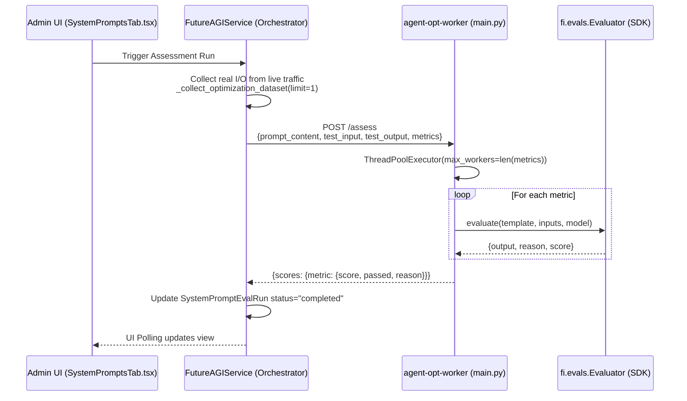

# Prompt Evaluation

<details>
<summary>Relevant source files</summary>

The following files were used as context for generating this wiki page:

- [frontend/components/settings/SystemPromptsTab.tsx](frontend/components/settings/SystemPromptsTab.tsx)
- [orchestrator/core/services/futureagi_service.py](orchestrator/core/services/futureagi_service.py)
- [services/agent-opt-worker/Dockerfile](services/agent-opt-worker/Dockerfile)
- [services/agent-opt-worker/automatos_logging.py](services/agent-opt-worker/automatos_logging.py)
- [services/agent-opt-worker/automatos_metrics.py](services/agent-opt-worker/automatos_metrics.py)
- [services/agent-opt-worker/main.py](services/agent-opt-worker/main.py)
- [services/agent-opt-worker/requirements.txt](services/agent-opt-worker/requirements.txt)
- [services/shared/automatos_logging.py](services/shared/automatos_logging.py)
- [services/shared/automatos_metrics.py](services/shared/automatos_metrics.py)
- [services/workspace-worker/automatos_logging.py](services/workspace-worker/automatos_logging.py)
- [services/workspace-worker/automatos_metrics.py](services/workspace-worker/automatos_metrics.py)

</details>


This page documents the prompt evaluation system, which assesses system prompts using quality metrics and safety checks powered by the FutureAGI SDK. Evaluation runs are triggered on-demand via the admin UI or automatically on live chat traffic, with results stored in the `SystemPromptEvalRun` table.

For managing prompt versions and the registry, see **System Prompt Management (15.1)**. For automatic live traffic evaluation, see **Live Traffic Scoring (15.3)**. For optimization algorithms, see **Prompt Optimization (15.4)**. For worker service architecture details, see **Agent-Opt Worker Service (15.5)**.

---

## Overview

The evaluation system provides three types of assessments:

| Type | Purpose | Metrics Used | Endpoint |
|------|---------|--------------|----------|
| **Assessment** | Quality scoring for prompt effectiveness | `completeness`, `is_helpful`, `is_concise`, `prompt_adherence`, `factual_accuracy` | `/assess` |
| **Safety** | Security and content moderation checks | `toxicity`, `prompt_injection`, `content_moderation`, `bias_detection` | `/safety` |
| **Live Scoring** | Real-time evaluation of chat interactions | Configurable subset (default: `completeness`, `is_helpful`, `is_concise`) | `/score` |

All evaluations are dispatched from the orchestrator (`FutureAGIService`) to the isolated worker service (`agent-opt-worker`), which handles SDK calls and returns structured results.

**Sources:** [orchestrator/core/services/futureagi_service.py:118-145](), [services/agent-opt-worker/main.py:9-16](), [services/agent-opt-worker/main.py:129-141]()

---

## Evaluation Architecture

The system is split between the main orchestrator (which handles database persistence and UI logic) and an isolated worker service (which encapsulates the `agent-opt` and `ai-evaluation` SDK dependencies).

### System Component Interaction

```mermaid
graph TB
    subgraph "Frontend (Next.js)"
        ["SystemPromptsTab.tsx"]
        ["Trigger Buttons:<br/>Score Quality, Optimize, Safety Scan"]
    end
    
    subgraph "Orchestrator API (FastAPI)"
        ["admin_prompts.py<br/>/api/admin/prompts/{prompt_id}/assess"]
        ["FutureAGIService<br/>futureagi_service.py"]
        ["PostgreSQL DB<br/>SystemPromptEvalRun table"]
    end
    
    subgraph "Worker Service (Isolated Container)"
        ["agent-opt-worker main.py"]
        ["/assess Endpoint"]
        ["/safety Endpoint"]
        ["/score Endpoint"]
        ["fi.evals.Evaluator<br/>FutureAGI SDK"]
    end
    
    ["SystemPromptsTab.tsx"] -->|"POST /api/admin/prompts/{id}/assess"| ["admin_prompts.py<br/>/api/admin/prompts/{prompt_id}/assess"]
    ["admin_prompts.py<br/>/api/admin/prompts/{prompt_id}/assess"] -->|"Create SystemPromptEvalRun"| ["PostgreSQL DB<br/>SystemPromptEvalRun table"]
    ["admin_prompts.py<br/>/api/admin/prompts/{prompt_id}/assess"] -->|"background_tasks.add_task"| ["FutureAGIService<br/>futureagi_service.py"]
    
    ["FutureAGIService<br/>futureagi_service.py"] -->|"HTTP POST<br/>payload: {prompt_content, metrics}"| ["agent-opt-worker main.py"]
    ["agent-opt-worker main.py"] --> ["/assess Endpoint"]
    ["agent-opt-worker main.py"] --> ["/safety Endpoint"]
    ["agent-opt-worker main.py"] --> ["/score Endpoint"]
    
    ["/assess Endpoint"] -->|"evaluator.evaluate"| ["fi.evals.Evaluator<br/>FutureAGI SDK"]
    
    ["fi.evals.Evaluator<br/>FutureAGI SDK"] -.->|"results: {score, passed, reason}"| ["/assess Endpoint"]
    ["/assess Endpoint"] -.->|"HTTP 200"| ["FutureAGIService<br/>futureagi_service.py"]
    
    ["FutureAGIService<br/>futureagi_service.py"] -->|"Update status='completed'<br/>Store scores JSONB"| ["PostgreSQL DB<br/>SystemPromptEvalRun table"]
    ["PostgreSQL DB<br/>SystemPromptEvalRun table"] -.->|"Poll every 3s"| ["SystemPromptsTab.tsx"]
```

**Sources:** [orchestrator/core/services/futureagi_service.py:45-73](), [services/agent-opt-worker/main.py:9-16](), [frontend/components/settings/SystemPromptsTab.tsx:166-173]()

---

## Assessment Flow

The `/assess` endpoint scores prompt quality using configurable metrics. Each metric runs as a separate evaluation template via the FutureAGI SDK.

### Request Flow



**Sources:** [orchestrator/core/services/futureagi_service.py:118-145](), [services/agent-opt-worker/main.py:226-238](), [services/agent-opt-worker/main.py:59-78]()

### Metrics Configuration

The worker maintains a `TEMPLATE_CONFIG` dictionary mapping metric names to their required inputs and optimal models:

| Metric | Required Inputs | Model | Purpose |
|--------|----------------|-------|---------|
| `completeness` | `input`, `output` | `turing_large` | Addresses the query fully |
| `is_helpful` | `input`, `output` | `turing_large` | Utility and actionability |
| `is_concise` | `output` | `turing_large` | Measures response brevity |
| `prompt_adherence` | `input`, `output` | `turing_large` | Instruction following |
| `groundedness` | `input`, `output`, `context` | `turing_large` | Contextual accuracy |
| `toxicity` | `output` | `protect` | Safety and moderation |

**Sources:** [services/agent-opt-worker/main.py:129-141]()

### Concurrent Scoring Implementation

All metrics are evaluated concurrently using `ThreadPoolExecutor` to minimize the latency of the evaluation job. The worker submits each metric as a separate thread task and collects results as they complete.

```python
# services/agent-opt-worker/main.py:226-238
with ThreadPoolExecutor(max_workers=len(metrics)) as pool:
    futures = {}
    for template in metrics:
        inputs = _build_inputs(template, input_text, output_text, context_text=req.prompt_content)
        model = _get_model(template)
        futures[pool.submit(_run_single_template, template, inputs, model)] = template
    for future in as_completed(futures):
        template = futures[future]
        results[template] = future.result()
```

**Sources:** [services/agent-opt-worker/main.py:226-238]()

---

## Scoring Logic and Normalization

### Result Normalization

The SDK returns varied output formats (e.g., "Passed"/"Failed" strings or float scores). The worker normalizes these into a consistent schema for the orchestrator.

```python
# services/agent-opt-worker/main.py:95-121
if isinstance(output, (int, float)):
    # Numeric score (e.g. completeness returns 0.0-1.0)
    score = float(output)
    passed = score >= 0.5
elif isinstance(output, str):
    output_lower = output.lower().strip()
    if output_lower == "passed":
        passed = True
        score = 1.0
    elif output_lower == "failed":
        passed = False
        score = 0.0
    else:
        # Try to parse as number
        try:
            score = float(output)
            passed = score >= 0.5
        except (ValueError, TypeError):
            passed = False
            score = 0.0
```

**Sources:** [services/agent-opt-worker/main.py:95-122]()

### Observability and Monitoring

The evaluation worker includes standard observability hooks used across the platform:
* **Logging:** Uses `automatos_logging` for structured JSON log relay [services/agent-opt-worker/main.py:34](), [services/agent-opt-worker/automatos_logging.py:132-161]().
* **Metrics:** Exposes Prometheus metrics via `add_fastapi_metrics` [services/agent-opt-worker/main.py:40](), including request duration histograms and total request counters [services/agent-opt-worker/automatos_metrics.py:49-66]().

---

## Database Integration: SystemPromptEvalRun

The orchestrator tracks every evaluation attempt in the `SystemPromptEvalRun` table. The frontend polls these runs to provide real-time feedback to admins.

| Field | Type | Description |
|-------|------|-------------|
| `id` | UUID | Primary key |
| `prompt_id` | UUID | Link to the `SystemPrompt` |
| `run_type` | String | `assess`, `safety`, `optimize`, or `live` |
| `status` | String | `pending`, `running`, `completed`, or `failed` |
| `scores` | JSONB | Raw metrics results from the worker |
| `error_message` | String | Captures worker timeouts or SDK errors |

**Sources:** [frontend/components/settings/SystemPromptsTab.tsx:61-72](), [orchestrator/core/services/futureagi_service.py:79-98]()

---

## Worker Service Deployment

The `agent-opt-worker` is a standalone service defined by its own `Dockerfile` and `requirements.txt`. It is designed to be isolated from the main orchestrator to avoid dependency conflicts with the specialized FutureAGI SDKs.

### Worker Environment

- **Base Image:** `python:3.11-slim` [services/agent-opt-worker/Dockerfile:1]()
- **Key Dependencies:** `agent-opt`, `ai-evaluation`, `litellm`, `fastapi` [services/agent-opt-worker/requirements.txt:1-8]()
- **Health Check:** Standard `/health` endpoint integrated with `automatos_metrics` [services/agent-opt-worker/main.py:15-40]()

### Orchestrator Connection

The `FutureAGIService` acts as a thin HTTP client to the worker, managing timeouts (default 120s for assessment) and handling connection failures gracefully.

```python
# orchestrator/core/services/futureagi_service.py:79-89
async def _call_worker(self, path: str, payload: Dict[str, Any], timeout: int = WORKER_TIMEOUT) -> Dict[str, Any]:
    url = f"{WORKER_URL}{path}"
    try:
        async with httpx.AsyncClient(timeout=timeout) as client:
            resp = await client.post(url, json=payload)
        if resp.status_code != 200:
            return {"error": f"Worker error ({resp.status_code})"}
        return resp.json()
    except Exception as e:
        return {"error": str(e)}
```

**Sources:** [orchestrator/core/services/futureagi_service.py:79-98](), [services/agent-opt-worker/Dockerfile:1-16]()

---