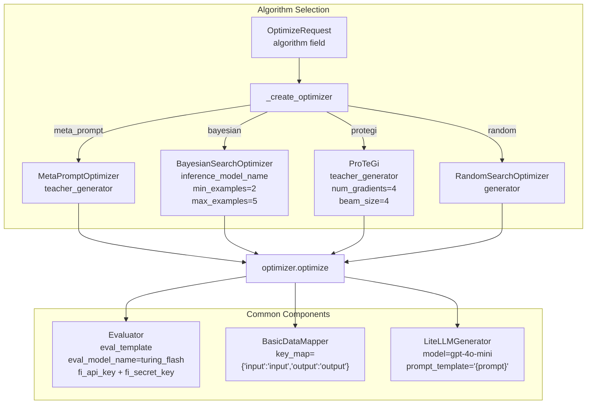
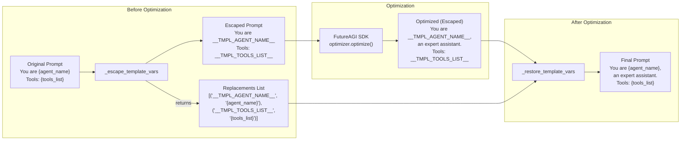
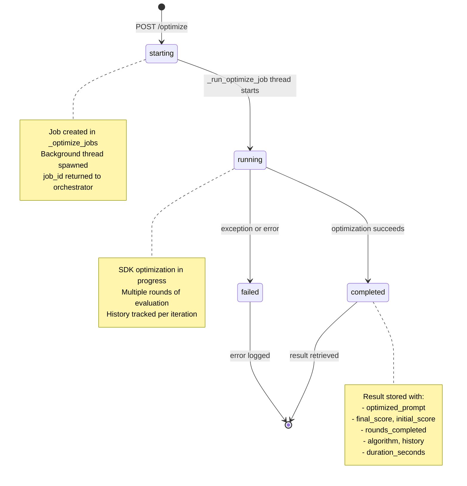
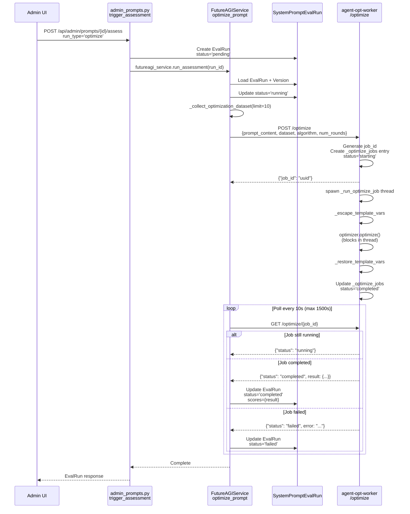
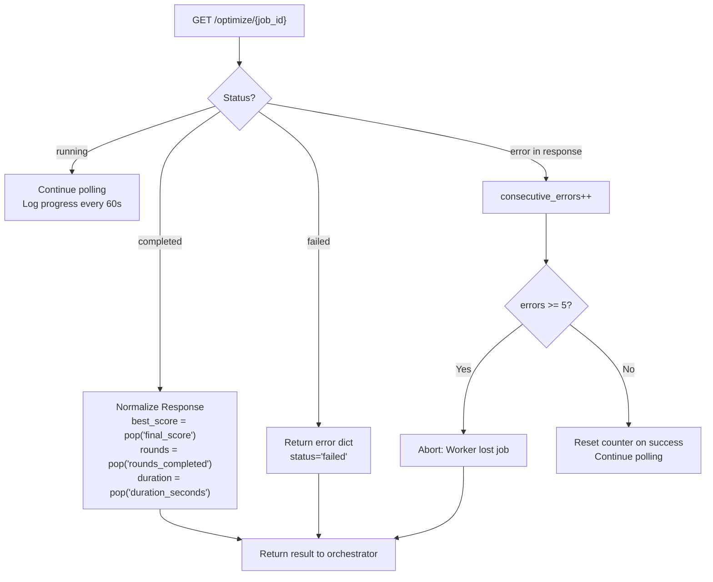
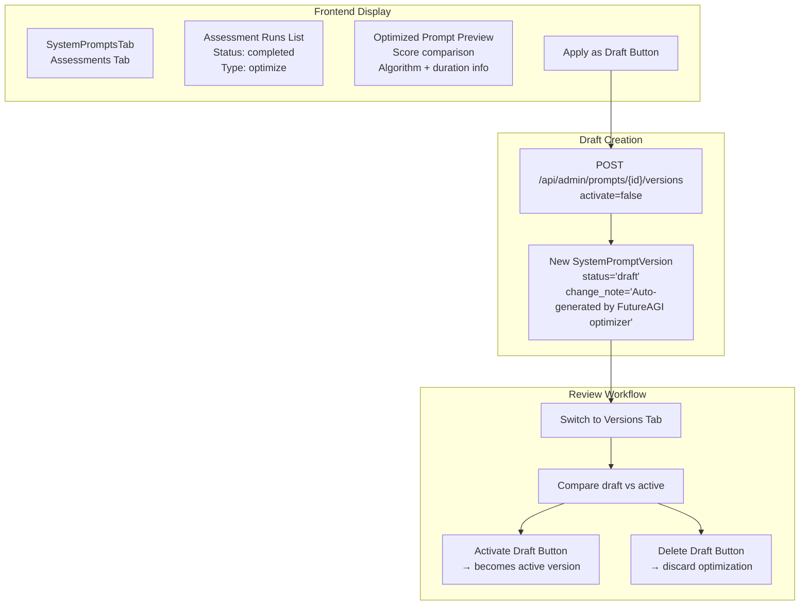

# Prompt Optimization

<details>
<summary>Relevant source files</summary>

The following files were used as context for generating this wiki page:

- [frontend/components/settings/SystemPromptsTab.tsx](frontend/components/settings/SystemPromptsTab.tsx)
- [orchestrator/core/services/futureagi_service.py](orchestrator/core/services/futureagi_service.py)
- [services/agent-opt-worker/Dockerfile](services/agent-opt-worker/Dockerfile)
- [services/agent-opt-worker/main.py](services/agent-opt-worker/main.py)
- [services/agent-opt-worker/requirements.txt](services/agent-opt-worker/requirements.txt)

</details>


This document describes the prompt optimization system, which automatically improves system prompts using FutureAGI's optimization algorithms. The system collects real chat interactions as training data, runs iterative optimization in an isolated worker service, and presents improved prompts for review before activation.

For information about system prompt management and versioning, see [System Prompt Management](#11.1). For evaluation and scoring, see [Prompt Evaluation](#11.2). For live traffic scoring used to build datasets, see [Live Traffic Scoring](#11.3). For worker service architecture details, see [Worker Service Architecture](#11.5).

---

## Overview

The optimization system follows a three-phase workflow:

1. **Dataset Collection**: Gather recent user-assistant message pairs from live chat traffic
2. **Async Optimization**: Run iterative prompt improvement using FutureAGI's `agent-opt` SDK in an isolated worker
3. **Result Application**: Present the optimized prompt as a draft version for admin review

The process is fully asynchronous with polling-based status checks, supporting optimization runs that may take 10-25 minutes to complete.

**Sources:** [orchestrator/core/services/futureagi_service.py:1-432]()

---

## Optimization Algorithm Selection

The worker service supports four optimization algorithms from the `fi.opt.optimizers` package:

| Algorithm | Description | Best For | Parameters |
|-----------|-------------|----------|------------|
| `meta_prompt` | Meta-learning approach that generates improved prompts iteratively | General-purpose optimization | `teacher_generator` |
| `bayesian` | Bayesian search over prompt space | Exploration of diverse variations | `min_examples`, `max_examples` |
| `protegi` | Prompt generation with gradient-based improvements | Fine-grained optimization | `num_gradients`, `beam_size` |
| `random` | Random search baseline | Quick baseline comparison | `generator` |

The default algorithm is `meta_prompt` with GPT-4o-mini as the teacher model.

**Algorithm Factory Pattern:**



**Sources:** [services/agent-opt-worker/main.py:525-544](), [services/agent-opt-worker/main.py:375-432]()

---

## Template Variable Escaping

System prompts contain template variables like `{agent_name}` that must be preserved during optimization. The FutureAGI SDK internally uses `.format()` on prompts, which would crash if these placeholders remain. The solution is a two-phase escaping mechanism:

### Escaping Logic



### Implementation Details

**Regex Pattern:** `(?<!\{)\{(\w+)\}(?!\})` - matches single-brace variables but not double-braces

**Escape Format:** `__TMPL_{VARIABLE_NAME_UPPER}__` - ensures no collision with natural language

**Example:**
- Input: `You are {agent_name}, a helpful assistant. Tools: {tools_list}.`
- Escaped: `You are __TMPL_AGENT_NAME__, a helpful assistant. Tools: __TMPL_TOOLS_LIST__.`
- After SDK optimization: Content improved but placeholders intact
- Restored: `You are {agent_name}, a highly effective assistant specialized in... Tools: {tools_list}.`

**Sources:** [services/agent-opt-worker/main.py:351-372](), [services/agent-opt-worker/main.py:393-396](), [services/agent-opt-worker/main.py:435]()

---

## Dataset Collection

Optimization requires real input-output examples. The system collects recent chat interactions from the `messages` table.

### Collection Query

```mermaid
graph TB
    subgraph "Database Query"
        Messages[(messages table<br/>role: user | assistant<br/>parts: JSONB<br/>chat_id<br/>created_at)]
        
        Query["SQL JOIN<br/>m1.role = 'user'<br/>m2.role = 'assistant'<br/>m2.created_at = MIN(created_at) > m1.created_at<br/>ORDER BY m1.created_at DESC<br/>LIMIT :limit"]
        
        Messages --> Query
    end
    
    subgraph "Text Extraction"
        Query --> Pairs["Message Pairs<br/>(user_parts, assistant_parts)"]
        Pairs --> Extract[_extract_text]
        Extract --> Dataset["Dataset<br/>[{'input': 'user text',<br/>  'output': 'assistant text'}]"]
    end
    
    subgraph "Usage"
        Dataset --> Optimizer["FutureAGI Optimizer<br/>evaluates prompt variants<br/>against this dataset"]
    end
```

### Key Characteristics

- **Limit**: Default 10 examples for assessment, configurable for optimization
- **Pair Matching**: Joins each user message with its immediate assistant response
- **Text Extraction**: Handles both string and structured JSONB `parts` field
- **Recency Bias**: Orders by `created_at DESC` to prefer recent conversations

**Code Flow:**

1. `FutureAGIService.optimize_prompt()` calls `_collect_optimization_dataset(limit=10)`
2. Raw SQL query joins user→assistant message pairs
3. `_extract_text()` parses JSONB parts or returns string directly
4. Returns `List[Dict[str, str]]` with `input` and `output` keys

**Sources:** [orchestrator/core/services/futureagi_service.py:307-343](), [orchestrator/core/services/futureagi_service.py:29-41](), [orchestrator/core/services/futureagi_service.py:170-172]()

---

## Async Job Lifecycle

Optimization runs asynchronously due to long execution times (10-25 minutes). The worker maintains an in-memory job store with a polling-based status API.

### Job State Machine



### Job Store Structure

```python
_optimize_jobs: Dict[str, Dict[str, Any]] = {
    "job_id_uuid": {
        "status": "starting" | "running" | "completed" | "failed",
        "created_at": 1234567890.0,
        "result": {
            "optimized_prompt": str,
            "final_score": float,
            "initial_score": float,
            "rounds_completed": int,
            "algorithm": str,
            "history": List[Dict],
            "duration_seconds": float,
            "status": "completed"
        },
        "error": Optional[str],
        "duration_seconds": Optional[float]
    }
}
```

### Cleanup Logic

- **TTL**: 3600 seconds (1 hour)
- **Trigger**: Called at start of each new optimization
- **Criteria**: Removes jobs with `status` in `("completed", "failed")` older than TTL
- **Prevents**: Memory leaks from abandoned jobs

**Sources:** [services/agent-opt-worker/main.py:333-348](), [services/agent-opt-worker/main.py:468-494](), [services/agent-opt-worker/main.py:497-522]()

---

## End-to-End Optimization Workflow

### Orchestrator → Worker Flow



### Key Parameters

| Field | Type | Default | Description |
|-------|------|---------|-------------|
| `prompt_content` | string | - | Current active prompt text |
| `dataset` | array | - | 10+ input/output pairs from live traffic |
| `scoring_template` | string | `"is_helpful"` | FutureAGI metric to optimize for |
| `algorithm` | string | `"meta_prompt"` | Optimization algorithm name |
| `num_rounds` | int | 2 | Number of optimization iterations |
| `teacher_model` | string | `"gpt-4o-mini"` | LLM used to generate variations |
| `task_description` | string | auto-generated | Context about the optimization goal |

**Sources:** [orchestrator/core/services/futureagi_service.py:160-226](), [orchestrator/api/admin_prompts.py:395-465](), [services/agent-opt-worker/main.py:375-465]()

---

## Polling Mechanism

The orchestrator polls the worker using exponential backoff to check job status.

### Polling Configuration

| Parameter | Value | Purpose |
|-----------|-------|---------|
| `max_wait` | 1500s (25 min) | Maximum total polling duration |
| `poll_interval` | 10s | Time between status checks |
| `consecutive_errors` threshold | 5 | Fast-fail if worker loses job |
| `progress_log_interval` | 60s | Log status every minute |

### Poll Response Handling



### Error Scenarios

1. **Worker Timeout**: No response after 15s → log error, continue polling
2. **Worker Restart**: Job not found (404) after 5 consecutive polls → fail fast
3. **Optimization Timeout**: No completion after 1500s → return timeout error
4. **SDK Exception**: Worker returns `status='failed'` with error message → propagate to EvalRun

**Sources:** [orchestrator/core/services/futureagi_service.py:192-226]()

---

## Results and Application

### Result Structure

When optimization completes, the worker returns:

```json
{
  "optimized_prompt": "You are {agent_name}, a highly effective assistant...",
  "final_score": 0.89,
  "initial_score": 0.72,
  "rounds_completed": 3,
  "algorithm": "meta_prompt",
  "history": [
    {
      "round": 1,
      "score": 0.75,
      "prompt_preview": "You are {agent_name}, a helpful..."
    },
    {
      "round": 2,
      "score": 0.83,
      "prompt_preview": "You are {agent_name}, an expert..."
    },
    {
      "round": 3,
      "score": 0.89,
      "prompt_preview": "You are {agent_name}, a highly effective..."
    }
  ],
  "duration_seconds": 487.3,
  "status": "completed"
}
```

### Application Workflow



### Admin UI Actions

1. **Trigger Optimization**: Click "Optimize" button in Assessments tab
2. **Monitor Progress**: Real-time polling updates status from `pending` → `running` → `completed`
3. **Review Result**: View optimized prompt, score improvement, and execution details
4. **Apply as Draft**: Click "Apply as Draft" to create a new version (doesn't activate immediately)
5. **Compare & Activate**: Switch to Versions tab, compare draft vs active, then activate if satisfied

**Sources:** [frontend/components/settings/SystemPromptsTab.tsx:261-279](), [frontend/components/settings/SystemPromptsTab.tsx:579-587](), [frontend/components/settings/SystemPromptsTab.tsx:665-717]()

---

## Configuration and Requirements

### Environment Variables

| Variable | Required | Used By | Purpose |
|----------|----------|---------|---------|
| `AGENT_OPT_WORKER_URL` | Yes | Orchestrator | Worker service URL (default: `http://agent-opt-worker.railway.internal:8080`) |
| `FUTUREAGI_API_KEY` | Yes | Worker | FutureAGI authentication |
| `FUTUREAGI_SECRET_KEY` | Yes | Worker | FutureAGI authentication |
| `OPENAI_API_KEY` | Yes | Worker | Teacher model (GPT-4o-mini) access |
| `FI_API_KEY` | Auto-set | Worker SDK | Forwarded from `FUTUREAGI_API_KEY` |
| `FI_SECRET_KEY` | Auto-set | Worker SDK | Forwarded from `FUTUREAGI_SECRET_KEY` |

### Worker Dependencies

The worker requires specialized SDK packages not installed in the orchestrator:

```
agent-opt==0.0.1       # Prompt optimization algorithms
ai-evaluation>=0.1.9   # FutureAGI evaluation SDK
litellm>=1.61.0        # Multi-provider LLM client
```

This isolation prevents version conflicts with the orchestrator's dependencies.

**Sources:** [services/agent-opt-worker/requirements.txt:1-7](), [services/agent-opt-worker/main.py:41-51](), [orchestrator/core/services/futureagi_service.py:24-26]()

---

## Error Handling

### Common Errors

| Error | Cause | Resolution |
|-------|-------|------------|
| "No live traffic data yet" | Empty dataset collection | Enable FutureAGI scoring and chat first |
| "Worker not available" | `httpx.ConnectError` | Check `AGENT_OPT_WORKER_URL` configuration |
| "Worker timed out after 300s" | Optimization exceeds timeout | Normal for large `num_rounds` values |
| "Lost connection to optimization job" | Worker restart during execution | Increase worker memory/stability |
| "OpenAI API key not configured" | Missing `OPENAI_API_KEY` | Set env var in worker service |
| "Template variables interfered" | Escaping/restoration failed | Check for nested braces or unusual syntax |

### Retry Strategy

- **Network errors**: Logged but polling continues
- **Worker restart**: Fast-fail after 5 consecutive 404 responses
- **Optimization timeout**: Fail after 25 minutes total elapsed time
- **SDK exceptions**: Captured and stored in `EvalRun.error_message`

**Sources:** [orchestrator/core/services/futureagi_service.py:78-97](), [orchestrator/core/services/futureagi_service.py:170-172](), [orchestrator/core/services/futureagi_service.py:216-226](), [services/agent-opt-worker/main.py:384-386](), [services/agent-opt-worker/main.py:460-465]()

---