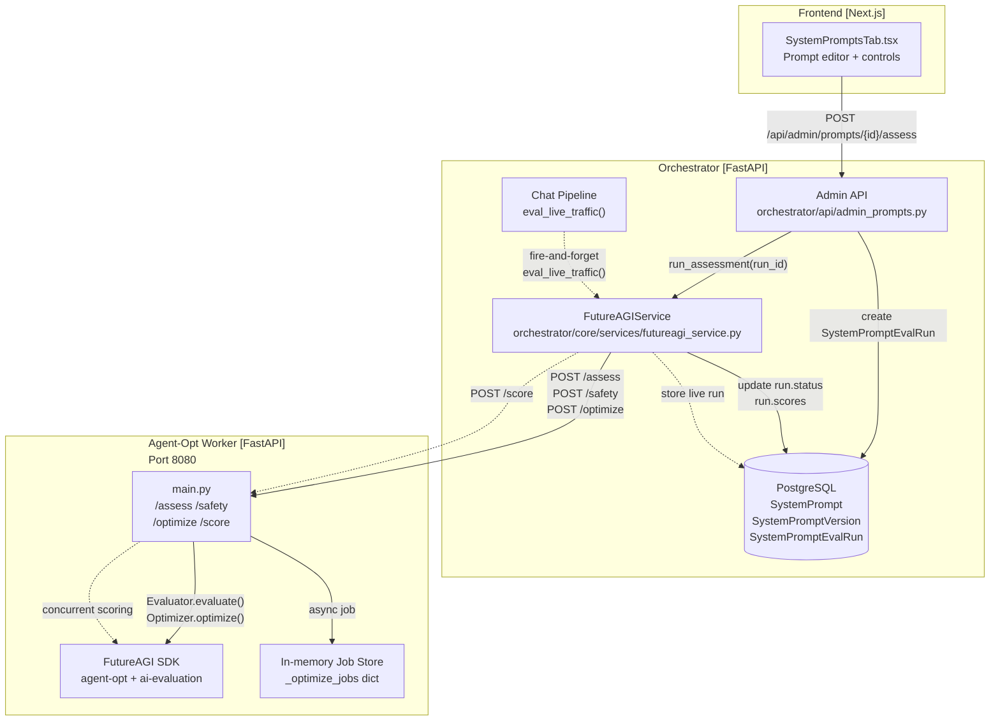

# Prompt Optimization

Relevant source files

The following files were used as context for generating this wiki page:

- [frontend/components/settings/SystemPromptsTab.tsx](frontend/components/settings/SystemPromptsTab.tsx)
- [orchestrator/core/services/futureagi_service.py](orchestrator/core/services/futureagi_service.py)
- [services/agent-opt-worker/Dockerfile](services/agent-opt-worker/Dockerfile)
- [services/agent-opt-worker/automatos_logging.py](services/agent-opt-worker/automatos_logging.py)
- [services/agent-opt-worker/automatos_metrics.py](services/agent-opt-worker/automatos_metrics.py)
- [services/agent-opt-worker/main.py](services/agent-opt-worker/main.py)
- [services/agent-opt-worker/requirements.txt](services/agent-opt-worker/requirements.txt)
- [services/shared/automatos_logging.py](services/shared/automatos_logging.py)
- [services/shared/automatos_metrics.py](services/shared/automatos_metrics.py)
- [services/workspace-worker/automatos_logging.py](services/workspace-worker/automatos_logging.py)
- [services/workspace-worker/automatos_metrics.py](services/workspace-worker/automatos_metrics.py)

The prompt optimization system provides FutureAGI-powered assessment, safety checking, and iterative optimization for system prompts. This system evaluates prompt quality using structured metric templates, runs safety scans to detect harmful content, and optimizes prompts using algorithms like meta-prompt learning and Bayesian search. The architecture isolates the FutureAGI SDK in a dedicated worker service to avoid dependency conflicts with the main orchestrator and handles long-running optimization tasks through an asynchronous job pattern.

---

## Architecture Overview

The prompt optimization system uses a two-service architecture to isolate FutureAGI SDK dependencies from the main orchestrator.

### System Interaction Diagram

**Sources:** [orchestrator/core/services/futureagi_service.py:45-112](), [services/agent-opt-worker/main.py:1-16](), [orchestrator/api/admin_prompts.py:42-43]()

---

## Async Job Pattern

Prompt optimization is a computationally expensive process involving multiple rounds of LLM "teacher" evaluations. To prevent HTTP timeouts and blocking, the system implements an asynchronous job pattern.

### Optimization Workflow
1.  **Job Initiation:** The `FutureAGIService.optimize_prompt` method in the orchestrator sends a `POST /optimize` request to the worker [orchestrator/core/services/futureagi_service.py:161-182]().
2.  **Worker Hand-off:** The `agent-opt-worker` generates a unique `job_id`, initializes a status entry in the `_optimize_jobs` dictionary, and spawns a background thread to execute the optimization [services/agent-opt-worker/main.py:247-270]().
3.  **Polling with Backoff:** The orchestrator (via `FutureAGIService`) polls the worker's `GET /optimize/{job_id}` endpoint. The frontend `SystemPromptsTab` also implements polling logic, checking every 3 seconds for updates when a run is in `pending` or `running` status [frontend/components/settings/SystemPromptsTab.tsx:166-173]().

**Sources:** [services/agent-opt-worker/main.py:247-283](), [orchestrator/core/services/futureagi_service.py:184-192](), [frontend/components/settings/SystemPromptsTab.tsx:166-173]()

---

## Template Variable Escaping

The system manages prompts that often contain variables (e.g., `{{user_name}}`). During evaluation and optimization, these must be handled carefully to ensure the LLM teacher distinguishes between the prompt structure and the variable placeholders.

*   **Extraction:** The `_extract_text` helper in `FutureAGIService` ensures that structured chat parts are flattened into plain text before being sent to the evaluation SDK [orchestrator/core/services/futureagi_service.py:30-42]().
*   **Input Mapping:** The worker's `_build_inputs` function maps `input`, `output`, and `context` keys to the specific requirements of the chosen FutureAGI metric template [services/agent-opt-worker/main.py:144-156]().

**Sources:** [orchestrator/core/services/futureagi_service.py:30-42](), [services/agent-opt-worker/main.py:144-156]()

---

## Optimization History & Metrics

The system maintains a comprehensive history of optimization attempts and quality assessments.

### Data Flow for Scoring
The `agent-opt-worker` utilizes a `ThreadPoolExecutor` to run multiple scoring templates concurrently (e.g., `completeness`, `is_helpful`, `is_concise`). This allows for a holistic quality score to be generated in a single assessment run [services/agent-opt-worker/main.py:233-245]().

### Metric Configurations
| Metric | Required Input Keys | Target Model |
| :--- | :--- | :--- |
| `groundedness` | `input`, `output`, `context` | `turing_large` |
| `toxicity` | `output` | `protect` |
| `prompt_injection` | `input` | `protect` |
| `factual_accuracy` | `input`, `output` | `turing_large` |

**Sources:** [services/agent-opt-worker/main.py:129-141](), [services/agent-opt-worker/main.py:233-245]()

---

## Implementation Details

### Key Classes and Functions

| Entity | Location | Role |
| :--- | :--- | :--- |
| `FutureAGIService` | `orchestrator/core/services/futureagi_service.py` | Singleton service in the orchestrator that manages HTTP communication with the worker and database persistence of results. |
| `_run_single_template` | `services/agent-opt-worker/main.py` | Executes a specific FutureAGI evaluation template using the `fi.evals.Evaluator`. |
| `SystemPromptsTab` | `frontend/components/settings/SystemPromptsTab.tsx` | React component providing the UI for version control, manual assessment triggers, and live status polling. |
| `OptimiseRequest` | `services/agent-opt-worker/main.py` | Pydantic model defining the payload for optimization, including `algorithm` (e.g., `meta_prompt`) and `num_rounds`. |

**Sources:** [orchestrator/core/services/futureagi_service.py:45-51](), [services/agent-opt-worker/main.py:59-65](), [frontend/components/settings/SystemPromptsTab.tsx:101-115](), [services/agent-opt-worker/main.py:184-192]()

### Worker Health and Monitoring
The worker service includes built-in Prometheus metrics via `add_fastapi_metrics` and structured logging via `setup_logging` to track the performance and error rates of long-running optimization jobs [services/agent-opt-worker/main.py:32-40]().

**Sources:** [services/agent-opt-worker/main.py:32-40](), [services/agent-opt-worker/automatos_metrics.py:79-98]()

---