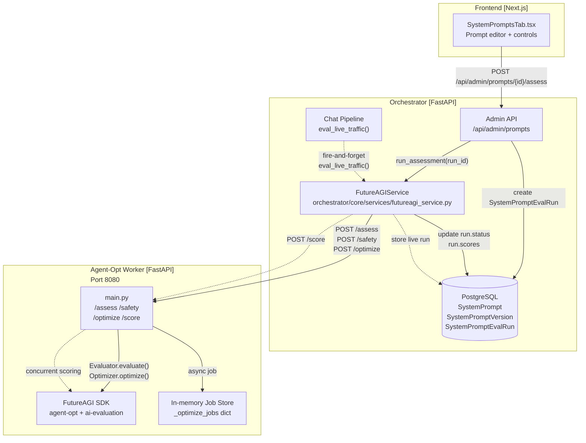
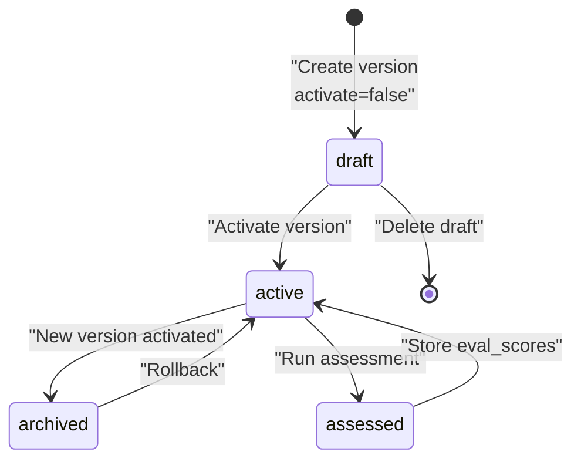
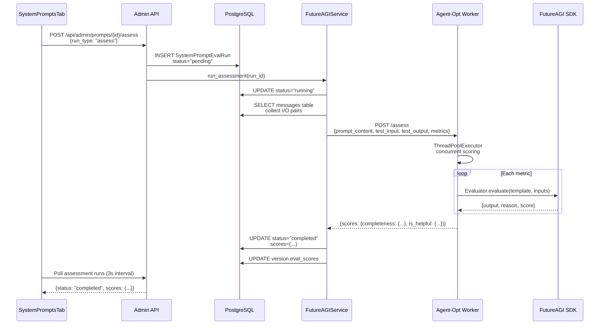
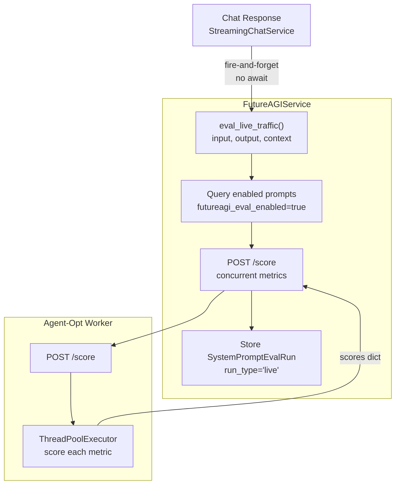

# Prompt Optimization

Relevant source files

The following files were used as context for generating this wiki page:

- [frontend/components/settings/SystemPromptsTab.tsx](frontend/components/settings/SystemPromptsTab.tsx)
- [orchestrator/core/services/futureagi_service.py](orchestrator/core/services/futureagi_service.py)
- [services/agent-opt-worker/Dockerfile](services/agent-opt-worker/Dockerfile)
- [services/agent-opt-worker/automatos_logging.py](services/agent-opt-worker/automatos_logging.py)
- [services/agent-opt-worker/automatos_metrics.py](services/agent-opt-worker/automatos_metrics.py)
- [services/agent-opt-worker/main.py](services/agent-opt-worker/main.py)
- [services/agent-opt-worker/requirements.txt](services/agent-opt-worker/requirements.txt)
- [services/shared/automatos_logging.py](services/shared/automatos_logging.py)
- [services/shared/automatos_metrics.py](services/shared/automatos_metrics.py)
- [services/workspace-worker/Dockerfile](services/workspace-worker/Dockerfile)
- [services/workspace-worker/automatos_logging.py](services/workspace-worker/automatos_logging.py)
- [services/workspace-worker/automatos_metrics.py](services/workspace-worker/automatos_metrics.py)
- [services/workspace-worker/entrypoint.sh](services/workspace-worker/entrypoint.sh)
- [services/workspace-worker/requirements.txt](services/workspace-worker/requirements.txt)

The prompt optimization system provides FutureAGI-powered assessment, safety checking, and optimization for system prompts. This system evaluates prompt quality using structured metric templates, runs safety scans to detect harmful content, and optimizes prompts using algorithms like meta-prompt learning and Bayesian search. The architecture isolates the FutureAGI SDK in a dedicated worker service to avoid dependency conflicts with the main orchestrator.

For agent-specific prompt assembly and context building, see [Context Service](#4). For general system configuration, see [Authentication & Multi-Tenancy](#17).

---

## Architecture Overview

The prompt optimization system uses a two-service architecture to isolate FutureAGI SDK dependencies from the main orchestrator.

Sources: [orchestrator/core/services/futureagi_service.py:45-112](), [services/agent-opt-worker/main.py:1-16]()

---

## System Prompt Management

System prompts are versioned content templates stored in the `system_prompts` table. Each prompt has multiple versions, with one marked as `active`. The system tracks evaluation scores per version and supports rollback to previous versions.

### Database Schema

| Table | Purpose | Key Fields |
|-------|---------|------------|
| `SystemPrompt` | Prompt metadata | `slug`, `display_name`, `category`, `futureagi_eval_enabled` |
| `SystemPromptVersion` | Versioned content | `prompt_id`, `version_number`, `content`, `status`, `eval_scores` |
| `SystemPromptEvalRun` | Assessment jobs | `prompt_id`, `version_id`, `run_type`, `status`, `scores` |

### Version Lifecycle

The frontend component `SystemPromptsTab` provides version management UI with tabs for content editing, version history, and assessment runs.

Sources: [frontend/components/settings/SystemPromptsTab.tsx:33-72](), [frontend/components/settings/SystemPromptsTab.tsx:202-212]()

### Version Management API

| Endpoint | Method | Purpose |
|----------|--------|---------|
| `POST /api/admin/prompts/{id}/versions` | Create new version (with `?activate=true/false`) |
| `POST /api/admin/prompts/{id}/versions/{vid}/activate` | Activate specific version |
| `POST /api/admin/prompts/{id}/rollback` | Rollback to previous version |
| `DELETE /api/admin/prompts/{id}/versions/{vid}` | Delete draft version |
| `PATCH /api/admin/prompts/{id}/futureagi-toggle` | Toggle live scoring on/off |

Sources: [frontend/components/settings/SystemPromptsTab.tsx:202-210](), [frontend/components/settings/SystemPromptsTab.tsx:219-227]()

---

## Prompt Evaluation

Prompt evaluation assesses quality using structured metric templates. The orchestrator collects a dataset of real chat exchanges and sends them to the worker for concurrent scoring across multiple metrics.

### Assessment Flow

Sources: [orchestrator/core/services/futureagi_service.py:118-145](), [services/agent-opt-worker/main.py:223-245]()

### Quality Metric Templates

The system provides pre-configured metric templates optimized for specific evaluation tasks:

| Template | Required Inputs | Model | Purpose |
|----------|----------------|-------|---------|
| `completeness` | input, output | turing_large | Checks if output fully addresses input |
| `is_helpful` | input, output | turing_large | Evaluates response helpfulness |
| `is_concise` | output | turing_large | Checks output conciseness |
| `prompt_adherence` | input, output | turing_large | Verifies output follows prompt instructions |
| `groundedness` | input, output, context | turing_large | Checks factual grounding in context |
| `factual_accuracy` | input, output | turing_large | Verifies factual correctness |
| `summary_quality` | input, output | turing_large | Assesses summary quality |

Each template returns:
- `score` (0.0-1.0 float)
- `passed` (boolean, true if score ≥ 0.5)
- `reason` (text explanation)

Sources: [services/agent-opt-worker/main.py:129-141](), [services/agent-opt-worker/main.py:59-122]()

### Dataset Collection

The `_collect_optimization_dataset()` method queries the `messages` table to extract recent user-assistant chat pairs. It extracts plain text from the `parts` JSONB field using `_extract_text()`, handling both string and structured message formats.

Sources: [orchestrator/core/services/futureagi_service.py:30-42](), [orchestrator/core/services/futureagi_service.py:137-143]()

---

## Live Traffic Scoring

Live traffic scoring automatically evaluates every chat response using enabled prompts. This provides continuous quality monitoring without manual intervention.

### Live Scoring Pipeline

Sources: [orchestrator/core/services/futureagi_service.py:232-302]()

### Implementation Details

The live scoring flow is fire-and-forget to avoid blocking chat responses:

1. **Chat pipeline** calls `eval_live_traffic()` after sending response (no await).
2. **FutureAGIService** queries all prompts with `futureagi_eval_enabled=True`.
3. For each enabled prompt, calls worker `/score` endpoint with default metrics: `["completeness", "is_helpful", "is_concise"]`.
4. Worker scores concurrently across all metrics using `ThreadPoolExecutor`.
5. Service stores a `SystemPromptEvalRun` with `run_type="live"` for each prompt.

Sources: [orchestrator/core/services/futureagi_service.py:233-302](), [services/agent-opt-worker/main.py:303-331]()

---

## Prompt Optimization

Prompt optimization uses FutureAGI's agent-opt library to iteratively improve prompt content. The process runs asynchronously in the worker service, allowing long-running optimization jobs without blocking the orchestrator.

### Async Job Pattern

Optimization is handled as an async job because it can take several minutes to complete. The `FutureAGIService` starts the job by calling `POST /optimize` on the worker, which returns a `job_id`. The orchestrator then polls `GET /optimize/{job_id}` until completion.

Sources: [orchestrator/core/services/futureagi_service.py:161-197](), [services/agent-opt-worker/main.py:443-467]()

### Polling with Backoff

The frontend component `SystemPromptsTab` implements the polling logic. When an assessment run is in `pending` or `running` status, it triggers an interval that polls the backend every 3 seconds to update the UI with the latest status and scores.

Sources: [frontend/components/settings/SystemPromptsTab.tsx:166-173]()

### Template Variable Escaping

System prompts often contain placeholders like `{agent_name}` or `{datetime}`. The optimization SDK's `.format()` method would crash on these. The worker escapes them by doubling the braces (e.g., `{{agent_name}}`) before optimization and restores them to single braces after. This is performed using regex `(?<!\{)\{(\w+)\}(?!\})` to safely identify variables.

Sources: [services/agent-opt-worker/main.py:356-377](), [services/agent-opt-worker/main.py:398-440]()

### Optimization Algorithms

| Algorithm | Strategy | Best For |
|-----------|----------|----------|
| `meta_prompt` | Uses a teacher LLM to generate improved prompts via meta-learning | General-purpose optimization |
| `bayesian` | Bayesian search over prompt variations with inference model | Few examples, exploration |
| `protegi` | Gradient-based optimization with beam search | High accuracy requirements |

Sources: [orchestrator/core/services/futureagi_service.py:164-165](), [services/agent-opt-worker/main.py:530-549]()

---

## Safety Checks

Safety scans detect harmful content in system prompts using specialized templates. The system adds context-aware preambles to reduce false positives on instructional text.

### Safety Templates

| Template | Model | Detects |
|----------|-------|---------|
| `toxicity` | protect | Toxic/harmful language |
| `prompt_injection` | protect | Injection attack patterns |
| `content_moderation` | protect | Policy-violating content |
| `bias_detection` | protect_flash | Biased language |

Sources: [services/agent-opt-worker/main.py:129-141]()

### Safety Scan Flow

The `SAFETY_PREAMBLE` prefixes the prompt to clarify it's instructional content, not user input. This reduces false positives when prompts discuss how to handle sensitive topics safely.

Sources: [services/agent-opt-worker/main.py:252-296]()

---

## Agent-Opt Worker Service

The `agent-opt-worker` is an isolated FastAPI service running in its own container. It holds all FutureAGI SDK dependencies, which conflict with the orchestrator's libraries.

### Service Architecture

| Component | Technology | Purpose |
|-----------|-----------|---------|
| Runtime | Python 3.11 | SDK compatibility |
| Framework | FastAPI + uvicorn | HTTP API |
| SDK | agent-opt==0.0.1 | Prompt optimization |
| SDK | ai-evaluation>=0.1.9 | Metric templates |
| Observability | prometheus_client | Metrics export at `/metrics` |
| Logging | automatos_logging | Structured logs to log-relay |

Sources: [services/agent-opt-worker/requirements.txt:1-8](), [services/agent-opt-worker/Dockerfile:1-16]()

### Worker Endpoints

| Endpoint | Method | Purpose | Timeout |
|----------|--------|---------|---------|
| `/assess` | POST | Score prompt with quality metrics | 120s |
| `/safety` | POST | Run safety templates | 120s |
| `/score` | POST | Score live chat exchange | 120s |
| `/optimize` | POST | Start async optimization job | 300s |
| `/optimize/{job_id}` | GET | Poll job status/result | 15s |

Sources: [orchestrator/core/services/futureagi_service.py:26-27](), [services/agent-opt-worker/main.py:16-28](), [services/agent-opt-worker/main.py:198-528]()

---

## UI Components

The `SystemPromptsTab` component provides a three-tab interface for prompt management:

### Content Tab
- Display active prompt content and edit mode with `Textarea`.
- Actions: "Save as Draft", "Save & Activate", "Rollback".

### Versions Tab
- List all versions with status badges (active, draft, archived).
- Shows version numbers, change notes, and associated evaluation scores.

### Assessments Tab
- Toggle for "FutureAGI Live Scoring".
- Action buttons: "Score Quality", "Optimize", "Safety Scan".
- Historical list of `AssessmentRun` entries with status and detailed score breakdown.

Sources: [frontend/components/settings/SystemPromptsTab.tsx:100-727]()

---