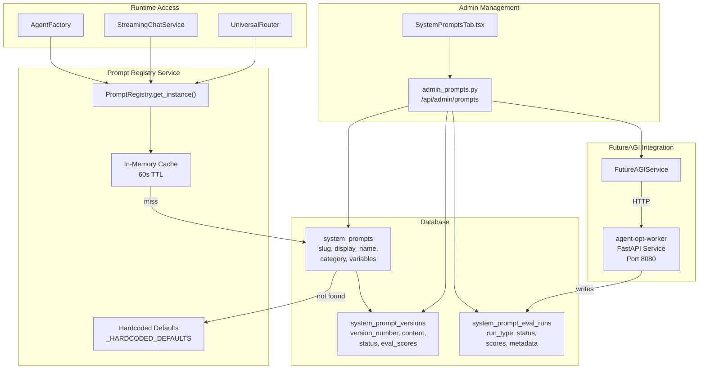
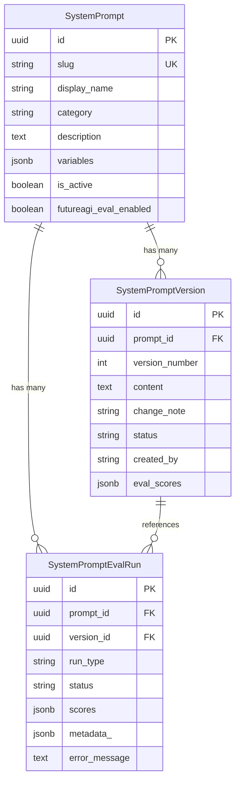
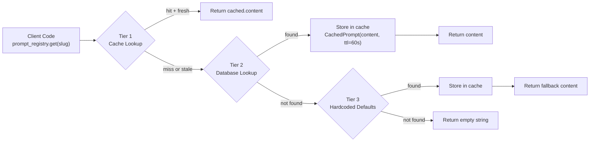
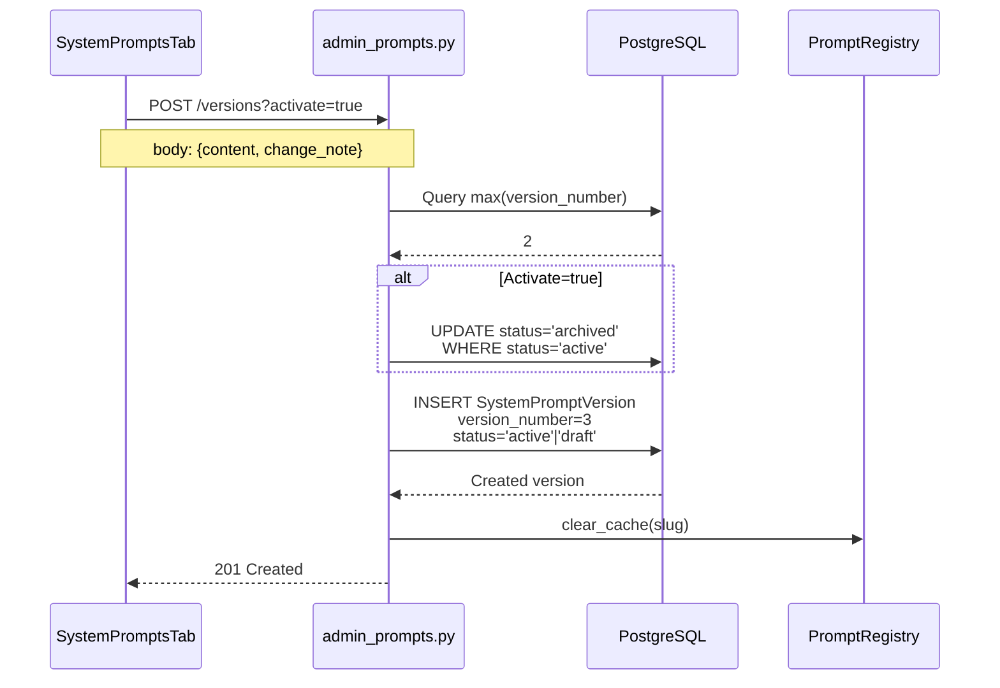
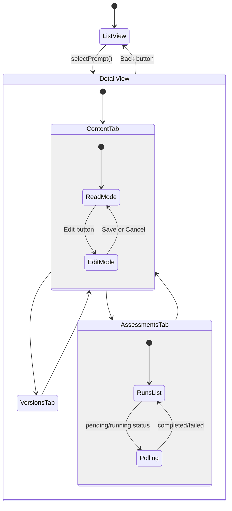
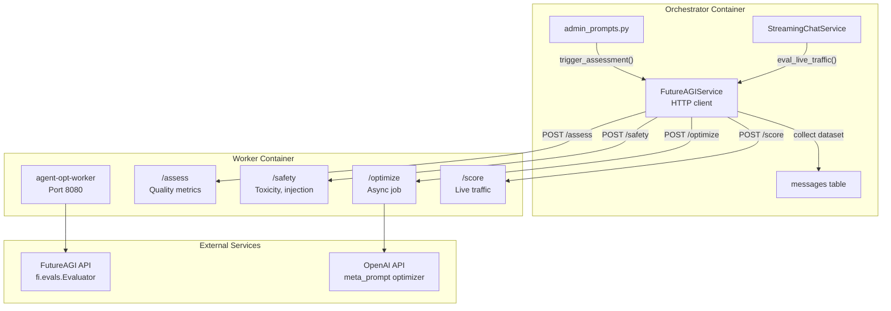
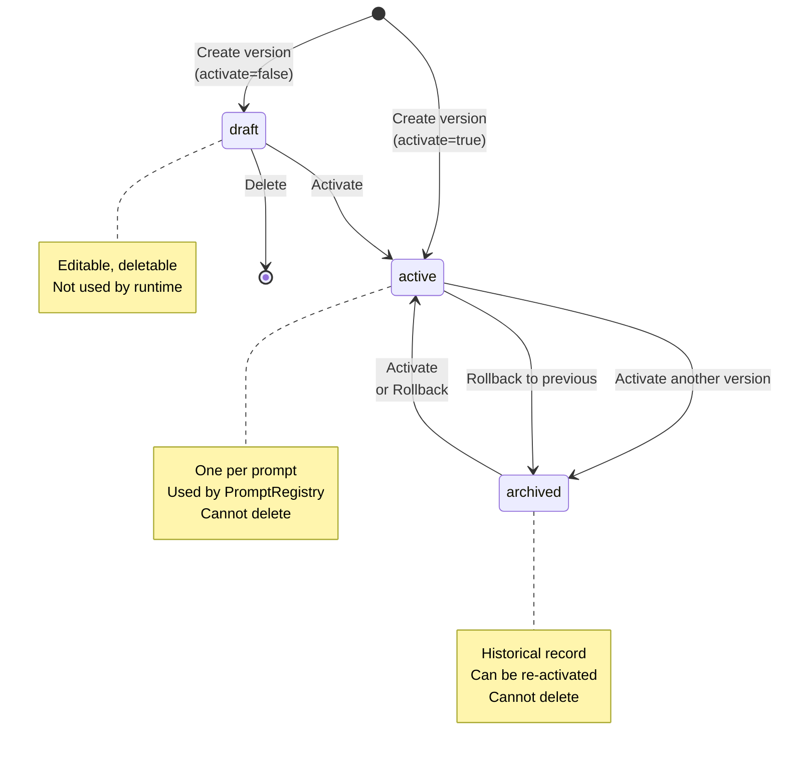
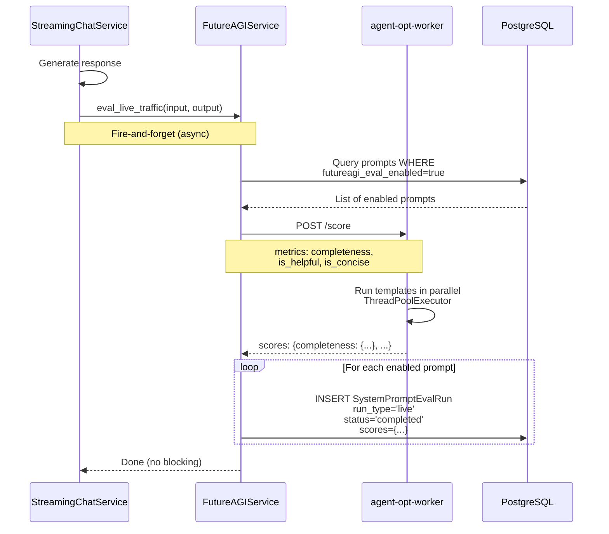

# System Prompt Management

<details>
<summary>Relevant source files</summary>

The following files were used as context for generating this wiki page:

- [frontend/components/settings/SystemPromptsTab.tsx](frontend/components/settings/SystemPromptsTab.tsx)
- [orchestrator/core/services/futureagi_service.py](orchestrator/core/services/futureagi_service.py)
- [services/agent-opt-worker/Dockerfile](services/agent-opt-worker/Dockerfile)
- [services/agent-opt-worker/main.py](services/agent-opt-worker/main.py)
- [services/agent-opt-worker/requirements.txt](services/agent-opt-worker/requirements.txt)

</details>


## Purpose and Scope

The System Prompt Management subsystem provides centralized storage, versioning, and optimization for all LLM-facing system prompts used throughout the Automatos AI platform. This includes chatbot personalities, orchestrator prompts, specialized task prompts, and persona templates.

This page covers prompt storage, versioning, the `PromptRegistry` cache, admin APIs, and FutureAGI-based evaluation and optimization. For runtime agent context assembly (how prompts are combined with plugins, skills, and tools), see [Agent Context Assembly](#3.5). For the FutureAGI worker service architecture, see [Worker Service Architecture](#11.5).

**Sources:** [orchestrator/core/models/system_prompts.py:1-205](), [orchestrator/core/services/prompt_registry.py:1-200]()

---

## System Architecture

The prompt management system consists of four primary layers:

1. **Database Layer**: PostgreSQL storage for prompts, versions, and evaluation runs
2. **Registry Layer**: `PromptRegistry` with 60-second TTL cache and three-tier fallback
3. **API Layer**: Admin REST endpoints for CRUD operations and evaluation triggers
4. **Worker Layer**: Isolated `agent-opt-worker` service for FutureAGI SDK operations

### High-Level Architecture Diagram



**Sources:** [orchestrator/core/services/prompt_registry.py:35-143](), [orchestrator/api/admin_prompts.py:1-466](), [orchestrator/core/services/futureagi_service.py:44-428]()

---

## Database Models

### SystemPrompt Table

The `SystemPrompt` model stores the container for a named prompt identified by a unique `slug`:

| Column | Type | Description |
|--------|------|-------------|
| `id` | UUID | Primary key |
| `slug` | String(120) | Unique stable identifier (e.g., "chatbot-friendly") |
| `display_name` | String(255) | Human-readable name |
| `category` | String(50) | Grouping (personality, orchestrator, specialized, persona) |
| `description` | Text | Optional documentation |
| `variables` | JSONB | Variable schema (e.g., `{"agent_name": "str"}`) |
| `is_active` | Boolean | Global enable/disable flag |
| `futureagi_eval_enabled` | Boolean | Enable live traffic scoring |
| `created_at` | DateTime | Creation timestamp |
| `updated_at` | DateTime | Last modification timestamp |

### SystemPromptVersion Table

The `SystemPromptVersion` model stores immutable snapshots of prompt content:

| Column | Type | Description |
|--------|------|-------------|
| `id` | UUID | Primary key |
| `prompt_id` | UUID | Foreign key to `system_prompts` |
| `version_number` | Integer | Sequential version (1, 2, 3, ...) |
| `content` | Text | The actual prompt text |
| `change_note` | String(500) | Optional change description |
| `status` | String(20) | draft \| active \| archived |
| `created_by` | String(255) | User ID or "system" |
| `created_at` | DateTime | Creation timestamp |
| `eval_scores` | JSONB | FutureAGI quality scores (populated after evaluation) |

**Constraint:** Only one version per prompt can have `status='active'` at any time. This is enforced at the application layer.

### SystemPromptEvalRun Table

The `SystemPromptEvalRun` model tracks FutureAGI assessment runs:

| Column | Type | Description |
|--------|------|-------------|
| `id` | UUID | Primary key |
| `prompt_id` | UUID | Foreign key to `system_prompts` |
| `version_id` | UUID | Foreign key to `system_prompt_versions` |
| `run_type` | String(30) | assess \| optimize \| safety \| live |
| `status` | String(20) | pending \| running \| completed \| failed |
| `scores` | JSONB | Evaluation results |
| `metadata_` | JSONB | Configuration (algorithm, metrics, etc.) |
| `error_message` | Text | Failure details |
| `started_at` | DateTime | Execution start time |
| `completed_at` | DateTime | Execution end time |
| `created_at` | DateTime | Record creation timestamp |

**Sources:** [orchestrator/core/models/system_prompts.py:32-139]()

### Model Relationships Diagram



**Sources:** [orchestrator/core/models/system_prompts.py:32-139]()

---

## PromptRegistry Service

The `PromptRegistry` is a singleton service providing cached access to system prompts with three-tier fallback resolution.

### Architecture



**Sources:** [orchestrator/core/services/prompt_registry.py:93-116]()

### Cache Implementation

The `CachedPrompt` dataclass stores cached content with TTL tracking:

```python
@dataclass
class CachedPrompt:
    content: str
    fetched_at: float = field(default_factory=time.time)
    ttl: float = 60.0  # seconds

    @property
    def is_stale(self) -> bool:
        return (time.time() - self.fetched_at) > self.ttl
```

The registry maintains an in-memory dictionary `_cache: Dict[str, CachedPrompt]` indexed by slug.

**Sources:** [orchestrator/core/services/prompt_registry.py:24-32]()

### Variable Interpolation

The `get()` method accepts keyword arguments for variable substitution using `str.format_map()`:

```python
def get(self, slug: str, **variables: Any) -> str:
    raw = self._resolve(slug)
    if not raw:
        return ""
    
    if variables:
        try:
            return raw.format_map(variables)
        except KeyError as e:
            logger.warning(f"Missing variable {e} for prompt '{slug}', returning raw")
            return raw
    
    return raw
```

**Example Usage:**
```python
from core.services.prompt_registry import prompt_registry

text = prompt_registry.get(
    "chatbot-friendly",
    agent_name="Atlas",
    agent_role="General assistant",
    tools_list="search, calendar, email"
)
```

The prompt template `"You are {agent_name}, a friendly AI assistant..."` becomes `"You are Atlas, a friendly AI assistant..."`.

**Sources:** [orchestrator/core/services/prompt_registry.py:59-76]()

### Hardcoded Defaults

The registry includes hardcoded fallbacks in `_HARDCODED_DEFAULTS` dictionary for bootstrapping scenarios where the database is unavailable. These are minimal versions of the most critical prompts (chatbot personalities, routing classifier, etc.).

**Sources:** [orchestrator/core/services/prompt_registry.py:149-195]()

---

## Admin API Endpoints

The `admin_prompts.py` router provides REST endpoints for managing prompts.

### Endpoint Summary

| Method | Endpoint | Description |
|--------|----------|-------------|
| `GET` | `/api/admin/prompts` | List prompts with optional category/search filters |
| `GET` | `/api/admin/prompts/categories` | Get category counts |
| `GET` | `/api/admin/prompts/{prompt_id}` | Get single prompt details |
| `GET` | `/api/admin/prompts/{prompt_id}/versions` | List all versions for a prompt |
| `POST` | `/api/admin/prompts/{prompt_id}/versions` | Create new version (draft or activate) |
| `POST` | `/api/admin/prompts/{prompt_id}/versions/{version_id}/activate` | Activate specific version |
| `POST` | `/api/admin/prompts/{prompt_id}/rollback` | Rollback to previous version |
| `DELETE` | `/api/admin/prompts/{prompt_id}/versions/{version_id}` | Delete draft version |
| `PATCH` | `/api/admin/prompts/{prompt_id}/futureagi-toggle` | Toggle live traffic scoring |
| `GET` | `/api/admin/prompts/{prompt_id}/assessment-runs` | List FutureAGI runs |
| `POST` | `/api/admin/prompts/{prompt_id}/assess` | Trigger assessment/optimization |

**Sources:** [orchestrator/api/admin_prompts.py:42-466]()

### Version Creation Flow



**Sources:** [orchestrator/api/admin_prompts.py:171-223]()

### Rollback Operation

The rollback endpoint re-activates the most recent archived version:

1. Find most recent `status='archived'` version
2. Update current `status='active'` to `status='archived'`
3. Update found version to `status='active'`
4. Clear registry cache

**Sources:** [orchestrator/api/admin_prompts.py:267-308]()

---

## Seed System

The `seed_system_prompts.py` module provides idempotent initialization of default prompts.

### Prompt Manifest

The `PROMPT_MANIFEST` list defines all default prompts across four categories:

| Category | Slugs |
|----------|-------|
| **personality** | `chatbot-friendly`, `chatbot-professional`, `chatbot-technical` |
| **orchestrator** | `routing-classifier`, `task-decomposer`, `complexity-analyzer`, `agent-selector`, `master-orchestrator`, `quality-assessor` |
| **specialized** | `nl2sql-generator`, `memory-injection` |
| **persona** | `persona-executive-assistant`, `persona-data-analyst`, `persona-code-reviewer`, `persona-creative-writer` |

Each entry specifies:
- `slug`: Unique identifier
- `display_name`: Human-readable title
- `category`: Grouping
- `description`: Documentation
- `variables`: Expected template variables
- `content`: Initial prompt text

**Sources:** [orchestrator/core/seeds/seed_system_prompts.py:23-318]()

### Seeding Logic

The `seed_system_prompts(db: Session)` function:

1. Iterates through `PROMPT_MANIFEST`
2. Checks if prompt with same `slug` already exists
3. If not, creates `SystemPrompt` record
4. Creates initial `SystemPromptVersion` with `version_number=1`, `status='active'`, `created_by='system'`
5. Commits transaction

This is called during application startup from the lifespan handler in `main.py`.

**Sources:** [orchestrator/core/seeds/seed_system_prompts.py:321-365]()

---

## Frontend Interface

The `SystemPromptsTab` component provides the admin UI for prompt management.

### Component States



**Sources:** [frontend/components/settings/SystemPromptsTab.tsx:100-727]()

### List View

The list view displays all prompts with:
- Search filter (searches display_name, slug, description)
- Category filter buttons (All, personality, orchestrator, specialized, persona)
- Prompt cards showing: display_name, category badge, version count

**Sources:** [frontend/components/settings/SystemPromptsTab.tsx:302-379]()

### Detail View Tabs

**Content Tab:**
- Read mode: Shows active content in `<pre>` block, quality scores if available
- Edit mode: `<Textarea>` for content, `<Input>` for change note
- Actions: "Edit Prompt", "Rollback", "Save as Draft", "Save & Activate"

**Versions Tab:**
- Lists all versions with version number, status badge, change note, timestamp
- Actions: "Activate" button for non-active versions, "Delete" button for drafts

**Assessments Tab:**
- FutureAGI live scoring toggle
- Trigger buttons: "Score Quality", "Optimize", "Safety Scan"
- Assessment run results with status badges, scores, optimized prompts

**Sources:** [frontend/components/settings/SystemPromptsTab.tsx:420-724]()

### Assessment Run Polling

When assessment runs have `status='pending'` or `status='running'`, the component polls every 3 seconds:

```typescript
useEffect(() => {
  const hasPending = assessmentRuns.some(r => r.status === 'pending' || r.status === 'running')
  if (!hasPending || !selectedPrompt) return
  const interval = setInterval(() => {
    fetchAssessmentRuns(selectedPrompt.id)
  }, 3000)
  return () => clearInterval(interval)
}, [assessmentRuns, selectedPrompt, fetchAssessmentRuns])
```

**Sources:** [frontend/components/settings/SystemPromptsTab.tsx:165-173]()

---

## FutureAGI Integration

The FutureAGI integration provides automated prompt evaluation, safety checks, and optimization through the `agent-opt` and `ai-evaluation` SDKs.

### Service Architecture



**Sources:** [orchestrator/core/services/futureagi_service.py:44-428](), [services/agent-opt-worker/main.py:1-545]()

### Evaluation Types

**Assess (`/assess` endpoint):**
- Runs quality metrics: `completeness`, `is_helpful`, `is_concise`, `prompt_adherence`, `factual_accuracy`
- Uses real input/output pairs from live traffic or synthetic test cases
- Returns scores 0.0-1.0 per metric with pass/fail status and reasoning

**Safety (`/safety` endpoint):**
- Runs protection metrics: `toxicity`, `prompt_injection`, `content_moderation`
- Prefixes prompt with context preamble: "NOTE: The following text is a SYSTEM PROMPT..."
- Returns overall safe/unsafe verdict with per-check details

**Optimize (`/optimize` endpoint):**
- Starts async optimization job, returns `job_id`
- Collects dataset from recent chat messages
- Runs meta_prompt algorithm (or bayesian/protegi/random)
- Polls via `GET /optimize/{job_id}` until completed
- Returns optimized prompt text, initial/final scores, history

**Score (`/score` endpoint):**
- Scores a single input/output pair (used for live traffic)
- Fire-and-forget from chat pipeline when `futureagi_eval_enabled=true`

**Sources:** [services/agent-opt-worker/main.py:218-327]()

### Template Variable Escaping

The worker implements special escaping for template variables like `{agent_name}` to prevent `.format()` crashes during optimization:

```python
def _escape_template_vars(text: str) -> tuple[str, list[tuple[str, str]]]:
    replacements = []
    for match in re.finditer(r'(?<!\{)\{(\w+)\}(?!\})', text):
        original = match.group(0)
        var_name = match.group(1)
        placeholder = f"__TMPL_{var_name.upper()}__"
        replacements.append((placeholder, original))
    escaped = text
    for placeholder, original in replacements:
        escaped = escaped.replace(original, placeholder)
    return escaped, replacements
```

After optimization, `_restore_template_vars()` reverses the process.

**Sources:** [services/agent-opt-worker/main.py:351-372]()

### Dataset Collection

The orchestrator collects datasets from the `messages` table by joining consecutive user/assistant message pairs:

```sql
SELECT m1.parts, m2.parts
FROM messages m1
JOIN messages m2
  ON m1.chat_id = m2.chat_id
  AND m2.role = 'assistant'
  AND m2.created_at = (
      SELECT MIN(created_at) FROM messages
      WHERE chat_id = m1.chat_id AND role = 'assistant'
      AND created_at > m1.created_at
  )
WHERE m1.role = 'user'
ORDER BY m1.created_at DESC
LIMIT :limit
```

This extracts real conversational turns for optimization training.

**Sources:** [orchestrator/core/services/futureagi_service.py:307-343]()

---

## Version Lifecycle

System prompt versions follow a strict state machine:

### State Diagram



**Sources:** [orchestrator/api/admin_prompts.py:171-308]()

### Activation Rules

1. Only one version per prompt can have `status='active'`
2. When activating a version, the current active version is automatically archived
3. Draft versions can be deleted; active/archived versions cannot
4. Rollback re-activates the most recent archived version
5. Every activation clears the `PromptRegistry` cache for that slug

**Sources:** [orchestrator/api/admin_prompts.py:225-264]()

---

## Live Traffic Scoring

When `SystemPrompt.futureagi_eval_enabled=true`, the system automatically scores every chat response.

### Scoring Flow



**Sources:** [orchestrator/core/services/futureagi_service.py:233-301]()

### Integration Point

The chat service calls this after generating each assistant response:

```python
# Fire-and-forget scoring
asyncio.create_task(
    futureagi_service.eval_live_traffic(
        input_text=user_message,
        output_text=assistant_response,
        context_text=system_prompt
    )
)
```

This builds a dataset over time for future optimization runs.

**Sources:** [orchestrator/core/services/futureagi_service.py:233-301]()

---

## Configuration

### Environment Variables

| Variable | Description | Default |
|----------|-------------|---------|
| `AGENT_OPT_WORKER_URL` | Worker service URL | `http://agent-opt-worker.railway.internal:8080` |
| `FUTUREAGI_API_KEY` | FutureAGI API key (worker reads this) | (none) |
| `FUTUREAGI_SECRET_KEY` | FutureAGI secret key (worker reads this) | (none) |
| `OPENAI_API_KEY` | OpenAI key for optimization (worker reads this) | (none) |

The orchestrator only needs `AGENT_OPT_WORKER_URL`. The worker reads the FutureAGI and OpenAI keys directly.

**Sources:** [orchestrator/core/services/futureagi_service.py:24-26](), [services/agent-opt-worker/main.py:41-51]()

### Worker Isolation

The `agent-opt-worker` runs in a separate container to isolate the `agent-opt` and `ai-evaluation` SDKs from the main orchestrator, preventing version conflicts and dependency bloat.

**Docker Setup:**
```dockerfile
FROM python:3.11-slim
WORKDIR /app
COPY requirements.txt .
RUN pip install --no-cache-dir -r requirements.txt
COPY main.py .
EXPOSE 8080
CMD ["uvicorn", "main:app", "--host", "0.0.0.0", "--port", "8080"]
```

**Sources:** [services/agent-opt-worker/Dockerfile:1-16](), [services/agent-opt-worker/requirements.txt:1-7]()

---

## Template Configuration

The worker uses a `TEMPLATE_CONFIG` dictionary to define:
- Required input keys per template (`input`, `output`, `context`)
- Best model per template (`turing_large`, `protect`, etc.)

| Template | Keys | Model |
|----------|------|-------|
| `completeness` | input, output | turing_large |
| `is_helpful` | input, output | turing_large |
| `is_concise` | output | turing_large |
| `toxicity` | output | protect |
| `prompt_injection` | input | protect |
| `content_moderation` | output | protect |

This ensures each evaluation template receives only the data it expects.

**Sources:** [services/agent-opt-worker/main.py:124-136]()

---

## Summary

The System Prompt Management subsystem provides:

1. **Versioned Storage**: PostgreSQL-backed prompts with draft/active/archived lifecycle
2. **Cached Access**: 60-second TTL cache with DB and hardcoded fallbacks
3. **Admin Interface**: REST APIs and React UI for CRUD operations
4. **Evaluation System**: FutureAGI integration for quality scoring and optimization
5. **Live Learning**: Automatic scoring of chat responses to build optimization datasets
6. **Worker Isolation**: Separate container for SDK dependencies

All LLM-facing prompts in the platform are managed through this system, enabling centralized updates, A/B testing via draft versions, and continuous improvement through FutureAGI optimization.

**Sources:** [orchestrator/core/models/system_prompts.py:1-205](), [orchestrator/core/services/prompt_registry.py:1-200](), [orchestrator/api/admin_prompts.py:1-466](), [orchestrator/core/services/futureagi_service.py:1-432](), [services/agent-opt-worker/main.py:1-545]()

---