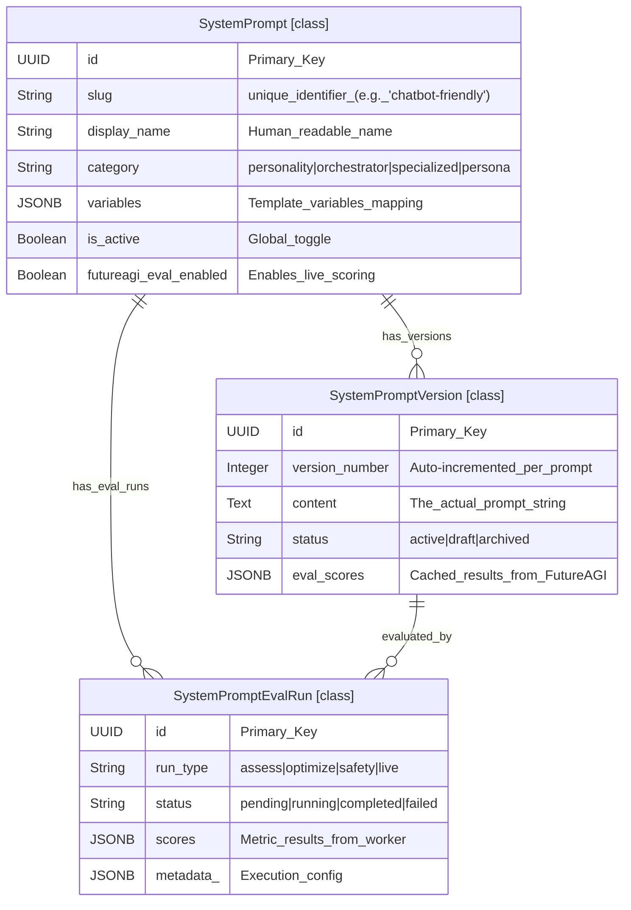
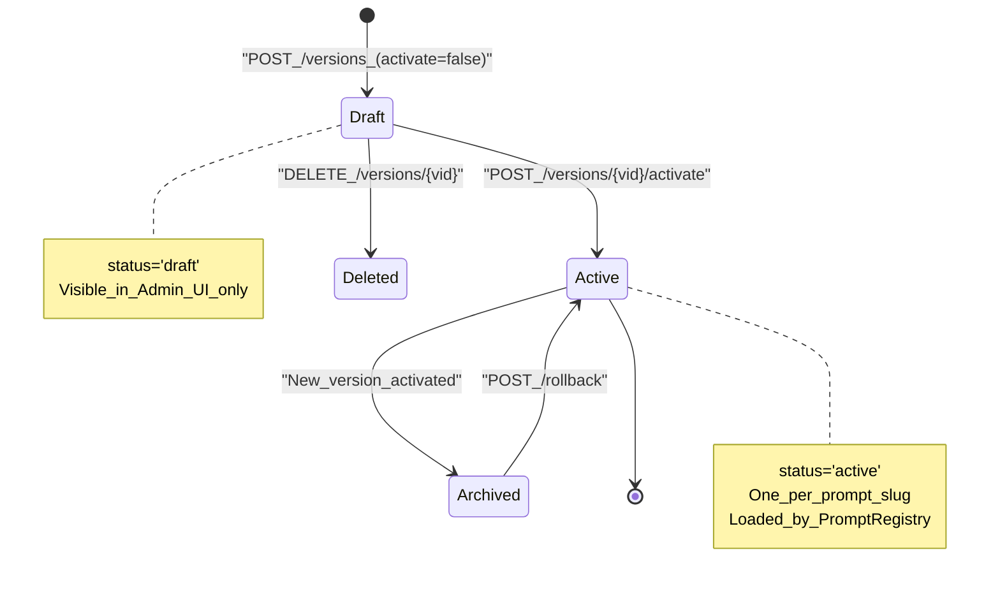
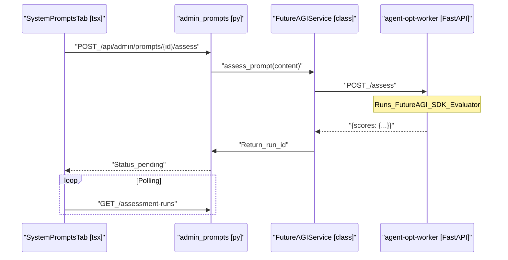

# System Prompt Management

Relevant source files

The following files were used as context for generating this wiki page:

- [frontend/components/settings/SystemPromptsTab.tsx](frontend/components/settings/SystemPromptsTab.tsx)
- [orchestrator/core/services/futureagi_service.py](orchestrator/core/services/futureagi_service.py)
- [services/agent-opt-worker/Dockerfile](services/agent-opt-worker/Dockerfile)
- [services/agent-opt-worker/automatos_logging.py](services/agent-opt-worker/automatos_logging.py)
- [services/agent-opt-worker/automatos_metrics.py](services/agent-opt-worker/automatos_metrics.py)
- [services/agent-opt-worker/main.py](services/agent-opt-worker/main.py)
- [services/agent-opt-worker/requirements.txt](services/agent-opt-worker/requirements.txt)
- [services/shared/automatos_logging.py](services/shared/automatos_logging.py)
- [services/shared/automatos_metrics.py](services/shared/automatos_metrics.py)
- [services/workspace-worker/automatos_logging.py](services/workspace-worker/automatos_logging.py)
- [services/workspace-worker/automatos_metrics.py](services/workspace-worker/automatos_metrics.py)

System Prompt Management provides versioned storage and FutureAGI-powered optimization for system-level prompts used throughout the Automatos platform. This includes personality presets for the orchestrator, specialized prompts for agents, and custom persona templates managed via the `SystemLLMSettingsTab` and `SystemPromptsTab`.

For runtime prompt assembly and context injection, see **4. Context Service**. For agent-specific persona configuration, see **5.3. Agent Personas**. For FutureAGI prompt evaluation and optimization workflows, see **15.2. Prompt Evaluation** and **15.4. Prompt Optimization**.

---

## Database Schema

System prompts are stored in three core tables that provide versioning, evaluation tracking, and content management. These models are defined in `orchestrator/core/models/system_prompts.py` and integrated into the global model registry in `orchestrator/core/models/__init__.py`.

### Data Model Entity Space

The following diagram associates the logical data entities with their specific SQLAlchemy class implementations.

**Sources:** [orchestrator/core/models/system_prompts.py:32-139](), [orchestrator/core/models/__init__.py:21-21]()

---

## Prompt Registry & Resolution

The `PromptRegistry` is a singleton service that manages prompt retrieval with a multi-tier resolution strategy: **In-memory Cache -> Database -> Hardcoded Fallbacks**.

### Prompt Resolution Logic

1.  **Cache**: Checks `self._cache` for a `CachedPrompt`. If not stale (TTL 60s), returns content [orchestrator/core/services/prompt_registry.py:93-98]().
2.  **Database**: Queries `SystemPrompt` and `SystemPromptVersion` for the `active` status version [orchestrator/core/services/prompt_registry.py:118-140]().
3.  **Fallback**: If DB is unavailable or empty, uses `_HARDCODED_DEFAULTS` [orchestrator/core/services/prompt_registry.py:149-199]().

### Variable Interpolation
The registry uses `str.format_map(variables)` to inject runtime data into prompts.
- **Example**: `prompt_registry.get("chatbot-friendly", agent_name="Atlas")` replaces `{agent_name}` in the template [orchestrator/core/services/prompt_registry.py:59-76]().

**Sources:** [orchestrator/core/services/prompt_registry.py:35-115](), [orchestrator/core/seeds/seed_system_prompts.py:23-163]()

---

## Prompt Lifecycle & Versioning

Prompts follow a strict versioning flow managed by `orchestrator/api/admin_prompts.py`. Admin access is strictly enforced via `_assert_admin` [orchestrator/api/admin_prompts.py:49-55]().

### Version Creation Flow
When `create_version` is called with `activate=true`:
1.  The system determines the next `version_number` by querying `func.max(SystemPromptVersion.version_number)` [orchestrator/api/admin_prompts.py:187-191]().
2.  The current `active` version for that `prompt_id` is updated to `status="archived"` [orchestrator/api/admin_prompts.py:196-200]().
3.  A new `SystemPromptVersion` is inserted with `status="active"` and the new content [orchestrator/api/admin_prompts.py:203-211]().

**Sources:** [orchestrator/api/admin_prompts.py:171-217](), [orchestrator/api/admin_prompts.py:253-288]()

---

## FutureAGI Integration Architecture

Automatos uses an isolated `agent-opt-worker` service to handle heavy LLM evaluation tasks. The `FutureAGIService` in the orchestrator acts as a thin HTTP client.

### Component Roles

| Component | Role | File |
|-----------|------|------|
| `FutureAGIService` | Orchestrator-side client for DB reads/writes and worker dispatch. | `orchestrator/core/services/futureagi_service.py` |
| `agent-opt-worker` | FastAPI service running the FutureAGI SDK in isolation. | `services/agent-opt-worker/main.py` |
| `SystemPromptsTab` | Frontend management interface with live auto-polling. | `frontend/components/settings/SystemPromptsTab.tsx` |

### System Interaction Space

This diagram maps the UI configuration components to the backend service and worker entities.

**Sources:** [orchestrator/core/services/futureagi_service.py:45-112](), [services/agent-opt-worker/main.py:1-40](), [frontend/components/settings/SystemPromptsTab.tsx:100-115](), [orchestrator/api/admin_prompts.py:42-55]()

---

## Live Traffic Scoring

When `futureagi_eval_enabled` is set to `True` on a `SystemPrompt`, the system performs "fire-and-forget" scoring on every chat exchange [orchestrator/core/models/system_prompts.py:52-52]().

1.  **Trigger**: `FutureAGIService.eval_live_traffic` is called with user input and agent output [orchestrator/core/services/futureagi_service.py:233-240]().
2.  **Dispatch**: The service identifies all enabled prompts and sends a `/score` request to the worker [orchestrator/core/services/futureagi_service.py:270-280]().
3.  **Metrics**: The worker evaluates metrics like `completeness`, `is_helpful`, and `is_concise` concurrently using a `ThreadPoolExecutor` [services/agent-opt-worker/main.py:303-331](). It maps these templates to specific models, such as `turing_large` for quality and `protect` for safety [services/agent-opt-worker/main.py:129-141]().
4.  **Storage**: Results are saved as `SystemPromptEvalRun` with `run_type='live'` [orchestrator/core/services/futureagi_service.py:288-300]().

**Sources:** [orchestrator/core/services/futureagi_service.py:233-302](), [services/agent-opt-worker/main.py:129-141](), [services/agent-opt-worker/main.py:303-351]()

---

## Prompt Optimization Workflow

Optimization uses multi-round refinement algorithms (e.g., `meta_prompt`, `bayesian`) provided by the SDK [orchestrator/core/services/futureagi_service.py:164-166]().

-   **Dataset Collection**: The service pulls up to 10 real chat exchanges to ground the optimization [orchestrator/core/services/futureagi_service.py:171-173]().
-   **Template Escaping**: To prevent the SDK's `.format()` calls from failing on platform variables, the worker uses `_escape_template_vars` to replace `{var}` with `__TMPL_VAR__` during processing [services/agent-opt-worker/main.py:356-377]().
-   **Async Execution**: Optimization is handled as an async job on the worker, returning a `job_id` to the orchestrator [services/agent-opt-worker/main.py:473-485]().
-   **Polling**: The frontend polls the status of the optimization job every 3 seconds while it is in a `pending` or `running` state [frontend/components/settings/SystemPromptsTab.tsx:166-173]().

**Sources:** [orchestrator/core/services/futureagi_service.py:161-227](), [services/agent-opt-worker/main.py:356-377](), [services/agent-opt-worker/main.py:473-549](), [frontend/components/settings/SystemPromptsTab.tsx:166-173]()

---