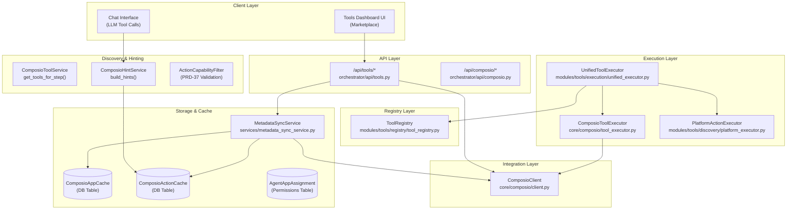
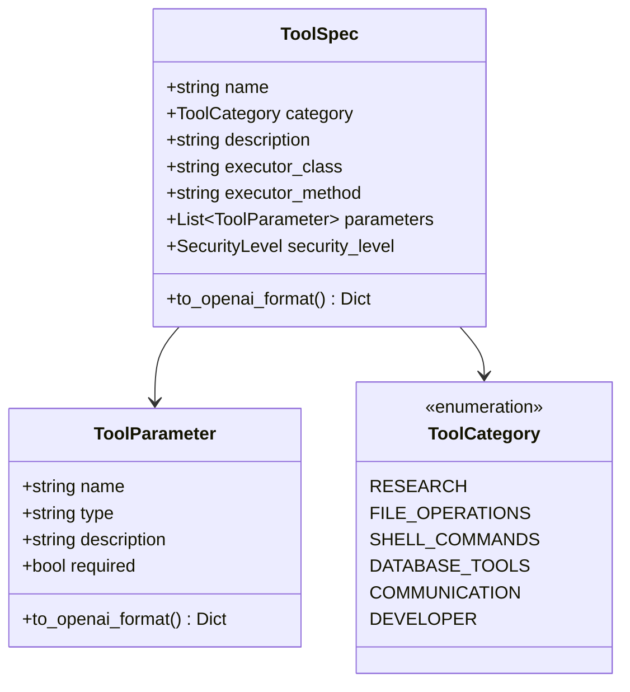
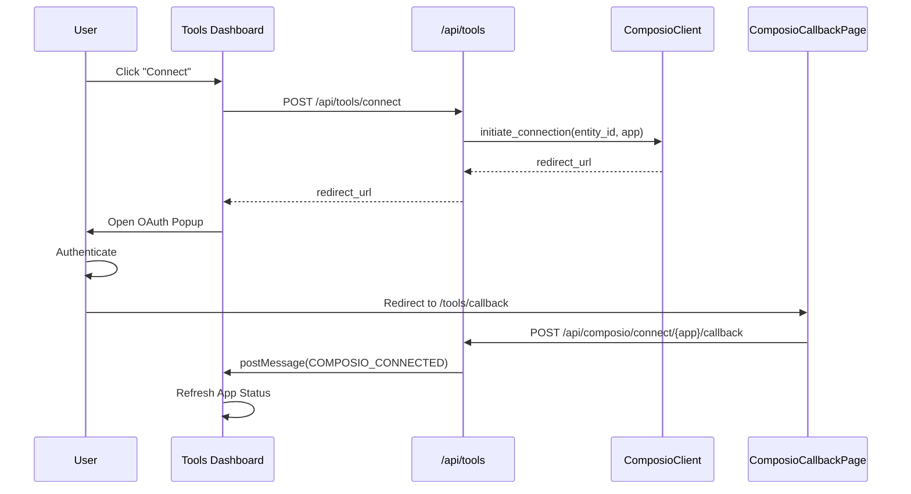
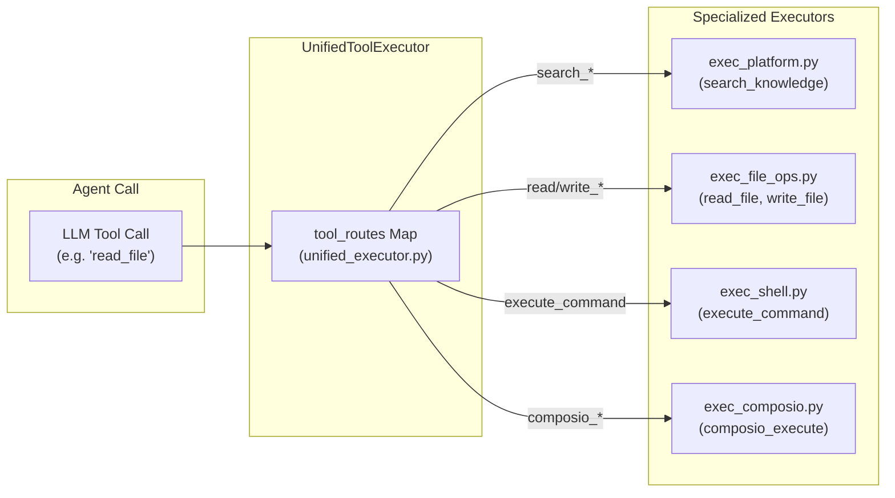

# Tools & Integrations

Relevant source files

The following files were used as context for generating this wiki page:

- [orchestrator/alembic/versions/prd123_tool_tier.py](orchestrator/alembic/versions/prd123_tool_tier.py)
- [orchestrator/api/tools.py](orchestrator/api/tools.py)
- [orchestrator/consumers/__init__.py](orchestrator/consumers/__init__.py)
- [orchestrator/consumers/chatbot/__init__.py](orchestrator/consumers/chatbot/__init__.py)
- [orchestrator/consumers/chatbot/tool_router.py](orchestrator/consumers/chatbot/tool_router.py)
- [orchestrator/core/composio/client.py](orchestrator/core/composio/client.py)
- [orchestrator/core/composio/tool_executor.py](orchestrator/core/composio/tool_executor.py)
- [orchestrator/core/models/tools.py](orchestrator/core/models/tools.py)
- [orchestrator/modules/agents/factory/agent_factory.py](orchestrator/modules/agents/factory/agent_factory.py)
- [orchestrator/modules/tools/__init__.py](orchestrator/modules/tools/__init__.py)
- [orchestrator/modules/tools/execution/exec_platform.py](orchestrator/modules/tools/execution/exec_platform.py)
- [orchestrator/modules/tools/execution/unified_executor.py](orchestrator/modules/tools/execution/unified_executor.py)
- [orchestrator/modules/tools/registry/tool_registry.py](orchestrator/modules/tools/registry/tool_registry.py)
- [orchestrator/modules/tools/services/composio_hint_service.py](orchestrator/modules/tools/services/composio_hint_service.py)
- [orchestrator/modules/tools/services/composio_tool_service.py](orchestrator/modules/tools/services/composio_tool_service.py)
- [orchestrator/services/metadata_sync_service.py](orchestrator/services/metadata_sync_service.py)

## Purpose and Scope

This document describes the tools and integrations system in Automatos AI, which enables agents to interact with external services via the Composio platform and internal platform capabilities. The system provides access to 880+ applications with 12,000+ actions through a unified interface, including OAuth management, metadata caching, action discovery, and execution.

For information about how agents use tools during chat conversations, see [Chat Interface](#9). For workspace-specific tools like file operations and shell commands, see [Workspace Execution](#21). For knowledge retrieval tools, see [Knowledge Base & RAG](#7).

---

## System Architecture

The tools system consists of five main layers: (1) **Tool Registry** for centralized tool catalogs, (2) **Tool Discovery** for resolving available actions, (3) **Metadata Sync** for caching Composio apps/actions locally, (4) **Connection Management** for OAuth flows, and (5) **Tool Execution** for routing and validation.

Title: Tool System Architecture (Natural Language to Code Entity Space)

**Key Components**:

| Component | Purpose | Location |
|-----------|---------|----------|
| `ToolRegistry` | Centralized catalog of platform tools | [orchestrator/modules/tools/registry/tool_registry.py:157-181]() |
| `UnifiedToolExecutor` | Single entry point for tool execution | [orchestrator/modules/tools/execution/unified_executor.py:67-168]() |
| `ComposioClient` | Wrapper around Composio SDK | [orchestrator/core/composio/client.py:54-126]() |
| `MetadataSyncService` | Syncs Composio metadata to local cache | [orchestrator/services/metadata_sync_service.py:37-54]() |
| `ComposioToolService` | Resolves Composio actions into tool schemas | [orchestrator/modules/tools/services/composio_tool_service.py:63-73]() |
| `ComposioHintService` | Generates system message hints for LLM | [orchestrator/modules/tools/services/composio_hint_service.py:89-109]() |

**Sources**: [orchestrator/modules/tools/execution/unified_executor.py:1-44](), [orchestrator/core/composio/client.py:1-51](), [orchestrator/modules/tools/registry/tool_registry.py:1-35](), [orchestrator/modules/tools/services/composio_tool_service.py:1-22](), [orchestrator/modules/tools/services/composio_hint_service.py:1-21]()

---

## Tool Registry

The `ToolRegistry` provides a single source of truth for all platform tools. Tools are defined as `ToolSpec` objects with metadata, parameters, security levels, and executors.

Title: Tool Specification Entities

**Platform Tools** (defined in `_register_core_tools()`):
- **Research**: `search_knowledge`, `semantic_search`, `search_codebase` [orchestrator/modules/tools/execution/unified_executor.py:107-111]()
- **Database**: `query_database`, `smart_query_database` [orchestrator/modules/tools/execution/unified_executor.py:114-115]()
- **File Operations**: `read_file`, `write_file`, `list_directory` [orchestrator/modules/tools/execution/unified_executor.py:124-128]()
- **Shell**: `execute_command` [orchestrator/modules/tools/execution/unified_executor.py:131-131]()
- **Composio**: `composio_execute` [orchestrator/modules/tools/execution/unified_executor.py:140-140]()

**Sources**: [orchestrator/modules/tools/registry/tool_registry.py:38-154](), [orchestrator/modules/tools/execution/unified_executor.py:105-166]()

---

## Composio Integration

Composio provides OAuth management and tool execution for 880+ external applications. The `ComposioClient` wraps the Composio SDK and provides workspace-isolated connections via the `EntityManager`.

### Connection Flow

Title: OAuth Connection Sequence

### ComposioClient Methods

| Method | Purpose | Returns |
|--------|---------|---------|
| `initiate_connection` | Start OAuth flow | `str` (redirect URL) [orchestrator/core/composio/client.py:69-79]() |
| `get_entity` | Get/validate entity ID | `Dict` [orchestrator/core/composio/client.py:128-146]() |
| `_resolve_auth_config_id` | Cached auth config lookup | `Optional[str]` [orchestrator/core/composio/client.py:148-180]() |

**Sources**: [orchestrator/core/composio/client.py:54-126](), [orchestrator/api/tools.py:79-104](), [orchestrator/core/composio/entity_manager.py:1-50]()

---

## Tool Discovery & Hinting

Automatos uses a 3-tier strategy to resolve tools for an agent's current task, managed by `ComposioToolService` and `ComposioHintService`.

1. **Capability-based**: Uses `ActionCapabilityFilter` and taxonomy overlap to find relevant actions [orchestrator/modules/tools/services/composio_hint_service.py:162-166]().
2. **Token-filtered**: Matches prompt tokens against `ComposioActionCache` with a mandatory capability gate [orchestrator/modules/tools/services/composio_hint_service.py:167-172]().
3. **Top-N Fallback**: Provides safe, default actions for connected apps when no specific matches are found [orchestrator/modules/tools/services/composio_hint_service.py:173-176]().

For recipes, a specialized `recipe_mode` skips taxonomy gates to use direct prompt token matching [orchestrator/modules/tools/services/composio_hint_service.py:152-160]().

**Sources**: [orchestrator/modules/tools/services/composio_tool_service.py:63-113](), [orchestrator/modules/tools/services/composio_hint_service.py:89-176]()

---

## Tool Execution & Routing

The `UnifiedToolExecutor` routes tool calls to appropriate executors. It maintains a `tool_routes` map that delegates to specialized modules.

Title: Execution Routing (Natural Language Space to Code Entity Space)

### Execution Routing Table

| Tool Name Pattern | Target Executor Module | File Reference |
|-------------------|------------------------|----------------|
| `search_knowledge` | `exec_platform.py` | [orchestrator/modules/tools/execution/unified_executor.py:107]() |
| `read_file`, `write_file` | `exec_file_ops.py` | [orchestrator/modules/tools/execution/unified_executor.py:124-125]() |
| `execute_command` | `exec_shell.py` | [orchestrator/modules/tools/execution/unified_executor.py:131]() |
| `composio_execute` | `exec_composio.py` | [orchestrator/modules/tools/execution/unified_executor.py:140]() |

**Sources**: [orchestrator/modules/tools/execution/unified_executor.py:105-166](), [orchestrator/modules/tools/execution/exec_platform.py:13-26](), [orchestrator/core/composio/tool_executor.py:141-162]()

---

## Tools API Reference

The `/api/tools` router serves marketplace metadata and handles app management. It uses `MetadataSyncService` to populate local cache tables for high performance.

### Primary Endpoints

| Endpoint | Method | Purpose |
|----------|--------|---------|
| `/api/tools/marketplace` | GET | List apps from `ComposioAppCache` [orchestrator/api/tools.py:79-116]() |
| `/api/tools/stats` | GET | Summary from `ComposioStatsCache` [orchestrator/api/tools.py:176-182]() |
| `/api/tools/connected` | GET | List apps connected to current workspace [orchestrator/api/tools.py:203-207]() |
| `/api/tools/sync` | POST | Trigger `MetadataSyncService.run_full_sync()` [orchestrator/api/tools.py:147]() |

**Sources**: [orchestrator/api/tools.py:79-207](), [orchestrator/services/metadata_sync_service.py:42-52]()

---

## Child Pages

For deep dives into specific subsystems, see:
- [Composio Integration](#8.1) — SDK wrapper, entity management, and OAuth flow.
- [Tool Discovery & Resolution](#8.2) — ToolRegistry, ComposioCache, and 3-tier resolution logic.
- [Tool Router & Execution](#8.3) — UnifiedToolExecutor routing logic and Platform/Action executors.
- [Connecting Apps](#8.4) — Tools Dashboard and connection initiation flow.
- [Permission & Validation System](#8.5) — ActionCapabilityFilter and intent validation.
- [Tool Hint Service](#8.6) — ComposioHintService strategies and token filtering.
- [Tools API Reference](#8.7) — Detailed API documentation for tools marketplace and stats.

---