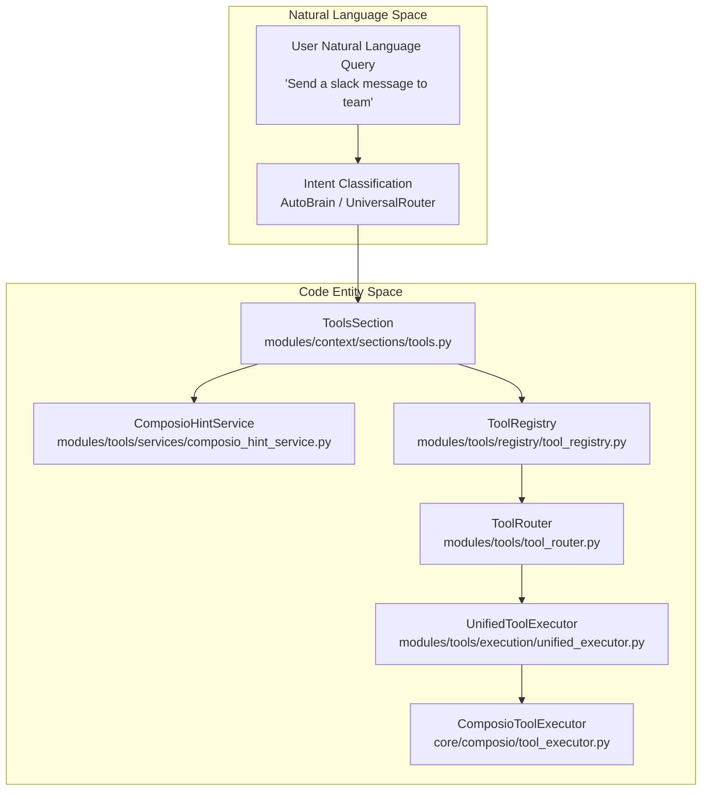

# Tools & Integrations

Relevant source files

The following files were used as context for generating this wiki page:

- [orchestrator/consumers/chatbot/tool_router.py](orchestrator/consumers/chatbot/tool_router.py)
- [orchestrator/modules/context/sections/platform_actions.py](orchestrator/modules/context/sections/platform_actions.py)
- [orchestrator/modules/context/sections/tools.py](orchestrator/modules/context/sections/tools.py)
- [orchestrator/modules/tools/discovery/action_registry.py](orchestrator/modules/tools/discovery/action_registry.py)
- [orchestrator/modules/tools/discovery/action_semantic_index.py](orchestrator/modules/tools/discovery/action_semantic_index.py)
- [orchestrator/modules/tools/execution/unified_executor.py](orchestrator/modules/tools/execution/unified_executor.py)
- [orchestrator/modules/tools/registry/tool_registry.py](orchestrator/modules/tools/registry/tool_registry.py)
- [orchestrator/modules/tools/services/composio_hint_service.py](orchestrator/modules/tools/services/composio_hint_service.py)
- [orchestrator/modules/tools/services/composio_tool_service.py](orchestrator/modules/tools/services/composio_tool_service.py)
- [orchestrator/modules/tools/tool_router.py](orchestrator/modules/tools/tool_router.py)
- [orchestrator/tests/test_action_registry_filtered.py](orchestrator/tests/test_action_registry_filtered.py)
- [orchestrator/tests/test_action_semantic_index.py](orchestrator/tests/test_action_semantic_index.py)
- [orchestrator/tests/test_platform_actions_section.py](orchestrator/tests/test_platform_actions_section.py)
- [orchestrator/tests/test_tool_router_semantic.py](orchestrator/tests/test_tool_router_semantic.py)

## Purpose and Scope

This document describes the tools and integrations system in Automatos AI, which enables agents to interact with external services via the Composio platform and internal platform capabilities. The system provides access to 880+ applications and 12,000+ actions through a unified execution and routing architecture, including OAuth management, metadata caching, semantic discovery, and permission validation.

For details on how tools integrate with agent runtimes, see [Agents](#5). For chat interaction streaming and tool loops, see [Chat Interface](#9). For workspace sandboxed operations, see [Workspace Execution](#21).

---

## System Architecture

The tools system consists of five main layers: (1) **Tool Registry** for centralized catalogs [orchestrator/modules/tools/registry/tool_registry.py:158-181](), (2) **Tool Discovery & Resolution** for semantic ranking and capability filtering [orchestrator/modules/tools/discovery/action_semantic_index.py:113-124](), (3) **Metadata Sync** for caching remote schemas locally [orchestrator/modules/tools/services/composio_tool_service.py:63-70](), (4) **Permission & Validation System** for safety guards [orchestrator/modules/tools/tool_router.py:36-46](), and (5) **Tool Execution** via `UnifiedToolExecutor` [orchestrator/modules/tools/execution/unified_executor.py:58-64]().

Title: Tool System Architecture (Natural Language to Code Entity Space)

Sources: [orchestrator/modules/tools/registry/tool_registry.py:158-181](), [orchestrator/modules/tools/tool_router.py:29-46](), [orchestrator/modules/tools/execution/unified_executor.py:58-64](), [orchestrator/modules/context/sections/tools.py:41-55]()

---

## 8.1 Composio Integration

The Composio integration wraps the external SDK, managing entity mappings (`workspace_id` to entity IDs), OAuth flows, and metadata synchronization. It populates local tables like `ComposioAppCache` and `ComposioActionCache` to ensure fast lookups and handles special environment workarounds, such as LinkedIn media image uploads.

For deep technical details, see [Composio Integration](#8.1).

Sources: [orchestrator/modules/tools/services/composio_tool_service.py:63-70]()

---

## 8.2 Tool Discovery & Resolution

Tool discovery uses `ToolRegistry`, `ComposioCache`, `AgentAppAssignment`, and `SkillLoader` to resolve tools through tiered filters: capability-based matching, token-filtered scoring, and top-N fallbacks.

For deep technical details, see [Tool Discovery & Resolution](#8.2).

Sources: [orchestrator/modules/tools/registry/tool_registry.py:158-181](), [orchestrator/modules/tools/discovery/action_semantic_index.py:113-124]()

---

## 8.3 Tool Router & Execution

`UnifiedToolExecutor` provides the single execution entry point, routing requests across specialized executor modules (`exec_platform`, `exec_research`, `exec_workspace`, `exec_composio`, `exec_multimodal`, and `exec_shell`), capturing outcomes, and formatting results.

For deep technical details, see [Tool Router & Execution](#8.3).

Sources: [orchestrator/modules/tools/execution/unified_executor.py:58-146]()

---

## 8.4 Connecting Apps

The `ToolsDashboard` and `my-tools` workspace views manage third-party integrations, initiating OAuth popup flows or instant NO_AUTH activation depending on the application requirements.

For deep technical details, see [Connecting Apps](#8.4).

Sources: [orchestrator/modules/tools/registry/tool_registry.py:1-35]()

---

## 8.5 Permission & Validation System

`ActionCapabilityFilter` performs intent validation, capability taxonomy checks, hierarchy permission verification, and maintains audit trails for privileged or destructive actions.

For deep technical details, see [Permission & Validation System](#8.5).

Sources: [orchestrator/modules/tools/tool_router.py:36-46]()

---

## 8.6 Tool Hint Service

`ComposioHintService` implements a three-tier hint strategy combining capability-based hints, token filtering, and top-N fallbacks backed by an action semantic index to inject relevant hints into prompt contexts.

For deep technical details, see [Tool Hint Service](#8.6).

Sources: [orchestrator/modules/tools/services/composio_hint_service.py:89-98]()

---

## 8.7 Tools API Reference

Exposes endpoints under `/api/tools/*` and `/api/composio/*` for marketplace stats, connected apps listing, credential testing, skill management, and workspace association.

For deep technical details, see [Tools API Reference](#8.7).

Sources: [orchestrator/modules/tools/registry/tool_registry.py:1-35]()

---

## 8.8 Tool Routing Graph & Telemetry

PRD-139/232 intent graph infrastructure (`graph_router`, `edge_builder`, intent clustering, and signal recorders) tracks routing telemetry and powers evaluation harnesses under `scripts/eval`.

For deep technical details, see [Tool Routing Graph & Telemetry](#8.8).

Sources: [orchestrator/modules/context/sections/platform_actions.py:143-166]()

---

## Child Pages

- [Composio Integration](#8.1) — Composio SDK wrapper, metadata sync, app/action caching, OAuth flow, entity management, LinkedIn image workaround
- [Tool Discovery & Resolution](#8.2) — ToolRegistry, ComposioCache, AgentAppAssignment, SkillLoader; capability/token-filtered/top-N resolution tiers
- [Tool Router & Execution](#8.3) — UnifiedToolExecutor routing logic, exec_* executors (platform, research, workspace, composio, multimodal), result formatting
- [Connecting Apps](#8.4) — ToolsDashboard, my-tools dashboard, initiate connection flow, OAuth popup, NO_AUTH instant activation
- [Permission & Validation System](#8.5) — ActionCapabilityFilter, intent validation, capability taxonomy, hierarchy permissions, bypass audit
- [Tool Hint Service](#8.6) — ComposioHintService 3-tier strategy, capability-based hints, token filtering, top-N fallback, action semantic index
- [Tools API Reference](#8.7) — API endpoints for tools marketplace, stats, connected apps, skills, credentials testing, add/remove from workspace
- [Tool Routing Graph & Telemetry](#8.8) — PRD-139/232 intent graph: graph_router, edge_builder, intent clustering, signal recorder, tool routing telemetry tables, seed utterances, and the tool-routing eval harness under scripts/eval

---