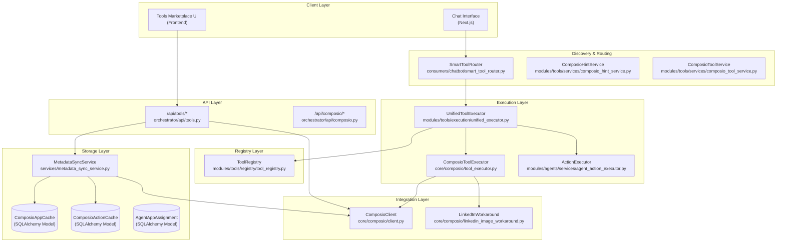
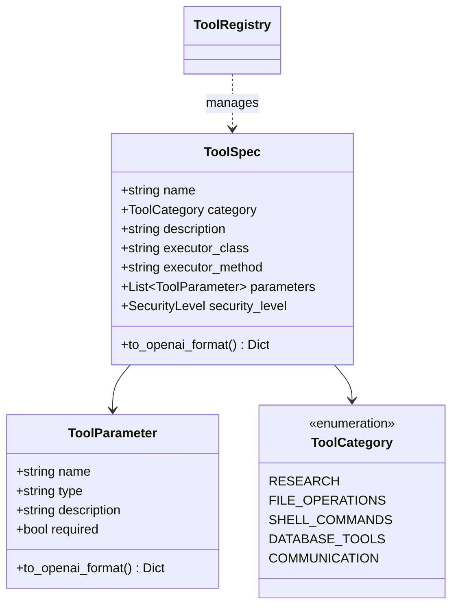

# Tools & Integrations

Relevant source files

The following files were used as context for generating this wiki page:

- [orchestrator/api/composio.py](orchestrator/api/composio.py)
- [orchestrator/api/tools.py](orchestrator/api/tools.py)
- [orchestrator/consumers/chatbot/intent_classifier.py](orchestrator/consumers/chatbot/intent_classifier.py)
- [orchestrator/consumers/chatbot/personality.py](orchestrator/consumers/chatbot/personality.py)
- [orchestrator/consumers/chatbot/smart_tool_router.py](orchestrator/consumers/chatbot/smart_tool_router.py)
- [orchestrator/consumers/chatbot/tool_router.py](orchestrator/consumers/chatbot/tool_router.py)
- [orchestrator/core/composio/client.py](orchestrator/core/composio/client.py)
- [orchestrator/core/composio/linkedin_image_workaround.py](orchestrator/core/composio/linkedin_image_workaround.py)
- [orchestrator/core/composio/tool_executor.py](orchestrator/core/composio/tool_executor.py)
- [orchestrator/core/credentials/tester.py](orchestrator/core/credentials/tester.py)
- [orchestrator/core/credentials/types.py](orchestrator/core/credentials/types.py)
- [orchestrator/core/database/credential_types_seed.json](orchestrator/core/database/credential_types_seed.json)
- [orchestrator/modules/tools/execution/exec_platform.py](orchestrator/modules/tools/execution/exec_platform.py)
- [orchestrator/modules/tools/execution/unified_executor.py](orchestrator/modules/tools/execution/unified_executor.py)
- [orchestrator/modules/tools/registry/tool_registry.py](orchestrator/modules/tools/registry/tool_registry.py)
- [orchestrator/modules/tools/services/composio_hint_service.py](orchestrator/modules/tools/services/composio_hint_service.py)
- [orchestrator/modules/tools/services/composio_tool_service.py](orchestrator/modules/tools/services/composio_tool_service.py)
- [orchestrator/services/metadata_sync_service.py](orchestrator/services/metadata_sync_service.py)

## Purpose and Scope

This document describes the tools and integrations system in Automatos AI, which enables agents to interact with external services via the Composio platform and internal platform capabilities. The system provides access to 880+ applications with 12,000+ actions through a unified interface, including OAuth management, metadata caching, action discovery, and execution.

For information about how agents use tools during chat conversations, see [Chat Interface](#9). For workspace-specific tools like file operations and shell commands, see [Workspace Execution](#21). For knowledge retrieval tools, see [Knowledge Base & RAG](#7).

---

## System Architecture

The tools system consists of five main layers: (1) **Tool Registry** for centralized tool catalogs, (2) **Tool Discovery** for resolving available actions, (3) **Metadata Sync** for caching Composio apps/actions locally, (4) **Connection Management** for OAuth flows, and (5) **Tool Execution** for routing and validation.

Title: Tool System Architecture (Natural Language to Code Entity Space)

**Key Components**:

| Component | Purpose | Location |
|-----------|---------|----------|
| `ToolRegistry` | Centralized catalog of platform tools | [orchestrator/modules/tools/registry/tool_registry.py:157-181]() |
| `UnifiedToolExecutor` | Single entry point for tool execution routing | [orchestrator/modules/tools/execution/unified_executor.py:69-171]() |
| `ComposioClient` | Wrapper around Composio SDK for entity/auth management | [orchestrator/core/composio/client.py:54-126]() |
| `MetadataSyncService` | Bulk syncs Composio metadata to local cache tables | [orchestrator/services/metadata_sync_service.py:37-54]() |
| `ComposioToolService` | Resolves Composio actions into OpenAI function schemas | [orchestrator/modules/tools/services/composio_tool_service.py:63-73]() |
| `ComposioHintService` | Generates system message hints for LLM action discovery | [orchestrator/modules/tools/services/composio_hint_service.py:89-109]() |
| `SmartToolRouter` | Intent-based filtering of available tools for LLM context | [orchestrator/consumers/chatbot/smart_tool_router.py:39-56]() |

**Sources**: [orchestrator/modules/tools/execution/unified_executor.py:1-44](), [orchestrator/core/composio/client.py:1-51](), [orchestrator/modules/tools/registry/tool_registry.py:1-35](), [orchestrator/modules/tools/services/composio_tool_service.py:1-22](), [orchestrator/modules/tools/services/composio_hint_service.py:1-21]()

---

## Tool Registry & Models

The `ToolRegistry` provides a unified query interface for all platform tools. Tools are defined as `ToolSpec` objects which can be exported to OpenAI function-calling formats.

Title: Tool Specification Entities

**Tool Categories** (defined in `ToolCategory` enum):
- **RESEARCH**: RAG, semantic search, CodeGraph [orchestrator/modules/tools/registry/tool_registry.py:40-40]().
- **FILE_OPERATIONS**: Read, write, delete files [orchestrator/modules/tools/registry/tool_registry.py:41-41]().
- **SHELL_COMMANDS**: Execute shell commands [orchestrator/modules/tools/registry/tool_registry.py:42-42]().
- **COMMUNICATION**: Slack, Email, etc. [orchestrator/modules/tools/registry/tool_registry.py:47-47]().

**Sources**: [orchestrator/modules/tools/registry/tool_registry.py:38-154](), [orchestrator/modules/tools/registry/tool_registry.py:157-181]()

---

## Composio Integration

Composio provides OAuth management and tool execution for 880+ external applications. The `ComposioClient` manages entities (mapped to `workspace_id`) and handles the "Hosted Auth" flow.

### Metadata Sync & Cache
To avoid excessive API calls to Composio, the `MetadataSyncService` populates local cache tables:
- `ComposioAppCache`: Stores app metadata (Slack, GitHub, etc.) [orchestrator/api/tools.py:139-142]()
- `ComposioActionCache`: Stores individual action schemas [orchestrator/api/tools.py:26-26]()
- `ComposioStatsCache`: Global counts for marketplace display [orchestrator/api/tools.py:133-135]()

### Connection Management
The `EntityManager` (via `ComposioClient`) maps internal `workspace_id` to Composio entities [orchestrator/core/composio/client.py:137-156](). Connections are initiated via `initiate_connection` which returns a hosted OAuth URL [orchestrator/core/composio/client.py:69-79]().

### LinkedIn Workaround
Due to known issues with Composio's LinkedIn image upload (May 2026), a direct implementation using LinkedIn's Community Management API is used for media posts [orchestrator/core/composio/linkedin_image_workaround.py:4-13]().

**Sources**: [orchestrator/core/composio/client.py:54-126](), [orchestrator/services/metadata_sync_service.py:37-150](), [orchestrator/api/tools.py:94-104](), [orchestrator/core/composio/linkedin_image_workaround.py:1-24]()

---

## Tool Discovery & Hinting

Automatos uses a 3-tier strategy to resolve tools for an agent's current task, primarily managed by `ComposioHintService` and `ComposioToolService`.

1. **Capability-based (Tier 1)**: Matches intents against `ComposioActionMetadata` and taxonomy [orchestrator/modules/tools/services/composio_hint_service.py:13-13]().
2. **Token-filtered (Tier 2)**: Uses `ILIKE` matching on action names and descriptions with a mandatory capability gate [orchestrator/modules/tools/services/composio_hint_service.py:14-14]().
3. **Top-N Fallback (Tier 3)**: Provides safe, high-utility actions for connected apps when no specific match is found [orchestrator/modules/tools/services/composio_hint_service.py:15-15]().

The `SmartToolRouter` also performs semantic ranking (PRD-64) using embeddings to match tools to user intent [orchestrator/consumers/chatbot/smart_tool_router.py:49-51]().

**Sources**: [orchestrator/modules/tools/services/composio_hint_service.py:12-21](), [orchestrator/modules/tools/services/composio_tool_service.py:108-113](), [orchestrator/consumers/chatbot/smart_tool_router.py:39-112]()

---

## Tool Execution & Routing

The `UnifiedToolExecutor` serves as the central dispatcher for all tool calls.

### Execution Routing Logic
The executor maps tool names to specific implementation modules:
- **Research Tools**: Routed to `_execute_platform_tool` (e.g., `search_knowledge`) [orchestrator/modules/tools/execution/unified_executor.py:109-113]().
- **File Ops**: Routed to `_execute_file_op` (e.g., `read_file`, `write_file`) [orchestrator/modules/tools/execution/unified_executor.py:126-130]().
- **Shell Commands**: Routed to `_execute_shell` [orchestrator/modules/tools/execution/unified_executor.py:133-133]().
- **Composio Actions**: Routed to `ComposioToolExecutor` via `composio_execute` or dynamic prefix routing [orchestrator/modules/tools/execution/unified_executor.py:142-142]().

### File Upload Handling
The `resolve_file_uploads` function handles converting workspace file paths or URLs into Composio `FileUploadable` objects for actions that require media (e.g., Twitter/LinkedIn posts) [orchestrator/core/composio/tool_executor.py:123-132]().

**Sources**: [orchestrator/modules/tools/execution/unified_executor.py:105-168](), [orchestrator/core/composio/tool_executor.py:123-132]()

---

## Tools API Reference

The `/api/tools` router serves the marketplace and connection status.

| Endpoint | Method | Purpose |
|----------|--------|---------|
| `/api/tools/marketplace` | GET | Returns cached apps and actions for the UI [orchestrator/api/tools.py:105-113]() |
| `/api/tools/stats` | GET | Summary of connected vs available tools [orchestrator/api/tools.py:92-98]() |
| `/api/tools/sync` | POST | Triggers manual metadata synchronization [orchestrator/api/tools.py:27-27]() |

**Sources**: [orchestrator/api/tools.py:32-207]()

---

## Child Pages

For deep dives into specific subsystems, see:
- [Composio Integration](#8.1) — SDK wrapper, entity management, and OAuth flow.
- [Tool Discovery & Resolution](#8.2) — ToolRegistry, ComposioCache, and 3-tier resolution logic.
- [Tool Router & Execution](#8.3) — UnifiedToolExecutor routing logic and Platform/Action executors.
- [Connecting Apps](#8.4) — ToolsDashboard and connection initiation flow.
- [Permission & Validation System](#8.5) — ActionCapabilityFilter and intent validation.
- [Tool Hint Service](#8.6) — ComposioHintService strategies and token filtering.
- [Tools API Reference](#8.7) — Detailed API documentation for tools marketplace and stats.

---