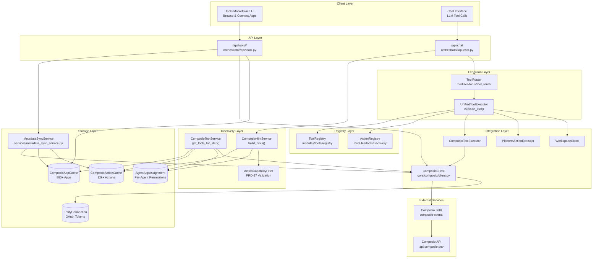
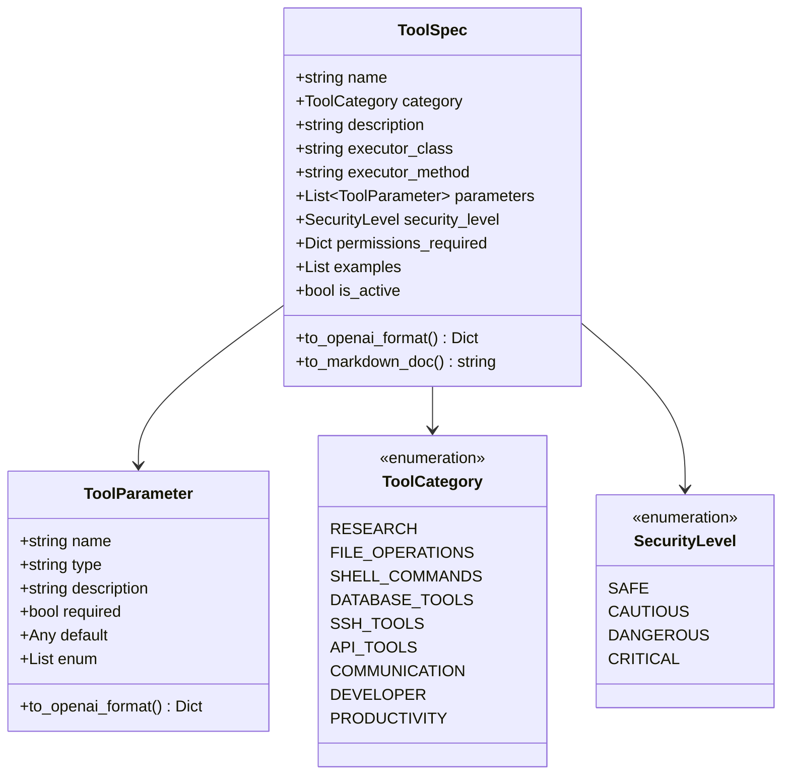
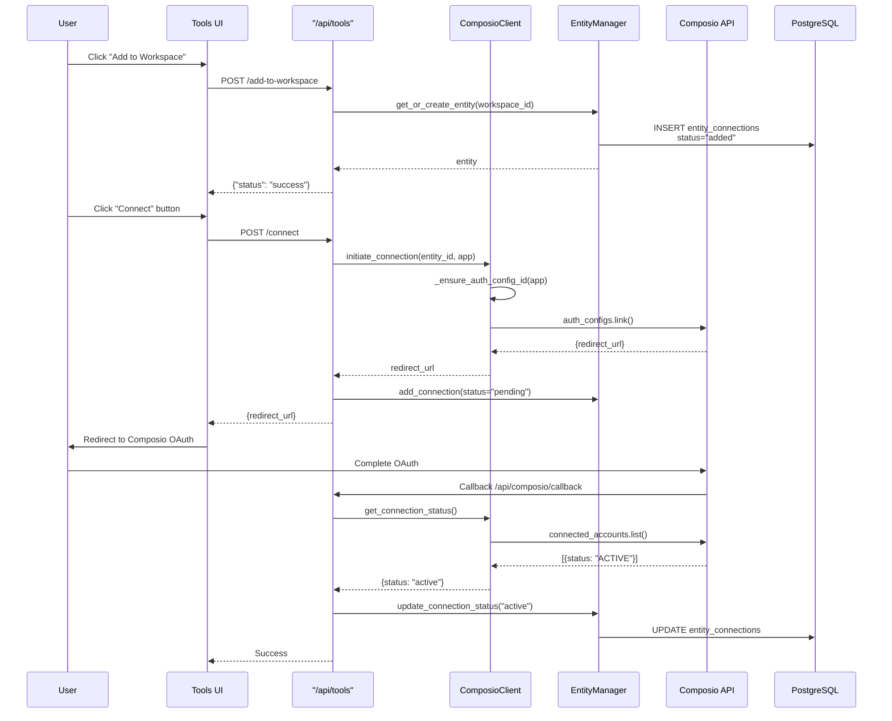
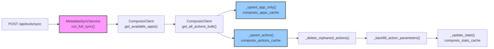
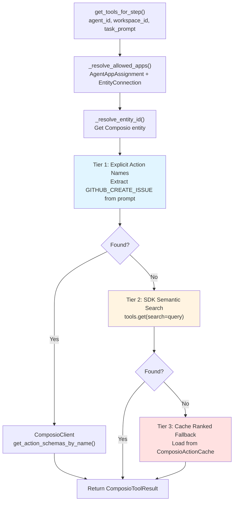
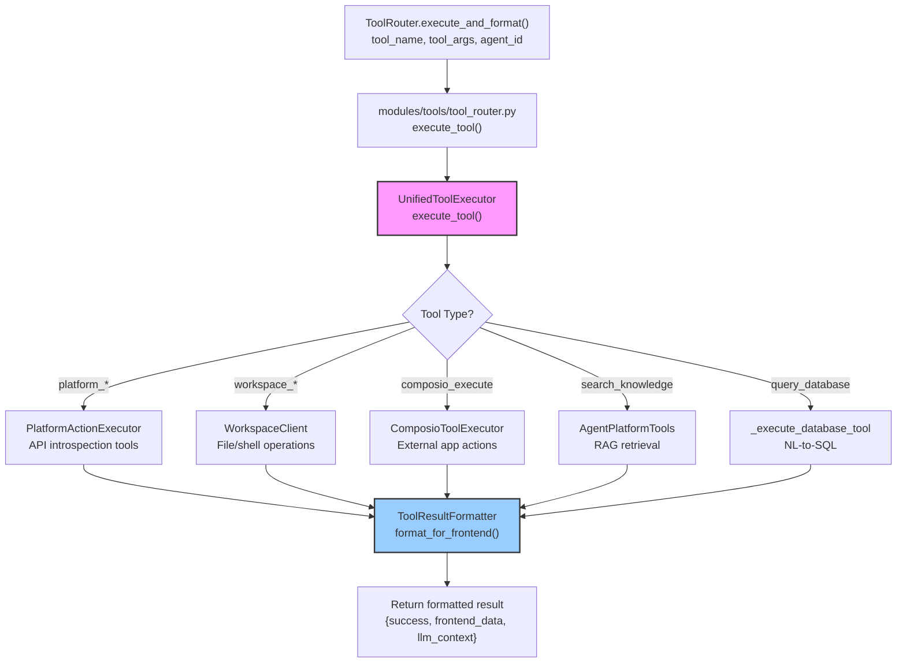
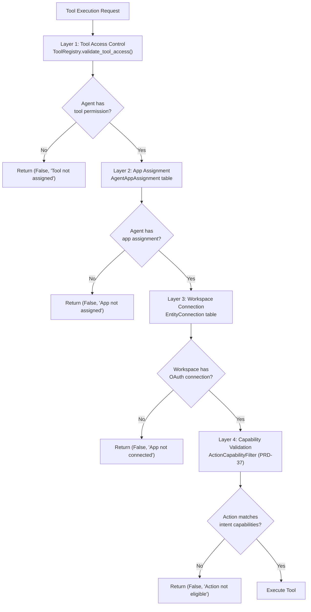
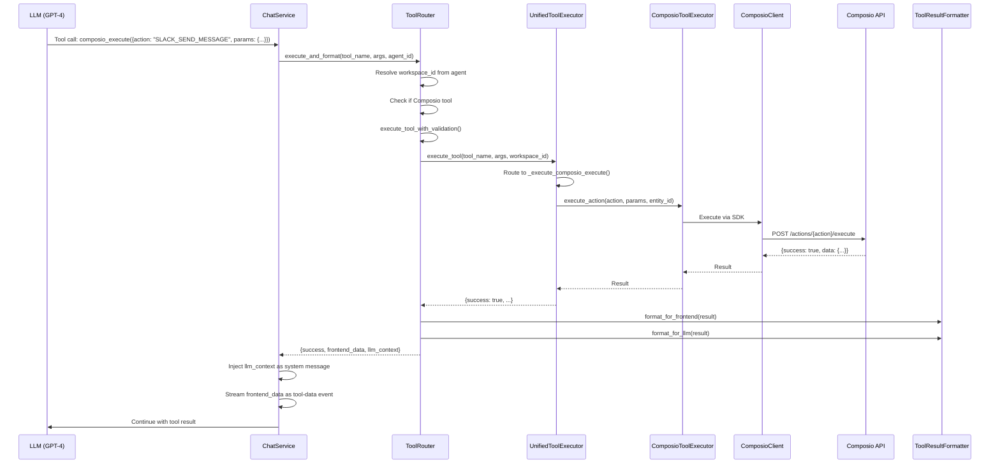

# Tools & Integrations

<details>
<summary>Relevant source files</summary>

The following files were used as context for generating this wiki page:

- [docs/DoctorsNotes.docx](docs/DoctorsNotes.docx)
- [orchestrator/api/tools.py](orchestrator/api/tools.py)
- [orchestrator/consumers/chatbot/tool_router.py](orchestrator/consumers/chatbot/tool_router.py)
- [orchestrator/core/composio/client.py](orchestrator/core/composio/client.py)
- [orchestrator/modules/tools/execution/unified_executor.py](orchestrator/modules/tools/execution/unified_executor.py)
- [orchestrator/modules/tools/registry/tool_registry.py](orchestrator/modules/tools/registry/tool_registry.py)
- [orchestrator/modules/tools/services/composio_hint_service.py](orchestrator/modules/tools/services/composio_hint_service.py)
- [orchestrator/modules/tools/services/composio_tool_service.py](orchestrator/modules/tools/services/composio_tool_service.py)
- [orchestrator/modules/tools/tool_router.py](orchestrator/modules/tools/tool_router.py)
- [orchestrator/services/metadata_sync_service.py](orchestrator/services/metadata_sync_service.py)

</details>


## Purpose and Scope

This document describes the tools and integrations system in Automatos AI, which enables agents to interact with external services via the Composio platform. The system provides access to 880+ applications with 12,000+ actions through a unified interface, including OAuth management, metadata caching, action discovery, and execution.

For information about how agents use tools during chat conversations, see [Chat Interface](#7). For workspace-specific tools like file operations and shell commands, see [Workspace Execution](#9). For knowledge retrieval tools, see [Knowledge Base & RAG](#5).

---

## System Architecture

The tools system consists of five main layers: (1) **Tool Registry** for centralized tool catalogs, (2) **Tool Discovery** for resolving available actions, (3) **Metadata Sync** for caching Composio apps/actions locally, (4) **Connection Management** for OAuth flows, and (5) **Tool Execution** for routing and validation.



**Key Components**:

| Component | Purpose | Location |
|-----------|---------|----------|
| `ToolRegistry` | Centralized catalog of platform tools | [modules/tools/registry/tool_registry.py:157-395]() |
| `ComposioToolService` | Resolves Composio actions for agent steps | [modules/tools/services/composio_tool_service.py:63-350]() |
| `ComposioHintService` | Generates LLM hints for action selection | [modules/tools/services/composio_hint_service.py:89-443]() |
| `UnifiedToolExecutor` | Single entry point for tool execution | [modules/tools/execution/unified_executor.py:56-857]() |
| `ComposioClient` | Wrapper around Composio SDK | [core/composio/client.py:54-878]() |
| `MetadataSyncService` | Syncs Composio metadata to local cache | [services/metadata_sync_service.py:37-551]() |

**Sources**: [modules/tools/services/composio_tool_service.py:1-350](), [modules/tools/execution/unified_executor.py:1-857](), [core/composio/client.py:1-878](), [modules/tools/registry/tool_registry.py:1-1171](), [services/metadata_sync_service.py:1-551]()

---

## Tool Registry

The `ToolRegistry` provides a single source of truth for all platform tools. Tools are defined as `ToolSpec` objects with metadata, parameters, security levels, and executors.

### ToolSpec Structure



### Core Methods

| Method | Purpose | Returns |
|--------|---------|---------|
| `register_tool(tool: ToolSpec)` | Add tool to registry | `None` |
| `get_tool(name: str)` | Get tool by name | `Optional[ToolSpec]` |
| `get_all_tools(active_only: bool)` | Get all registered tools | `List[ToolSpec]` |
| `get_tools_by_category(category: ToolCategory)` | Get tools in category | `List[ToolSpec]` |
| `export_openai_functions(categories: List[str])` | Export tools in OpenAI format | `List[Dict]` |
| `validate_tool_access(agent_id, tool_name, db, workspace_id)` | Check agent permissions | `Tuple[bool, str]` |

**Platform Tools** (defined in `_register_core_tools()`):
- **Research**: `search_knowledge`, `semantic_search`, `search_codebase`, `search_tables`, `search_images`, `search_formulas`, `search_multimodal`
- **Database**: `query_database`, `smart_query_database`
- **File Operations**: `read_file`, `write_file`, `list_directory`, `create_directory`, `delete_file`
- **Shell**: `execute_command`
- **HTTP**: `http_request`
- **SSH**: `ssh_execute`
- **Documents**: `create_pdf`, `create_docx`, `create_xlsx`, `create_pptx`

**Sources**: [modules/tools/registry/tool_registry.py:157-1171]()

---

## Composio Integration

Composio provides OAuth management and tool execution for 880+ external applications. The `ComposioClient` wraps the Composio SDK and provides workspace-isolated connections.

### Connection Flow



### ComposioClient Methods

| Method | Purpose | Returns |
|--------|---------|---------|
| `get_entity(entity_id: str)` | Get or validate entity | `Dict[str, str]` |
| `initiate_connection(entity_id, app, callback_url)` | Start OAuth flow | `str` (redirect URL) |
| `get_connection_status(entity_id, app)` | Check connection status | `Optional[Dict]` |
| `disconnect_app(entity_id, app)` | Revoke OAuth | `bool` |
| `get_available_apps()` | List all Composio apps | `List[Dict]` |
| `get_app_actions(app_name)` | Get actions for app | `List[Dict]` |
| `get_all_actions_bulk(limit, max_pages)` | Bulk fetch all actions | `List[Dict]` |

### Auth Config Resolution

The `ComposioClient` automatically resolves or creates auth configs for apps:

1. **Check cache**: `_auth_config_cache` (1 hour TTL)
2. **Query Composio API**: `auth_configs.list()` to find existing config
3. **Create if missing**: `auth_configs.create()` with appropriate scheme
4. **Handle NO_AUTH apps**: Skip auth config (e.g., `composio_search`, `tavily`)

**Sources**: [core/composio/client.py:54-878](), [orchestrator/api/tools.py:394-417]()

---

## Metadata Caching

The `MetadataSyncService` syncs Composio apps and actions to local PostgreSQL tables to avoid 48+ API calls per marketplace page load.

### Sync Process



### Cache Tables

| Table | Purpose | Key Columns |
|-------|---------|-------------|
| `composio_apps_cache` | App metadata | `app_name`, `display_name`, `categories`, `action_count`, `trigger_count` |
| `composio_actions_cache` | Action schemas | `app_name`, `action_name`, `description`, `parameters` |
| `composio_stats_cache` | Marketplace stats | `stat_key`, `stat_value` (JSONB) |
| `composio_sync_jobs` | Sync history | `job_type`, `status`, `apps_synced`, `actions_synced` |

### Sync Strategies

**Full Sync** (`POST /api/tools/sync`):
1. Fetch all apps via `get_available_apps()` (paginated, 1000/page)
2. Bulk fetch all actions via `get_all_actions_bulk()` (1000/page, up to 1000 pages)
3. Upsert apps into `composio_apps_cache`
4. Group actions by app and upsert into `composio_actions_cache`
5. Delete orphaned actions (in DB but not in bulk response)
6. Backfill parameter schemas (v3 API doesn't return params, use SDK per-app call)
7. Update stats cache

**Incremental Sync** (currently redirects to full sync)

**Parameter Backfill Only** (`POST /api/tools/backfill-params`):
- Finds apps with empty `parameters` column
- Calls `ComposioClient.get_app_actions()` per app (SDK returns full OpenAI schemas)
- Updates `parameters` column for matching actions
- Capped at 30 apps by default to avoid long sync times

**Sources**: [services/metadata_sync_service.py:37-551](), [orchestrator/api/tools.py:610-666]()

---

## Tool Discovery & Resolution

Tool discovery determines which Composio actions are available to an agent for a given task. The system uses a three-tier resolution strategy.

### ComposioToolService Resolution



### Resolution Strategies

**Tier 1: Explicit Action Names**
- Extract uppercase patterns like `GITHUB_CREATE_ISSUE` from prompt
- Filter to only actions whose prefix matches allowed apps
- Call `ComposioClient.get_action_schemas_by_name()` for exact schemas
- **Use case**: Recipe steps with explicit action names

**Tier 2: SDK Semantic Search**
- Call `ComposioClient.search_actions_for_step(query, apps, entity_id)`
- Uses Composio's semantic search (vector embeddings)
- Scoped to allowed apps
- **Use case**: Natural language prompts like "send slack message"

**Tier 3: Cache Ranked Fallback**
- Query `ComposioActionCache` for all actions in allowed apps
- Rank by relevance to prompt tokens
- Cap at `limit` (default 30)
- **Use case**: When SDK search returns 0 results

### Tool Hint Generation

The `ComposioHintService` generates system message hints that guide LLM action selection:

```python
result = ComposioHintService(db).build_hints(
    agent_id=42,
    prompt="send a message to #general",
    workspace_id=ws_id,
    recipe_mode=False  # chatbot mode uses 3-tier resolution
)

# result.hint_lines:
# [
#   "You have these external apps connected (via Composio): SLACK, GMAIL.",
#   "IMPORTANT: To interact with these apps, call `composio_execute` with the EXACT action name...",
#   "- SLACK available actions: SLACK_SEND_MESSAGE, SLACK_CREATE_CHANNEL, ...",
#   "\nParameter hints (pass these inside `params`):",
#   "\nSLACK_SEND_MESSAGE:",
#   "  - channel: string (Channel name or ID)",
#   "  - text: string (Message text)",
#   "\nYou MUST call `composio_execute` to fulfill the user's request."
# ]
```

**Resolution Modes**:

| Mode | Strategy | Use Case |
|------|----------|----------|
| `recipe_mode=False` | 3-tier (capability → token → fallback) | Chatbot conversations |
| `recipe_mode=True` | Pure token matching (no taxonomy) | Recipe steps with curated prompts |

**Sources**: [modules/tools/services/composio_tool_service.py:63-350](), [modules/tools/services/composio_hint_service.py:89-443]()

---

## Tool Execution

The `UnifiedToolExecutor` routes tool calls to appropriate executors and formats results.

### Execution Architecture



### UnifiedToolExecutor Methods

| Method | Purpose | Executor |
|--------|---------|----------|
| `execute_tool(tool_name, parameters, agent_id, workspace_id)` | Route to appropriate executor | Lazy-loaded |
| `_execute_platform_tool()` | Research tools (RAG, CodeGraph) | `AgentPlatformTools` |
| `_execute_database_tool()` | NL-to-SQL queries | `NL2SQLService` |
| `_execute_file_op()` | File operations | `AgentActionExecutor` |
| `_execute_shell()` | Shell commands | `AgentActionExecutor` |
| `_execute_composio_execute()` | Composio actions | `ComposioToolExecutor` |
| `_execute_platform_action()` | Platform actions | `PlatformActionExecutor` |
| `_execute_workspace_action()` | Workspace operations | `WorkspaceClient` |

### Lazy Loading

The executor uses lazy initialization to avoid loading heavy dependencies at startup:

```python
@property
def composio_executor(self):
    """Lazy-load Composio executor only when needed."""
    if self._composio_executor is None:
        from core.composio.tool_executor import ComposioToolExecutor
        self._composio_executor = ComposioToolExecutor(self.db)
    return self._composio_executor
```

### Result Formatting

The `ToolResultFormatter` provides three output formats:

| Format | Method | Purpose |
|--------|--------|---------|
| **Frontend** | `format_for_frontend()` | Artifact viewer widgets |
| **LLM** | `format_for_llm()` | System message injection |
| **Standardized** | `standardize_result()` | Unified schema |

**Example**: Database query result

```json
{
  "success": true,
  "frontend_data": {
    "type": "data_widget",
    "title": "Database Query Results",
    "format": "table",
    "data": [...],
    "columns": ["id", "name", "created_at"],
    "row_count": 25,
    "sql": "SELECT * FROM agents WHERE workspace_id = '...'",
    "chart_config": {
      "type": "bar",
      "x": "created_at",
      "y": "count"
    }
  },
  "llm_context": "Database query result: 25 rows returned\nSQL: SELECT * FROM agents...",
  "raw_result": {...}
}
```

**Sources**: [modules/tools/execution/unified_executor.py:56-857](), [modules/tools/tool_router.py:364-492](), [consumers/chatbot/tool_router.py:54-228]()

---

## Permission & Validation System

The system implements defense-in-depth validation across three layers:

### Multi-Layer Validation



### Permission Tables

| Table | Purpose | Key Columns |
|-------|---------|-------------|
| `agent_app_assignments` | Per-agent app permissions | `agent_id`, `app_name`, `app_type`, `is_active` |
| `entity_connections` | OAuth tokens per workspace | `entity_id`, `app_name`, `status`, `connection_id` |
| `workspace_tool_config` | Enabled actions per workspace | `workspace_id`, `tool_id`, `configuration` (JSONB with `enabled_actions`) |
| `agent_tool_permissions` | Platform tool permissions | `agent_id`, `tool_id`, `is_active` |

### Capability-Based Filtering (PRD-37)

The `ActionCapabilityFilter` prevents agents from calling inappropriate actions:

**Example**: Prevent `SLACK_CREATE_CHANNEL_BASED_CONVERSATION` when user intent is "send message"

```python
# Extract capabilities from intent
capabilities = get_capabilities_for_intent("send a message to #general")
# → ["message.send"]

# Filter actions by capability overlap
eligible, reason = filter.check_action_eligibility(
    action_id="SLACK_SEND_MESSAGE",
    intent="send a message to #general",
    allow_destructive=False
)
# → (True, "Matches capabilities: message.send")

eligible, reason = filter.check_action_eligibility(
    action_id="SLACK_CREATE_CHANNEL_BASED_CONVERSATION",
    intent="send a message to #general",
    allow_destructive=False
)
# → (False, "Missing required capabilities")
```

**Validation Points**:
1. **Selection time**: Filter actions when building tool lists
2. **Execution time**: Validate again before executing (defense-in-depth)

**Sources**: [modules/tools/tool_router.py:612-670](), [modules/tools/execution/unified_executor.py:168-217](), [modules/tools/registry/tool_registry.py:845-952]()

---

## Tools API Reference

The `/api/tools` router provides marketplace browsing, connection management, and configuration.

### Marketplace Endpoints

| Endpoint | Method | Purpose |
|----------|--------|---------|
| `/api/tools/marketplace` | GET | List all available apps with filters |
| `/api/tools/stats` | GET | Marketplace statistics |
| `/api/tools/connected` | GET | List workspace-connected apps |
| `/api/tools/{app_name}/actions` | GET | List actions for an app |
| `/api/tools/{app_name}/triggers` | GET | List triggers for an app |

**Example**: Marketplace query

```http
GET /api/tools/marketplace?category=communication&search=slack&limit=50

Response:
{
  "apps": [
    {
      "id": 123,
      "app_name": "SLACK",
      "display_name": "Slack",
      "description": "Team communication platform",
      "logo_url": "https://...",
      "categories": ["communication", "productivity"],
      "auth_schemes": ["OAUTH2"],
      "action_count": 124,
      "trigger_count": 15,
      "status": "ACTIVE",
      "is_connected": true,
      "triggers": [
        {"name": "NEW_MESSAGE", "display_name": "New Message", "description": "..."},
        {"name": "NEW_CHANNEL", "display_name": "New Channel", "description": "..."}
      ]
    }
  ],
  "total_apps": 1,
  "total_actions": 12543,
  "categories": {...},
  "last_synced": "2024-01-15T12:34:56Z"
}
```

### Connection Management

| Endpoint | Method | Purpose |
|----------|--------|---------|
| `/api/tools/add-to-workspace` | POST | Add app to workspace (no OAuth yet) |
| `/api/tools/connect` | POST | Initiate OAuth connection |
| `/api/tools/disconnect` | POST | Revoke OAuth connection |
| `/api/composio/callback` | GET | OAuth callback handler |

**Connection States**:
- **`added`**: App added to workspace, not connected
- **`pending`**: OAuth flow initiated, waiting for completion
- **`active`**: OAuth completed, connection active

### Configuration Endpoints

| Endpoint | Method | Purpose |
|----------|--------|---------|
| `/api/tools/{app_name}/actions` | POST | Save enabled actions for workspace |
| `/api/tools/workspace` | GET | Get all workspace tools |
| `/api/tools/sync` | POST | Trigger full metadata sync |
| `/api/tools/backfill-params` | POST | Backfill parameter schemas |
| `/api/tools/sync-history` | GET | View sync job history |

**Example**: Enable actions

```http
POST /api/tools/slack/actions
{
  "actions": [
    "SLACK_SEND_MESSAGE",
    "SLACK_SEND_DIRECT_MESSAGE",
    "SLACK_LIST_CHANNELS"
  ]
}

Response:
{
  "status": "success",
  "enabled_count": 3,
  "app_name": "SLACK"
}
```

**Sources**: [orchestrator/api/tools.py:1-763]()

---

## Tool Routing Flow

End-to-end flow from LLM tool call to formatted response:



**Key Features**:
- **Workspace isolation**: Entity ID scoped to workspace
- **Validation**: Capability check before execution
- **Formatting**: Separate outputs for frontend and LLM
- **Streaming**: Results streamed via SSE as tool-data events

**Sources**: [modules/tools/tool_router.py:302-492](), [modules/tools/execution/unified_executor.py:281-384]()

---

## Performance Optimizations

### Metadata Caching

**Problem**: Marketplace page loaded 880+ apps × 48 API calls = 42,240+ API calls per load

**Solution**: Local cache tables with periodic sync

| Metric | Before | After | Improvement |
|--------|--------|-------|-------------|
| Marketplace load time | 8-12s | 150-300ms | **40-80x faster** |
| API calls per load | 42,240+ | 0 | **100% reduction** |
| DB queries | 1-2 | 1-2 | Same |

### Action Schema Caching

**Problem**: Composio v3 API doesn't return parameter schemas in bulk endpoint

**Solution**: Two-phase sync
1. Bulk fetch all actions (fast, no params)
2. Backfill params for apps with empty schemas (capped at 30 apps)

### Auth Config Caching

**Problem**: Repeated `auth_configs.list()` calls for connection initiation

**Solution**: In-memory cache with 1-hour TTL

```python
self._auth_config_cache: Dict[str, Optional[str]] = {}  # {app_slug: auth_config_id}
```

### Tool Hint Generation

**Problem**: Generating hints for 880+ apps × 12k+ actions is slow

**Solution**: Three-tier resolution (early exit)
1. **Tier 1**: Explicit names → exact lookup (fastest)
2. **Tier 2**: Token filtering → ILIKE queries (medium)
3. **Tier 3**: Cache fallback → load top N (slowest)

**Sources**: [services/metadata_sync_service.py:42-215](), [core/composio/client.py:149-240](), [modules/tools/services/composio_hint_service.py:160-179]()

---

## Internal vs External Apps

The system distinguishes between **platform** (internal) and **Composio** (external) tools:

| Type | Examples | Integration | Execution |
|------|----------|-------------|-----------|
| **Platform** | `search_knowledge`, `query_database`, `read_file` | `ToolRegistry` | `UnifiedToolExecutor` → direct |
| **Composio** | `SLACK_SEND_MESSAGE`, `GITHUB_CREATE_ISSUE` | `ComposioClient` | `UnifiedToolExecutor` → `ComposioToolExecutor` |

**Internal Apps** (filtered from marketplace):
- `RAG`: Knowledge retrieval (already exposed as `search_knowledge`)
- `MEMORY`: Mem0 integration (already handled by `ChatService`)
- `NL2SQL`: Database queries (already exposed as `query_database`)
- `CODEGRAPH`: Code search (already exposed as `search_codebase`)

These are excluded from the marketplace UI because they're already available as platform tools with better UX.

**Sources**: [orchestrator/api/tools.py:40-41](), [services/metadata_sync_service.py:34-35]()

---

## Security Considerations

### OAuth Token Storage

- **Composio-managed**: Tokens stored on Composio's servers, referenced by `connection_id`
- **Local tracking**: `entity_connections` table tracks connection status, not tokens
- **Workspace isolation**: Entity ID scoped to workspace prevents cross-tenant access

### Command Whitelisting

For workspace tools (`workspace_*`):
- Shell commands validated against `ALLOWED_COMMANDS` list
- `BLOCKED_PATTERNS` regex prevents dangerous operations
- Path safety checks prevent directory traversal

### Capability-Based Security

- **Intent validation**: Actions must match user intent capabilities
- **Destructive actions**: Flagged in metadata, blocked by default
- **Confirmation required**: High-risk actions require explicit confirmation

### Rate Limiting

- Applied at middleware level (SlowAPI)
- Default: 60 requests/minute per IP
- Composio API has its own rate limits (handled by SDK)

**Sources**: [services/workspace-worker/executor.py:36-470](), [modules/tools/execution/unified_executor.py:168-217]()

---

## Troubleshooting

### Common Issues

| Issue | Cause | Solution |
|-------|-------|----------|
| Marketplace shows 0 apps | Metadata sync not run | `POST /api/tools/sync` |
| Actions missing parameters | v3 API doesn't return params | `POST /api/tools/backfill-params` |
| OAuth fails with 404 | Auth config not found | Delete cached entry in `_auth_config_cache` |
| Tool execution fails | Connection not active | Check `entity_connections.status` |
| Action not available to agent | Missing app assignment | Add in `agent_app_assignments` |

### Debug Endpoints

| Endpoint | Purpose |
|----------|---------|
| `/api/tools/debug/connections` | View all connection records |
| `/api/tools/debug/cache-status` | Check cache freshness |
| `/api/tools/sync-history` | View sync job history |

### Logging

Key log patterns:

```python
logger.info(f"[ComposioToolService] Exact lookup: agent={agent_id} resolved={len(result.tools)} actions")
logger.info(f"[ComposioHintService] strategy={result.strategy_used} matches={len(result.matched_actions)}")
logger.info(f"[tool-trace {trace_id}] execute_tool done tool={tool_name} success={bool(result.get('success'))}")
```

**Sources**: [modules/tools/services/composio_tool_service.py:160-165](), [modules/tools/services/composio_hint_service.py:203-207](), [modules/tools/tool_router.py:346-349]()

---