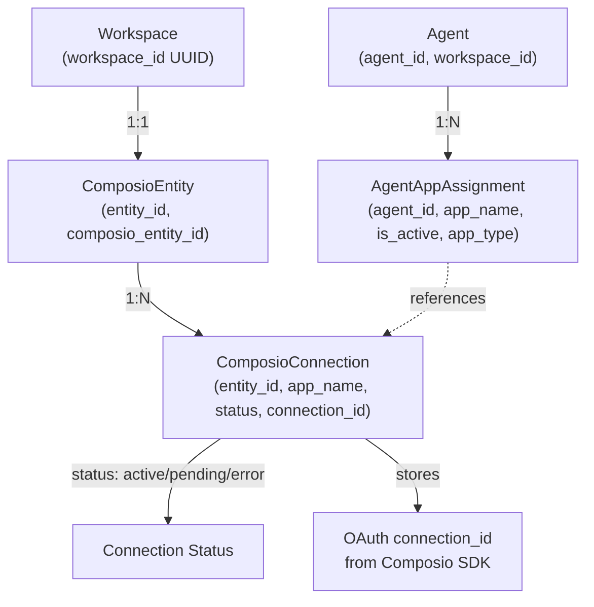
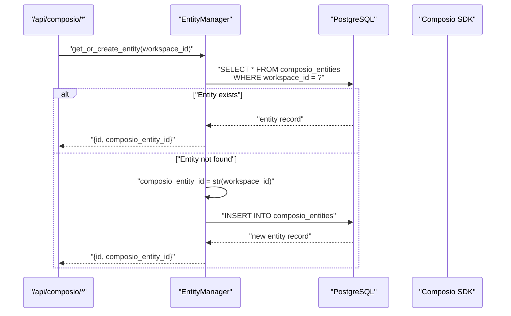
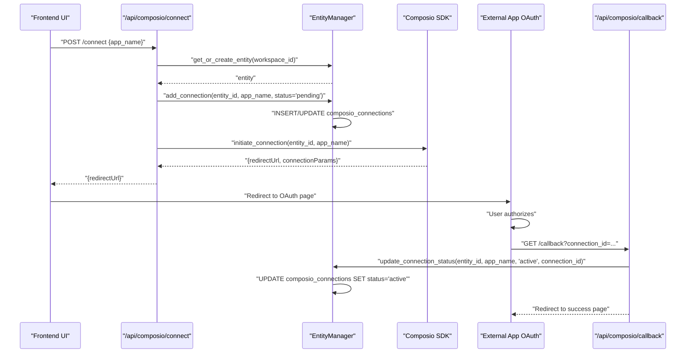
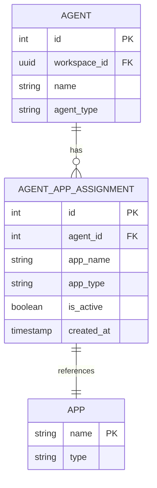
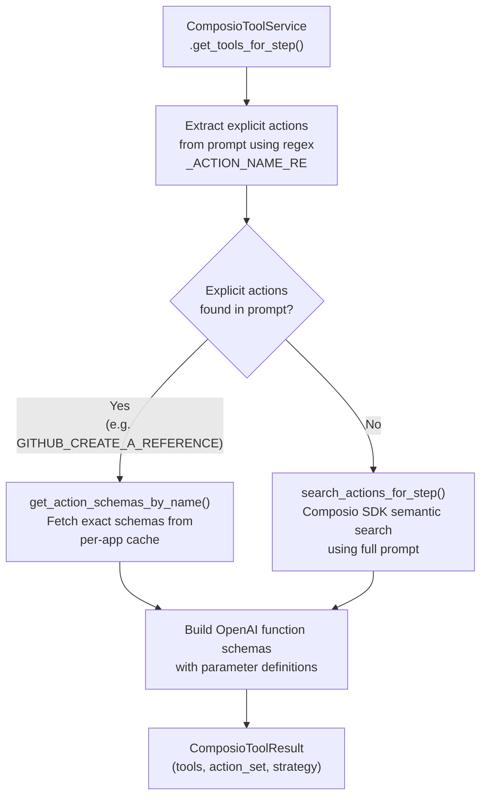
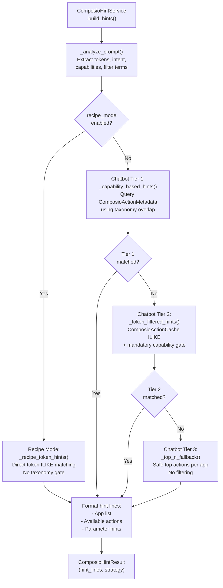
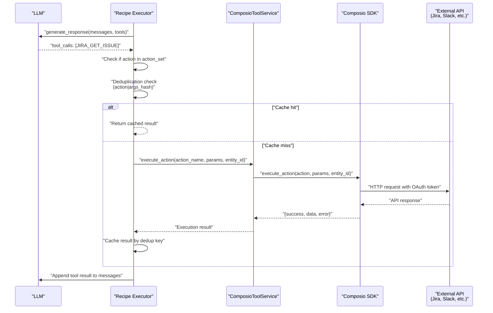
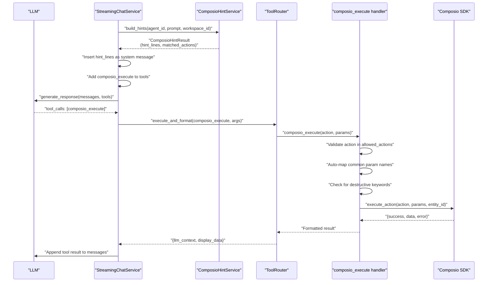
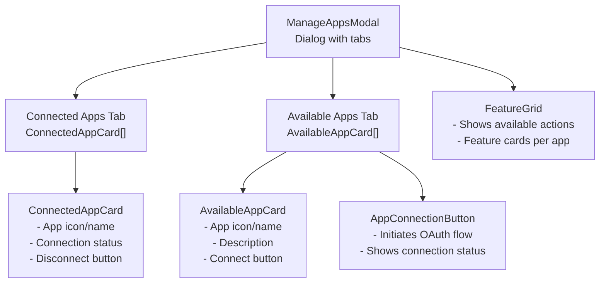

# Composio Integration

<details>
<summary>Relevant source files</summary>

The following files were used as context for generating this wiki page:

- [docs/DoctorsNotes.docx](docs/DoctorsNotes.docx)
- [orchestrator/api/tools.py](orchestrator/api/tools.py)
- [orchestrator/consumers/chatbot/tool_router.py](orchestrator/consumers/chatbot/tool_router.py)
- [orchestrator/core/composio/client.py](orchestrator/core/composio/client.py)
- [orchestrator/modules/tools/execution/unified_executor.py](orchestrator/modules/tools/execution/unified_executor.py)
- [orchestrator/modules/tools/registry/tool_registry.py](orchestrator/modules/tools/registry/tool_registry.py)
- [orchestrator/modules/tools/services/composio_hint_service.py](orchestrator/modules/tools/services/composio_hint_service.py)
- [orchestrator/modules/tools/services/composio_tool_service.py](orchestrator/modules/tools/services/composio_tool_service.py)
- [orchestrator/modules/tools/tool_router.py](orchestrator/modules/tools/tool_router.py)
- [orchestrator/services/metadata_sync_service.py](orchestrator/services/metadata_sync_service.py)

</details>


**Purpose**: This document describes how Automatos AI integrates with Composio to provide 500+ external app integrations (Slack, Jira, GitHub, etc.) for agents. It covers entity management, OAuth connection flows, agent tool assignment, tool resolution strategies, and action execution patterns.

**Scope**: This page focuses on the Composio integration layer only. For broader tool management including builtin tools and skill-based tools, see [Tools API Reference](#6.6). For agent context assembly that consumes Composio tools, see [Agent Context Assembly](#3.5).

---

## Overview

Composio integration enables agents to interact with external applications through:
- **Entity-based isolation**: Each workspace has a dedicated Composio entity
- **OAuth connection management**: Workspace-level app connections with status tracking
- **Agent tool assignment**: Granular control over which apps each agent can access
- **Dual resolution strategy**: SDK semantic search (primary) and hint-based fallback
- **Direct action execution**: Per-action function-calling tools with exact parameter schemas

The system maintains a three-tier authorization model:
1. **Workspace connection**: OAuth completed for an app (stored in `composio_connections` table)
2. **Agent assignment**: Specific agent granted access to an app (stored in `agent_app_assignments` table)
3. **Action resolution**: Relevant actions identified for the task at hand

Sources: [orchestrator/modules/tools/services/composio_hint_service.py:1-89](), [orchestrator/modules/tools/services/composio_tool_service.py:1-55]()

---

## Architecture Overview

### Entity-Connection-Assignment Model



**Entity Management**: The `EntityManager` class creates a 1:1 mapping between workspaces and Composio entities. The `composio_entity_id` is simply the workspace UUID string, providing deterministic mapping without external API calls.

**Connection Lifecycle**: Connections start as `pending` when OAuth is initiated, transition to `active` when the callback completes, or `error` if the flow fails. The `connection_id` from Composio SDK is stored for action execution.

**Assignment Filtering**: When resolving tools for an agent, the system intersects agent assignments with workspace connections to determine the allowed app set.

Sources: [orchestrator/core/composio/entity_manager.py:19-69](), [orchestrator/core/models/composio_cache.py]() (AgentAppAssignment model), [orchestrator/modules/tools/services/composio_hint_service.py:217-268]()

---

## Entity Management

### EntityManager Class

The `EntityManager` handles workspace-to-entity mapping and connection persistence:



**Key Methods**:
- `get_entity_by_workspace(workspace_id)`: Retrieve entity for a workspace
- `get_or_create_entity(workspace_id)`: Idempotent entity creation
- `get_entity_connections(entity_id)`: List all app connections for an entity
- `get_connected_apps(workspace_id)`: Return active app names for a workspace

The entity creation strategy [orchestrator/core/composio/entity_manager.py:41-69]() uses the workspace UUID directly as the Composio entity ID, avoiding external API dependencies and ensuring idempotency.

Sources: [orchestrator/core/composio/entity_manager.py:19-125]()

---

## Connection Management

### OAuth Connection Flow



### Connection Status Tracking

The system tracks connection state in the `composio_connections` table:

| Column | Type | Purpose |
|--------|------|---------|
| `entity_id` | INT (FK) | References `composio_entities.id` |
| `app_name` | VARCHAR | Uppercase app name (e.g., "SLACK", "JIRA") |
| `status` | VARCHAR | `pending`, `active`, or `error` |
| `connection_id` | VARCHAR | Composio SDK connection identifier |
| `connected_at` | TIMESTAMP | When status transitioned to `active` |
| `last_synced_at` | TIMESTAMP | Last status check or update |

**Lazy Status Upgrade**: The `get_connected_apps()` method [orchestrator/core/composio/entity_manager.py:101-124]() implements lazy connection promotion: if a connection is `pending` but has a `connection_id`, it's treated as `active` and the status is upgraded automatically. This handles cases where OAuth completes but the callback is missed.

Sources: [orchestrator/core/composio/entity_manager.py:72-204](), [orchestrator/api/composio.py]() (OAuth endpoints)

---

## Agent Tool Assignment

### AgentAppAssignment Model

Agents are granted access to specific apps through the `agent_app_assignments` table:



**Assignment Fields**:
- `agent_id`: Foreign key to `agents.id`
- `app_name`: Uppercase app identifier (e.g., "GITHUB", "SLACK")
- `app_type`: `"EXTERNAL"` for Composio apps, `"BUILTIN"` for internal tools
- `is_active`: Boolean flag to enable/disable without deletion

### Assignment Resolution

When resolving tools for an agent, the system filters assignments by:

1. **Agent ID match**: `AgentAppAssignment.agent_id == agent_id`
2. **Active status**: `AgentAppAssignment.is_active == True`
3. **External type**: `AgentAppAssignment.app_type == "EXTERNAL"` (Composio apps only)
4. **Connection intersection**: Assigned apps must have active connections in workspace

This multi-gate approach [orchestrator/modules/tools/services/composio_hint_service.py:217-268]() ensures agents only access apps they're authorized for AND that the workspace has connected.

Sources: [orchestrator/modules/tools/services/composio_hint_service.py:217-268](), [orchestrator/modules/tools/services/composio_tool_service.py:254-293]()

---

## Tool Resolution Strategies

Composio tools are resolved using a dual-path strategy: SDK semantic search (primary) and hint-based fallback (secondary).

### Strategy 1: SDK Semantic Search (Primary)



**Explicit Action Extraction**: The service uses a regex pattern [orchestrator/modules/tools/services/composio_tool_service.py:67]() to find uppercase action names in prompts:
```
_ACTION_NAME_RE = re.compile(r"\b([A-Z][A-Z0-9]+(?:_[A-Z0-9]+){2,})\b")
```

This matches patterns like `JIRA_GET_ISSUE`, `GITHUB_CREATE_A_REFERENCE`, etc.

**Direct Schema Lookup**: When explicit actions are found, the system bypasses semantic search and directly fetches their schemas via `get_action_schemas_by_name()` [orchestrator/modules/tools/services/composio_tool_service.py:116-133](). This avoids the SDK's alphabetical bias and provides exact parameter schemas.

**SDK Search Fallback**: When no explicit actions are detected, the system calls `search_actions_for_step()` [orchestrator/modules/tools/services/composio_tool_service.py:153-170]() with the task prompt, limit, and allowed app names. The SDK performs semantic matching to find relevant actions.

Sources: [orchestrator/modules/tools/services/composio_tool_service.py:55-193]()

---

### Strategy 2: Hint-Based Fallback

When SDK search returns no tools, the system falls back to hint-based resolution via `ComposioHintService`:



**Recipe Mode** [orchestrator/modules/tools/services/composio_hint_service.py:153-160](): Skips taxonomy/capability gates and uses prompt tokens directly for ILIKE matching. Designed for curated recipe step prompts that are specific and actionable.

**Chatbot Tier 1** [orchestrator/modules/tools/services/composio_hint_service.py:308-386](): Queries `ComposioActionMetadata` table using capability overlap from the taxonomy. Scores actions by capability matches, keyword overlap, and classification confidence.

**Chatbot Tier 2** [orchestrator/modules/tools/services/composio_hint_service.py:392-488](): Falls back to `ComposioActionCache` with token-based ILIKE search. **Critical**: Capability terms are a mandatory gate [orchestrator/modules/tools/services/composio_hint_service.py:20-21]() — actions MUST match at least one capability term to be included. This prevents `SLACK_CREATE_CHANNEL_BASED_CONVERSATION` from competing with `SLACK_SEND_MESSAGE` for messaging intents.

**Chatbot Tier 3** [orchestrator/modules/tools/services/composio_hint_service.py:492-552](): Returns top N safe actions per app with no filtering. Used when no confident matches are found.

Sources: [orchestrator/modules/tools/services/composio_hint_service.py:89-213]()

---

## Action Execution

Composio actions can be executed in two ways: direct per-action calls or through the `composio_execute` mega-tool.

### Direct Action Execution (SDK Search Path)

When `ComposioToolService` returns per-action tools, they're executed directly:



**Deduplication**: The recipe executor [orchestrator/api/recipe_executor.py:260-298]() maintains a cache keyed by `"{action_name}|{args_json_sorted}"`. If the LLM calls the same action with identical parameters again, the cached result is returned without hitting the API.

**Direct Execution Logic**: Actions are executed directly if:
1. The tool name is in the resolved `action_set` from SDK search, OR
2. The tool name starts with a connected app prefix (e.g., `JIRA_*`, `SLACK_*`)

This allows the LLM to infer related actions beyond the search results, as long as they're in the connected app namespace.

Sources: [orchestrator/api/recipe_executor.py:256-312](), [orchestrator/modules/tools/services/composio_tool_service.py:194-212]()

---

### composio_execute Mega-Tool (Hint Fallback Path)

When SDK search returns no tools, the system injects the `composio_execute` mega-tool along with action hints:



**Hint Injection**: The hint lines [orchestrator/modules/tools/services/composio_hint_service.py:137-148]() include:
- Connected app list
- Exact action names to use (e.g., "SLACK_SEND_MESSAGE, SLACK_GET_CHANNELS")
- Parameter hints for top actions (extracted from action schemas)
- Directive: "You MUST call `composio_execute` to fulfill the user's request"

**Validation**: The `composio_execute` handler validates:
- Action is in the allowed set for the workspace/agent
- No destructive keywords in params (delete, remove, etc.) for safety
- Auto-maps common parameter name variations (e.g., `issue_key` → `issue_id_or_key`)

Sources: [orchestrator/modules/tools/services/composio_hint_service.py:137-212](), [orchestrator/consumers/chatbot/service.py:640-693]()

---

## Frontend Components

### App Connection UI

The frontend provides React components for managing Composio connections:



**Component Hierarchy**:

1. **ManageAppsModal** [frontend/components/composio/manage-apps-modal.tsx](): Top-level dialog with tabbed interface
2. **ConnectedAppCard** [frontend/components/composio/connected-app-card.tsx](): Displays connected apps with disconnect action
3. **AvailableAppCard** [frontend/components/composio/available-app-card.tsx](): Lists apps available for connection
4. **AppConnectionButton** [frontend/components/composio/app-connection-button.tsx](): Triggers OAuth flow and handles redirects
5. **FeatureGrid** [frontend/components/composio/feature-grid.tsx](): Shows available actions/features per app

### API Client Integration

The frontend uses `useComposioApi` hook [frontend/hooks/use-composio-api.ts]() for data fetching:

```typescript
const {
  connectedApps,
  availableApps,
  isLoading,
  connect,
  disconnect,
  refreshConnections
} = useComposioApi(workspaceId)
```

**Key Methods**:
- `connect(appName)`: Initiates OAuth flow, opens popup window
- `disconnect(appName)`: Removes connection
- `refreshConnections()`: Re-fetches connection status from backend

Sources: [frontend/components/composio/manage-apps-modal.tsx](), [frontend/components/composio/app-connection-button.tsx](), [frontend/hooks/use-composio-api.ts]()

---

## Caching Layer

### ComposioActionCache Table

The system maintains a cache of action metadata for fast lookups:

| Column | Type | Purpose |
|--------|------|---------|
| `app_name` | VARCHAR | Uppercase app identifier |
| `action_name` | VARCHAR | Full action name (e.g., `JIRA_GET_ISSUE`) |
| `display_name` | VARCHAR | Human-readable name |
| `description` | TEXT | Action description for LLM context |
| `parameters` | JSONB | Parameter schema |
| `last_synced_at` | TIMESTAMP | Cache freshness timestamp |

**Token Matching**: Tier 2 hint resolution [orchestrator/modules/tools/services/composio_hint_service.py:392-488]() queries this table with token-based ILIKE filters:

```sql
WHERE app_name IN ('SLACK', 'JIRA')
AND (
  action_name ILIKE '%send%' OR
  action_name ILIKE '%message%' OR
  description ILIKE '%send%' OR
  description ILIKE '%message%'
)
```

### ComposioActionMetadata Table

Enhanced metadata for capability-based routing:

| Column | Type | Purpose |
|--------|------|---------|
| `app_id` | VARCHAR | Lowercase app identifier |
| `action_id` | VARCHAR | Full action name |
| `capabilities` | TEXT[] | Array of capability tags (e.g., `["message.send"]`) |
| `intent_keywords` | TEXT[] | Keywords for intent matching |
| `destructive` | BOOLEAN | Safety flag for dangerous actions |
| `classification_confidence` | FLOAT | ML confidence score (0-1) |

**Capability Overlap**: Tier 1 hint resolution [orchestrator/modules/tools/services/composio_hint_service.py:308-386]() queries with:

```sql
WHERE app_id IN ('slack', 'jira')
AND capabilities && ARRAY['message.send', 'message.create']
AND destructive = false
```

Sources: [orchestrator/modules/tools/services/composio_hint_service.py:308-488](), [orchestrator/modules/tools/capabilities/models.py]() (ComposioActionMetadata model)

---

## Integration Points

### Recipe Executor Integration

Recipes use `ComposioToolService` for per-action tools:

1. **Tool Resolution**: [orchestrator/api/recipe_executor.py:113-150]() calls `get_tools_for_step()` with the step's task prompt
2. **SDK Result Handling**: If tools are returned, they're added to the LLM's tool list
3. **Hint Fallback**: If no tools are returned, the system falls back to `ComposioHintService.build_hints()` with `recipe_mode=True`
4. **Direct Execution**: Tool calls matching the action set are executed directly via `execute_action()`
5. **Deduplication**: Results are cached to prevent redundant API calls

Sources: [orchestrator/api/recipe_executor.py:43-363]()

---

### Chat Service Integration

The streaming chat service uses both strategies:

1. **SDK Search First**: [orchestrator/consumers/chatbot/service.py:640-672]() attempts `ComposioToolService.get_tools_for_step()`
2. **Tool Injection**: Per-action tools are added to the LLM's tool list, replacing `composio_execute`
3. **Scope Message**: A system message explains which apps are connected and to use the provided tools directly
4. **Hint Fallback**: If no SDK tools are found, falls back to `ComposioHintService.build_hints()` with `recipe_mode=False`
5. **Mega-Tool Execution**: Tool calls to `composio_execute` are routed through the validation/auto-mapping pipeline

Sources: [orchestrator/consumers/chatbot/service.py:640-807]()

---

## Best Practices

### Agent Setup

1. **Connect Apps First**: Use the frontend UI to complete OAuth for required apps
2. **Assign Apps to Agent**: Explicitly assign apps via `AgentAppAssignment` records
3. **Test Explicit Actions**: Include action names in prompts during testing to trigger direct lookup
4. **Monitor Strategy Usage**: Check logs for `strategy=sdk_search` vs `strategy=hint_fallback` to optimize prompts

### Prompt Design

**For Recipe Steps**:
- Include explicit action names when possible: "Use JIRA_GET_ISSUE to fetch ticket details"
- Be specific about parameters: "Get issue with key PROJECT-123"
- Enable `recipe_mode=True` for direct token matching without taxonomy overhead

**For Chat Interactions**:
- Use intent-rich language that matches capability taxonomy
- Let the system suggest tools via Tier 1 capability matching
- Avoid generic prompts that trigger Tier 3 fallback (low precision)

### Error Handling

**Connection Failures**:
- Check `composio_connections.status` for `error` state
- Re-trigger OAuth flow via frontend UI
- Validate entity_id mapping in `composio_entities` table

**Action Execution Failures**:
- Check SDK error messages in tool result
- Verify parameter names match action schema
- Enable auto-mapping for common parameter variations

Sources: [orchestrator/modules/tools/services/composio_hint_service.py:88-213](), [orchestrator/api/recipe_executor.py:113-199]()

---