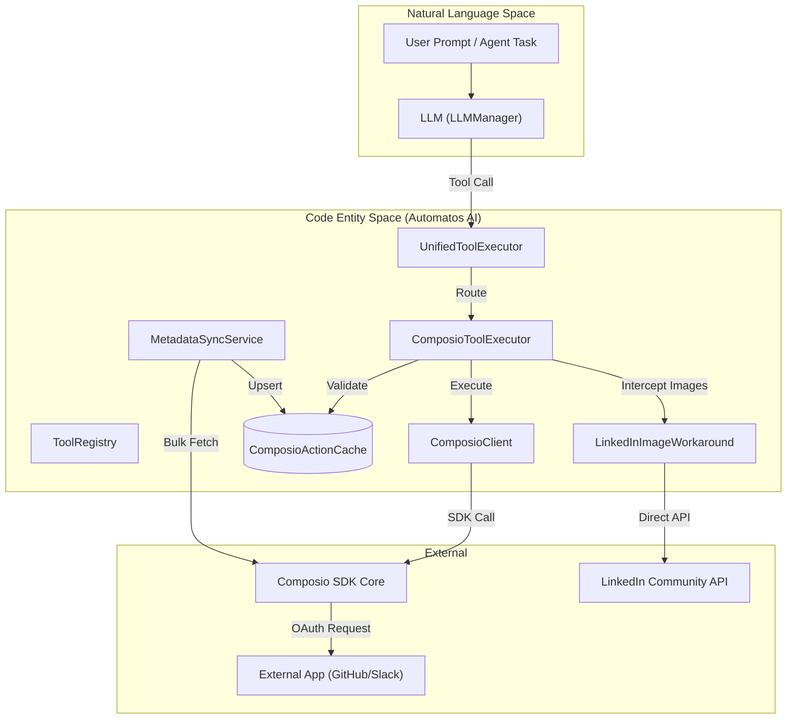
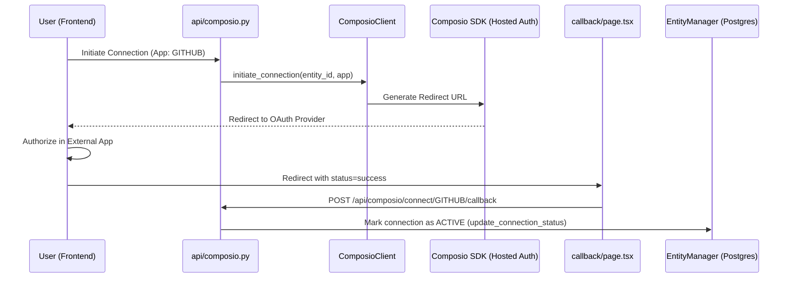

# Composio Integration

Relevant source files

The following files were used as context for generating this wiki page:

- [orchestrator/api/composio.py](orchestrator/api/composio.py)
- [orchestrator/api/tools.py](orchestrator/api/tools.py)
- [orchestrator/core/composio/client.py](orchestrator/core/composio/client.py)
- [orchestrator/core/composio/linkedin_image_workaround.py](orchestrator/core/composio/linkedin_image_workaround.py)
- [orchestrator/core/composio/tool_executor.py](orchestrator/core/composio/tool_executor.py)
- [orchestrator/core/credentials/tester.py](orchestrator/core/credentials/tester.py)
- [orchestrator/core/credentials/types.py](orchestrator/core/credentials/types.py)
- [orchestrator/core/database/credential_types_seed.json](orchestrator/core/database/credential_types_seed.json)
- [orchestrator/services/metadata_sync_service.py](orchestrator/services/metadata_sync_service.py)

**Purpose**: This document describes how Automatos AI integrates with the Composio SDK to provide 500+ external app integrations (Slack, Jira, GitHub, etc.) for agents. It covers metadata synchronization, app/action caching, OAuth flow, entity management, and the unified tool execution pipeline.

**Scope**: This page focuses on the Composio integration layer, including the SDK wrapper and the caching services that enable low-latency tool discovery and execution.

---

## Overview

Composio integration enables agents to interact with external applications through a robust infrastructure:
- **Entity-based isolation**: Each workspace maps to a dedicated Composio entity (`user_id`) for credential isolation [orchestrator/core/composio/client.py:137-155]().
- **Metadata Sync**: A background service that mirrors the Composio marketplace into local PostgreSQL tables to eliminate API latency during tool discovery [orchestrator/services/metadata_sync_service.py:1-7]().
- **Hosted OAuth**: Manages authentication flows for third-party services using Composio's hosted auth infrastructure [orchestrator/core/composio/client.py:54-79]().
- **Unified Execution**: A single entry point for agents to call any external tool with validation and error handling [orchestrator/core/composio/tool_executor.py:1-12]().
- **File Upload Support**: Specialized logic to resolve local workspace files or URLs into `FileUploadable` objects for actions like LinkedIn or Twitter posts [orchestrator/core/composio/tool_executor.py:68-120]().

Sources: [orchestrator/core/composio/client.py:1-12](), [orchestrator/services/metadata_sync_service.py:1-13](), [orchestrator/core/composio/tool_executor.py:1-12]()

---

## System Architecture

The integration bridges the gap between Natural Language (LLM tool calls) and the Code Entity Space (Composio SDK and local Cache).

### Tool Discovery and Execution Flow

Title: "Tool Discovery and Execution Architecture"

**Key Entities**:
- `ComposioClient`: A lazy-loaded wrapper around the `composio-core` SDK [orchestrator/core/composio/client.py:54-126](). It uses `OpenAIProvider` to provide tool schemas [orchestrator/core/composio/client.py:121-135]().
- `ComposioActionCache`: Stores tool schemas (parameters, descriptions) locally to avoid fetching them from the SDK during the chat loop [orchestrator/api/tools.py:26]().
- `ComposioToolExecutor`: Handles the invocation of Composio actions. It includes logic for `resolve_file_uploads` to handle media params [orchestrator/core/composio/tool_executor.py:123-132]().
- `LinkedInImageWorkaround`: A specialized module that bypasses Composio for LinkedIn image posts due to known SDK limitations, calling the LinkedIn API directly [orchestrator/core/composio/linkedin_image_workaround.py:4-13]().

Sources: [orchestrator/core/composio/client.py:54-135](), [orchestrator/api/tools.py:26](), [orchestrator/core/composio/tool_executor.py:123-132](), [orchestrator/core/composio/linkedin_image_workaround.py:1-24]()

---

## Metadata Synchronization

To ensure high performance, Automatos AI does not query the Composio SDK for tool schemas during an active agent run. Instead, it uses a `MetadataSyncService` to maintain a local mirror.

### Sync Logic
The service performs a bulk fetch of all available apps and actions:
1. **Fetch Apps**: Retrieves all supported toolkits using `client.get_available_apps()` [orchestrator/services/metadata_sync_service.py:60-71]().
2. **Bulk Fetch Actions**: Uses `get_all_actions_bulk` to download tool definitions in a paged manner (up to 1000 actions per page) [orchestrator/services/metadata_sync_service.py:73-86]().
3. **Upsert Cache**: Updates `ComposioAppCache` and `ComposioActionCache` tables, removing orphaned actions to ensure the local DB matches the Composio bulk registry exactly [orchestrator/services/metadata_sync_service.py:108-149]().
4. **Trigger Management**: Syncs trigger counts and metadata for apps like Slack, Gmail, and GitHub to support workflow triggers [orchestrator/services/metadata_sync_service.py:94-98]().

### Cache Tables

| Table | Role |
| :--- | :--- |
| `ComposioAppCache` | Stores app metadata, logos, categories, and connection status [orchestrator/api/tools.py:139-142](). |
| `ComposioActionCache` | Stores the JSON schema for every individual tool (e.g., `GITHUB_CREATE_ISSUE`) [orchestrator/api/tools.py:26](). |
| `ComposioStatsCache` | Aggregated counts of total tools and categories for the UI [orchestrator/api/tools.py:26](). |

Sources: [orchestrator/services/metadata_sync_service.py:42-150](), [orchestrator/api/tools.py:132-158]()

---

## OAuth and Connection Flow

Automatos AI uses Composio's **Hosted Auth** to manage user credentials securely without handling sensitive tokens directly.

### OAuth Sequence

Title: "Composio OAuth and Connection Lifecycle"

**Implementation Details**:
- **Initiation**: The `initiate_connection` method [orchestrator/core/composio/client.py:199-234]() requests a redirect URL from Composio for a specific entity.
- **Entity Management**: Every workspace is mapped to a `composio_entity_id` (stringified workspace UUID) to isolate credentials [orchestrator/core/composio/entity_manager.py:55-60]().
- **Auth Config Caching**: The client caches `auth_config_id` resolution for 1 hour to avoid repeated API calls during connection setup [orchestrator/core/composio/client.py:157-186]().
- **Performance Optimization**: Connection status is read from the local DB during page loads to eliminate redundant API calls to Composio [orchestrator/api/tools.py:113-130]().

Sources: [orchestrator/core/composio/client.py:157-234](), [orchestrator/api/composio.py:208-220](), [orchestrator/core/composio/entity_manager.py:19-69](), [orchestrator/api/tools.py:113-130]()

---

## Tool Execution Pipeline

When an agent decides to use a tool, the execution pipeline handles permission checks, file resolution, and direct API workarounds.

### File Upload Resolution
For actions requiring media (Twitter, LinkedIn), the system resolves file references:
- **URL Resolution**: Downloads files from URLs via `FileUploadable.from_url` [orchestrator/core/composio/tool_executor.py:86-95]().
- **Workspace Resolution**: Uses `WorkspaceClient` to download files from the agent's sandboxed environment and convert them to temporary paths for the SDK [orchestrator/core/composio/tool_executor.py:97-120]().

### LinkedIn Image Workaround
Due to limitations in the Composio SDK (as of May 2026), Automatos AI implements a direct workaround for LinkedIn image posts:
- **Credential Loading**: Loads `linkedInCommunityManagementOAuth2Api` credentials from the platform's central credential store [orchestrator/core/composio/linkedin_image_workaround.py:61-106]().
- **Token Management**: Handles OAuth2 token refresh logic [orchestrator/core/composio/linkedin_image_workaround.py:116-157]().
- **Direct API Call**: Bypasses the SDK and calls `api.linkedin.com` directly for media-rich posts [orchestrator/core/composio/linkedin_image_workaround.py:41-45]().

### Credential Testing
The platform includes a `CredentialTester` that can verify the validity of various credentials, including LinkedIn Community Management APIs, using actual API calls [orchestrator/core/credentials/tester.py:69-127]().

Sources: [orchestrator/core/composio/tool_executor.py:68-120](), [orchestrator/core/composio/linkedin_image_workaround.py:1-157](), [orchestrator/core/credentials/tester.py:109](), [orchestrator/core/credentials/types.py:124-194]()

---

## API Reference

### Backend Endpoints
- `GET /api/tools/marketplace`: Lists apps from the local cache with connection status [orchestrator/api/tools.py:105-199]().
- `POST /api/tools/sync`: Triggers the `MetadataSyncService` to refresh the local cache [orchestrator/api/tools.py:27]().
- `GET /api/composio/apps`: Lists all available Composio apps with workspace connection status [orchestrator/api/composio.py:120-170]().
- `GET /api/composio/apps/{app_name}/actions`: Lists specific actions for a toolkit [orchestrator/api/composio.py:173-201]().

### Core Classes

| Class | File | Responsibility |
| :--- | :--- | :--- |
| `ComposioClient` | `orchestrator/core/composio/client.py` | Low-level SDK wrapper, OAuth redirect logic, and schema lookup [orchestrator/core/composio/client.py:54]() |
| `ComposioToolExecutor` | `orchestrator/core/composio/tool_executor.py` | Permission validation and action execution via SDK [orchestrator/core/composio/tool_executor.py:1-12]() |
| `MetadataSyncService` | `orchestrator/services/metadata_sync_service.py` | Syncing marketplace data to local PostgreSQL cache [orchestrator/services/metadata_sync_service.py:37-41]() |
| `EntityManager` | `orchestrator/core/composio/entity_manager.py` | Managing workspace-to-entity mappings and connection states [orchestrator/core/composio/entity_manager.py:19-28]() |
| `CredentialTester` | `orchestrator/core/credentials/tester.py` | Testing credentials like LinkedIn OAuth2 [orchestrator/core/credentials/tester.py:55-69]() |

Sources: [orchestrator/core/composio/client.py:54-80](), [orchestrator/core/composio/tool_executor.py:1-12](), [orchestrator/services/metadata_sync_service.py:37-41](), [orchestrator/core/composio/entity_manager.py:19-28](), [orchestrator/core/credentials/tester.py:55-69]()

---