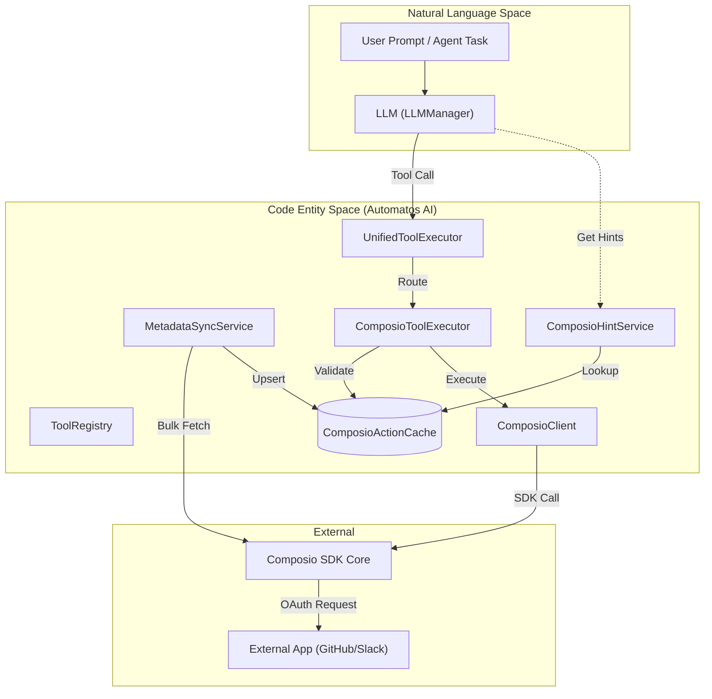
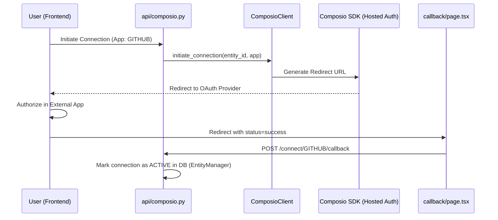

# Composio Integration

Relevant source files

The following files were used as context for generating this wiki page:

- [docs/PRDS/58-PROMPT-MANAGEMENT-FUTUREAGI-INTEGRATION.md](docs/PRDS/58-PROMPT-MANAGEMENT-FUTUREAGI-INTEGRATION.md)
- [docs/PRDS/59-WORKFLOW-ENGINE-V2-NEURAL-SWARM-BRIDGE.md](docs/PRDS/59-WORKFLOW-ENGINE-V2-NEURAL-SWARM-BRIDGE.md)
- [docs/PRDS/60-RAG-V3-TOP10-COMPETITIVE-UPGRADE.md](docs/PRDS/60-RAG-V3-TOP10-COMPETITIVE-UPGRADE.md)
- [docs/PRDS/61-NL2SQL-V2-COMPETITIVE-UPGRADE.md](docs/PRDS/61-NL2SQL-V2-COMPETITIVE-UPGRADE.md)
- [docs/PRDS/62-CODEGRAPH-V2-COMPETITIVE-UPGRADE.md](docs/PRDS/62-CODEGRAPH-V2-COMPETITIVE-UPGRADE.md)
- [frontend/app/tools/callback/page.tsx](frontend/app/tools/callback/page.tsx)
- [frontend/components/composio/app-connection-button.tsx](frontend/components/composio/app-connection-button.tsx)
- [frontend/components/tools/composio-apps-section.tsx](frontend/components/tools/composio-apps-section.tsx)
- [frontend/components/tools/tool-config-modal.tsx](frontend/components/tools/tool-config-modal.tsx)
- [orchestrator/api/composio.py](orchestrator/api/composio.py)
- [orchestrator/api/routing.py](orchestrator/api/routing.py)
- [orchestrator/api/tools.py](orchestrator/api/tools.py)
- [orchestrator/core/composio/client.py](orchestrator/core/composio/client.py)
- [orchestrator/core/composio/entity_manager.py](orchestrator/core/composio/entity_manager.py)
- [orchestrator/core/composio/tool_executor.py](orchestrator/core/composio/tool_executor.py)
- [orchestrator/modules/agents/factory/agent_factory.py](orchestrator/modules/agents/factory/agent_factory.py)
- [orchestrator/modules/tools/services/composio_hint_service.py](orchestrator/modules/tools/services/composio_hint_service.py)
- [orchestrator/modules/tools/services/composio_tool_service.py](orchestrator/modules/tools/services/composio_tool_service.py)
- [orchestrator/scripts/setup_jira_trigger.py](orchestrator/scripts/setup_jira_trigger.py)
- [orchestrator/services/metadata_sync_service.py](orchestrator/services/metadata_sync_service.py)

**Purpose**: This document describes how Automatos AI integrates with the Composio SDK to provide 500+ external app integrations (Slack, Jira, GitHub, etc.) for agents. It covers metadata synchronization, app/action caching, OAuth flow, entity management, and the unified tool execution pipeline.

**Scope**: This page focuses on the Composio integration layer, including the SDK wrapper and the caching services that enable low-latency tool discovery and execution.

---

## Overview

Composio integration enables agents to interact with external applications through a robust infrastructure:
- **Entity-based isolation**: Each workspace maps to a dedicated Composio entity (`user_id`) for credential isolation [orchestrator/core/composio/client.py:128-146]().
- **Metadata Sync**: A background service that mirrors the Composio marketplace into local PostgreSQL tables to eliminate API latency during tool discovery [orchestrator/services/metadata_sync_service.py:1-7]().
- **Hosted OAuth**: Manages authentication flows for third-party services using Composio's hosted auth infrastructure [orchestrator/core/composio/client.py:54-79]().
- **Unified Execution**: A single entry point for agents to call any external tool with validation and error handling [orchestrator/core/composio/tool_executor.py:141-162]().

Sources: [orchestrator/core/composio/client.py:1-12](), [orchestrator/services/metadata_sync_service.py:1-13](), [orchestrator/core/composio/tool_executor.py:30-46]()

---

## System Architecture

The integration bridges the gap between Natural Language (LLM tool calls) and the Code Entity Space (Composio SDK and local Cache).

### Tool Discovery and Execution Flow

Title: Tool Discovery and Execution Architecture

**Key Entities**:
- `ComposioClient`: A lazy-loaded wrapper around the `composio-core` SDK [orchestrator/core/composio/client.py:54-126]().
- `ComposioActionCache`: Stores tool schemas (parameters, descriptions) locally to avoid fetching them from the SDK during the chat loop [orchestrator/api/tools.py:25]().
- `UnifiedToolExecutor`: Routes generic tool calls to specific executors based on tool prefixes or registry lookups [orchestrator/modules/agents/factory/agent_factory.py:42-44]().
- `ComposioHintService`: Generates system message hints for LLMs to ensure they use correct tool names and parameters [orchestrator/modules/tools/services/composio_hint_service.py:89-98]().

Sources: [orchestrator/core/composio/client.py:54-126](), [orchestrator/api/tools.py:25](), [orchestrator/services/metadata_sync_service.py:37-47](), [orchestrator/modules/tools/services/composio_hint_service.py:89-110]()

---

## Metadata Synchronization

To ensure high performance, Automatos AI does not query the Composio SDK for tool schemas during an active agent run. Instead, it uses a `MetadataSyncService` to maintain a local mirror.

### Sync Logic
The service performs a bulk fetch of all available apps and actions:
1. **Fetch Apps**: Retrieves all supported toolkits [orchestrator/services/metadata_sync_service.py:60-71]().
2. **Bulk Fetch Actions**: Uses `get_all_actions_bulk` to download 800+ tool definitions in a paged manner [orchestrator/services/metadata_sync_service.py:73-86]().
3. **Upsert Cache**: Updates `ComposioAppCache` and `ComposioActionCache` tables, removing orphaned actions that no longer exist in the SDK [orchestrator/services/metadata_sync_service.py:108-149]().

### Cache Tables

| Table | Role |
| :--- | :--- |
| `ComposioAppCache` | Stores app metadata, logos, categories, and connection status [orchestrator/api/tools.py:43-56](). |
| `ComposioActionCache` | Stores the JSON schema for every individual tool (e.g., `GITHUB_CREATE_ISSUE`) [orchestrator/api/tools.py:25](). |
| `ComposioStatsCache` | Aggregated counts of total tools and categories for the UI [orchestrator/api/tools.py:66-72](). |

Sources: [orchestrator/services/metadata_sync_service.py:42-150](), [orchestrator/api/tools.py:106-133]()

---

## OAuth and Connection Flow

Automatos AI uses Composio's **Hosted Auth** to manage user credentials securely without handling sensitive tokens directly.

### OAuth Sequence

Title: Composio OAuth and Connection Lifecycle

**Implementation Details**:
- **Initiation**: The `initiate_connection` method [orchestrator/core/composio/client.py:199-234]() requests a redirect URL from Composio for a specific entity.
- **Entity Management**: Every workspace is mapped to a `composio_entity_id` (stringified workspace UUID) to isolate credentials [orchestrator/core/composio/entity_manager.py:55-60]().
- **Callback Handling**: The frontend `ComposioCallbackPage` [frontend/app/tools/callback/page.tsx:8-40]() captures the redirect parameters and notifies the backend to update the `ComposioConnection` status to `ACTIVE` [orchestrator/core/composio/entity_manager.py:163-185]().

Sources: [orchestrator/core/composio/client.py:199-234](), [frontend/app/tools/callback/page.tsx:8-40](), [orchestrator/api/composio.py:208-220](), [orchestrator/core/composio/entity_manager.py:19-69]()

---

## Tool Discovery & Resolution

To handle the vast scale of Composio tools (800+), the system employs a multi-tier resolution strategy via `ComposioToolService` and `ComposioHintService`.

### Tool Hinting (System Prompt Injection)
`ComposioHintService` injects candidate actions into the LLM system message based on three tiers:
1. **Capability-based**: Uses `ComposioActionMetadata` and taxonomy overlap to find tools matching the user intent [orchestrator/modules/tools/services/composio_hint_service.py:162-166]().
2. **Token-filtered**: Matches prompt tokens against action names in `ComposioActionCache` with a mandatory capability gate [orchestrator/modules/tools/services/composio_hint_service.py:168-172]().
3. **Top-N Fallback**: Provides a safe set of default actions for connected apps [orchestrator/modules/tools/services/composio_hint_service.py:15-16]().

### Action Resolution for Execution
`ComposioToolService` resolves tool schemas for specific execution steps:
- **Explicit Lookup**: Extracts action names directly from the prompt using regex (e.g., `GITHUB_CREATE_ISSUE`) [orchestrator/modules/tools/services/composio_tool_service.py:75-76]().
- **Semantic Search**: Uses the Composio SDK's semantic search if no explicit name is found [orchestrator/modules/tools/services/composio_tool_service.py:111]().
- **Hint-scoped Search**: Limits SDK search to specific apps based on domain keywords (e.g., "email" -> `["gmail"]`) [orchestrator/modules/tools/services/composio_tool_service.py:78-95]().

Sources: [orchestrator/modules/tools/services/composio_hint_service.py:12-21](), [orchestrator/modules/tools/services/composio_tool_service.py:63-113]()

---

## Tool Execution Pipeline

When an agent decides to use a tool, the `ComposioToolExecutor` manages the lifecycle and validation.

### Execution Routing and Validation
1. **Identification**: Actions are typically formatted as `APP_ACTION_NAME` (e.g., `GITHUB_LIST_REPOS`) [orchestrator/core/composio/tool_executor.py:166-174]().
2. **Access Control**: `validate_feature_access` checks the `AgentAppFeature` table to see if the specific agent is allowed to use that action [orchestrator/core/composio/tool_executor.py:66-125]().
3. **Entity Resolution**: The executor resolves the Composio entity associated with the workspace [orchestrator/core/composio/tool_executor.py:126-140]().
4. **SDK Execution**: The `execute` method invokes the SDK. It uses `ComposioActionCache` to verify the app name for multi-word tools [orchestrator/core/composio/tool_executor.py:182-192]().

### Loop Prevention and Performance
- **Caching**: Auth configurations and action schemas are cached in-memory with a TTL to avoid redundant API calls [orchestrator/core/composio/client.py:96-103]().
- **Execution Metadata**: Results include `execution_time_ms` and standard success/error structures for consumption by the agent loop [orchestrator/core/composio/tool_executor.py:163-174]().

Sources: [orchestrator/core/composio/tool_executor.py:66-210](), [orchestrator/core/composio/client.py:96-103]()

---

## API Reference

### Backend Endpoints
- `GET /api/tools/marketplace`: Lists apps from the local cache with connection status [orchestrator/api/tools.py:79-133]().
- `POST /api/tools/sync`: Triggers the `MetadataSyncService` to refresh the local cache [orchestrator/api/tools.py:26]().
- `GET /api/composio/apps/{app_name}/actions`: Lists specific actions for a toolkit [orchestrator/api/composio.py:173-183]().
- `POST /api/composio/connect/{app_name}/callback`: Finalizes an OAuth connection [orchestrator/api/composio.py:255-257]().

### Core Classes

| Class | File | Responsibility |
| :--- | :--- | :--- |
| `ComposioClient` | `orchestrator/core/composio/client.py` | Low-level SDK wrapper and OAuth redirect logic [orchestrator/core/composio/client.py:54]() |
| `ComposioToolExecutor` | `orchestrator/core/composio/tool_executor.py` | Permission validation and action execution [orchestrator/core/composio/tool_executor.py:30]() |
| `MetadataSyncService` | `orchestrator/services/metadata_sync_service.py` | Syncing marketplace data to local PostgreSQL [orchestrator/services/metadata_sync_service.py:37]() |
| `EntityManager` | `orchestrator/core/composio/entity_manager.py` | Managing workspace-to-entity mappings and connections [orchestrator/core/composio/entity_manager.py:19]() |
| `ComposioHintService` | `orchestrator/modules/tools/services/composio_hint_service.py` | Generating LLM system hints for tool discovery [orchestrator/modules/tools/services/composio_hint_service.py:89]() |

Sources: [orchestrator/core/composio/client.py:54-80](), [orchestrator/core/composio/tool_executor.py:30-46](), [orchestrator/services/metadata_sync_service.py:37-42](), [orchestrator/core/composio/entity_manager.py:19-22](), [orchestrator/modules/tools/services/composio_hint_service.py:89-98]()

---