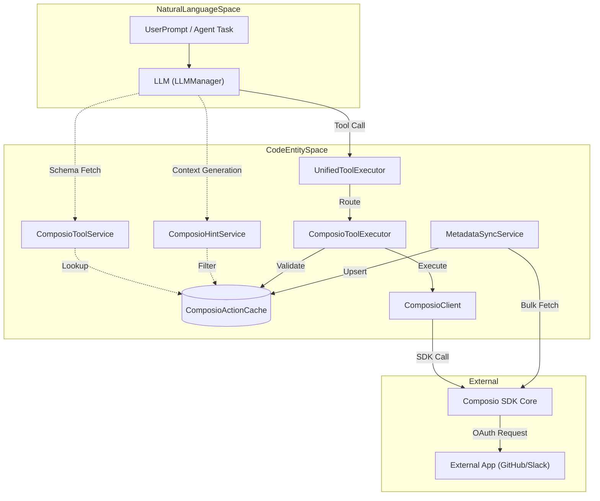
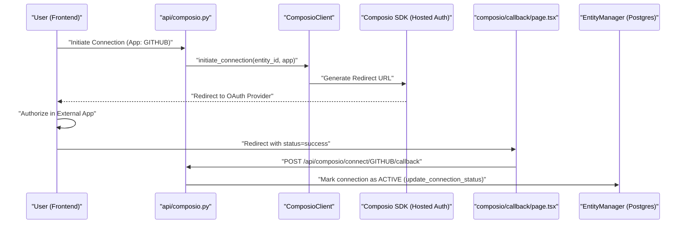

# Composio Integration

Relevant source files

The following files were used as context for generating this wiki page:

- [frontend/app/sign-in/[[...rest]]/page.tsx](frontend/app/sign-in/[[...rest]]/page.tsx)
- [frontend/app/sign-up/[[...rest]]/page.tsx](frontend/app/sign-up/[[...rest]]/page.tsx)
- [frontend/app/tools/callback/page.tsx](frontend/app/tools/callback/page.tsx)
- [frontend/components/__tests__/prd175-auth-edition.test.tsx](frontend/components/__tests__/prd175-auth-edition.test.tsx)
- [frontend/components/auth/sign-up-form.tsx](frontend/components/auth/sign-up-form.tsx)
- [frontend/components/local-auth-provider.tsx](frontend/components/local-auth-provider.tsx)
- [frontend/components/workflows/execution-kitchen.tsx](frontend/components/workflows/execution-kitchen.tsx)
- [frontend/lib/auth-edition.ts](frontend/lib/auth-edition.ts)
- [orchestrator/api/composio.py](orchestrator/api/composio.py)
- [orchestrator/api/heartbeat.py](orchestrator/api/heartbeat.py)
- [orchestrator/api/recipe_executor.py](orchestrator/api/recipe_executor.py)
- [orchestrator/api/skills.py](orchestrator/api/skills.py)
- [orchestrator/api/tools.py](orchestrator/api/tools.py)
- [orchestrator/api/webhooks.py](orchestrator/api/webhooks.py)
- [orchestrator/api/workflow_recipes.py](orchestrator/api/workflow_recipes.py)
- [orchestrator/channels/discord_adapter.py](orchestrator/channels/discord_adapter.py)
- [orchestrator/channels/slack_adapter.py](orchestrator/channels/slack_adapter.py)
- [orchestrator/core/composio/client.py](orchestrator/core/composio/client.py)
- [orchestrator/core/composio/entity_manager.py](orchestrator/core/composio/entity_manager.py)
- [orchestrator/core/composio/linkedin_image_workaround.py](orchestrator/core/composio/linkedin_image_workaround.py)
- [orchestrator/core/composio/tool_executor.py](orchestrator/core/composio/tool_executor.py)
- [orchestrator/core/credentials/tester.py](orchestrator/core/credentials/tester.py)
- [orchestrator/core/credentials/types.py](orchestrator/core/credentials/types.py)
- [orchestrator/core/database/credential_types_seed.json](orchestrator/core/database/credential_types_seed.json)
- [orchestrator/core/routing/ingestors/webhook.py](orchestrator/core/routing/ingestors/webhook.py)
- [orchestrator/services/metadata_sync_service.py](orchestrator/services/metadata_sync_service.py)
- [orchestrator/services/webhook_dedup.py](orchestrator/services/webhook_dedup.py)
- [orchestrator/tests/test_p2w0_service_imports_resolve.py](orchestrator/tests/test_p2w0_service_imports_resolve.py)
- [orchestrator/tests/test_p2w2_webhook_dedup.py](orchestrator/tests/test_p2w2_webhook_dedup.py)
- [orchestrator/tests/test_p2w2_webhook_signature_reject.py](orchestrator/tests/test_p2w2_webhook_signature_reject.py)
- [orchestrator/tests/test_prd175_auth_edition.py](orchestrator/tests/test_prd175_auth_edition.py)

**Purpose**: This document describes how Automatos AI integrates with the Composio SDK to provide 500+ external app integrations (Slack, Jira, GitHub, Shopify, etc.) for agents. It covers metadata synchronization, app/action caching, OAuth flow, entity management, file upload resolution, and the LinkedIn image workaround.

**Scope**: This page focuses on the Composio integration layer, including the SDK wrapper (`ComposioClient`), the caching services (`MetadataSyncService`), tool execution pipelines (`ComposioToolExecutor`), and OAuth connection callbacks.

---

## Overview

Composio integration enables agents to interact with external applications through a robust infrastructure:
- **Entity-based isolation**: Each workspace maps to a dedicated Composio entity (`user_id`) for credential isolation [orchestrator/core/composio/client.py:146-164]().
- **Metadata Sync**: A background service that mirrors the Composio marketplace into local PostgreSQL tables (`ComposioAppCache`, `ComposioActionCache`) to eliminate API latency during tool discovery [orchestrator/services/metadata_sync_service.py:1-13](), [orchestrator/api/tools.py:27]().
- **Hosted OAuth**: Manages authentication flows for third-party services using Composio's hosted auth infrastructure and callback handlers [orchestrator/core/composio/client.py:65-82](), [frontend/app/tools/callback/page.tsx:8-40]().
- **Unified Execution**: A single entry point for agents to call any external tool with validation, parameter mapping, and error handling [orchestrator/core/composio/tool_executor.py:141-162]().
- **Trigger Subscriptions**: Support for subscribing to external events (e.g., Jira tickets, GitHub PRs) via `TriggerSubscription` to trigger workflows and recipes [orchestrator/api/workflow_recipes.py:52-130]().

Sources: [orchestrator/core/composio/client.py:1-12](), [orchestrator/services/metadata_sync_service.py:1-13](), [orchestrator/core/composio/tool_executor.py:30-46](), [orchestrator/api/workflow_recipes.py:52-130](), [frontend/app/tools/callback/page.tsx:8-40]()

---

## System Architecture

The integration bridges the gap between Natural Language (LLM tool calls and user intents) and the Code Entity Space (Composio SDK, local caching tables, and executors).

### Tool Discovery and Execution Architecture

Title: "Tool Discovery and Execution Architecture"

**Key Entities**:
- `ComposioClient`: A lazy-loaded wrapper around the `composio-core` SDK [orchestrator/core/composio/client.py:54-126]().
- `ComposioActionCache`: Stores tool schemas (parameters, descriptions) locally to avoid fetching them from the SDK during the chat loop [orchestrator/api/tools.py:27]().
- `ComposioToolExecutor`: Handles the actual invocation of Composio actions after validating agent permissions [orchestrator/core/composio/tool_executor.py:30-46]().
- `ComposioHintService`: Generates system message hints to guide the LLM toward correct action names based on prompt analysis [orchestrator/modules/tools/services/composio_hint_service.py:89-102]().
- `ComposioToolService`: Resolves specific action names into OpenAI-compatible function schemas for the LLM [orchestrator/modules/tools/services/composio_tool_service.py:63-71]().

Sources: [orchestrator/core/composio/client.py:54-126](), [orchestrator/api/tools.py:27](), [orchestrator/services/metadata_sync_service.py:37-47](), [orchestrator/modules/tools/services/composio_hint_service.py:89-102](), [orchestrator/modules/tools/services/composio_tool_service.py:63-71]()

---

## Metadata Synchronization

To ensure high performance, Automatos AI does not query the Composio SDK for tool schemas during an active agent run. Instead, it uses `MetadataSyncService` to maintain a local mirror.

### Sync Logic
The service performs a bulk fetch of all available apps and actions:
1. **Fetch Apps**: Retrieves all supported toolkits [orchestrator/services/metadata_sync_service.py:60-71]().
2. **Bulk Fetch Actions**: Uses `get_all_actions_bulk` to download tool definitions in a paged manner (up to 1000 actions per page) [orchestrator/services/metadata_sync_service.py:73-86]().
3. **Upsert Cache**: Updates `ComposioAppCache` and `ComposioActionCache` tables, removing orphaned actions to ensure the local DB matches the Composio bulk registry exactly [orchestrator/services/metadata_sync_service.py:108-149]().
4. **Trigger Management**: Syncs trigger counts and metadata for apps like Slack, Gmail, and GitHub to support workflow triggers [orchestrator/services/metadata_sync_service.py:94-98]().

### Cache Tables

| Table | Role |
| :--- | :--- |
| `ComposioAppCache` | Stores app metadata, logos, categories, and connection status [orchestrator/api/tools.py:105-118](). |
| `ComposioActionCache` | Stores the JSON schema for every individual tool (e.g., `GITHUB_CREATE_ISSUE`) [orchestrator/api/tools.py:27](). |
| `ComposioStatsCache` | Aggregated counts of total tools and categories for the UI [orchestrator/api/tools.py:27](). |

Sources: [orchestrator/services/metadata_sync_service.py:42-150](), [orchestrator/api/tools.py:105-180]()

---

## OAuth and Connection Flow

Automatos AI uses Composio's **Hosted Auth** to manage user credentials securely without handling sensitive tokens directly.

### OAuth Sequence and Code Mapping

Title: "Composio OAuth and Connection Lifecycle"

**Implementation Details**:
- **Initiation**: The `initiate_connection` method requests a redirect URL from Composio for a specific entity [orchestrator/core/composio/client.py:199-234]().
- **Entity Management**: Every workspace is mapped to a `composio_entity_id` (stringified workspace UUID) via `EntityManager` to isolate credentials [orchestrator/core/composio/entity_manager.py:55-60]().
- **Callback Handling**: The frontend `ComposioCallbackPage` (`frontend/app/tools/callback/page.tsx`) captures the redirect parameters and notifies the backend via `apiClient.post` to update the `ComposioConnection` status to `ACTIVE` [frontend/app/tools/callback/page.tsx:8-40](), [orchestrator/core/composio/entity_manager.py:163-185]().
- **Performance Optimization**: Connection status is read from the local DB during page loads to eliminate redundant API calls to Composio [orchestrator/api/tools.py:156-172]().

Sources: [orchestrator/core/composio/client.py:199-234](), [frontend/app/tools/callback/page.tsx:8-40](), [orchestrator/core/composio/entity_manager.py:19-69](), [orchestrator/api/tools.py:156-172]()

---

## File Upload Resolution & LinkedIn Workaround

A critical feature of the Composio integration is the automated resolution of file references. Any Composio action requiring a file (e.g., `TWITTER_UPLOAD_MEDIA`) undergoes a resolution process that converts URLs or workspace paths into Composio `FileUploadable` objects [orchestrator/core/composio/tool_executor.py:124-133]().

### Resolution Flow
1. **Detection**: The system identifies parameters in `UPLOAD_ACTIONS` (e.g., `media_urls`, `images`) [orchestrator/core/composio/tool_executor.py:39-49]().
2. **URL Download**: If the value is a URL, it is downloaded and uploaded to Composio's S3 storage [orchestrator/core/composio/tool_executor.py:87-96]().
3. **Workspace Path**: If the value is a local path, the `WorkspaceClient` fetches the bytes, creates a temporary file, and uploads it [orchestrator/core/composio/tool_executor.py:98-121]().
4. **LinkedIn Direct Image Workaround**: For platforms like LinkedIn where native Composio image uploads may fail due to upstream SDK limitations, the `linkedin_image_workaround` module bypasses the SDK entirely and calls LinkedIn's Community Management API directly using credentials loaded from the platform's credential store [orchestrator/core/composio/linkedin_image_workaround.py:1-24]().

Sources: [orchestrator/core/composio/tool_executor.py:34-133](), [orchestrator/core/composio/linkedin_image_workaround.py:1-45]()

---

## Tool Discovery and Hints

To help LLMs select the correct tool without overwhelming the context window, `ComposioHintService` and `ComposioToolService` provide tiered discovery.

### Discovery Strategies
1. **Explicit Action Lookup**: Extracts exact action names from the prompt and fetches schemas from the cache [orchestrator/modules/tools/services/composio_tool_service.py:141-166]().
2. **Capability-based Hints**: Maps intent keywords (e.g., "email", "ticket") to specific apps like Gmail or Jira [orchestrator/modules/tools/services/composio_hint_service.py:80-95]().
3. **Token Filtering**: Uses `ILIKE` queries against prompt tokens to find relevant actions in `ComposioActionCache` [orchestrator/modules/tools/services/composio_hint_service.py:167-173]().

Sources: [orchestrator/modules/tools/services/composio_tool_service.py:63-113](), [orchestrator/modules/tools/services/composio_hint_service.py:89-160]()

---

## Tool Execution Pipeline

When an agent decides to use a tool, `ComposioToolExecutor` manages the lifecycle and validation.

### Execution Routing and Validation
1. **Identification**: Actions are formatted as `APP_ACTION_NAME` (e.g., `GITHUB_LIST_REPOS`). The executor uses `ComposioActionCache` to reliably determine the `app_name` [orchestrator/core/composio/tool_executor.py:182-192]().
2. **Access Control**: `validate_feature_access` checks the `AgentAppFeature` table to verify if the agent is allowed to use that action [orchestrator/core/composio/tool_executor.py:66-125]().
3. **SDK Execution**: The `execute` method invokes the SDK, handling both successful responses and detailed error types [orchestrator/core/composio/tool_executor.py:141-174]().

Sources: [orchestrator/core/composio/tool_executor.py:66-210](), [orchestrator/modules/tools/execution/unified_executor.py:105-166]()

---

## Webhook and Trigger Management

Composio triggers allow the platform to react to external events. These are registered as `TriggerSubscription` entities [orchestrator/api/workflow_recipes.py:28]().

- **Registration**: When a recipe is configured with a trigger, `_auto_register_trigger` calls the Composio SDK to subscribe to the event and points the callback to `/api/composio/webhook` [orchestrator/api/workflow_recipes.py:52-129]().
- **Verification**: Inbound webhooks are verified using HMAC-SHA256 signatures (`_verify_webhook_signature`) to ensure authenticity [orchestrator/api/webhooks.py:48-90]().
- **Ingestion**: Inbound payloads are normalized and routed through `UniversalRouter` [orchestrator/api/webhooks.py:31-36]().

Sources: [orchestrator/api/workflow_recipes.py:52-130](), [orchestrator/api/webhooks.py:48-183]()

---

## API Reference

### Backend Endpoints
- `GET /api/tools/marketplace`: Lists apps from the local cache with connection status [orchestrator/api/tools.py:146-154]().
- `POST /api/tools/sync`: Triggers `MetadataSyncService` to refresh the local cache [orchestrator/api/tools.py:28]().
- `GET /api/composio/apps/{app_name}/actions`: Lists specific actions for a toolkit [orchestrator/api/composio.py:182-210]().
- `POST /api/composio/connect/{app_name}/callback`: Finalizes an OAuth connection [orchestrator/api/composio.py:255-257]().

### Core Classes

| Class | File | Responsibility |
| :--- | :--- | :--- |
| `ComposioClient` | `orchestrator/core/composio/client.py` | Low-level SDK wrapper, OAuth redirect logic, and schema lookup [orchestrator/core/composio/client.py:54]() |
| `ComposioToolExecutor` | `orchestrator/core/composio/tool_executor.py` | Permission validation and action execution via SDK [orchestrator/core/composio/tool_executor.py:30]() |
| `MetadataSyncService` | `orchestrator/services/metadata_sync_service.py` | Syncing marketplace data to local PostgreSQL cache [orchestrator/services/metadata_sync_service.py:37]() |
| `EntityManager` | `orchestrator/core/composio/entity_manager.py` | Managing workspace-to-entity mappings and connection states [orchestrator/core/composio/entity_manager.py:19]() |

Sources: [orchestrator/core/composio/client.py:54-80](), [orchestrator/core/composio/tool_executor.py:30-46](), [orchestrator/services/metadata_sync_service.py:37-42](), [orchestrator/core/composio/entity_manager.py:19-22]()

---