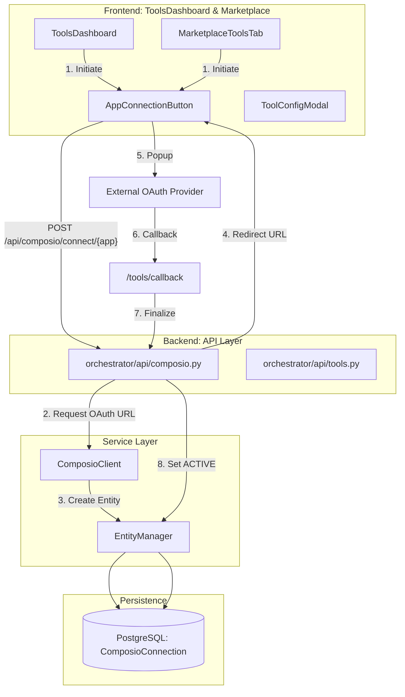
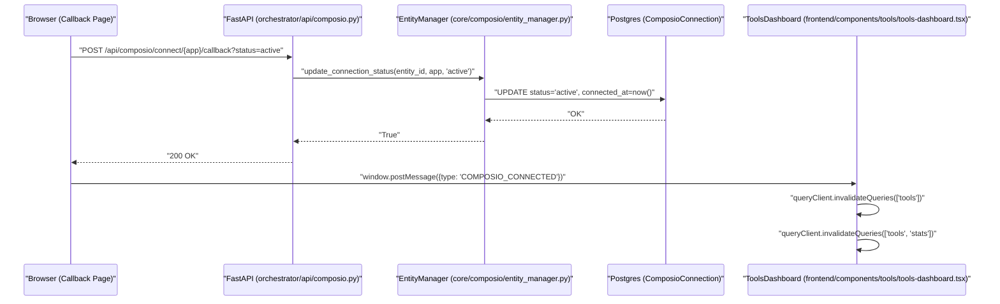

# Connecting Apps

<details>
<summary>Relevant source files</summary>

The following files were used as context for generating this wiki page:

- [docs/PRDS/58-PROMPT-MANAGEMENT-FUTUREAGI-INTEGRATION.md](docs/PRDS/58-PROMPT-MANAGEMENT-FUTUREAGI-INTEGRATION.md)
- [docs/PRDS/59-WORKFLOW-ENGINE-V2-NEURAL-SWARM-BRIDGE.md](docs/PRDS/59-WORKFLOW-ENGINE-V2-NEURAL-SWARM-BRIDGE.md)
- [docs/PRDS/60-RAG-V3-TOP10-COMPETITIVE-UPGRADE.md](docs/PRDS/60-RAG-V3-TOP10-COMPETITIVE-UPGRADE.md)
- [docs/PRDS/61-NL2SQL-V2-COMPETITIVE-UPGRADE.md](docs/PRDS/61-NL2SQL-V2-COMPETITIVE-UPGRADE.md)
- [docs/PRDS/62-CODEGRAPH-V2-COMPETITIVE-UPGRADE.md](docs/PRDS/62-CODEGRAPH-V2-COMPETITIVE-UPGRADE.md)
- [frontend/app/tools/callback/page.tsx](frontend/app/tools/callback/page.tsx)
- [frontend/components/agents/agent-management.tsx](frontend/components/agents/agent-management.tsx)
- [frontend/components/agents/skills/skill-editor-modal.tsx](frontend/components/agents/skills/skill-editor-modal.tsx)
- [frontend/components/agents/skills/workspace-skills-tab.tsx](frontend/components/agents/skills/workspace-skills-tab.tsx)
- [frontend/components/composio/app-connection-button.tsx](frontend/components/composio/app-connection-button.tsx)
- [frontend/components/documents/document-management.tsx](frontend/components/documents/document-management.tsx)
- [frontend/components/knowledge/memory-tab.tsx](frontend/components/knowledge/memory-tab.tsx)
- [frontend/components/tools/composio-apps-section.tsx](frontend/components/tools/composio-apps-section.tsx)
- [frontend/components/tools/tool-config-modal.tsx](frontend/components/tools/tool-config-modal.tsx)
- [frontend/components/tools/tools-dashboard.tsx](frontend/components/tools/tools-dashboard.tsx)
- [frontend/hooks/use-skills-api.ts](frontend/hooks/use-skills-api.ts)
- [orchestrator/api/workspace_skills.py](orchestrator/api/workspace_skills.py)
- [orchestrator/core/composio/entity_manager.py](orchestrator/core/composio/entity_manager.py)

</details>


## Purpose and Scope

The app connection system manages the integration of external applications (primarily via Composio) into Automatos AI workspaces. It handles the full lifecycle of a connection: from discovery in the marketplace to OAuth authorization, state persistence in the database, and instant activation for tools requiring no authentication (`NO_AUTH`).

The system uses a two-phase connection process: **Add to Workspace** (registration) and **Connect** (authorization). This allows users to stage tools before granting permissions. The primary entry points are the `ToolsDashboard` and the `MarketplaceToolsTab`.

---

## Connection Architecture

The connection flow bridges the frontend dashboard with the Composio SDK and the local PostgreSQL database to track entity-level permissions.

### Technical Data Flow



**Sources:**
- [frontend/components/tools/tools-dashboard.tsx:61-67]()
- [orchestrator/api/composio.py:120-170]()
- [orchestrator/core/composio/entity_manager.py:41-69]()
- [frontend/app/tools/callback/page.tsx:23-60]()

---

## The Connection Lifecycle

Connections are tracked via the `ComposioConnection` model, scoped to a `ComposioEntity` (which maps 1:1 to a Workspace).

### State Management

| Status | Code Symbol | Description |
| :--- | :--- | :--- |
| **Added** | `added` | The app is registered in the workspace but lacks credentials. |
| **Pending** | `pending` | OAuth flow has been initiated; waiting for callback. |
| **Active** | `active` | Credentials verified; tools are executable by agents. |
| **Failed** | `failed` | OAuth or API Key validation failed. |

### Implementation: Entity Manager
The `EntityManager` class in `orchestrator/core/composio/entity_manager.py` handles the transition logic in the database. It provides methods to retrieve connected apps and update their statuses based on Composio entity IDs.

[orchestrator/core/composio/entity_manager.py:101-124]()
```python
def get_connected_apps(self, workspace_id: UUID) -> List[str]:
    entity = self.get_entity_by_workspace(workspace_id)
    if not entity:
        return []
    conns = self.get_entity_connections(str(entity["id"]))
    result = []
    for c in conns:
        status = (c.get("status") or "").lower()
        app = (c.get("app_name") or "").upper()
        if not app:
            continue
        if status == "active":
            result.append(app)
        elif status == "pending" and c.get("connection_id"):
            # OAuth completed on Composio side but our callback missed —
            # treat as connected and lazily upgrade status to 'active'.
            self.update_connection_status(
                entity_id=str(entity["id"]),
                app_name=app,
                status="active",
                connection_id=c["connection_id"],
            )
            result.append(app)
    return result
```

**Sources:**
- [orchestrator/core/composio/entity_manager.py:19-40]()
- [orchestrator/core/composio/entity_manager.py:163-186]()

---

## Connection Methods

### 1. OAuth Popup Flow
Used for apps like Google, Slack, and GitHub. The frontend opens a centered popup to prevent losing the application state.

1. **Initiate**: `useInitiateConnection` hook calls `POST /api/composio/connect/{app_name}` via `orchestrator/api/composio.py`.
2. **Redirect**: Backend returns a Composio-generated OAuth URL via `InitiateConnectionResponse`.
3. **Callback**: The `ComposioCallbackPage` in `frontend/app/tools/callback/page.tsx` receives the `connection_id` and `status` [frontend/app/tools/callback/page.tsx:12-15]().
4. **Synchronization**: The callback page sends a `postMessage` of type `COMPOSIO_CONNECTED` to the parent window and notifies the backend to mark the app as `ACTIVE` [frontend/app/tools/callback/page.tsx:33-46]().

[frontend/app/tools/callback/page.tsx:43-50]()
```typescript
if (status === 'success' || status === 'active' || connected) {
    if (window.opener) {
        const trustedOrigin = window.location.origin
        window.opener.postMessage({ type: 'COMPOSIO_CONNECTED', status, connectionId }, trustedOrigin)
        window.close()
    } else {
        router.push('/tools')
    }
}
```

### 2. NO_AUTH Instant Activation
Some tools (e.g., Calculator, Weather) do not require credentials. These are activated instantly. The `AppConnectionButton` detects if a `redirect_url` is missing from the initiation result, signifying a `NO_AUTH` app that can be used immediately.

[frontend/components/composio/app-connection-button.tsx:42-47]()
```typescript
// NO_AUTH apps are activated immediately — no OAuth redirect needed
if (!result.redirect_url) {
    setIsConnecting(false)
    onConnected?.()
    return
}
```

### 3. API Key / Manual Configuration
For tools requiring static keys, the `ToolConfigModal` renders a configuration interface. The modal attempts to resolve the `credentialType` based on tool metadata (e.g., `credential_type` or `auto_enable_on_credential`) [frontend/components/tools/tool-config-modal.tsx:201-205]().

**Sources:**
- [frontend/components/tools/tool-config-modal.tsx:148-178]()
- [frontend/app/tools/callback/page.tsx:8-40]()
- [frontend/components/composio/app-connection-button.tsx:33-60]()

---

## UI Components

### ToolsDashboard
The primary entry point for managing connections. It uses the `useTools` hook to fetch both available and enabled tools from the database cache. It supports a full cache sync via `apiClient.syncToolsCache('full')` [frontend/components/tools/tools-dashboard.tsx:174-180]().

[frontend/components/tools/tools-dashboard.tsx:153-163]()
```typescript
const {
    data: toolsData,
    isLoading: toolsLoading,
    isFetching: toolsFetching,
    error: toolsError
  } = useTools({
    skip: (currentPage - 1) * pageSize,
    limit: pageSize,
    search: debouncedSearch || undefined,
    category: categoryParam
  })
```

### ToolConfigModal
A multi-tab modal used to configure credentials and view available actions. It checks connection status via `useConnectedApps` [frontend/components/tools/tool-config-modal.tsx:90-96](). If connected, it can list specific `appActions` using `useAppActions` [frontend/components/tools/tool-config-modal.tsx:97]().

### WorkspaceSkillsTab
While not for external apps, this tab manages internal "Skills" which follow a similar enablement pattern. It uses `listWorkspaceSkills` to show enabled marketplace skills and workspace-owned (forked) skills [frontend/components/agents/skills/workspace-skills-tab.tsx:91-97]().

**Sources:**
- [frontend/components/tools/tools-dashboard.tsx:116-152]()
- [frontend/components/tools/tool-config-modal.tsx:83-98]()
- [frontend/components/agents/skills/workspace-skills-tab.tsx:65-90]()

---

## Technical Data Flow: Connection Finalization

This diagram tracks how a successful OAuth callback is propagated back to the system's state, updating both the backend database and the frontend UI cache.



**Sources:**
- [frontend/app/tools/callback/page.tsx:23-47]()
- [orchestrator/core/composio/entity_manager.py:163-186]()
- [frontend/components/tools/tools-dashboard.tsx:174-184]()

---