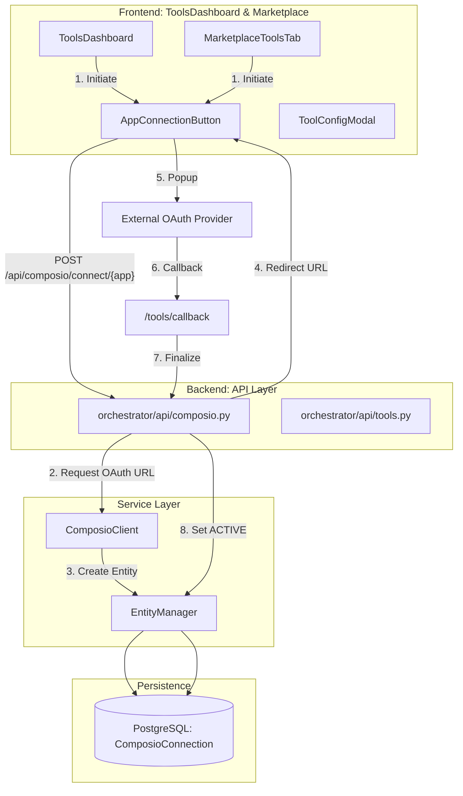
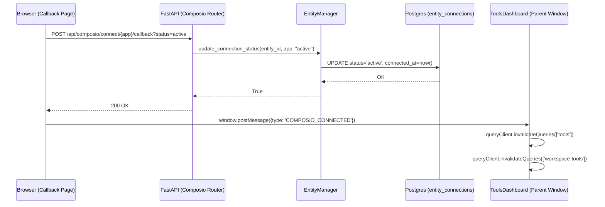

# Connecting Apps

<details>
<summary>Relevant source files</summary>

The following files were used as context for generating this wiki page:

- [docs/PRDS/58-PROMPT-MANAGEMENT-FUTUREAGI-INTEGRATION.md](docs/PRDS/58-PROMPT-MANAGEMENT-FUTUREAGI-INTEGRATION.md)
- [docs/PRDS/59-WORKFLOW-ENGINE-V2-NEURAL-SWARM-BRIDGE.md](docs/PRDS/59-WORKFLOW-ENGINE-V2-NEURAL-SWARM-BRIDGE.md)
- [docs/PRDS/60-RAG-V3-TOP10-COMPETITIVE-UPGRADE.md](docs/PRDS/60-RAG-V3-TOP10-COMPETITIVE-UPGRADE.md)
- [docs/PRDS/61-NL2SQL-V2-COMPETITIVE-UPGRADE.md](docs/PRDS/61-NL2SQL-V2-COMPETITIVE-UPGRADE.md)
- [docs/PRDS/62-CODEGRAPH-V2-COMPETITIVE-UPGRADE.md](docs/PRDS/62-CODEGRAPH-V2-COMPETITIVE-UPGRADE.md)
- [frontend/app/tools/callback/page.tsx](frontend/app/tools/callback/page.tsx)
- [frontend/components/composio/app-connection-button.tsx](frontend/components/composio/app-connection-button.tsx)
- [frontend/components/marketplace/marketplace-agents-tab.tsx](frontend/components/marketplace/marketplace-agents-tab.tsx)
- [frontend/components/marketplace/marketplace-homepage.tsx](frontend/components/marketplace/marketplace-homepage.tsx)
- [frontend/components/marketplace/marketplace-tools-tab.tsx](frontend/components/marketplace/marketplace-tools-tab.tsx)
- [frontend/components/shared/stats-bar.tsx](frontend/components/shared/stats-bar.tsx)
- [frontend/components/tools/composio-apps-section.tsx](frontend/components/tools/composio-apps-section.tsx)
- [frontend/components/tools/tool-config-modal.tsx](frontend/components/tools/tool-config-modal.tsx)
- [frontend/components/tools/tools-dashboard.tsx](frontend/components/tools/tools-dashboard.tsx)
- [frontend/components/workflows/active-workflows-panel.tsx](frontend/components/workflows/active-workflows-panel.tsx)
- [frontend/components/workflows/execution-kitchen.tsx](frontend/components/workflows/execution-kitchen.tsx)
- [frontend/components/workflows/workflow-management.tsx](frontend/components/workflows/workflow-management.tsx)
- [frontend/lib/tooltips.json](frontend/lib/tooltips.json)
- [orchestrator/api/composio.py](orchestrator/api/composio.py)
- [orchestrator/api/recipe_executor.py](orchestrator/api/recipe_executor.py)
- [orchestrator/api/routing.py](orchestrator/api/routing.py)
- [orchestrator/api/workflow_recipes.py](orchestrator/api/workflow_recipes.py)
- [orchestrator/core/composio/entity_manager.py](orchestrator/core/composio/entity_manager.py)
- [orchestrator/modules/learning/tests/conftest.py](orchestrator/modules/learning/tests/conftest.py)
- [orchestrator/modules/learning/tests/test_learning_system.py](orchestrator/modules/learning/tests/test_learning_system.py)
- [orchestrator/scripts/setup_jira_trigger.py](orchestrator/scripts/setup_jira_trigger.py)

</details>


## Purpose and Scope

The app connection system manages the integration of external applications (primarily via Composio) into Automatos AI workspaces. It handles the full lifecycle of a connection: from discovery in the marketplace to OAuth authorization, state persistence in the database, and instant activation for tools requiring no authentication (`NO_AUTH`).

The system uses a two-phase connection process: **Add to Workspace** (registration) and **Connect** (authorization). This allows users to stage tools before granting permissions. The primary entry points are the `ToolsDashboard` and the `MarketplaceToolsTab`.

---

## Connection Architecture

The connection flow bridges the frontend dashboard with the Composio SDK and the local PostgreSQL database to track entity-level permissions.

### Technical Data Flow



**Sources:**
- [frontend/components/tools/tools-dashboard.tsx:116-163]()
- [frontend/components/marketplace/marketplace-tools-tab.tsx:163-188]()
- [orchestrator/api/composio.py:120-170]()
- [orchestrator/core/composio/entity_manager.py:41-69]()
- [frontend/app/tools/callback/page.tsx:23-60]()

---

## The Connection Lifecycle

Connections are tracked via the `ComposioConnection` model, scoped to a `ComposioEntity` (which maps 1:1 to a Workspace).

### State Management

| Status | Code Symbol | Description |
| :--- | :--- | :--- |
| **Added** | `added` | The app is registered in the workspace but lacks credentials. |
| **Pending** | `pending` | OAuth flow has been initiated; waiting for callback. |
| **Active** | `active` | Credentials verified; tools are executable by agents. |
| **Failed** | `failed` | OAuth or API Key validation failed. |

### Implementation: Entity Manager
The `EntityManager` class in `orchestrator/core/composio/entity_manager.py` handles the transition logic in the database. It provides methods to retrieve connected apps and update their statuses based on Composio entity IDs.

[orchestrator/core/composio/entity_manager.py:101-124]()
```python
def get_connected_apps(self, workspace_id: UUID) -> List[str]:
    entity = self.get_entity_by_workspace(workspace_id)
    if not entity: return []
    conns = self.get_entity_connections(str(entity["id"]))
    result = []
    for c in conns:
        status = (c.get("status") or "").lower()
        if status == "active":
            result.append(c["app_name"])
        elif status == "pending" and c.get("connection_id"):
            # Lazy upgrade to active if connection_id exists
            self.update_connection_status(entity["id"], c["app_name"], status="active")
            result.append(c["app_name"])
    return result
```

**Sources:**
- [orchestrator/core/composio/entity_manager.py:19-40]()
- [orchestrator/core/composio/entity_manager.py:163-186]()

---

## Connection Methods

### 1. OAuth Popup Flow
Used for apps like Google, Slack, and GitHub. The frontend opens a centered popup to prevent losing the application state.

1. **Initiate**: `useInitiateConnection` hook calls `POST /api/composio/connect/{app_name}` [frontend/hooks/use-composio-api.ts]().
2. **Redirect**: Backend returns a Composio-generated OAuth URL via `InitiateConnectionResponse` [orchestrator/api/composio.py:84-88]().
3. **Callback**: The `ComposioCallbackPage` in `frontend/app/tools/callback/page.tsx` receives the `connection_id` and `status`.
4. **Synchronization**: The callback page sends a `postMessage` of type `COMPOSIO_CONNECTED` to the parent window and notifies the backend to mark the app as `ACTIVE`.

[frontend/app/tools/callback/page.tsx:43-50]()
```typescript
if (status === 'success' || status === 'active' || connected) {
    if (window.opener) {
        const trustedOrigin = window.location.origin
        window.opener.postMessage({ type: 'COMPOSIO_CONNECTED', status, connectionId }, trustedOrigin)
        window.close()
    }
}
```

### 2. NO_AUTH Instant Activation
Some tools (e.g., Calculator, Weather) do not require credentials. These are activated instantly by the `EntityManager` by creating a record with `status="active"` immediately upon request. This is often handled during the "Add to Workspace" phase for these specific app types.

### 3. API Key / Manual Configuration
For tools requiring static keys, the `ToolConfigModal` renders a configuration interface. Users provide the necessary credentials which are then securely transmitted to the Composio backend via the orchestrator.

**Sources:**
- [frontend/components/tools/tool-config-modal.tsx:176-210]()
- [frontend/app/tools/callback/page.tsx:8-40]()
- [orchestrator/api/composio.py:208-230]()

---

## UI Components

### ToolsDashboard
The primary entry point for managing connections within a workspace. It uses the `useTools` hook to fetch both available and enabled tools from the database cache.

[frontend/components/tools/tools-dashboard.tsx:153-169]()
```typescript
const {
    data: toolsData,
    isLoading: toolsLoading,
    isFetching: toolsFetching,
    error: toolsError
  } = useTools({
    skip: (currentPage - 1) * pageSize,
    limit: pageSize,
    search: debouncedSearch || undefined,
    category: categoryParam
  })
```

### MarketplaceToolsTab
A specialized view within the `MarketplaceHomepage` [frontend/components/marketplace/marketplace-homepage.tsx:162-164]() that allows users to discover and connect new applications from the global Composio catalog. It uses `apiClient.get('/api/tools/marketplace')` to fetch a fast, DB-cached list of available apps [frontend/components/marketplace/marketplace-tools-tab.tsx:112-115]().

### ToolConfigModal
A multi-tab modal used to configure specific tool settings and view available actions once connected. It checks the connection status for the specific tool before allowing configuration.

[frontend/components/tools/tool-config-modal.tsx:83-93]()
```typescript
const isComposioApp = !!(tool?.composio_app_name || tool?.metadata?.composio_app_name || tool?.source === 'composio')
const { data: connections = [] } = useConnectedApps({ enabled: open && isComposioApp })
const isConnected = connections.some(
  (c) => c.app_name.toUpperCase() === composioAppName.toUpperCase() && c.status === 'active'
)
```

**Sources:**
- [frontend/components/tools/tools-dashboard.tsx:116-152]()
- [frontend/components/marketplace/marketplace-tools-tab.tsx:66-135]()
- [frontend/components/tools/tool-config-modal.tsx:24-62]()

---

## Technical Data Flow: Connection Finalization

This diagram tracks how a successful OAuth callback is propagated back to the system's state, updating both the backend database and the frontend UI cache.



**Sources:**
- [frontend/app/tools/callback/page.tsx:23-47]()
- [orchestrator/core/composio/entity_manager.py:163-186]()
- [frontend/components/tools/tools-dashboard.tsx:174-194]()
- [frontend/components/marketplace/marketplace-tools-tab.tsx:151-160]()

---