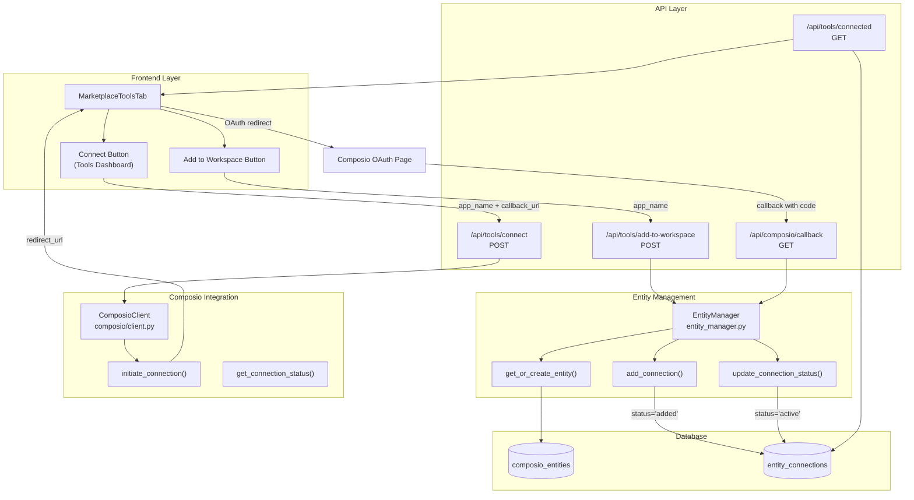
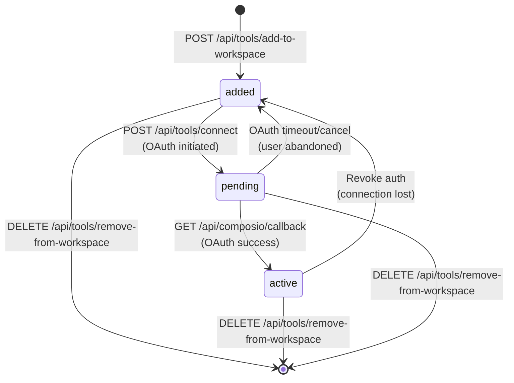
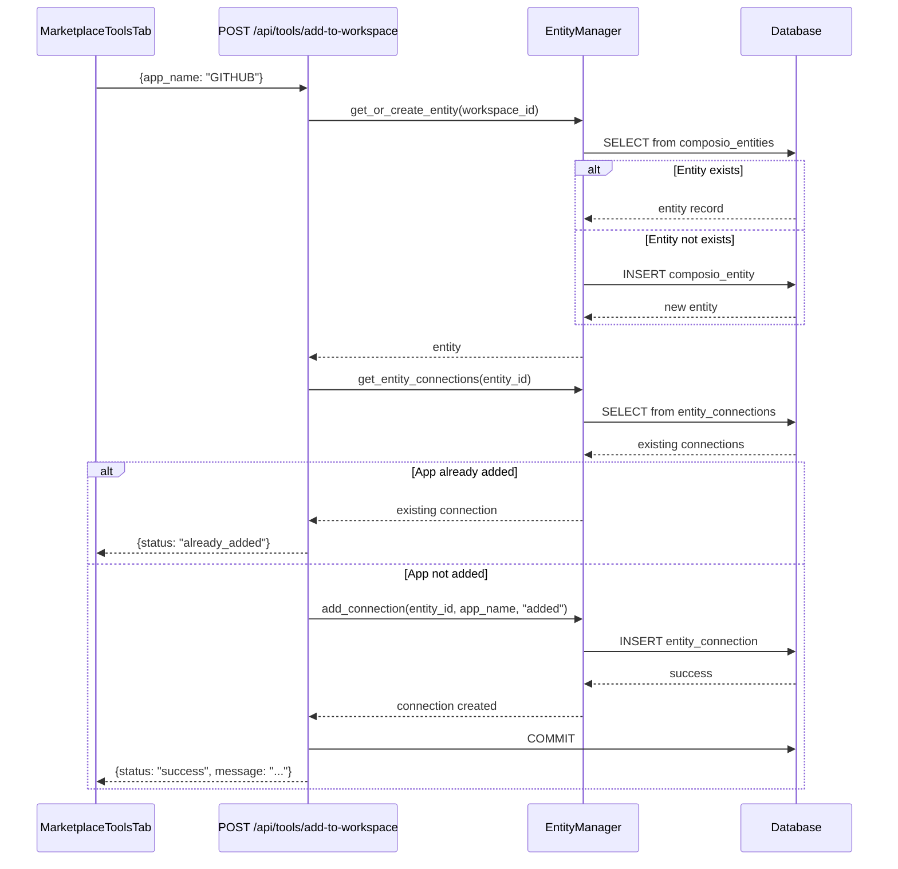
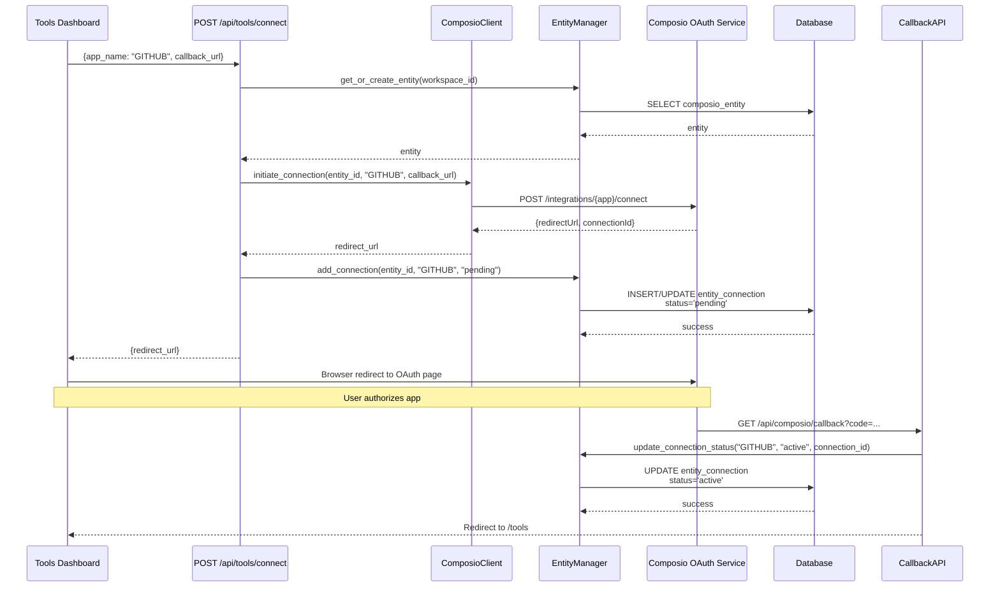
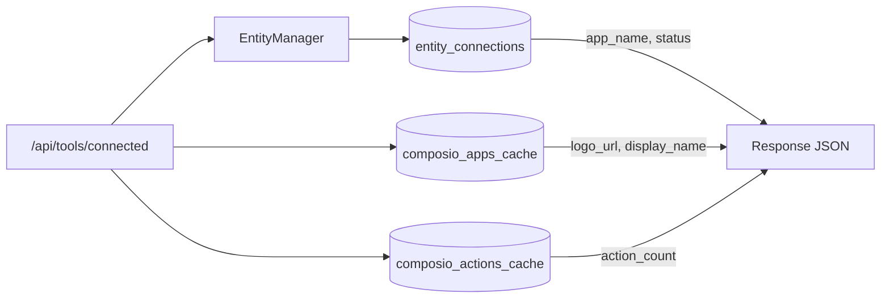
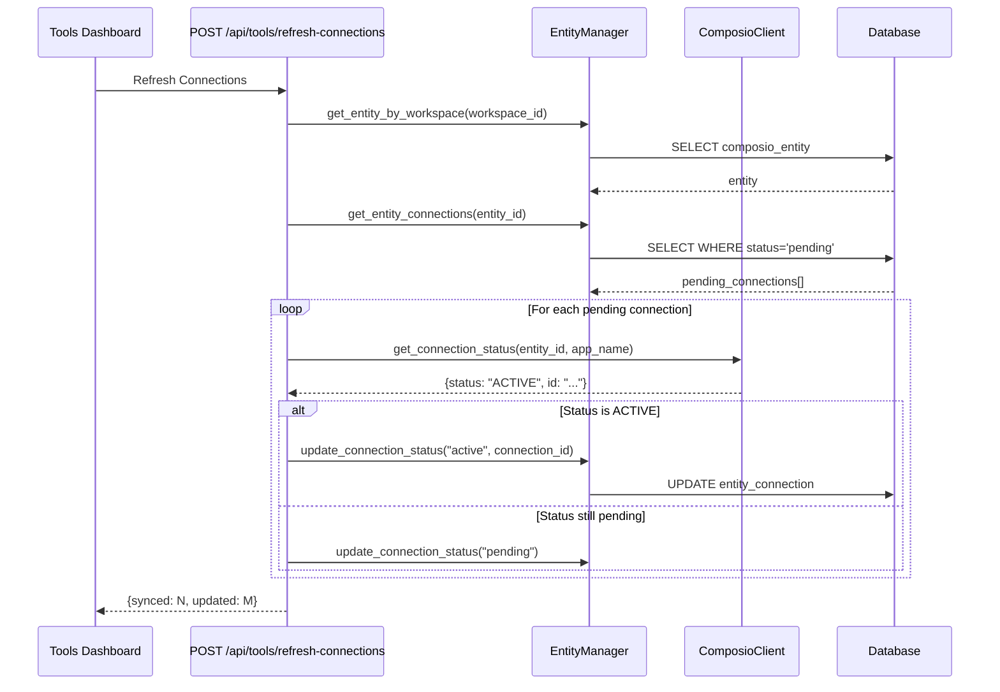
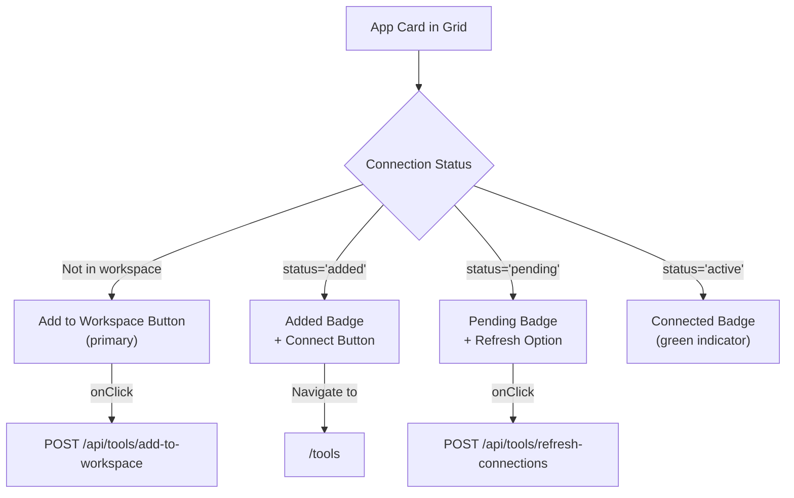

# Connecting Apps

<details>
<summary>Relevant source files</summary>

The following files were used as context for generating this wiki page:

- [docs/DoctorsNotes.docx](docs/DoctorsNotes.docx)
- [orchestrator/api/tools.py](orchestrator/api/tools.py)
- [orchestrator/consumers/chatbot/tool_router.py](orchestrator/consumers/chatbot/tool_router.py)
- [orchestrator/core/composio/client.py](orchestrator/core/composio/client.py)
- [orchestrator/modules/tools/execution/unified_executor.py](orchestrator/modules/tools/execution/unified_executor.py)
- [orchestrator/modules/tools/registry/tool_registry.py](orchestrator/modules/tools/registry/tool_registry.py)
- [orchestrator/modules/tools/services/composio_hint_service.py](orchestrator/modules/tools/services/composio_hint_service.py)
- [orchestrator/modules/tools/services/composio_tool_service.py](orchestrator/modules/tools/services/composio_tool_service.py)
- [orchestrator/modules/tools/tool_router.py](orchestrator/modules/tools/tool_router.py)
- [orchestrator/services/metadata_sync_service.py](orchestrator/services/metadata_sync_service.py)

</details>


## Purpose and Scope

This page documents the OAuth connection flow and webhook integration system for connecting external applications (Composio apps) to user workspaces. It covers the two-phase connection process (Add to Workspace → Connect/OAuth), connection state management, and the technical implementation of OAuth callback handling.

For information about browsing and discovering available apps, see [Composio Integration](#6.1). For details on tool execution and action routing, see [Tool Router & Execution](#6.2).

---

## OAuth Connection Architecture

The app connection system implements a two-phase approach: **Add to Workspace** (workspace registration) and **Connect** (OAuth authorization). This separation allows users to stage apps before initiating OAuth flows, preventing abandoned OAuth attempts from cluttering the workspace.

### Connection Flow Overview



**Sources:**
- [frontend/components/marketplace/marketplace-tools-tab.tsx:250-303]()
- [orchestrator/api/tools.py:451-528]()
- [orchestrator/api/tools.py:370-394]()

---

## Connection Status Lifecycle

Each app connection progresses through distinct states tracked in the `entity_connections` table. The status field determines UI visibility and connection readiness.

### State Transition Diagram



**Status Definitions:**

| Status | Meaning | UI Representation | Actions Available |
|--------|---------|-------------------|-------------------|
| `added` | App registered in workspace but not connected | "Added" badge | Connect (initiate OAuth) |
| `pending` | OAuth flow initiated but not completed | "Pending" badge | Refresh status, Cancel |
| `active` | OAuth completed, connection ready | "Connected" badge, green indicator | Disconnect, Configure actions |

**Sources:**
- [orchestrator/api/tools.py:451-528]()
- [orchestrator/core/composio/entity_manager.py]() (not shown but referenced)

---

## Add to Workspace Flow

The **Add to Workspace** operation registers an app in the user's workspace without requiring OAuth. This creates a workspace-scoped connection record with `status='added'`, making the app visible in the Applications tab.

### Implementation



**Key Code Locations:**

The `add_connection()` method creates a new database record:

[orchestrator/api/tools.py:514]()
```python
entity_manager.add_connection(entity_id=entity["id"], app_name=app_name, status="added")
```

The endpoint handles duplicate detection:

[orchestrator/api/tools.py:475-509]()

**Sources:**
- [orchestrator/api/tools.py:451-528]()
- [frontend/components/marketplace/marketplace-tools-tab.tsx:250-303]()

---

## OAuth Connection Initiation

After adding an app to the workspace, users click **Connect** to initiate OAuth. This flow redirects to Composio's OAuth provider and updates the connection status to `pending`.

### OAuth Initiation Flow



**Connection Initiation Code:**

[orchestrator/api/tools.py:370-394]()

```python
@router.post("/connect")
async def connect_app(
    payload: ConnectIn,
    ctx: RequestContext = Depends(get_request_context_hybrid),
    db: Session = Depends(get_db),
):
    client = get_composio_client()
    entity_manager = EntityManager(db)
    entity = entity_manager.get_or_create_entity(ctx.workspace_id)

    app_name = payload.app_name.upper()
    try:
        redirect_url = client.initiate_connection(
            entity_id=entity["composio_entity_id"],
            app=app_name,
            callback_url=payload.callback_url,
        )
    except Exception as e:
        raise HTTPException(status_code=503, detail=f"Failed to initiate OAuth: {str(e)}")

    # Store pending connection in DB
    entity_manager.add_connection(entity_id=entity["id"], app_name=app_name, status="pending")
    return {"redirect_url": redirect_url, "app_name": app_name}
```

**Sources:**
- [orchestrator/api/tools.py:370-394]()
- [orchestrator/core/composio/client.py]() (referenced but not shown)

---

## OAuth Callback Handling

After OAuth authorization, Composio redirects to the callback URL with an authorization code. The backend exchanges this code for access tokens and updates the connection status to `active`.

### Callback Processing

The callback endpoint is typically defined in `orchestrator/api/composio.py` (not shown in provided files, but referenced in the flow). The process:

1. **Receive callback** with `code` and `state` parameters
2. **Verify state** matches workspace/entity context
3. **Exchange code** for tokens via Composio API
4. **Update status** in database from `pending` → `active`
5. **Store connection_id** from Composio response
6. **Redirect user** back to Tools page

**Connection Status Update:**

[orchestrator/api/tools.py:666-671]()

```python
if composio_status and composio_status.get("status") == "ACTIVE":
    entity_manager.update_connection_status(
        entity_id=entity["id"],
        app_name=conn.get("app_name") or "",
        status="active",
        connection_id=composio_status.get("id"),
    )
```

**Sources:**
- [orchestrator/api/tools.py:622-686]()

---

## Webhook Integration

Many Composio apps support webhook triggers for real-time event notifications. Webhooks are configured automatically during connection and stored in the `composio_apps_cache.app_metadata` field.

### Webhook Trigger Schema

Triggers are synced during metadata sync and exposed via the `/api/tools/{app_name}/triggers` endpoint:

[orchestrator/api/tools.py:312-330]()

```python
@router.get("/{app_name}/triggers")
async def app_triggers(
    app_name: str,
    ctx: RequestContext = Depends(get_request_context_hybrid),
    db: Session = Depends(get_db),
):
    """
    Get triggers for an app.
    
    Triggers are synced into `composio_apps_cache.metadata["triggers"]` during `/api/tools/sync`.
    """
    cached = db.query(ComposioAppCache).filter(ComposioAppCache.app_name == app_name.upper()).first()
    if not cached:
        return []
    meta = cached.app_metadata or {}
    triggers = meta.get("triggers") or []
    return triggers if isinstance(triggers, list) else []
```

### Trigger Metadata Structure

Triggers are stored in the `app_metadata` JSONB column:

```json
{
  "triggers": [
    {
      "name": "GITHUB_PUSH_EVENT",
      "display_name": "Push Event",
      "description": "Triggered when code is pushed",
      "enabled": true
    }
  ]
}
```

**Sources:**
- [orchestrator/api/tools.py:312-330]()
- [orchestrator/api/tools.py:138-146]()

---

## Managing Connected Apps

Once connected, apps appear in the `/api/tools/connected` endpoint with `status='active'`. Users can view connection details, configure enabled actions, and disconnect apps.

### Connected Apps Query



**Connected Apps Response Structure:**

[orchestrator/api/tools.py:201-259]()

```python
@router.get("/connected")
async def connected(
    ctx: RequestContext = Depends(get_request_context_hybrid),
    db: Session = Depends(get_db),
):
    entity_manager = EntityManager(db)
    entity = entity_manager.get_entity_by_workspace(ctx.workspace_id)
    if not entity:
        return {"apps": [], "total": 0}

    connections = entity_manager.get_entity_connections(entity["id"])
    
    # Include active, added, and pending apps
    active = [c for c in connections if (c.get("status") or "").lower() in ("active", "added", "pending")]
    
    # Enrich with cached metadata
    conn_app_names = [c.get("app_name") for c in active if c.get("app_name")]
    app_names_upper = [(a or "").upper() for a in conn_app_names]
    cache = {
        a.app_name: a
        for a in db.query(ComposioAppCache).filter(
            ComposioAppCache.app_name.in_(list(set(app_names_upper)))
        ).all()
    }
    
    out = []
    for c in active:
        app_name = (c.get("app_name") or "").upper()
        cached = cache.get(app_name)
        # ... build response with logo, description, action_count, triggers
```

### Disconnecting Apps

Apps can be removed via:

[orchestrator/api/tools.py:566-595]()

```python
@router.delete("/remove-from-workspace/{app_name}")
async def remove_from_workspace(
    app_name: str,
    ctx: RequestContext = Depends(get_request_context_hybrid),
    db: Session = Depends(get_db),
):
    """
    Remove an app from workspace (deletes the connection record).
    Works for both connected and unconnected apps.
    """
    _assert_workspace_admin(ctx)
    entity_manager = EntityManager(db)
    entity = entity_manager.get_entity_by_workspace(ctx.workspace_id)
    # ...
    success = entity_manager.remove_connection(str(entity["id"]), app_upper)
```

**Sources:**
- [orchestrator/api/tools.py:201-259]()
- [orchestrator/api/tools.py:566-595]()

---

## Connection Refresh and Sync

Pending connections can be manually refreshed to check if OAuth was completed. This avoids automatic API calls on every page load (performance optimization).

### Manual Refresh Flow



**Refresh Implementation:**

[orchestrator/api/tools.py:622-686]()

```python
@router.post("/refresh-connections")
async def refresh_connections(
    ctx: RequestContext = Depends(get_request_context_hybrid),
    db: Session = Depends(get_db),
):
    """
    Manually refresh pending connections from Composio.
    
    PERFORMANCE NOTE: This makes API calls to Composio and should NOT
    be called on every page load. Use only when explicitly needed.
    """
    entity_manager = EntityManager(db)
    entity = entity_manager.get_entity_by_workspace(ctx.workspace_id)
    
    connections = entity_manager.get_entity_connections(entity["id"])
    pending_to_sync = [
        conn for conn in connections
        if (conn.get("status") or "").lower() == "pending"
    ]
    
    client = get_composio_client()
    updated_count = 0
    
    for conn in pending_to_sync:
        try:
            composio_status = client.get_connection_status(
                entity_id=entity["composio_entity_id"],
                app=(conn.get("app_name") or "").upper(),
            )
            if composio_status and composio_status.get("status") == "ACTIVE":
                entity_manager.update_connection_status(
                    entity_id=entity["id"],
                    app_name=conn.get("app_name") or "",
                    status="active",
                    connection_id=composio_status.get("id"),
                )
                updated_count += 1
```

**Sources:**
- [orchestrator/api/tools.py:622-686]()

---

## Frontend Integration

The marketplace tools tab implements the Add to Workspace UI with real-time status indicators.

### Add to Workspace Button Logic



**Status Indicator Code:**

[frontend/components/marketplace/marketplace-tools-tab.tsx:430-448]()

```typescript
{paginatedApps.map((app, index) => {
    const isConnected = connectedApps.has(app.name.toUpperCase())
    const isInWorkspace = workspaceApps.has(app.name.toUpperCase())
    const isConnecting = connectingApp === app.name

    return (
        <ToolCard
            key={app.name}
            app={app}
            index={index}
            isConnected={isConnected}
            isInWorkspace={isInWorkspace}
            isConnecting={isConnecting}
            onConnect={() => handleAddToWorkspace(app)}
            onDisconnect={() => handleDisconnect(app.name)}
            onDetails={() => handleOpenDetails(app)}
        />
    )
})}
```

**Add to Workspace Handler:**

[frontend/components/marketplace/marketplace-tools-tab.tsx:250-303]()

```typescript
const handleAddToWorkspace = async (app: ComposioApp) => {
    setConnectingApp(app.name)

    try {
        const result = await apiClient.post('/api/tools/add-to-workspace', {
            app_name: app.name,
        })

        await refetchWorkspace()
        setConnectingApp(null)

        const statusMsg = (result as any)?.status
        if (statusMsg === 'already_added') {
            toast({
                title: 'Already in Workspace',
                description: `${app.display_name} is already in your workspace.`,
            })
        } else {
            toast({
                title: 'Added to Workspace',
                description: `${app.display_name} has been added. Go to Tools > Applications to connect it.`,
            })
        }
    } catch (error) {
        // ... error handling
    }
}
```

**Sources:**
- [frontend/components/marketplace/marketplace-tools-tab.tsx:250-303]()
- [frontend/components/marketplace/marketplace-tools-tab.tsx:430-448]()

---

## Summary

The app connection system implements a robust two-phase flow:

1. **Add to Workspace** - Registers app in workspace with `status='added'`
2. **Connect** - Initiates OAuth, transitions to `pending` → `active`

Key technical components:
- `EntityManager` manages workspace-scoped connection records
- `ComposioClient` handles OAuth initiation and token exchange
- Connection status lifecycle ensures clean state transitions
- Manual refresh prevents performance issues from automatic API polling

This architecture prevents abandoned OAuth attempts from creating orphaned records while providing clear user feedback at each stage of the connection process.

---