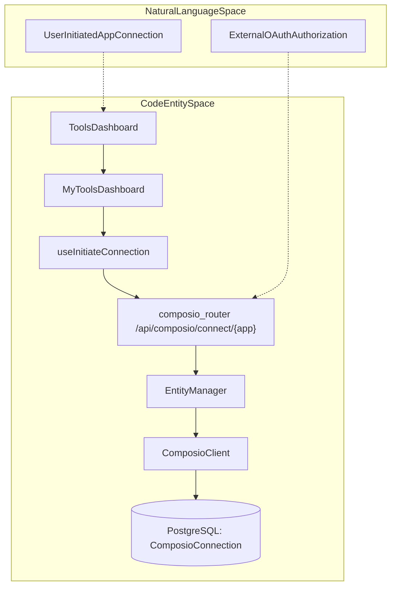
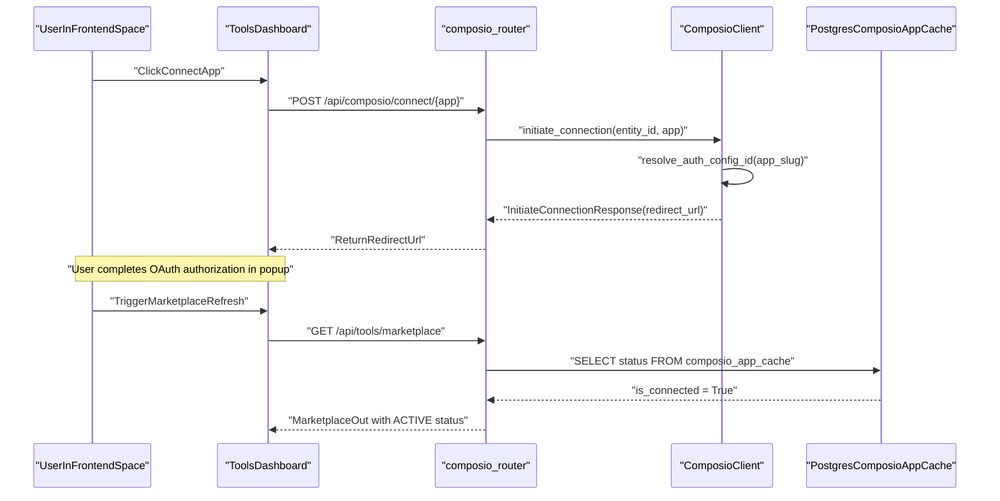

# Connecting Apps

Relevant source files

The following files were used as context for generating this wiki page:

- [frontend/app/tools/page.tsx](frontend/app/tools/page.tsx)
- [frontend/components/activity/activity-page.tsx](frontend/components/activity/activity-page.tsx)
- [frontend/components/agents/agent-management.tsx](frontend/components/agents/agent-management.tsx)
- [frontend/components/documents/document-management.tsx](frontend/components/documents/document-management.tsx)
- [frontend/components/layout/header.tsx](frontend/components/layout/header.tsx)
- [frontend/components/layout/mobile-sidebar.tsx](frontend/components/layout/mobile-sidebar.tsx)
- [frontend/components/layout/sidebar.tsx](frontend/components/layout/sidebar.tsx)
- [frontend/components/marketplace/marketplace-homepage.tsx](frontend/components/marketplace/marketplace-homepage.tsx)
- [frontend/components/settings/CredentialTypesTab.tsx](frontend/components/settings/CredentialTypesTab.tsx)
- [frontend/components/settings/CredentialsTab.tsx](frontend/components/settings/CredentialsTab.tsx)
- [frontend/components/shared/stats-bar.tsx](frontend/components/shared/stats-bar.tsx)
- [frontend/components/tools/my-tools-dashboard.tsx](frontend/components/tools/my-tools-dashboard.tsx)
- [frontend/components/tools/tools-dashboard.tsx](frontend/components/tools/tools-dashboard.tsx)
- [frontend/components/ui/help-tooltip.tsx](frontend/components/ui/help-tooltip.tsx)
- [frontend/components/workflows/active-workflows-panel.tsx](frontend/components/workflows/active-workflows-panel.tsx)
- [frontend/components/workflows/workflow-management.tsx](frontend/components/workflows/workflow-management.tsx)
- [frontend/lib/tooltips.json](frontend/lib/tooltips.json)
- [frontend/lib/use-tooltips.ts](frontend/lib/use-tooltips.ts)

## Purpose and Scope

The app connection system manages the integration of external applications—primarily via Composio—into Automatos AI workspaces. It handles the complete lifecycle of a connection: discovery in the marketplace, OAuth authorization popup flows, state persistence in PostgreSQL via `EntityManager`, and instant activation for tools requiring no authentication (`NO_AUTH`).

The primary user-facing interfaces for this subsystem are `ToolsDashboard` and `MyToolsDashboard`, which allow operators to stage, configure, and inspect connected workspace tools.

Sources:
- [frontend/components/tools/tools-dashboard.tsx:1-12]()
- [frontend/components/tools/my-tools-dashboard.tsx:1-15]()

---

## Connection Architecture

The connection architecture bridges the frontend management components (`ToolsDashboard`, `MyToolsDashboard`) with backend FastAPI routers (`orchestrator/api/composio.py`) and the Composio SDK wrapper (`ComposioClient`).

Sources:
- [frontend/components/tools/tools-dashboard.tsx:61-67]()
- [orchestrator/api/composio.py:214-230]()
- [orchestrator/core/composio/client.py:71-75]()

---

## The Connection Lifecycle & State Management

Connections are tracked via workspace-scoped records managed by the `EntityManager` and mapped to `ComposioEntity` identifiers.

### State Transitions

| Status | Code Symbol | Description |
| :--- | :--- | :--- |
| **Added** | `added` | The application is registered in the workspace registry but lacks active credentials. |
| **Pending** | `pending` | The OAuth authorization flow has been initiated; awaiting callback verification. |
| **Active** | `active` | Credentials verified; tools are fully executable by agents. |
| **Failed** | `failed` | OAuth exchange or API key validation failed during setup. |

The `list_available_apps` endpoint in `orchestrator/api/composio.py` queries the `EntityManager` to evaluate connection states for the active workspace context [orchestrator/api/composio.py:149-159]().

Sources:
- [orchestrator/api/composio.py:149-159]()
- [orchestrator/core/composio/client.py:146-164]()

---

## Connection Methods

### 1. OAuth Popup Flow
Used for external authenticated applications like GitHub, Slack, and Google Workspace.
1. **Initiation**: The `useInitiateConnection` hook invokes `POST /api/composio/connect/{app_name}` [orchestrator/api/composio.py:214-230]().
2. **Redirect Generation**: The backend executes `ComposioClient.initiate_connection()`, resolving the `auth_config_id` and constructing a secure redirect target [orchestrator/core/composio/client.py:166-182]().
3. **Popup Execution**: The frontend opens a centered browser popup, retaining parent application context while the user completes authentication with the external provider.

### 2. NO_AUTH Instant Activation
Applications that do not require secrets or tokens (e.g., utility calculators or public data lookups) bypass the OAuth flow entirely. The `list_available_apps` routine inspects `auth_schemes`; if empty or optional, the application transitions directly to `active` upon workspace assignment [orchestrator/api/composio.py:165-177]().

### 3. LinkedIn Image Workaround
To bridge limitations in standard Composio LinkedIn actions, Automatos AI includes a dedicated direct bypass module (`linkedin_image_workaround.py`) [orchestrator/core/composio/linkedin_image_workaround.py:4-14](). When image payloads are detected, `ComposioToolExecutor` routes execution through LinkedIn's Community Management API using internal keys secured in the platform `CredentialStore` [orchestrator/core/composio/linkedin_image_workaround.py:15-18]().

Sources:
- [orchestrator/api/composio.py:214-230]()
- [orchestrator/core/composio/client.py:166-182]()
- [orchestrator/core/composio/linkedin_image_workaround.py:4-24]()

---

## UI Components & Dashboards

### ToolsDashboard & MyToolsDashboard
- `ToolsDashboard`: Serves as the primary marketplace and catalogue interface for discovering, filtering, and adding new integrations. It utilizes the `useTools` hook and supports full cache synchronization via `apiClient.syncToolsCache('full')` [frontend/components/tools/tools-dashboard.tsx:173-186]().
- `MyToolsDashboard`: Focuses specifically on already installed and active workspace integrations, providing quick access to reconfiguration, action testing, and disconnection.

### ToolActionsModal
Allows operators to inspect and toggle specific action definitions for a connected application. It queries `list_app_actions` to display action schemas, parameter requirements, and execution statuses [orchestrator/api/composio.py:183-210]().

Sources:
- [frontend/components/tools/tools-dashboard.tsx:152-186]()
- [frontend/components/tools/my-tools-dashboard.tsx:1-40]()
- [orchestrator/api/composio.py:183-210]()

---

## Technical Data Flow: Connection Finalization

Sources:
- [orchestrator/api/composio.py:214-230]()
- [orchestrator/core/composio/client.py:166-182]()
- [orchestrator/api/tools.py:147-171]()

---