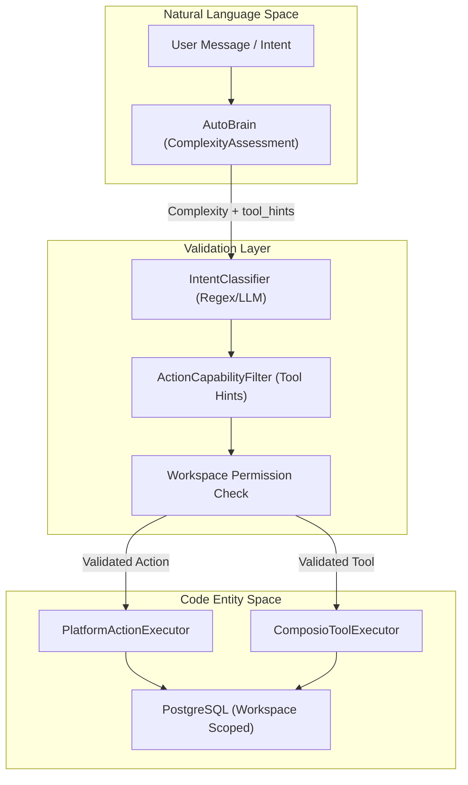
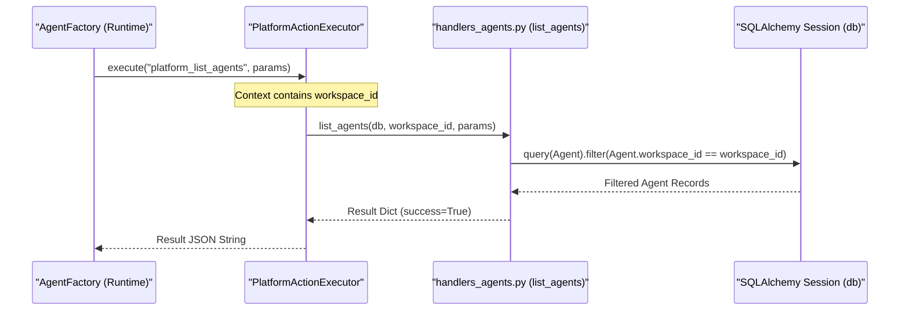

# Permission & Validation System

Relevant source files

The following files were used as context for generating this wiki page:

- [orchestrator/core/services/intent_classifier.py](orchestrator/core/services/intent_classifier.py)
- [orchestrator/modules/tools/discovery/actions_agents.py](orchestrator/modules/tools/discovery/actions_agents.py)
- [orchestrator/modules/tools/discovery/actions_assignments.py](orchestrator/modules/tools/discovery/actions_assignments.py)
- [orchestrator/modules/tools/discovery/actions_documents.py](orchestrator/modules/tools/discovery/actions_documents.py)
- [orchestrator/modules/tools/discovery/actions_marketplace.py](orchestrator/modules/tools/discovery/actions_marketplace.py)
- [orchestrator/modules/tools/discovery/actions_missions.py](orchestrator/modules/tools/discovery/actions_missions.py)
- [orchestrator/modules/tools/discovery/actions_monitoring.py](orchestrator/modules/tools/discovery/actions_monitoring.py)
- [orchestrator/modules/tools/discovery/actions_playbooks.py](orchestrator/modules/tools/discovery/actions_playbooks.py)
- [orchestrator/modules/tools/discovery/actions_reports.py](orchestrator/modules/tools/discovery/actions_reports.py)
- [orchestrator/modules/tools/discovery/actions_scheduling.py](orchestrator/modules/tools/discovery/actions_scheduling.py)
- [orchestrator/modules/tools/discovery/actions_search.py](orchestrator/modules/tools/discovery/actions_search.py)
- [orchestrator/modules/tools/discovery/actions_workspace.py](orchestrator/modules/tools/discovery/actions_workspace.py)
- [orchestrator/modules/tools/discovery/handlers_agents.py](orchestrator/modules/tools/discovery/handlers_agents.py)
- [orchestrator/modules/tools/discovery/handlers_reports.py](orchestrator/modules/tools/discovery/handlers_reports.py)

The Permission & Validation System in Automatos AI ensures that AI agents and workflows operate within safe boundaries, respecting multi-tenant isolation and functional capabilities. It bridges the gap between natural language intents and structured execution by validating actions against a defined taxonomy and workspace-scoped permissions.

## Core Components

The system relies on three primary layers to validate and filter actions before they reach the execution engine:

1.  **Complexity Assessment (AutoBrain)**: Determines the depth of the request and identifies necessary tool categories (tool hints). [orchestrator/consumers/chatbot/auto.py:5-21]()
2.  **Action Capability Filter**: Maps natural language intents to specific platform capabilities and validates if the agent has the authority to perform them. [orchestrator/modules/tools/execution/unified_executor.py:44-51]()
3.  **Workspace Isolation**: Ensures all database queries and tool executions are strictly scoped to the `workspace_id` provided in the request context. [orchestrator/modules/tools/discovery/handlers_agents.py:13-17]()

### System Data Flow

The following diagram illustrates the transition from a user's natural language request to a validated code execution within the system.

**Natural Language to Code Entity Mapping**

**Sources**: [orchestrator/consumers/chatbot/auto.py:59-82](), [orchestrator/modules/tools/execution/unified_executor.py:67-74](), [orchestrator/core/services/intent_classifier.py:135-145]()

---

## Action Capability Taxonomy

Platform actions are strictly categorized by domain and permission level using the `ActionDefinition` class. This taxonomy allows the system to filter available capabilities based on the agent's role and the user's intent.

### Permission Levels
Each registered action specifies a `permission_level` that dictates the risk profile of the operation:
*   **read**: Non-destructive data retrieval (e.g., `platform_list_agents`). [orchestrator/modules/tools/discovery/actions_agents.py:30]()
*   **write**: Modifying existing state or creating new entities (e.g., `platform_create_agent`). [orchestrator/modules/tools/discovery/actions_agents.py:141]()
*   **destructive**: Permanent removal of data (e.g., `platform_delete_memory`). [orchestrator/modules/tools/discovery/actions_workspace.py:137]()

### Action Categories
Actions are grouped into functional categories to facilitate discovery and hint-based filtering:

| Category | Key Actions | Purpose |
| :--- | :--- | :--- |
| `agents` | `platform_list_agents`, `platform_create_agent` | Lifecycle management of AI agents. [orchestrator/modules/tools/discovery/actions_agents.py:18-73]() |
| `memory` | `platform_store_memory`, `platform_search_memory` | Long-term workspace knowledge management. [orchestrator/modules/tools/discovery/actions_workspace.py:38-92]() |
| `playbooks` | `platform_list_playbooks`, `platform_create_playbook` | Workflow and automation control. [orchestrator/modules/tools/discovery/actions_playbooks.py:11-72]() |
| `missions` | `platform_create_mission`, `platform_get_mission` | Multi-agent autonomous orchestration. [orchestrator/modules/tools/discovery/actions_missions.py:9-85]() |
| `monitoring` | `platform_query_loki_logs`, `platform_get_alerts` | Infrastructure and health observability. [orchestrator/modules/tools/discovery/actions_monitoring.py:11-112]() |

**Sources**: [orchestrator/modules/tools/discovery/actions_workspace.py:1-193](), [orchestrator/modules/tools/discovery/actions_agents.py:1-150](), [orchestrator/modules/tools/discovery/actions_playbooks.py:1-155]()

---

## Intent Validation

Before an action is executed, the system uses the `IntentClassifier` to perform fast pattern matching against the user's query. This ensures the requested action aligns with the identified intent category and action type.

### Intent Classification Logic
The `IntentClassifier` uses pre-compiled regular expressions to categorize queries into domains like `EMAIL`, `CODE`, `DATABASE`, or `MEMORY`. [orchestrator/core/services/intent_classifier.py:40-95]()

*   **Category Detection**: Matches keywords like "remember" or "recall" to the `MEMORY` category. [orchestrator/core/services/intent_classifier.py:91-94]()
*   **Action Type Detection**: Distinguishes between `FETCH` (get/show), `CREATE` (add/new), and `DELETE` (remove/cancel). [orchestrator/core/services/intent_classifier.py:98-113]()

### Complexity Levels (PRD-68)
The `AutoBrain` assessment produces a `ComplexityAssessment` that restricts tool access based on the request's depth. [orchestrator/consumers/chatbot/auto.py:14-17]()

| Level | Capability Scope | Validation Rule |
| :--- | :--- | :--- |
| **ATOM** | Chitchat, Greetings | Minimal tool access, no complex reasoning. |
| **MOLECULE** | Single Tool Call | Requires specific `tool_hints` match. |
| **CELL** | Memory + Reasoning | Enables `UnifiedMemoryService` and fact retrieval. |
| **ORGANISM** | Multi-Agent Coordination | Triggers `MissionAction` or `PlaybookAction` execution. |

**Sources**: [orchestrator/core/services/intent_classifier.py:149-196](), [orchestrator/consumers/chatbot/auto.py:42-49]()

---

## Workspace & Multi-Tenant Isolation

The most critical validation step is ensuring that every operation is scoped to the correct `workspace_id`. This is enforced at the handler level for all platform actions.

### Isolation Enforcement Diagram

This diagram maps the internal code entities involved in maintaining workspace boundaries during execution.

**Workspace Isolation Sequence**

**Sources**: [orchestrator/modules/tools/discovery/handlers_agents.py:13-17](), [orchestrator/modules/tools/discovery/handlers_reports.py:13-15](), [orchestrator/modules/tools/discovery/actions_agents.py:11-17]()

### Handler Validation Examples
Handlers perform secondary validation on parameters to ensure data integrity within the workspace:
*   **Report Validation**: `submit_report` checks for required markdown sections and validates `report_type` against an allowed enum. [orchestrator/modules/tools/discovery/handlers_reports.py:25-43]()
*   **Agent Lookup**: `get_agent` allows lookup by `agent_id` or `agent_name` but always filters by `workspace_id`. [orchestrator/modules/tools/discovery/handlers_agents.py:73-81]()
*   **Assignment Safety**: `platform_assign_tool_to_agent` validates that the tool (Composio app) is assigned to the specific agent within the workspace context. [orchestrator/modules/tools/discovery/actions_assignments.py:9-35]()

**Sources**: [orchestrator/modules/tools/discovery/handlers_reports.py:109-121](), [orchestrator/modules/tools/discovery/handlers_agents.py:120-156](), [orchestrator/modules/tools/discovery/actions_assignments.py:1-122]()

---