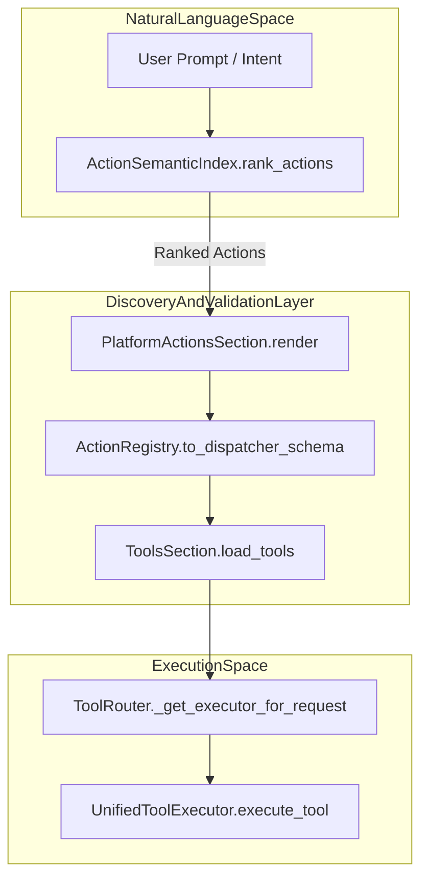
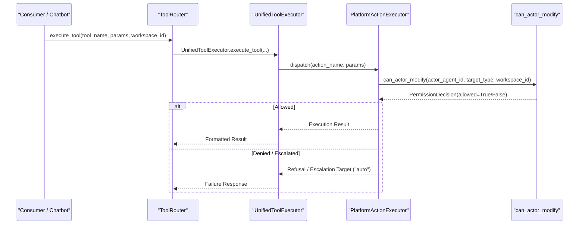

# Permission & Domain Validation System

Relevant source files

The following files were used as context for generating this wiki page:

- [orchestrator/alembic/versions/prd140_permission_bypass_log.py](orchestrator/alembic/versions/prd140_permission_bypass_log.py)
- [orchestrator/alembic/versions/prd140_team_lead_enabled.py](orchestrator/alembic/versions/prd140_team_lead_enabled.py)
- [orchestrator/consumers/chatbot/tool_router.py](orchestrator/consumers/chatbot/tool_router.py)
- [orchestrator/core/security/__init__.py](orchestrator/core/security/__init__.py)
- [orchestrator/core/security/bypass_audit.py](orchestrator/core/security/bypass_audit.py)
- [orchestrator/core/security/hierarchy_permissions.py](orchestrator/core/security/hierarchy_permissions.py)
- [orchestrator/core/security/url_validator.py](orchestrator/core/security/url_validator.py)
- [orchestrator/core/services/auto_cadence.py](orchestrator/core/services/auto_cadence.py)
- [orchestrator/modules/context/sections/platform_actions.py](orchestrator/modules/context/sections/platform_actions.py)
- [orchestrator/modules/context/sections/tools.py](orchestrator/modules/context/sections/tools.py)
- [orchestrator/modules/tools/discovery/action_registry.py](orchestrator/modules/tools/discovery/action_registry.py)
- [orchestrator/modules/tools/discovery/action_semantic_index.py](orchestrator/modules/tools/discovery/action_semantic_index.py)
- [orchestrator/modules/tools/execution/exec_platform.py](orchestrator/modules/tools/execution/exec_platform.py)
- [orchestrator/modules/tools/execution/unified_executor.py](orchestrator/modules/tools/execution/unified_executor.py)
- [orchestrator/modules/tools/registry/tool_registry.py](orchestrator/modules/tools/registry/tool_registry.py)
- [orchestrator/modules/tools/services/composio_hint_service.py](orchestrator/modules/tools/services/composio_hint_service.py)
- [orchestrator/modules/tools/services/composio_tool_service.py](orchestrator/modules/tools/services/composio_tool_service.py)
- [orchestrator/modules/tools/tool_router.py](orchestrator/modules/tools/tool_router.py)
- [orchestrator/scripts/check_hierarchy_gate.py](orchestrator/scripts/check_hierarchy_gate.py)
- [orchestrator/tests/security/test_hierarchy_permissions.py](orchestrator/tests/security/test_hierarchy_permissions.py)
- [orchestrator/tests/test_action_registry_filtered.py](orchestrator/tests/test_action_registry_filtered.py)
- [orchestrator/tests/test_action_semantic_index.py](orchestrator/tests/test_action_semantic_index.py)
- [orchestrator/tests/test_platform_actions_section.py](orchestrator/tests/test_platform_actions_section.py)
- [orchestrator/tests/test_tool_router_semantic.py](orchestrator/tests/test_tool_router_semantic.py)

The Permission & Validation System in Automatos AI enforces security boundaries, multi-tenant workspace isolation, and hierarchical authorization across all AI agents, recipes, and platform action dispatchers. It bridges natural language prompts and structured code execution by dynamically filtering capabilities, validating agent authority, and enforcing strict deny-by-default rules.

---

## 1. Action Registry & Semantic Discovery

Platform actions and tools are managed centrally to prevent context window bloat and restrict unauthorized access.

### Action Definition & Registry Architecture
Platform operations are defined as `ActionDefinition` dataclasses within `orchestrator/modules/tools/discovery/action_registry.py:28-46`(). Each action specifies its permission level (`read`, `write`, `destructive`), confirmation requirements, and scoping flags:
*   `admin_only`: Excluded from standard agent dispatcher schemas unless administrative privileges are verified [orchestrator/modules/tools/discovery/action_registry.py:38-38]().
*   `super_admin_only`: Enforces a fail-closed posture, omitting actions from standard discovery unless `include_super_admin=True` is explicitly passed [orchestrator/modules/tools/discovery/action_registry.py:39-42]().

The `ActionRegistry` singleton manages registration, categorization, and schema generation [orchestrator/modules/tools/discovery/action_registry.py:59-65]().

### Semantic Tool Routing & Indexing
To present relevant tool definitions to the LLM, `ActionSemanticIndex` embeds action descriptions, names, parameters, and seeded utterances [orchestrator/modules/tools/discovery/action_semantic_index.py:113-136]().
*   **Ranking Scope**: `rank_actions_scope()` provides a request-scoped context variable (`_rank_scope`) to memoize cosine similarity calculations within a single turn execution [orchestrator/modules/tools/discovery/action_semantic_index.py:36-55]().
*   **Relevance Floors & Boosts**: The system evaluates candidate actions against configured floors (`SEMANTIC_TOOL_ROUTING_FLOOR`) and applies additive priors for promoted actions (`TOOL_ROUTING_PROMOTION_BOOST`) [orchestrator/modules/tools/discovery/action_semantic_index.py:57-83]().
*   **Platform Actions Section**: `PlatformActionsSection` renders the narrowed markdown catalog into agent system prompts based on semantic relevance [orchestrator/modules/context/sections/platform_actions.py:30-47]().

**Natural Language to Code Entity Mapping**

**Sources**: [orchestrator/modules/tools/discovery/action_registry.py:28-46](), [orchestrator/modules/tools/discovery/action_semantic_index.py:36-55](), [orchestrator/modules/context/sections/platform_actions.py:30-47](), [orchestrator/modules/tools/tool_router.py:54-61]()

---

## 2. Hierarchy Permission System (PRD-140)

The hierarchy permission model regulates whether an actor (agent) possesses the authority to modify target entities (agents, tasks, playbooks, skills, tool assignments) within the organization.

### Chokepoint & Deny-by-Default Posture
The function `can_actor_modify()` in `core/security/hierarchy_permissions.py` acts as the single authorization chokepoint [orchestrator/core/security/hierarchy_permissions.py:112-127](). Every evaluation returns a `PermissionDecision` dataclass [orchestrator/core/security/hierarchy_permissions.py:85-108]().

1.  **Actor Validation Gate**: 
    *   `actor_agent_id is None` results in an immediate security denial (`anonymous_actor`) with no escalation path [orchestrator/core/security/hierarchy_permissions.py:131-134]().
    *   Unknown actor IDs or cross-workspace actor mismatches are denied immediately [orchestrator/core/security/hierarchy_permissions.py:136-144]().
    *   Inactive actors (`status != 'active'`) are blocked [orchestrator/core/security/hierarchy_permissions.py:146-149]().
2.  **Narrowed System Bypass**: System agent bypass requires **both** `is_system_agent=True` and an actor name present in `SYSTEM_BYPASS_ALLOWLIST` (e.g., `"Auto"`, `"Auto CTO"`, `"HARNESS"`) [orchestrator/core/security/hierarchy_permissions.py:68-74](), [orchestrator/core/security/hierarchy_permissions.py:151-157]().
3.  **Subtree Authority**: Non-system actors are restricted to modifying entities owned by agents within their reporting subtree, up to `MAX_SUBTREE_DEPTH` (16 levels) [orchestrator/core/security/hierarchy_permissions.py:76-80](), [orchestrator/core/security/hierarchy_permissions.py:159-160](). Out-of-subtree attempts return `escalation_target="auto"` to permit arbitration by the orchestrator [orchestrator/core/security/hierarchy_permissions.py:28-32]().

**Sources**: [orchestrator/core/security/hierarchy_permissions.py:68-160]()

---

## 3. Tool Execution & Validation Layer

Tool dispatching is unified across chatbot, workflow, and API entry points via `UnifiedToolExecutor` and `ToolRouter`.

### Execution Routing & Security Checks
*   **UnifiedToolExecutor**: Routes requests to domain-specific executors (`exec_platform`, `exec_research`, `exec_file_ops`, `exec_shell`, `exec_composio`, etc.) [orchestrator/modules/tools/execution/unified_executor.py:58-96]().
*   **Tool Router**: `ToolRouter` provides shared tool execution helpers, enforcing capability filtering and result parsing [orchestrator/modules/tools/tool_router.py:5-15](). It inspects result markers via `select_failure_message()` to ensure structured error handling and prevents silent drops of deliberate system stops (`requires_confirmation`, `over_quota`) [orchestrator/modules/tools/tool_router.py:80-110]().
*   **Integrations Degrade Seem**: If external integration credentials (e.g., Composio) are unconfigured, `_offerable_candidates()` and `_integrations_unavailable_result()` exclude or refuse Composio tool execution cleanly without failing open [orchestrator/modules/tools/tool_router.py:120-174]().

**Tool Execution Sequence & Validation Flow**

**Sources**: [orchestrator/modules/tools/execution/unified_executor.py:58-96](), [orchestrator/modules/tools/tool_router.py:54-174]()

---

## 4. Multi-Tenant Isolation & Administrative Controls

Data segregation and security boundaries are enforced at the database and execution layers.

### Workspace Scoping
Every tool call, memory retrieval, and platform action execution requires an explicit `workspace_id`. Cross-tenant operations are intercepted at the database query level and by the hierarchy permission gate (`_ws(actor.workspace_id) != ws`) [orchestrator/core/security/hierarchy_permissions.py:141-144]().

### Administrative & Role Restrictions
*   **Tool Loading Strategies**: `ToolsSection.load_tools()` supports strategies (`FULL`, `FILTERED`, `DISPATCHER_ONLY`, `NONE`) to scope available tools based on execution mode and authorization context [orchestrator/modules/context/sections/tools.py:32-38]().
*   **Composio Hint Service**: `ComposioHintService` applies a 3-tier strategy (Capability-based taxonomy matching, token-filtered capability gates, and top-N fallback) ensuring agents only receive hints for connected apps they are explicitly authorized to access [orchestrator/modules/tools/services/composio_hint_service.py:12-21]().

**Sources**: [orchestrator/modules/context/sections/tools.py:32-117](), [orchestrator/modules/tools/services/composio_hint_service.py:12-21](), [orchestrator/core/security/hierarchy_permissions.py:141-144]()

---