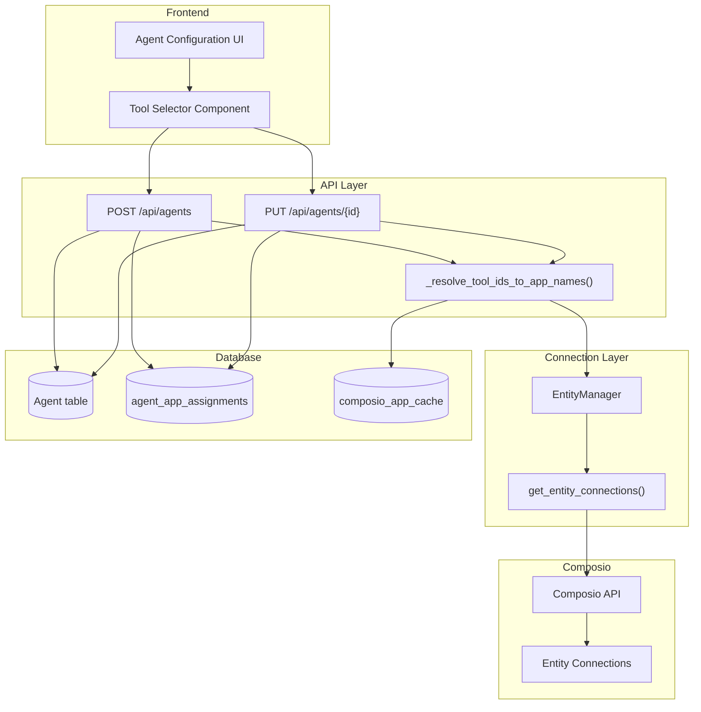
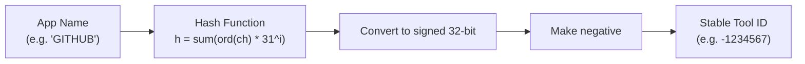
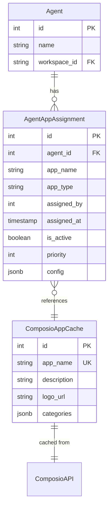
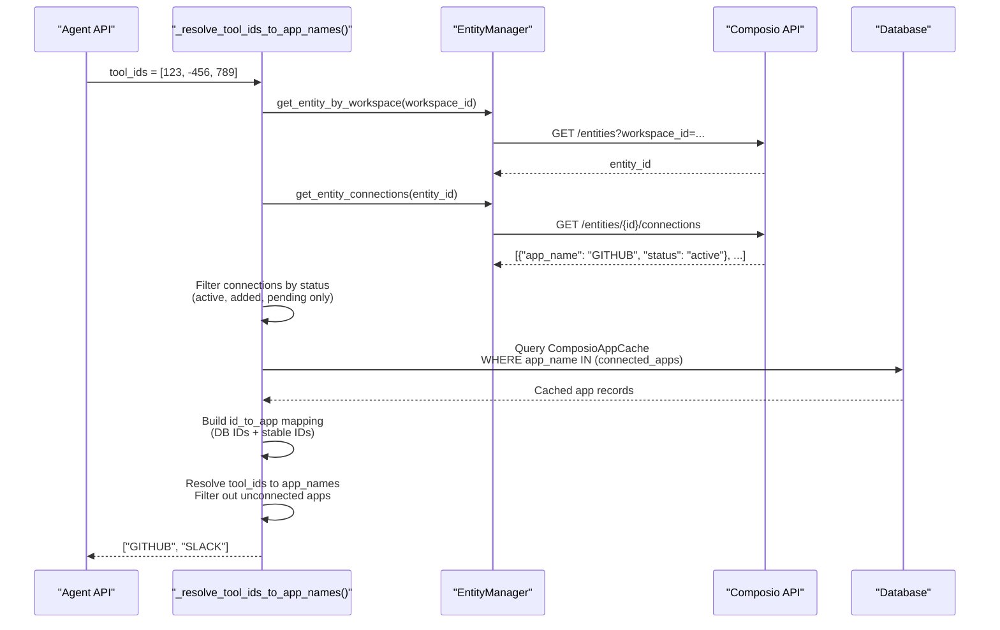
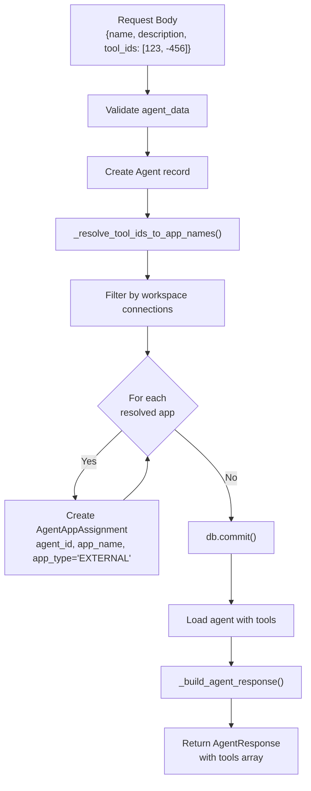
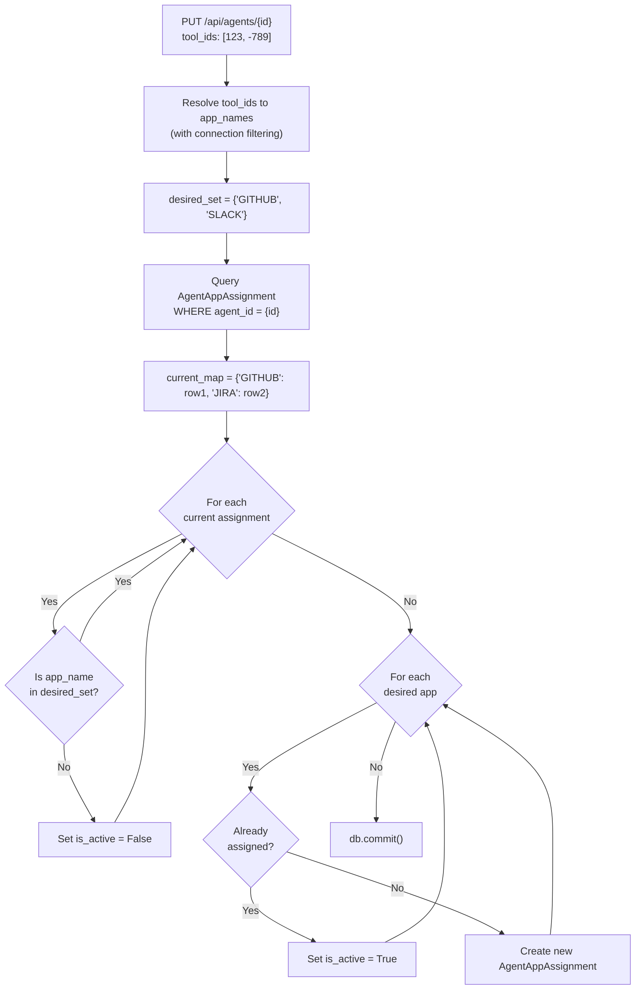
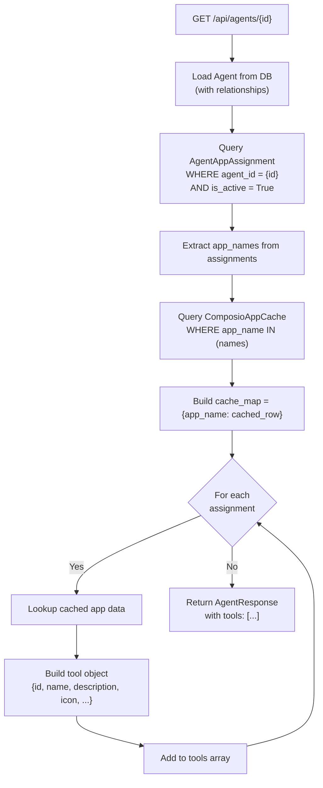
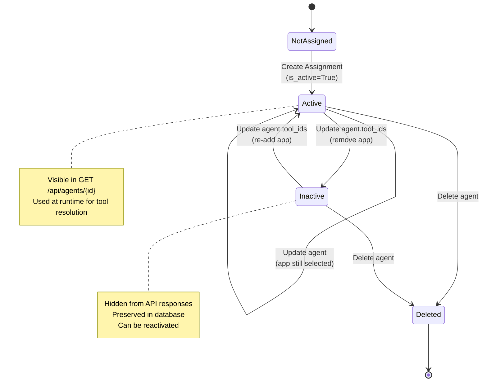
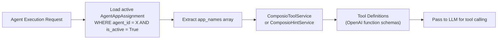

# Tool Assignment

<details>
<summary>Relevant source files</summary>

The following files were used as context for generating this wiki page:

- [docs/DoctorsNotes.docx](docs/DoctorsNotes.docx)
- [orchestrator/api/tools.py](orchestrator/api/tools.py)
- [orchestrator/consumers/chatbot/tool_router.py](orchestrator/consumers/chatbot/tool_router.py)
- [orchestrator/core/composio/client.py](orchestrator/core/composio/client.py)
- [orchestrator/modules/tools/execution/unified_executor.py](orchestrator/modules/tools/execution/unified_executor.py)
- [orchestrator/modules/tools/registry/tool_registry.py](orchestrator/modules/tools/registry/tool_registry.py)
- [orchestrator/modules/tools/services/composio_hint_service.py](orchestrator/modules/tools/services/composio_hint_service.py)
- [orchestrator/modules/tools/services/composio_tool_service.py](orchestrator/modules/tools/services/composio_tool_service.py)
- [orchestrator/modules/tools/tool_router.py](orchestrator/modules/tools/tool_router.py)
- [orchestrator/services/metadata_sync_service.py](orchestrator/services/metadata_sync_service.py)

</details>


## Purpose and Scope

This document explains how Composio tools (external app integrations) are assigned to agents in the Automatos AI platform. It covers the `AgentAppAssignment` table, stable tool ID generation, connection filtering, and the full lifecycle of tool assignments.

For information about the Composio integration architecture and entity management, see [Composio Integration](#6.1). For details on how tools are resolved and executed at runtime, see [Tool Resolution Strategies](#6.2) and [Tool Router & Execution](#6.3). For information about establishing OAuth connections, see [Connecting Apps](#6.4).

---

## Assignment Architecture

Tool assignment in Automatos AI follows a database-backed model where each agent-to-app relationship is stored as an `AgentAppAssignment` record. This approach provides:

- **Persistence**: Assignments survive agent restarts and system redeployments
- **Configuration**: Per-assignment config overrides (priority, custom settings)
- **Activation Control**: Assignments can be enabled/disabled without deletion
- **Audit Trail**: Track who assigned tools and when
- **Connection Filtering**: Only connected apps can be assigned

### High-Level Assignment Flow



**Sources**: [orchestrator/api/agents.py:63-110](), [orchestrator/api/agents.py:362-438](), [orchestrator/api/agents.py:608-698]()

---

## Stable Tool IDs

The frontend and backend use a **stable hashing function** to generate consistent integer IDs for Composio apps based on their names. This allows the UI to work with predictable IDs even before apps are cached in the database.

### Hash Algorithm



The hash function in `_stable_tool_id()` matches the frontend's `stableId()` function, ensuring consistency:

```python
def _stable_tool_id(name: str) -> int:
    """Match frontend stableId() hash (negative int)."""
    h = 0
    for ch in (name or ""):
        h = (h * 31 + ord(ch)) & 0xFFFFFFFF
        # convert to signed 32-bit
        if h & 0x80000000:
            h = -((~h + 1) & 0xFFFFFFFF)
    if h == 0:
        return -1
    return -abs(int(h))
```

**Key Properties**:
- Always returns a **negative integer** (to distinguish from database IDs)
- Deterministic: same app name always produces the same ID
- Case-sensitive: "GITHUB" and "github" produce different IDs

**Sources**: [orchestrator/api/agents.py:34-44]()

---

## Assignment Table Schema

The `agent_app_assignments` table (represented by the `AgentAppAssignment` model) stores the many-to-many relationship between agents and Composio apps.

### Table Structure

| Column | Type | Description |
|--------|------|-------------|
| `id` | INTEGER | Primary key |
| `agent_id` | INTEGER | Foreign key to `agents.id` |
| `app_name` | VARCHAR | Composio app name (uppercase, e.g. "GITHUB") |
| `app_type` | VARCHAR | Always "EXTERNAL" for Composio apps |
| `assigned_by` | INTEGER | User ID who made the assignment (if available) |
| `assigned_at` | TIMESTAMP | When the assignment was created |
| `is_active` | BOOLEAN | Whether the assignment is currently active |
| `priority` | INTEGER | Assignment priority (default 0) |
| `config` | JSONB | Per-assignment configuration overrides |

### Entity Relationships



**Sources**: [orchestrator/api/agents.py:13](), [orchestrator/api/agents.py:146-175]()

---

## Connection Filtering

A critical feature of tool assignment is **connection filtering**: only apps that are connected for the current workspace can be assigned to agents. This prevents configuration errors where an agent expects a tool but no OAuth connection exists.

### Connection Validation Flow



The `_resolve_tool_ids_to_app_names()` function performs this validation:

**Allowed Connection Statuses**:
- `active` - OAuth connection is active
- `added` - Connection added but not yet authorized
- `pending` - Connection authorization in progress

**Rejected Connection Statuses**:
- `disabled` - Connection was disabled
- `failed` - Connection authorization failed
- Any other status

**Sources**: [orchestrator/api/agents.py:63-110](), [orchestrator/core/composio/entity_manager.py]()

---

## Creating Tool Assignments

When a new agent is created via `POST /api/agents`, the frontend sends a list of `tool_ids` that may include:
- Database IDs from `composio_app_cache.id`
- Stable hash IDs (negative integers)

### Creation Process



### Code Implementation

The assignment creation logic in `POST /api/agents`:

```python
# Add tools (NEW: agent_app_assignments)
if agent_data.tool_ids:
    desired_apps = _resolve_tool_ids_to_app_names(db, ctx, agent_data.tool_ids)
    for app_name in desired_apps:
        db.add(
            AgentAppAssignment(
                agent_id=agent.id,
                app_name=app_name,
                app_type="EXTERNAL",
                assigned_by=_assigned_by_user_id(ctx),
                is_active=True,
                priority=0,
                config={},
            )
        )
```

**Sources**: [orchestrator/api/agents.py:407-421](), [orchestrator/api/agents.py:362-438]()

---

## Updating Tool Assignments

When updating an agent via `PUT /api/agents/{id}`, the backend uses a **diff-and-sync** strategy:
1. Resolve new tool IDs to app names
2. Query existing assignments
3. Disable assignments no longer selected
4. Re-enable or create assignments for selected tools

### Update Process



### Soft Deletion Pattern

The backend uses **soft deletion** by setting `is_active = False` rather than deleting rows. This provides:
- **Audit Trail**: History of what was assigned and when
- **Re-activation**: Easy to re-enable previously assigned tools
- **Analytics**: Track tool assignment patterns over time

**Sources**: [orchestrator/api/agents.py:651-683](), [orchestrator/api/agents.py:608-698]()

---

## Reading Tool Assignments

When reading agent details via `GET /api/agents/{id}`, the backend loads assignments and enriches them with cached app metadata.

### Response Building Process



### Tool Object Structure

Each tool in the response includes:

```json
{
  "id": 123,                          // ComposioAppCache.id (or null)
  "assignment_id": 456,               // AgentAppAssignment.id
  "name": "GITHUB",                   // App name (uppercase)
  "description": "GitHub integration", // From cache
  "provider": "Composio",             // Always "Composio"
  "category": "developer-tools",      // From cache categories[0]
  "icon": "https://...",              // Logo URL from cache
  "permissions": {},                  // Reserved for future use
  "configuration": {},                // From assignment.config
  "assigned_at": "2025-01-15T10:30:00Z" // Timestamp
}
```

**Sources**: [orchestrator/api/agents.py:146-175](), [orchestrator/api/agents.py:140-240]()

---

## Assignment Lifecycle States

Assignments follow a lifecycle managed through the `is_active` boolean field:

### State Diagram



### State Transitions

| From State | To State | Trigger | Database Action |
|------------|----------|---------|-----------------|
| Not Assigned | Active | Create agent with tool_ids | `INSERT` with `is_active=True` |
| Not Assigned | Active | Update agent, add tool | `INSERT` with `is_active=True` |
| Active | Active | Update agent, keep tool | No change |
| Active | Inactive | Update agent, remove tool | `UPDATE SET is_active=False` |
| Inactive | Active | Update agent, re-add tool | `UPDATE SET is_active=True` |
| Active/Inactive | Deleted | Delete agent | `DELETE` (cascade) |

**Sources**: [orchestrator/api/agents.py:651-683]()

---

## User ID Tracking

The `assigned_by` field attempts to track which user created the assignment. However, due to the current authentication system using Clerk user IDs (strings like `"user_..."`), while the database column is an `INTEGER`, the field is often `NULL`.

### Current Implementation

```python
def _assigned_by_user_id(ctx: RequestContext) -> Optional[int]:
    """
    `agent_app_assignments.assigned_by` is an INTEGER in Postgres.
    Our RequestContext `user.id` is currently a Clerk user id string (e.g. "user_..."),
    so we must never write it into this column.
    """
    try:
        raw = getattr(getattr(ctx, "user", None), "id", None)
        if raw is None:
            return None
        # Only accept numeric values
        return int(raw)
    except Exception:
        return None
```

This function returns `None` for most requests since Clerk IDs are non-numeric. Future work could:
- Create a separate user mapping table
- Change the column type to VARCHAR
- Use a different identifier

**Sources**: [orchestrator/api/agents.py:47-60]()

---

## Runtime Tool Resolution

At agent execution time, the system loads active assignments and resolves them to Composio tool definitions. This process is separate from assignment management and is covered in detail in [Tool Resolution Strategies](#6.2).

### Quick Overview



**Sources**: See [Tool Resolution Strategies](#6.2) for complete details.

---

## Best Practices

### For API Consumers

1. **Always send stable IDs**: Use the frontend's `stableId()` hash function or query `GET /api/tools/connected` to get valid IDs
2. **Respect connection status**: Don't attempt to assign apps that aren't connected
3. **Use full updates**: Send the complete list of desired tool_ids in update requests (the backend handles the diff)
4. **Check tool visibility**: After updates, verify tools appear in `GET /api/agents/{id}` response

### For Backend Developers

1. **Preserve soft deletion**: Never hard-delete assignments unless cascading from agent deletion
2. **Filter by is_active**: Always filter `WHERE is_active = True` when loading for runtime
3. **Validate connections**: Always call `_resolve_tool_ids_to_app_names()` to enforce connection filtering
4. **Handle cache misses**: Tools may not have cached metadata; handle `null` gracefully

**Sources**: [orchestrator/api/agents.py:63-110](), [orchestrator/api/agents.py:146-175](), [orchestrator/api/agents.py:651-683]()

---

## API Integration Examples

### Creating an Agent with Tools

```http
POST /api/agents
Content-Type: application/json
X-Workspace-ID: <workspace-uuid>
Authorization: Bearer <jwt>

{
  "name": "GitHub Assistant",
  "description": "Helps with GitHub operations",
  "agent_type": "custom",
  "tool_ids": [-1234567, 98765],  // Stable hash + DB ID
  "configuration": {}
}
```

### Updating Agent Tools

```http
PUT /api/agents/42
Content-Type: application/json
X-Workspace-ID: <workspace-uuid>
Authorization: Bearer <jwt>

{
  "tool_ids": [-1234567]  // Remove all but GITHUB
}
```

### Reading Agent Tools

```http
GET /api/agents/42
X-Workspace-ID: <workspace-uuid>
Authorization: Bearer <jwt>

Response:
{
  "id": 42,
  "name": "GitHub Assistant",
  "tools": [
    {
      "id": 123,
      "assignment_id": 456,
      "name": "GITHUB",
      "description": "GitHub integration",
      "category": "developer-tools",
      "icon": "https://...",
      "assigned_at": "2025-01-15T10:30:00Z"
    }
  ]
}
```

**Sources**: [orchestrator/api/agents.py:362-438](), [orchestrator/api/agents.py:608-698](), [orchestrator/api/agents.py:537-555]()

---