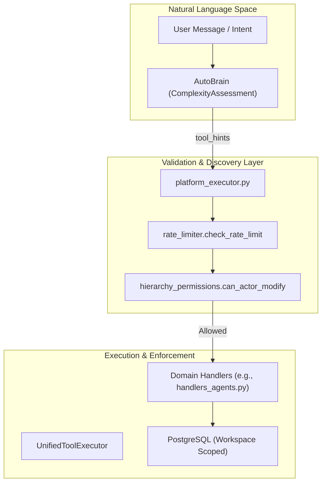
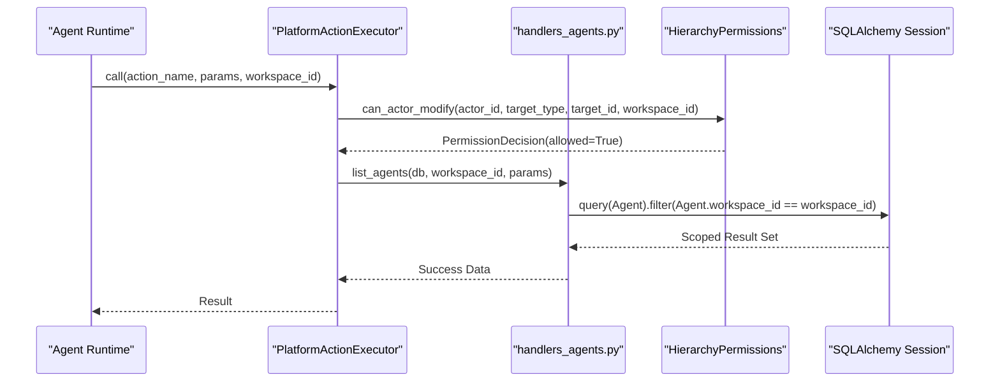

# Permission & Validation System

Relevant source files

The following files were used as context for generating this wiki page:

- [docs/notes/andy-fuck-it-mode.md](docs/notes/andy-fuck-it-mode.md)
- [frontend/app/admin/workspaces/page.tsx](frontend/app/admin/workspaces/page.tsx)
- [frontend/contexts/role-context.tsx](frontend/contexts/role-context.tsx)
- [orchestrator/alembic/versions/prd140_permission_bypass_log.py](orchestrator/alembic/versions/prd140_permission_bypass_log.py)
- [orchestrator/api/admin_workspaces.py](orchestrator/api/admin_workspaces.py)
- [orchestrator/consumers/chatbot/auto.py](orchestrator/consumers/chatbot/auto.py)
- [orchestrator/core/auth/clerk.py](orchestrator/core/auth/clerk.py)
- [orchestrator/core/security/__init__.py](orchestrator/core/security/__init__.py)
- [orchestrator/core/security/bypass_audit.py](orchestrator/core/security/bypass_audit.py)
- [orchestrator/core/security/hierarchy_permissions.py](orchestrator/core/security/hierarchy_permissions.py)
- [orchestrator/core/security/rate_limiter.py](orchestrator/core/security/rate_limiter.py)
- [orchestrator/core/security/url_validator.py](orchestrator/core/security/url_validator.py)
- [orchestrator/core/services/auto_reporting.py](orchestrator/core/services/auto_reporting.py)
- [orchestrator/core/services/notification_dispatcher.py](orchestrator/core/services/notification_dispatcher.py)
- [orchestrator/modules/tools/discovery/actions_auto_reporting.py](orchestrator/modules/tools/discovery/actions_auto_reporting.py)
- [orchestrator/modules/tools/discovery/handlers_auto_reporting.py](orchestrator/modules/tools/discovery/handlers_auto_reporting.py)
- [orchestrator/modules/tools/discovery/platform_actions.py](orchestrator/modules/tools/discovery/platform_actions.py)
- [orchestrator/modules/tools/discovery/platform_executor.py](orchestrator/modules/tools/discovery/platform_executor.py)
- [orchestrator/services/workspace_purge.py](orchestrator/services/workspace_purge.py)
- [orchestrator/tests/test_prd128_notification_dispatcher.py](orchestrator/tests/test_prd128_notification_dispatcher.py)

The Permission & Validation System in Automatos AI ensures that AI agents and workflows operate within safe boundaries, respecting multi-tenant isolation, administrative constraints, and functional capabilities. It bridges the gap between natural language intents and structured execution by validating actions against a defined taxonomy and workspace-scoped permissions.

## Core Components

The system relies on four primary layers to validate and filter actions before they reach the execution engine:

1.  **Complexity Assessment (AutoBrain)**: Determines the depth of the request (Atom → Organism) and identifies necessary tool categories (`tool_hints`) to narrow the tool search space. [orchestrator/consumers/chatbot/auto.py:5-22]()
2.  **Hierarchy Permissions (PRD-140)**: A service-layer chokepoint that validates if an actor (agent) has the right to modify a target entity (another agent, playbook, or skill) based on organizational reporting lines. [orchestrator/core/security/hierarchy_permissions.py:1-18]()
3.  **Platform Action Executor**: A thin dispatcher that routes platform management requests to domain-specific handlers while enforcing workspace isolation and rate limits. [orchestrator/modules/tools/discovery/platform_executor.py:1-9]()
4.  **Rate Limiting (PRD-70)**: Uses Redis sliding window counters to prevent abuse of security-sensitive operations (e.g., `git_clone`, `platform_write`) on a per-workspace or per-agent basis. [orchestrator/core/security/rate_limiter.py:1-21]()

### System Data Flow

The following diagram illustrates the transition from a user's natural language request to a validated code execution within the system.

**Natural Language to Code Entity Mapping**

**Sources**: [orchestrator/consumers/chatbot/auto.py:59-83](), [orchestrator/modules/tools/discovery/platform_executor.py:209-226](), [orchestrator/core/security/hierarchy_permissions.py:88-122]()

---

## Hierarchy Permissions (PRD-140)

The hierarchy permission system ensures that agents cannot arbitrarily modify platform state unless they are the owner of the target or the target reports to them.

### Enforcement Logic
The `can_actor_modify` function serves as the central enforcement point. It follows a strict "Default Deny" policy:
*   **Workspace Boundary**: Cross-workspace mutations are always denied. [orchestrator/core/security/hierarchy_permissions.py:151-162]()
*   **System Bypass**: Only a narrow allowlist of system actors (e.g., `Auto`, `HARNESS`, `platform-system`) can bypass hierarchy checks. [orchestrator/core/security/hierarchy_permissions.py:53-60]()
*   **Target Types**: The system currently enforces hierarchy on `agent`, `heartbeat`, `playbook`, `task`, `skill`, and `tool_assignment`. [orchestrator/core/security/hierarchy_permissions.py:41-46]()

### Mutation Mapping
The `platform_executor.py` maps specific platform actions to their target types and ID parameters to facilitate these checks. [orchestrator/modules/tools/discovery/platform_executor.py:209-231]()

| Action Name | Target Type | Param Key |
| :--- | :--- | :--- |
| `platform_update_agent` | `TARGET_AGENT` | `agent_id` |
| `platform_assign_skill_to_agent` | `TARGET_TOOL_ASSIGNMENT` | `agent_id` |
| `platform_update_playbook` | `TARGET_PLAYBOOK` | `playbook_id` |
| `platform_create_workspace_skill` | `TARGET_SKILL` | `None` (Escalates) |

**Sources**: [orchestrator/core/security/hierarchy_permissions.py:71-85](), [orchestrator/modules/tools/discovery/platform_executor.py:182-208]()

---

## Rate Limiting & Security Gates

To prevent platform exhaustion and recursive agent loops, the system implements per-operation rate limits.

### Operation Limits
Limits are defined in `DEFAULT_LIMITS` and can be overridden via environment variables. [orchestrator/core/security/rate_limiter.py:45-57]()
*   **platform_write**: 60 actions per minute per agent (subject). This prevents a chatty agent from starving parallel mission tasks. [orchestrator/core/security/rate_limiter.py:56]()
*   **git_clone**: 5 per hour per workspace. [orchestrator/core/security/rate_limiter.py:47]()
*   **skill_import**: 3 per hour. [orchestrator/core/security/rate_limiter.py:50]()

### Enforcement Mechanism
The `check_rate_limit` function uses a Redis-backed sliding window. If the count exceeds the limit, it raises a `429 HTTPException`. [orchestrator/core/security/rate_limiter.py:72-127]()

**Sources**: [orchestrator/core/security/rate_limiter.py:33-40](), [orchestrator/core/security/rate_limiter.py:90-110]()

---

## Admin Validation & Workspace Purge

Administrative operations (e.g., pausing or deleting workspaces) require elevated `system_role` validation.

### Admin Access Control
The `_assert_admin` helper in `api/admin_workspaces.py` checks if the `RequestContext` contains a user with the `admin` role. [orchestrator/api/admin_workspaces.py:45-54]()

### Hard-Delete (Purge) Sequence
When an administrator triggers a workspace deletion, the `workspace_purge.py` service executes a destructive sequence to ensure GDPR compliance and resource cleanup:
1.  **S3 Wipe**: Deletes all objects under `s3://{bucket}/workspaces/{id}/`. [orchestrator/services/workspace_purge.py:121-144]()
2.  **Clerk Deletion**: Removes the owning user from the Clerk authentication provider. [orchestrator/services/workspace_purge.py:157-165]()
3.  **Database Cascade**: Discovers all tables with a `workspace_id` column and deletes associated rows. [orchestrator/services/workspace_purge.py:51-70]()

**Sources**: [orchestrator/api/admin_workspaces.py:38-41](), [orchestrator/services/workspace_purge.py:1-19](), [orchestrator/services/workspace_purge.py:167-181]()

---

## Workspace Isolation Sequence

The following diagram maps the internal code entities involved in maintaining workspace boundaries during platform action execution.

**Workspace Isolation Sequence**

**Sources**: [orchestrator/modules/tools/discovery/platform_executor.py:1-9](), [orchestrator/core/security/hierarchy_permissions.py:88-122](), [orchestrator/modules/tools/discovery/handlers_agents.py:19-28]()

---