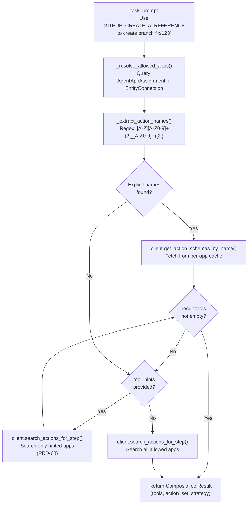
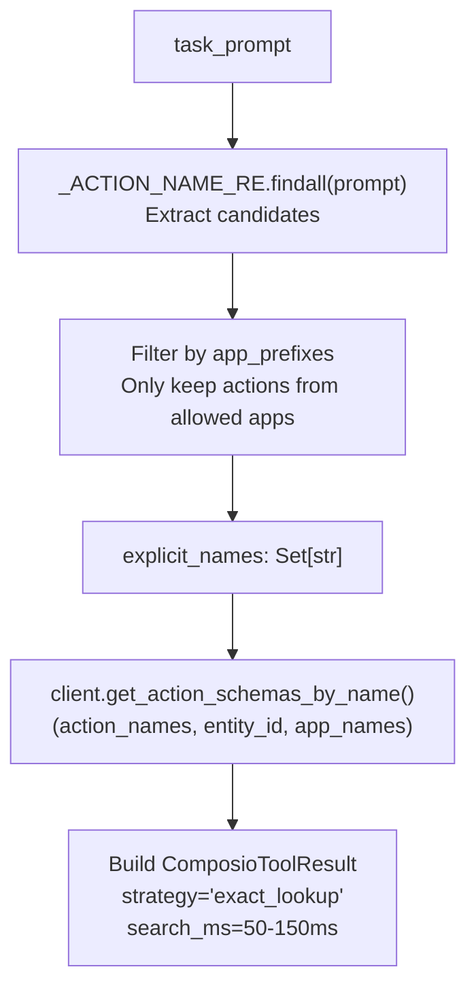
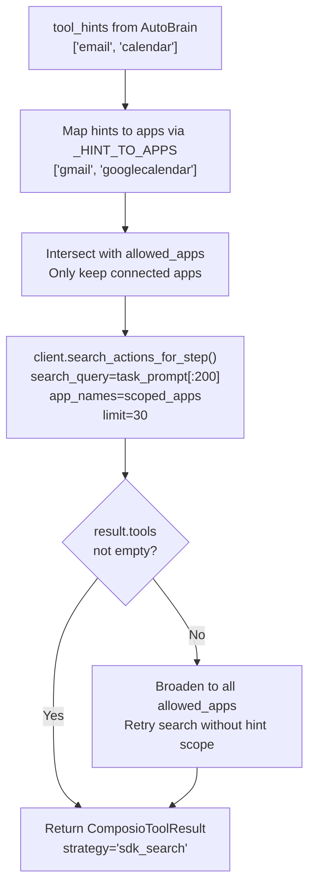
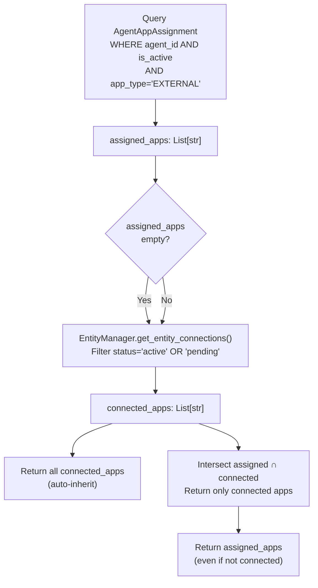
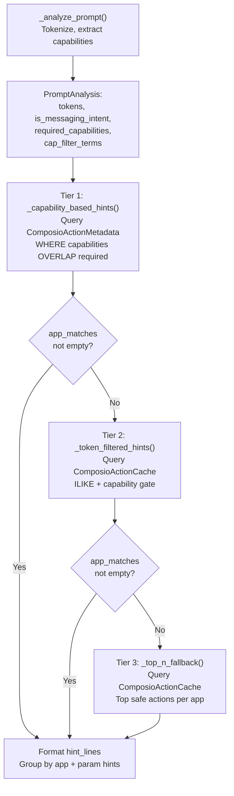
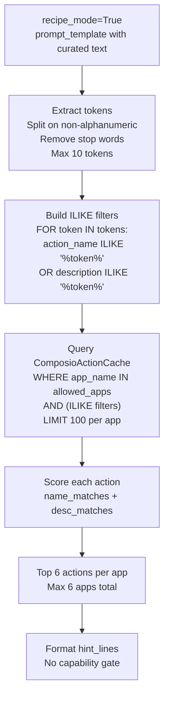
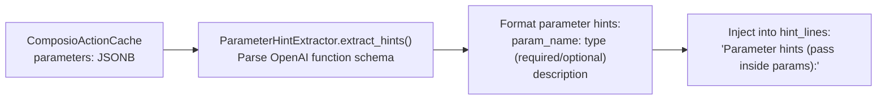
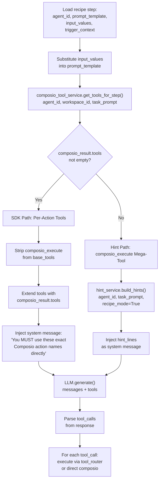
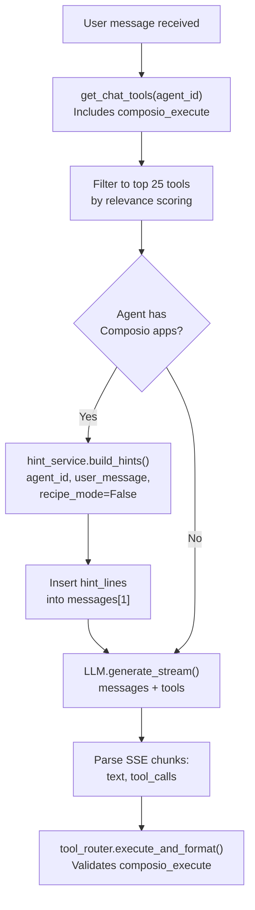
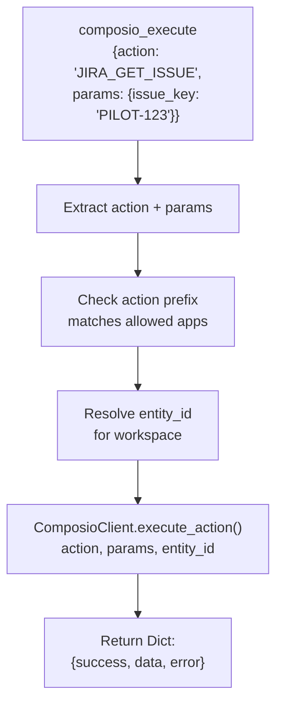

# Tool Resolution Strategies

<details>
<summary>Relevant source files</summary>

The following files were used as context for generating this wiki page:

- [docs/DoctorsNotes.docx](docs/DoctorsNotes.docx)
- [orchestrator/api/tools.py](orchestrator/api/tools.py)
- [orchestrator/consumers/chatbot/tool_router.py](orchestrator/consumers/chatbot/tool_router.py)
- [orchestrator/core/composio/client.py](orchestrator/core/composio/client.py)
- [orchestrator/modules/tools/execution/unified_executor.py](orchestrator/modules/tools/execution/unified_executor.py)
- [orchestrator/modules/tools/registry/tool_registry.py](orchestrator/modules/tools/registry/tool_registry.py)
- [orchestrator/modules/tools/services/composio_hint_service.py](orchestrator/modules/tools/services/composio_hint_service.py)
- [orchestrator/modules/tools/services/composio_tool_service.py](orchestrator/modules/tools/services/composio_tool_service.py)
- [orchestrator/modules/tools/tool_router.py](orchestrator/modules/tools/tool_router.py)
- [orchestrator/services/metadata_sync_service.py](orchestrator/services/metadata_sync_service.py)

</details>


## Purpose and Scope

This page documents the three-tier tool resolution system used by `ComposioToolService` to discover and select Composio actions for LLM execution. The system resolves actions through a cascading strategy:

1. **Tier 1: Explicit Action Names** - Extract action names from the prompt (e.g., `GITHUB_CREATE_A_REFERENCE`) and perform exact cache lookup
2. **Tier 2: SDK Semantic Search** - Use Composio SDK's semantic search with optional `tool_hints` scoping (PRD-68)
3. **Tier 3: Broadened Search** - If scoped search returns zero results, retry with all allowed apps

A separate hint-based system (`ComposioHintService`) provides system message injection with action candidates when direct tool resolution is not used.

For information about connecting apps and managing OAuth flows, see [6.4 Connecting Apps]. For tool execution and routing, see [6.3 Tool Router & Execution]. For workspace-level tool configuration, see [6.5 Permission & Validation System].

---

## Resolution Architecture

The system uses two independent resolution services:

**ComposioToolService** - Three-tier action resolution for direct tool schemas  
Implements a cascading strategy to find Composio actions: explicit name extraction → scoped SDK search → broadened search. Returns OpenAI function-calling schemas for each resolved action.

**ComposioHintService** - System message hint generation  
Builds action hints for LLM system messages using capability-based or token-based matching. Returns action names with parameter hints rather than full schemas.

### Tier Resolution Flow (ComposioToolService)



**Sources:**
- [orchestrator/modules/tools/services/composio_tool_service.py:97-256]()

---

## Three-Tier Resolution Strategy

### Tier 1: Explicit Action Name Extraction

The first tier uses regex pattern matching to extract explicit Composio action names from the prompt:

```
Pattern: \b([A-Z][A-Z0-9]+(?:_[A-Z0-9]+){2,})\b
Example Matches: GITHUB_CREATE_A_REFERENCE, JIRA_GET_ISSUE, SLACK_SEND_MESSAGE
```

Matched names are filtered to only include actions whose app prefix (e.g., `GITHUB_`) matches an app in the agent's allowed apps list (from `AgentAppAssignment`).

**Exact Lookup Process:**



**Key Methods:**

| Method | Location | Purpose |
|--------|----------|---------|
| `_extract_action_names()` | [composio_tool_service.py:280-292]() | Extract and filter action names from prompt |
| `get_action_schemas_by_name()` | [core/composio/client.py:644-712]() | Fetch schemas from ComposioClient cache |

**Sources:**
- [orchestrator/modules/tools/services/composio_tool_service.py:76-166]()
- [orchestrator/modules/tools/services/composio_tool_service.py:280-292]()

### Tier 2: SDK Semantic Search with Tool Hints (PRD-68)

If Tier 1 returns no results, the system falls through to SDK semantic search. If `tool_hints` are provided (from AutoBrain complexity assessment), the search is scoped to only those hinted apps.

**Tool Hints Scoping:**

The `_HINT_TO_APPS` mapping converts AutoBrain domain keywords to Composio app names:

```python
_HINT_TO_APPS = {
    "email": ["gmail"], "emails": ["gmail"], "inbox": ["gmail"],
    "slack": ["slack"], "message": ["slack", "telegram"],
    "calendar": ["googlecalendar"], "event": ["googlecalendar"],
    "jira": ["jira"], "ticket": ["jira"], "issue": ["jira"],
    "github": ["github"], "repo": ["github"], "code": ["github"],
    # ... 15+ more mappings
}
```

When AutoBrain returns `tool_hints=["email", "calendar"]`, the search is scoped to `["gmail", "googlecalendar"]` instead of all 15 allowed apps.

**Scoped Search Flow:**



**Performance Impact:**

| Scenario | Apps Searched | Latency | Accuracy |
|----------|---------------|---------|----------|
| With tool_hints | 2-4 apps | 150-300ms | High (scoped to relevant apps) |
| Without tool_hints | 15+ apps | 300-500ms | Medium (broader search) |
| Scoped returns 0 | 15+ apps (fallback) | 400-600ms | Low (generic results) |

**Sources:**
- [orchestrator/modules/tools/services/composio_tool_service.py:168-231]()
- [orchestrator/modules/tools/services/composio_tool_service.py:80-95]()

### Tier 3: Broadened Search Fallback

If the scoped search (Tier 2) returns zero results, the system automatically retries with all allowed apps. This ensures the LLM always receives some relevant actions, even if the hint-based scoping was too aggressive.

**Fallback Logic:**

```python
# Tier 2 scoped search returned 0 results
if search_apps != [a.lower() for a in allowed_apps]:
    logger.info("Hint-scoped search returned 0 — broadening to all apps")
    search_results = client.search_actions_for_step(
        search_query=task_prompt[:200],
        app_names=[a.lower() for a in allowed_apps],  # All apps
        entity_id=entity_id,
        limit=limit,
    )
```

**Sources:**
- [orchestrator/modules/tools/services/composio_tool_service.py:211-231]()

### ComposioToolService API

The `ComposioToolService` class implements the three-tier resolution strategy and provides both tool discovery and direct action execution.

**Class Definition:**

```python
class ComposioToolService:
    """
    Resolves Composio actions into OpenAI function-calling tools.
    
    Uses the Composio SDK to fetch per-app action schemas and presents
    them as individual tools to the LLM. Reusable across all consumers
    (recipe executor, chatbot, external API).
    """
    
    def __init__(self, db: Session):
        self.db = db
```

**Key Methods:**

| Method | Location | Purpose | Returns |
|--------|----------|---------|---------|
| `get_tools_for_step()` | [composio_tool_service.py:97-256]() | Three-tier resolution for a step | `ComposioToolResult` |
| `execute_action()` | [composio_tool_service.py:257-274]() | Direct action execution | `Dict[success, data, error]` |
| `_extract_action_names()` | [composio_tool_service.py:280-292]() | Regex extraction of action names | `Set[str]` |
| `_resolve_allowed_apps()` | [composio_tool_service.py:294-338]() | Query agent assignments + connections | `List[str]` |
| `_resolve_entity_id()` | [composio_tool_service.py:340-350]() | Get Composio entity_id for workspace | `Optional[str]` |

**Result Dataclass:**

```python
@dataclass
class ComposioToolResult:
    tools: List[Dict[str, Any]] = field(default_factory=list)
    action_set: Set[str] = field(default_factory=set)
    entity_id: str = ""
    app_names: List[str] = field(default_factory=list)
    strategy: str = "none"  # "exact_lookup" | "sdk_search" | "cache_ranked" | "none"
    search_ms: int = 0
```

**Sources:**
- [orchestrator/modules/tools/services/composio_tool_service.py:49-57]()
- [orchestrator/modules/tools/services/composio_tool_service.py:63-350]()

### Allowed Apps Resolution

The `_resolve_allowed_apps()` method determines which Composio apps an agent can use by intersecting:

1. **Agent Assignments** - Apps explicitly assigned to the agent via `AgentAppAssignment` table
2. **Workspace Connections** - Apps the workspace has OAuth-connected via `EntityConnection`

**Auto-Inherit Behavior:**

If an agent has no explicit app assignments, it automatically inherits all workspace-connected apps. This allows newly created agents to use all workspace tools without manual configuration.



**Sources:**
- [orchestrator/modules/tools/services/composio_tool_service.py:294-338]()

---

## Hint-Based Resolution (ComposioHintService)

### Purpose

The `ComposioHintService` generates system message hints listing candidate Composio actions when per-action tool schemas are not used. This service is separate from `ComposioToolService` and operates independently.

**Use Cases:**

| Consumer | When Used |
|----------|-----------|
| Recipe Executor | When `ComposioToolService.get_tools_for_step()` returns empty |
| Chat Service | When agent system prompt needs Composio action hints |
| Agent Factory | When building agent system prompts with Composio apps |

**System Message Format:**

```
You have these external apps connected (via Composio): GITHUB, JIRA, SLACK.
IMPORTANT: To interact with these apps, call `composio_execute` with the EXACT action name from the list below.
Do NOT guess or invent action names — only use the exact names listed here.

Usage: composio_execute({"action": "ACTION_NAME", "params": {<action-specific fields>}}).

- GITHUB available actions: GITHUB_CREATE_A_REFERENCE, GITHUB_GET_ISSUE, GITHUB_CREATE_PULL_REQUEST
- JIRA available actions: JIRA_GET_ISSUE, JIRA_EDIT_ISSUE, JIRA_ADD_COMMENT_TO_ISSUE

Parameter hints (pass these inside `params`):

GITHUB_CREATE_A_REFERENCE:
  ref: string (required) - The reference to create
  sha: string (required) - The SHA1 value for the reference

You MUST call `composio_execute` to fulfill the user's request.
Do NOT describe the action in text — actually invoke the tool.
```

**Sources:**
- [orchestrator/modules/tools/services/composio_hint_service.py:136-201]()

### ComposioHintService API

The `ComposioHintService` class provides unified hint generation with two operating modes: **chatbot mode** (3-tier capability-based resolution) and **recipe mode** (pure token matching).

**Class Definition:**

```python
class ComposioHintService:
    """
    Unified service for building Composio action hints for LLM system messages.
    
    Usage:
        hint_service = ComposioHintService(db_session)
        result = hint_service.build_hints(
            agent_id=42, 
            prompt="send slack message", 
            workspace_id=ws_id,
            recipe_mode=False  # Use 3-tier resolution
        )
        if result.hint_lines:
            llm_messages.insert(idx, {
                "role": "system", 
                "content": "\n".join(result.hint_lines)
            })
    """
```

**Key Methods:**

| Method | Location | Purpose | Returns |
|--------|----------|---------|---------|
| `build_hints()` | [composio_hint_service.py:103-212]() | Generate action hints with mode selection | `ComposioHintResult` |
| `_analyze_prompt()` | [composio_hint_service.py:279-311]() | Tokenize, extract capabilities, detect intent | `PromptAnalysis` |
| `_capability_based_hints()` | [composio_hint_service.py:316-392]() | Tier 1: Capability overlap from metadata | `bool` (success) |
| `_recipe_token_hints()` | [composio_hint_service.py:396-482]() | Recipe mode: Pure token ILIKE matching | Updates `app_matches` |
| `_token_filtered_hints()` | [composio_hint_service.py:486-580]() | Tier 2: Token ILIKE + capability gate | Updates `app_matches` |
| `_top_n_fallback()` | [composio_hint_service.py:584-622]() | Tier 3: Safe actions per app | Updates `app_matches` |

**Result Dataclass:**

```python
@dataclass
class ComposioHintResult:
    hint_lines: List[str] = field(default_factory=list)
    allowed_apps: List[str] = field(default_factory=list)
    matched_actions: List[str] = field(default_factory=list)
    param_hint_count: int = 0
    strategy_used: str = "none"  # "capability" | "token_filtered" | "recipe_token" | "fallback" | "none"
```

**Sources:**
- [orchestrator/modules/tools/services/composio_hint_service.py:77-84]()
- [orchestrator/modules/tools/services/composio_hint_service.py:89-212]()

### Chatbot Mode: Three-Tier Cascade

When `recipe_mode=False`, the hint service uses a three-tier cascade with capability-based filtering:



**Tier 1: Capability-Based** (Lines 316-392)  
Queries `ComposioActionMetadata` table using PostgreSQL array overlap operator. Capabilities are extracted from the prompt via `get_capabilities_for_intent()` taxonomy function. Actions are scored by capability match count + keyword overlap + classification confidence.

**Tier 2: Token-Filtered** (Lines 486-580)  
Queries `ComposioActionCache` using PostgreSQL ILIKE with prompt tokens. **Mandatory capability gate**: If capabilities were extracted (and not generic fallback), actions MUST contain at least one capability term in their name/description to pass filtering. This prevents `SLACK_CREATE_CHANNEL_BASED_CONVERSATION` from competing with `SLACK_SEND_MESSAGE` for messaging intents.

**Tier 3: Top-N Fallback** (Lines 584-622)  
Returns top 10 actions per app (max 6 apps) ordered by display_name. No filtering applied — ensures LLM always receives some actions even if prompt doesn't match taxonomy.

**Sources:**
- [orchestrator/modules/tools/services/composio_hint_service.py:160-178]()
- [orchestrator/modules/tools/services/composio_hint_service.py:316-392]()
- [orchestrator/modules/tools/services/composio_hint_service.py:486-580]()
- [orchestrator/modules/tools/services/composio_hint_service.py:584-622]()

### Recipe Mode: Pure Token Matching

When `recipe_mode=True`, the hint service skips capability extraction and taxonomy entirely, using pure token-based matching:



**Rationale:**

Recipe step prompts are curated and specific (e.g., "Get the JIRA issue with key {issue_key} and extract the status field"). Token matching directly on the prompt text is sufficient — no need for capability taxonomy. This approach scales to 850+ tools / 12k+ actions without manual keyword→capability curation.

**Scoring:**

Actions are scored by the number of matching tokens:

```python
name_lower = action_name.lower()
desc_lower = (cached.description or "").lower()
name_matches = sum(1 for tok in tokens if tok in name_lower)
desc_matches = sum(1 for tok in tokens if tok in desc_lower)
score = (name_matches * 3) + desc_matches  # Name matches weighted 3x
```

**Sources:**
- [orchestrator/modules/tools/services/composio_hint_service.py:152-159]()
- [orchestrator/modules/tools/services/composio_hint_service.py:396-482]()

### Parameter Hint Extraction

The hint service includes parameter hints for the top actions (up to `MAX_PARAM_HINT_ACTIONS=10` total). Hints are extracted from `ComposioActionCache.parameters` via `ParameterHintExtractor.extract_hints()`:



**Example Output:**

```
JIRA_GET_ISSUE:
  issue_id_or_key: string (required) - The issue key or ID
  fields: string (optional) - Comma-separated list of fields
  expand: string (optional) - Fields to expand in response

GITHUB_CREATE_A_REFERENCE:
  ref: string (required) - The reference to create (e.g., refs/heads/branch-name)
  sha: string (required) - The SHA1 value for this reference
```

**Max Parameters Per Action:**

Only the first 5 parameters are included per action (configurable via `MAX_PARAMS_PER_ACTION=5`) to prevent token overflow.

**Sources:**
- [orchestrator/modules/tools/services/composio_hint_service.py:625-678]()
- [orchestrator/modules/tools/formatting/schema_detector.py:1-100]()

---

## Integration: Recipe Execution

### Recipe Step Tool Resolution

The recipe executor (`execute_recipe_direct`) integrates both `ComposioToolService` and `ComposioHintService` with per-step decision logic:



**SDK Path Details:**

When `composio_result.tools` is not empty, the executor:

1. Strips `composio_execute` from base tools (lines 155-158)
2. Extends tools with per-action schemas (line 160)
3. Injects scope message to LLM (lines 163-168)
4. Executes matched actions directly via `composio_tool_service.execute_action()` (lines 281-312)

**Hint Path Details:**

When `composio_result.tools` is empty, the executor:

1. Keeps `composio_execute` in base tools
2. Calls `hint_service.build_hints(recipe_mode=True)` (lines 172-177)
3. Injects hint_lines as system message
4. Executes `composio_execute` calls via `tool_router.execute_and_format()` (lines 314-333)

**Sources:**
- [orchestrator/api/recipe_executor.py:109-200]()
- [orchestrator/api/recipe_executor.py:260-333]()

## Integration: Streaming Chat Service

### Chat Message Tool Resolution

The `StreamingChatService` integrates tool resolution differently than recipes, using hint-based injection more frequently:



**Key Differences from Recipe Execution:**

| Aspect | Recipe Execution | Chat Service |
|--------|------------------|--------------|
| **Tool Service** | `ComposioToolService` (3-tier) | Usually skipped |
| **Hint Service** | `recipe_mode=True` (token matching) | `recipe_mode=False` (3-tier capability) |
| **Base Tools** | Filtered per-step | Cached and reused |
| **Tool Filtering** | No filtering (all returned) | Relevance scoring to top 25 |
| **Execution** | Direct or via tool_router | Always via tool_router |

**Why Chat Uses Hints More:**

Chat messages are less curated than recipe prompts, so hint-based resolution with capability filtering provides better scoping. The 3-tier cascade (capability → token → fallback) ensures relevant actions are surfaced even for ambiguous user queries.

**Sources:**
- [orchestrator/consumers/chatbot/service.py:490-677]()

---

## Execution Paths

### SDK Path: Direct Action Execution

When `ComposioToolService` returns per-action tools, the recipe executor detects Composio action calls by:

1. Checking if `tool_name in composio_result.action_set`
2. OR checking if `tool_name` starts with a connected app prefix (e.g., `JIRA_*`)

Detected actions are executed directly via `ComposioToolService.execute_action()`:

```python
# Recipe executor direct execution (lines 281-312)
if tool_name in composio_result.action_set or \
   any(tool_name.startswith(f"{app}_") for app in composio_result.app_names):
    
    # Check deduplication cache
    args_hash = hashlib.md5(json.dumps(tool_args, sort_keys=True).encode()).hexdigest()
    cache_key = (tool_name, args_hash)
    if cache_key in composio_call_cache:
        exec_result = composio_call_cache[cache_key]
    else:
        exec_result = tool_service.execute_action(
            action_name=tool_name,
            params=tool_args,
            entity_id=composio_result.entity_id,
        )
        composio_call_cache[cache_key] = exec_result
```

**Deduplication Cache:**

The executor maintains a per-execution cache of `(action_name, args_hash) → result` to avoid duplicate Composio API calls when the LLM retries the same action with identical arguments within a single step execution.

**Sources:**
- [orchestrator/api/recipe_executor.py:260-312]()

### Hint Path: Tool Router Validation

When hint-based resolution is used, the LLM calls `composio_execute` with `{action, params}`. The tool router validates and executes:



**Validation Steps:**

1. Extract `action` and `params` from tool call arguments
2. Validate action prefix matches an app in the agent's allowed apps
3. Resolve `entity_id` from workspace via `EntityManager`
4. Execute via `ComposioClient.execute_action()`
5. Return standardized result dict

**Error Handling:**

If validation fails (e.g., action not in allowed apps), the tool router returns:

```python
{
    "success": False,
    "error": "Action JIRA_GET_ISSUE not allowed for this agent",
    "error_type": "permission_denied"
}
```

**Sources:**
- [orchestrator/modules/tools/execution/unified_executor.py:336-353]()
- [orchestrator/core/composio/tool_executor.py]()

---

## Consumer Integration Summary

### Tool Resolution by Consumer

| Consumer | Tool Service | Hint Service | Execution Path |
|----------|--------------|--------------|----------------|
| **Recipe Executor** | `ComposioToolService` (3-tier) | `recipe_mode=True` (fallback) | Direct or tool_router |
| **Chat Service** | Usually skipped | `recipe_mode=False` (primary) | Always tool_router |
| **Agent Factory** | Not used | `recipe_mode=False` | N/A (system prompt only) |

### Recipe Executor Integration

**File:** [orchestrator/api/recipe_executor.py:109-333]()

**Resolution Strategy:**

1. Call `ComposioToolService.get_tools_for_step()` per step
2. If result has tools → SDK path (direct execution)
3. If result is empty → Call `ComposioHintService.build_hints(recipe_mode=True)`
4. Execute via direct call or `tool_router.execute_and_format()`

**Key Features:**

- Per-step Composio resolution (different apps per step)
- Deduplication cache for repeated tool calls
- `recipe_mode=True` for pure token matching (scales to 850+ tools)

### Streaming Chat Service Integration

**File:** [orchestrator/consumers/chatbot/service.py:490-677]()

**Resolution Strategy:**

1. Load base tools via `get_chat_tools(agent_id)`
2. Apply relevance filtering (top 25 tools)
3. If agent has Composio apps → Call `ComposioHintService.build_hints(recipe_mode=False)`
4. Inject hint_lines at messages[1]
5. Execute all tool calls via `tool_router.execute_and_format()`

**Key Features:**

- Tool relevance scoring and filtering
- Always uses hint-based path (not per-action tools)
- `recipe_mode=False` for 3-tier capability resolution
- Memory context integration

### Agent Factory Integration

**File:** [orchestrator/modules/agents/factory/agent_factory.py:806-890]()

**Resolution Strategy:**

1. Call `ComposioHintService.build_hints()` when building system prompt
2. Inject hint_lines into agent's base system message
3. No execution — hints are static in agent definition

**Key Features:**

- System prompt only (no runtime resolution)
- Used for UI-created agents (not recipes or chat)
- Hints are baked into agent at creation time

**Sources:**
- [orchestrator/api/recipe_executor.py:109-333]()
- [orchestrator/consumers/chatbot/service.py:490-677]()
- [orchestrator/modules/agents/factory/agent_factory.py:806-890]()

---

## Performance Characteristics

### SDK Search Path

| Metric | Value | Notes |
|--------|-------|-------|
| Latency (Exact Lookup) | 50-150ms | Cache hit on per-app action index |
| Latency (SDK Search) | 200-500ms | Semantic search fallback |
| Token Overhead | Low | Only includes resolved action schemas |
| Accuracy | High | Exact parameter names, no validation layer |

### Hint-Based Path

| Metric | Value | Notes |
|--------|-------|-------|
| Latency (Capability) | 100-300ms | DB query on `ComposioActionMetadata` |
| Latency (Token-Filtered) | 200-400ms | PostgreSQL ILIKE with capability gate |
| Latency (Fallback) | 50-100ms | Simple top-N query per app |
| Token Overhead | Medium | Includes action list + parameter hints |
| Accuracy | Medium | Requires LLM to construct correct `params` dict |

**Sources:**
- [orchestrator/modules/tools/services/composio_tool_service.py:133-176]()
- [orchestrator/modules/tools/services/composio_hint_service.py:203-211]()

---