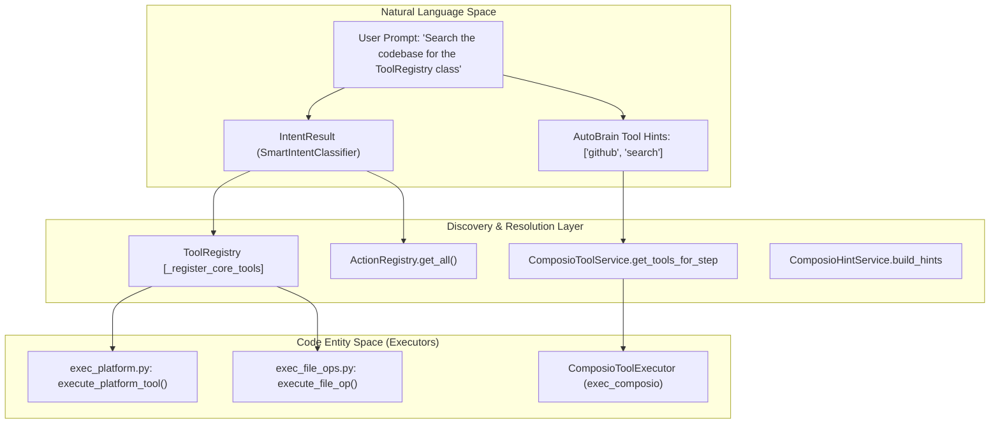
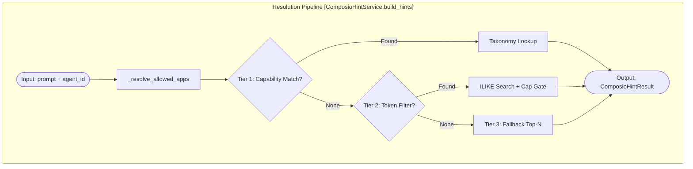

# Tool Discovery & Resolution

Relevant source files

The following files were used as context for generating this wiki page:

- [orchestrator/api/routing.py](orchestrator/api/routing.py)
- [orchestrator/consumers/chatbot/intent_classifier.py](orchestrator/consumers/chatbot/intent_classifier.py)
- [orchestrator/consumers/chatbot/personality.py](orchestrator/consumers/chatbot/personality.py)
- [orchestrator/consumers/chatbot/smart_tool_router.py](orchestrator/consumers/chatbot/smart_tool_router.py)
- [orchestrator/consumers/chatbot/tool_router.py](orchestrator/consumers/chatbot/tool_router.py)
- [orchestrator/core/routing/engine.py](orchestrator/core/routing/engine.py)
- [orchestrator/modules/context/sections/tools.py](orchestrator/modules/context/sections/tools.py)
- [orchestrator/modules/tools/discovery/action_registry.py](orchestrator/modules/tools/discovery/action_registry.py)
- [orchestrator/modules/tools/discovery/handlers_search.py](orchestrator/modules/tools/discovery/handlers_search.py)
- [orchestrator/modules/tools/execution/exec_platform.py](orchestrator/modules/tools/execution/exec_platform.py)
- [orchestrator/modules/tools/execution/unified_executor.py](orchestrator/modules/tools/execution/unified_executor.py)
- [orchestrator/modules/tools/registry/tool_registry.py](orchestrator/modules/tools/registry/tool_registry.py)
- [orchestrator/modules/tools/services/composio_hint_service.py](orchestrator/modules/tools/services/composio_hint_service.py)
- [orchestrator/modules/tools/services/composio_tool_service.py](orchestrator/modules/tools/services/composio_tool_service.py)
- [orchestrator/modules/tools/tool_router.py](orchestrator/modules/tools/tool_router.py)
- [orchestrator/scripts/setup_jira_trigger.py](orchestrator/scripts/setup_jira_trigger.py)
- [orchestrator/tests/test_action_registry_filtered.py](orchestrator/tests/test_action_registry_filtered.py)
- [orchestrator/tests/test_tool_router_semantic.py](orchestrator/tests/test_tool_router_semantic.py)

## Purpose and Scope

This page documents the tool discovery, registration, and resolution systems within Automatos AI. The architecture centers around a centralized `ToolRegistry` and a specialized `ComposioToolService` that implements a multi-tier resolution strategy for discovering actions. These systems bridge the gap between Natural Language (user prompts) and Code Entities (tool schemas and executors).

Key components include:
- **ToolRegistry**: The single source of truth for all platform tools [orchestrator/modules/tools/registry/tool_registry.py:157-167]().
- **ActionRegistry**: Registry for platform-specific management actions (e.g., `platform_list_agents`) [orchestrator/modules/tools/discovery/action_registry.py:55-61]().
- **ComposioCache**: Database-backed caching for external app metadata and action schemas (`ComposioActionCache`) [orchestrator/modules/tools/services/composio_hint_service.py:33-33]().
- **3-Tier Resolution**: A cascading strategy (Capability, Token-filtered, Top-N) to find relevant actions within token budgets [orchestrator/modules/tools/services/composio_hint_service.py:12-21]().

---

## Tool Discovery Architecture

The discovery process maps high-level intents to specific executable code entities defined in the `UnifiedToolExecutor` and external Composio actions.

### Natural Language to Code Entity Mapping

**Sources:**
- [orchestrator/modules/tools/registry/tool_registry.py:157-181]()
- [orchestrator/modules/tools/execution/unified_executor.py:69-168]()
- [orchestrator/modules/tools/services/composio_tool_service.py:72-113]()
- [orchestrator/modules/tools/discovery/action_registry.py:55-74]()
- [orchestrator/consumers/chatbot/intent_classifier.py:37-46]()

---

## Core Components

### 1. ToolRegistry
The `ToolRegistry` [orchestrator/modules/tools/registry/tool_registry.py:157-181]() manages the lifecycle of `ToolSpec` objects. It categorizes tools using the `ToolCategory` enum (RESEARCH, FILE_OPERATIONS, SHELL_COMMANDS, etc.) [orchestrator/modules/tools/registry/tool_registry.py:38-50]() and exports them into OpenAI-compatible function-calling formats via `to_openai_format()` [orchestrator/modules/tools/registry/tool_registry.py:110-128]().

### 2. ActionRegistry
The `ActionRegistry` handles "Platform Actions"—internal operations for managing agents, workflows, and workspace data [orchestrator/modules/tools/discovery/action_registry.py:5-13](). It can export these actions as a single `platform_execute` dispatcher tool [orchestrator/modules/tools/discovery/action_registry.py:136-160]() or as individual "promoted" first-class tools [orchestrator/modules/tools/discovery/action_registry.py:119-134]().

### 3. UnifiedToolExecutor
The `UnifiedToolExecutor` acts as the routing hub for execution. It maintains a `tool_routes` map that delegates to specific modules like `exec_platform`, `exec_file_ops`, and `exec_composio` [orchestrator/modules/tools/execution/unified_executor.py:105-168](). It supports lazy-loading of executors to minimize startup overhead [orchestrator/modules/tools/execution/unified_executor.py:95-99]().

---

## 3-Tier Tool Resolution

The `ComposioHintService` and `ComposioToolService` implement a cascading strategy to resolve user prompts into specific tool schemas while respecting token limits [orchestrator/modules/tools/services/composio_hint_service.py:12-21]().

### Tier 1: Capability-Based (Taxonomy Match)
The system uses `get_capabilities_for_intent` to map user prompts to required capabilities [orchestrator/modules/tools/services/composio_hint_service.py:36-36]().
- **Logic**: It performs a join between `ComposioActionCache` and `ComposioActionMetadata` to find actions that explicitly provide the required capabilities [orchestrator/modules/tools/services/composio_hint_service.py:12-13]().

### Tier 2: Token-Filtered (Keyword Match)
If Tier 1 yields insufficient results, the system falls back to token-based filtering.
- **Mandatory Gate**: Actions MUST match at least one capability term to be included [orchestrator/modules/tools/services/composio_hint_service.py:17-21]().
- **Scoring**: It uses SQL `ILIKE` on the action name and description against prompt tokens [orchestrator/modules/tools/services/composio_hint_service.py:14-15]().

### Tier 3: Top-N Fallback
If no specific matches are found, the system provides a "safe" list of actions for the connected apps, prioritizing those frequently used or marked as safe [orchestrator/modules/tools/services/composio_hint_service.py:15-16]().

### Resolution Flow Diagram

**Sources:**
- [orchestrator/modules/tools/services/composio_hint_service.py:103-124]()
- [orchestrator/modules/tools/services/composio_hint_service.py:162-172]()
- [orchestrator/modules/tools/services/composio_tool_service.py:108-113]()

---

## Semantic Routing & Intent Classification

Automatos uses a `SmartIntentClassifier` to determine if a request even requires tools before attempting discovery [orchestrator/consumers/chatbot/intent_classifier.py:5-12]().

### Intent Classification
The classifier categorizes messages into `Intent` types like `DATA_QUERY`, `SEARCH`, or `EXTERNAL_ACTION` [orchestrator/consumers/chatbot/intent_classifier.py:23-34](). This intent then drives the `SmartToolRouter` to select categories of tools to load (e.g., `SEARCH` intent loads the "search" and "web_search" categories) [orchestrator/consumers/chatbot/smart_tool_router.py:115-128]().

### Semantic Narrowing
For the `platform_execute` tool, the system can narrow the allowed action enum using semantic similarity. The `_rank_actions_for_dispatcher` function uses an `ActionSemanticIndex` to find the top-K platform actions relevant to the user's query [orchestrator/modules/tools/tool_router.py:124-154](). This prevents the LLM from seeing hundreds of irrelevant platform actions in its schema.

**Sources:**
- [orchestrator/consumers/chatbot/intent_classifier.py:48-56]()
- [orchestrator/consumers/chatbot/smart_tool_router.py:79-112]()
- [orchestrator/modules/tools/tool_router.py:124-154]()

---

## Execution and Result Formatting

Once a tool is resolved and called by the LLM, the `UnifiedToolExecutor` routes the request [orchestrator/modules/tools/execution/unified_executor.py:69-75]().

1. **Platform Actions**: Routed via `exec_platform.py` [orchestrator/modules/tools/execution/unified_executor.py:28-28]().
2. **Composio Actions**: Routed to `ComposioToolExecutor` [orchestrator/modules/tools/execution/unified_executor.py:60-61]().
3. **Formatting**: Results are processed by `ToolResultFormatter` to ensure a consistent structure for the LLM [orchestrator/modules/tools/tool_router.py:31-31](). In chatbot mode, `build_tool_context_message` further enhances this with system-level instructions and document source attribution [orchestrator/consumers/chatbot/tool_router.py:47-58]().

**Sources:**
- [orchestrator/modules/tools/execution/unified_executor.py:105-168]()
- [orchestrator/consumers/chatbot/tool_router.py:71-110]()
- [orchestrator/modules/tools/tool_router.py:52-60]()

---