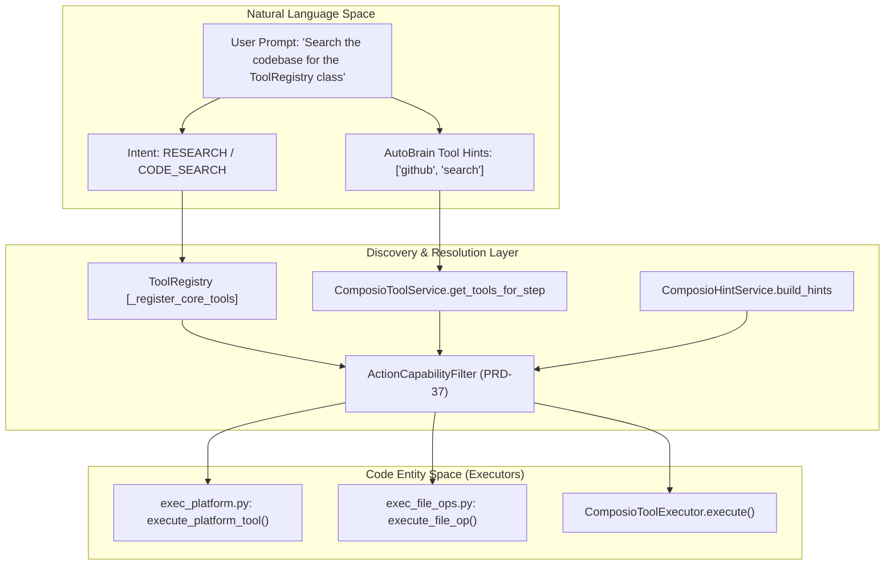
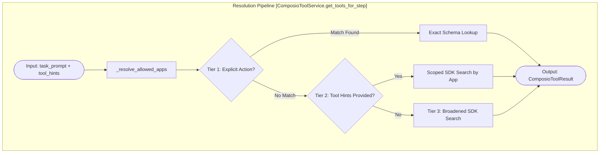

# Tool Discovery & Resolution

Relevant source files

The following files were used as context for generating this wiki page:

- [orchestrator/alembic/versions/prd123_tool_tier.py](orchestrator/alembic/versions/prd123_tool_tier.py)
- [orchestrator/api/tools.py](orchestrator/api/tools.py)
- [orchestrator/consumers/__init__.py](orchestrator/consumers/__init__.py)
- [orchestrator/consumers/chatbot/__init__.py](orchestrator/consumers/chatbot/__init__.py)
- [orchestrator/consumers/chatbot/tool_router.py](orchestrator/consumers/chatbot/tool_router.py)
- [orchestrator/core/composio/client.py](orchestrator/core/composio/client.py)
- [orchestrator/core/composio/tool_executor.py](orchestrator/core/composio/tool_executor.py)
- [orchestrator/core/models/tools.py](orchestrator/core/models/tools.py)
- [orchestrator/modules/agents/factory/agent_factory.py](orchestrator/modules/agents/factory/agent_factory.py)
- [orchestrator/modules/tools/__init__.py](orchestrator/modules/tools/__init__.py)
- [orchestrator/modules/tools/execution/exec_platform.py](orchestrator/modules/tools/execution/exec_platform.py)
- [orchestrator/modules/tools/execution/unified_executor.py](orchestrator/modules/tools/execution/unified_executor.py)
- [orchestrator/modules/tools/registry/tool_registry.py](orchestrator/modules/tools/registry/tool_registry.py)
- [orchestrator/modules/tools/services/composio_hint_service.py](orchestrator/modules/tools/services/composio_hint_service.py)
- [orchestrator/modules/tools/services/composio_tool_service.py](orchestrator/modules/tools/services/composio_tool_service.py)
- [orchestrator/services/metadata_sync_service.py](orchestrator/services/metadata_sync_service.py)

## Purpose and Scope

This page documents the tool discovery, registration, and resolution systems within Automatos AI. The architecture centers around a centralized `ToolRegistry` and a specialized `ComposioToolService` that implements a multi-tier resolution strategy for discovering actions. These systems bridge the gap between Natural Language (user prompts) and Code Entities (tool schemas and executors).

Key components include:
- **ToolRegistry**: The single source of truth for all platform tools [orchestrator/modules/tools/registry/tool_registry.py:157-167]().
- **ComposioCache**: Database-backed caching for external app metadata (`ComposioAppCache`) and action schemas (`ComposioActionCache`) [orchestrator/core/models/composio_cache.py:25-25]().
- **AgentAppAssignment**: Mapping of specific applications to agents [orchestrator/modules/tools/services/composio_tool_service.py:35-35]().
- **3-Tier Resolution**: A cascading strategy (Capability, Token-filtered, Top-N) to find relevant actions within token budgets [orchestrator/modules/tools/services/composio_hint_service.py:12-21]().

---

## Tool Discovery Architecture

The discovery process maps high-level intents to specific executable code entities defined in the `UnifiedToolExecutor` and external Composio actions.

### Natural Language to Code Entity Mapping

**Sources:**
- [orchestrator/modules/tools/registry/tool_registry.py:157-181]()
- [orchestrator/modules/tools/execution/unified_executor.py:67-168]()
- [orchestrator/modules/tools/services/composio_tool_service.py:72-113]()
- [orchestrator/modules/tools/services/composio_hint_service.py:89-124]()
- [orchestrator/modules/tools/execution/exec_platform.py:13-26]()

---

## Core Components

### 1. ToolRegistry
The `ToolRegistry` [orchestrator/modules/tools/registry/tool_registry.py:157-181]() manages the lifecycle of `ToolSpec` objects. It categorizes tools (RESEARCH, FILE_OPERATIONS, SHELL_COMMANDS, etc.) and exports them into OpenAI-compatible function-calling formats.

- **Core Tools**: Automatically registered during initialization, including `search_knowledge`, `search_codebase`, and `query_database` [orchestrator/modules/tools/registry/tool_registry.py:177-178]().
- **ToolSpec**: Defines the `executor_class` and `executor_method` required to run the tool, along with security levels [orchestrator/modules/tools/registry/tool_registry.py:89-108]().

### 2. Composio Cache & Metadata
To avoid expensive SDK overhead during every request, the system utilizes database-backed models and a sync service:
- `ComposioActionCache`: Stores the actual JSON schemas for actions [orchestrator/core/models/composio_cache.py:25-25]().
- `MetadataSyncService`: Periodically fetches bulk data from the Composio SDK to populate the local cache, preventing per-request API latency [orchestrator/services/metadata_sync_service.py:37-47]().
- `AgentAppAssignment`: Tracks which applications are enabled for specific agents [orchestrator/modules/tools/services/composio_tool_service.py:35-35]().

### 3. UnifiedToolExecutor
The `UnifiedToolExecutor` acts as the routing hub for execution. It maintains a `tool_routes` map that delegates to specific modules like `exec_platform`, `exec_file_ops`, and `exec_composio` [orchestrator/modules/tools/execution/unified_executor.py:105-166](). It also handles dynamic routing for Composio actions using a name-prefix check or cache lookup [orchestrator/modules/tools/execution/unified_executor.py:98-102]().

---

## 3-Tier Tool Resolution

The `ComposioToolService` and `ComposioHintService` implement a cascading strategy to resolve user prompts into specific tool schemas while respecting the `_MAX_TOOLS` limit (default 30) to protect the LLM's context window [orchestrator/modules/tools/services/composio_tool_service.py:41-41]().

### Tier 1: Explicit Action Names (Exact Lookup)
The system uses the `_ACTION_NAME_RE` regex to extract strings that look like exact Composio actions (e.g., `GITHUB_CREATE_ISSUE`) [orchestrator/modules/tools/services/composio_tool_service.py:76-76]().
- **Strategy**: If found, it performs an exact schema lookup via the `ComposioClient` [orchestrator/modules/tools/services/composio_tool_service.py:142-167]().

### Tier 2: Token-Filtered Search (Capability Scoping)
If no explicit names are found, the system uses `tool_hints` (often from AutoBrain complexity assessment) to scope the search.
- **Logic**: It maps hints like "email" to specific apps like `["gmail"]` using the `_HINT_TO_APPS` dictionary [orchestrator/modules/tools/services/composio_tool_service.py:80-95]().
- **Refinement**: In `ComposioHintService`, actions must match capability terms derived from the intent taxonomy to be included. Capability terms are a **mandatory gate**, not just a score boost [orchestrator/modules/tools/services/composio_hint_service.py:17-21]().

### Tier 3: Top-N Fallback
If specific searches return zero results, the system broadens the search to all allowed apps for the agent, sorting by relevance and capping at the limit [orchestrator/modules/tools/services/composio_tool_service.py:112-113]().

### Resolution Flow Diagram

**Sources:**
- [orchestrator/modules/tools/services/composio_tool_service.py:97-114]()
- [orchestrator/modules/tools/services/composio_tool_service.py:141-167]()
- [orchestrator/modules/tools/services/composio_hint_service.py:12-21]()

---

## Tool Execution and Routing

Once a tool is discovered and selected by the LLM, the `UnifiedToolExecutor` handles the actual call.

### Execution Path
1. **Routing**: The executor looks up the `tool_name` in its `tool_routes` map [orchestrator/modules/tools/execution/unified_executor.py:105-166]().
2. **Platform Tools**: Research tools like `search_knowledge` or `search_codebase` are routed to `exec_platform.py` [orchestrator/modules/tools/execution/exec_platform.py:13-26]().
3. **Composio Tools**: Actions are routed to the `ComposioToolExecutor`. This executor validates that the agent has explicit permission for the specific action via `AgentAppFeature` [orchestrator/core/composio/tool_executor.py:66-124]().
4. **Validation**: Before execution, `ActionCapabilityFilter` (PRD-37) enforces defense-in-depth by checking if the action is permitted for the current intent [orchestrator/modules/tools/execution/unified_executor.py:44-51]().

### Formatting Results
Tool outputs are passed through the `ToolResultFormatter` to ensure consistency. In the chatbot, `build_tool_context_message` adds "CRITICAL INSTRUCTIONS" and standardized emojis to guide the LLM's response based on the tool data [orchestrator/consumers/chatbot/tool_router.py:47-58]().

**Sources:**
- [orchestrator/modules/tools/execution/unified_executor.py:105-166]()
- [orchestrator/core/composio/tool_executor.py:141-162]()
- [orchestrator/consumers/chatbot/tool_router.py:47-58]()

---

## Tool Hint Service

The `ComposioHintService` provides a specialized discovery mechanism for the `CHATBOT` mode. Instead of providing full JSON schemas for every possible action (which would exceed token limits), it injects "hints" into the system message.

### Resolution Strategies
- **Recipe Mode**: Skips taxonomy and uses prompt tokens directly for ILIKE matching. This is optimized for specific workflow steps where the prompt is highly curated and scales to any number of tools without manual taxonomy maintenance [orchestrator/modules/tools/services/composio_hint_service.py:117-120]().
- **Chatbot Mode**: Uses the 3-tier capability resolution to find the most relevant actions for a conversational query [orchestrator/modules/tools/services/composio_hint_service.py:161-178]().

**Sources:**
- [orchestrator/modules/tools/services/composio_hint_service.py:103-124]()
- [orchestrator/modules/tools/services/composio_hint_service.py:152-160]()

---

## Data Flow: Discovery to Execution

1. **Request**: `SmartChatOrchestrator` receives a message and extracts the intent.
2. **Context Building**: `ContextService` is invoked to build the prompt. It calls `ComposioHintService.build_hints` if the intent requires tools.
3. **Discovery**: The `ToolsSection` within `ContextService` gathers core tools from the `ToolRegistry` and external actions from `ComposioToolService`.
4. **Resolution**: The 3-tier strategy filters thousands of potential actions down to the top candidates based on `tool_hints` and `allowed_apps`.
5. **LLM Selection**: The LLM receives the assembled context and selects a tool (e.g., `search_codebase` or `composio_execute`).
6. **Execution**: `UnifiedToolExecutor` receives the call, validates it via `ActionCapabilityFilter`, and executes the logic via the appropriate sub-executor [orchestrator/modules/tools/execution/unified_executor.py:67-91]().

**Sources:**
- [orchestrator/modules/tools/execution/unified_executor.py:105-166]()
- [orchestrator/modules/tools/services/composio_hint_service.py:103-124]()
- [orchestrator/modules/tools/services/composio_tool_service.py:97-113]()

---