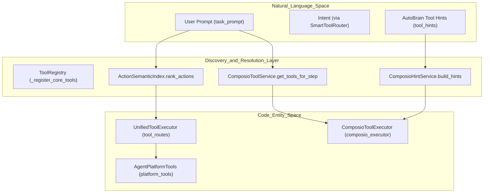
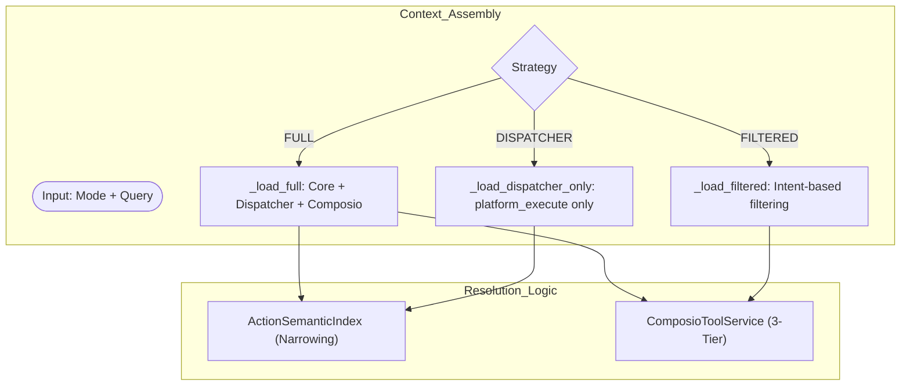

# Tool Discovery & Resolution

Relevant source files

The following files were used as context for generating this wiki page:

- [frontend/components/suggestions/SuggestionChip.tsx](frontend/components/suggestions/SuggestionChip.tsx)
- [frontend/components/suggestions/ToolSuggestionBar.tsx](frontend/components/suggestions/ToolSuggestionBar.tsx)
- [orchestrator/alembic/versions/20260129_add_app_suggestions.py](orchestrator/alembic/versions/20260129_add_app_suggestions.py)
- [orchestrator/alembic/versions/20260129_merge_heads.py](orchestrator/alembic/versions/20260129_merge_heads.py)
- [orchestrator/alembic/versions/prd123_cost_tracking.py](orchestrator/alembic/versions/prd123_cost_tracking.py)
- [orchestrator/alembic/versions/prd123_tool_tier.py](orchestrator/alembic/versions/prd123_tool_tier.py)
- [orchestrator/alembic/versions/prd142_wave5_drop_dead_tables.py](orchestrator/alembic/versions/prd142_wave5_drop_dead_tables.py)
- [orchestrator/consumers/chatbot/tool_router.py](orchestrator/consumers/chatbot/tool_router.py)
- [orchestrator/core/models/composio_cache.py](orchestrator/core/models/composio_cache.py)
- [orchestrator/core/models/tools.py](orchestrator/core/models/tools.py)
- [orchestrator/modules/context/sections/platform_actions.py](orchestrator/modules/context/sections/platform_actions.py)
- [orchestrator/modules/context/sections/tools.py](orchestrator/modules/context/sections/tools.py)
- [orchestrator/modules/tools/discovery/action_registry.py](orchestrator/modules/tools/discovery/action_registry.py)
- [orchestrator/modules/tools/discovery/action_semantic_index.py](orchestrator/modules/tools/discovery/action_semantic_index.py)
- [orchestrator/modules/tools/execution/unified_executor.py](orchestrator/modules/tools/execution/unified_executor.py)
- [orchestrator/modules/tools/registry/tool_registry.py](orchestrator/modules/tools/registry/tool_registry.py)
- [orchestrator/modules/tools/services/composio_hint_service.py](orchestrator/modules/tools/services/composio_hint_service.py)
- [orchestrator/modules/tools/services/composio_tool_service.py](orchestrator/modules/tools/services/composio_tool_service.py)
- [orchestrator/modules/tools/tool_router.py](orchestrator/modules/tools/tool_router.py)
- [orchestrator/scripts/prd_parity.py](orchestrator/scripts/prd_parity.py)
- [orchestrator/services/tool_manifest_service.py](orchestrator/services/tool_manifest_service.py)
- [orchestrator/tests/test_action_registry_filtered.py](orchestrator/tests/test_action_registry_filtered.py)
- [orchestrator/tests/test_action_semantic_index.py](orchestrator/tests/test_action_semantic_index.py)
- [orchestrator/tests/test_platform_actions_section.py](orchestrator/tests/test_platform_actions_section.py)
- [orchestrator/tests/test_tool_router_semantic.py](orchestrator/tests/test_tool_router_semantic.py)

## Purpose and Scope

This page documents the tool discovery, registration, and resolution systems within Automatos AI. The architecture centers around a centralized `ToolRegistry` [orchestrator/modules/tools/registry/tool_registry.py:158-181](), `ActionRegistry` [orchestrator/modules/tools/discovery/action_registry.py:59-69](), and specialized services like `ComposioToolService` [orchestrator/modules/tools/services/composio_tool_service.py:63-70]() and `ComposioHintService` [orchestrator/modules/tools/services/composio_hint_service.py:89-102]() that implement capability-filtered and token-filtered resolution tiers. These systems bridge the gap between Natural Language inputs and Code Entity Space executions.

Key components covered:
- **ToolRegistry & ActionRegistry**: Centralized specification and execution routing for platform and custom tools.
- **ActionSemanticIndex**: Vector-based semantic similarity ranking for narrowing tool surfaces using embedding managers [orchestrator/modules/tools/discovery/action_semantic_index.py:113-122]().
- **Multi-Tier Resolution**: Capability-filtered, token-filtered, and top-N resolution tiers [orchestrator/modules/tools/services/composio_hint_service.py:12-21]().

---

## Tool Discovery Architecture

The discovery pipeline maps high-level user intents and system prompts to specific executable code entities defined across `UnifiedToolExecutor` [orchestrator/modules/tools/execution/unified_executor.py:58-64](), `ActionRegistry` [orchestrator/modules/tools/discovery/action_registry.py:59-69](), and external integration suites.

**Sources:**
- [orchestrator/modules/tools/registry/tool_registry.py:158-181]()
- [orchestrator/modules/tools/execution/unified_executor.py:58-146]()
- [orchestrator/modules/tools/services/composio_tool_service.py:63-113]()
- [orchestrator/modules/tools/discovery/action_semantic_index.py:113-137]()

---

## Core Components

### 1. ToolRegistry & ActionRegistry
The `ToolRegistry` [orchestrator/modules/tools/registry/tool_registry.py:158-181]() manages the lifecycle of `ToolSpec` objects. It groups tools using the `ToolCategory` enum (`RESEARCH`, `FILE_OPERATIONS`, `SHELL_COMMANDS`, etc.) [orchestrator/modules/tools/registry/tool_registry.py:38-50]().

The `ActionRegistry` [orchestrator/modules/tools/discovery/action_registry.py:59-69]() manages platform-level management actions via `ActionDefinition` [orchestrator/modules/tools/discovery/action_registry.py:27-46](). It provides conversion methods such as `to_openai_tools` [orchestrator/modules/tools/discovery/action_registry.py:111-131]() and `to_first_class_schemas` [orchestrator/modules/tools/discovery/action_registry.py:138-163]().

**Sources:**
- [orchestrator/modules/tools/registry/tool_registry.py:38-50]()
- [orchestrator/modules/tools/registry/tool_registry.py:158-181]()
- [orchestrator/modules/tools/discovery/action_registry.py:27-69]()
- [orchestrator/modules/tools/discovery/action_registry.py:111-163]()

### 2. ActionSemanticIndex
The `ActionSemanticIndex` [orchestrator/modules/tools/discovery/action_semantic_index.py:113-122]() embeds platform `ActionDefinition` instances and evaluates cosine similarity against incoming queries using an underlying `EmbeddingManager` and Redis caching layer. It supports request-scoped memoization via `rank_actions_scope()` [orchestrator/modules/tools/discovery/action_semantic_index.py:41-55]() to prevent redundant embedding generation during context assembly turns.

**Sources:**
- [orchestrator/modules/tools/discovery/action_semantic_index.py:41-55]()
- [orchestrator/modules/tools/discovery/action_semantic_index.py:113-137]()

### 3. UnifiedToolExecutor
`UnifiedToolExecutor` [orchestrator/modules/tools/execution/unified_executor.py:58-64]() acts as the routing nexus for execution requests. Its `tool_routes` map delegates specialized execution tasks to modules such as `exec_platform`, `exec_file_ops`, `exec_shell`, and `exec_composio` [orchestrator/modules/tools/execution/unified_executor.py:28-35](). Heavy dependencies like the Composio executor are lazy-loaded via `_get_composio_executor()` [orchestrator/modules/tools/execution/unified_executor.py:44-53]().

**Sources:**
- [orchestrator/modules/tools/execution/unified_executor.py:28-64]()
- [orchestrator/modules/tools/execution/unified_executor.py:96-146]()

---

## Multi-Tier Tool Resolution

Tool resolution behavior adapts based on the active context mode (Chatbot, Recipe, or Heartbeat) and filtering strategies managed by `ToolsSection` [orchestrator/modules/context/sections/tools.py:41-51]().

### 1. Semantic Narrowing & Platform Actions
Platform action surfaces are filtered dynamically by `PlatformActionsSection` [orchestrator/modules/context/sections/platform_actions.py:30-42](). When semantic routing is enabled via configuration flags, `ActionSemanticIndex` ranks actions against runtime queries, reducing catalog token footprints [orchestrator/modules/context/sections/platform_actions.py:72-91]().

### 2. Composio Tool Service Strategy
`ComposioToolService` resolves external integration actions through a sequential resolution pipeline [orchestrator/modules/tools/services/composio_tool_service.py:97-113]():
- **Exact Name Lookup**: Extracts action identifiers (e.g., `GITHUB_CREATE_A_REFERENCE`) using regex patterns [orchestrator/modules/tools/services/composio_tool_service.py:75-76]().
- **Hint-Scoped Search**: Maps AutoBrain `tool_hints` to specific allowed application packages [orchestrator/modules/tools/services/composio_tool_service.py:78-95]().
- **SDK Semantic Search**: Queries the downstream Composio SDK via semantic parameters [orchestrator/modules/tools/services/composio_tool_service.py:111-111]().
- **Broadened Fallback**: Falls back to general app-level candidate lists when specific queries yield empty results [orchestrator/modules/tools/services/composio_tool_service.py:112-113]().

### Resolution Flow Diagram

**Sources:**
- [orchestrator/modules/context/sections/tools.py:41-113]()
- [orchestrator/modules/context/sections/platform_actions.py:48-91]()
- [orchestrator/modules/tools/services/composio_tool_service.py:97-113]()

---

## Tool Hint Service

`ComposioHintService` generates formatted system prompt hints listing candidate actions while constraining context budgets [orchestrator/modules/tools/services/composio_hint_service.py:89-124]().

### Resolution Tiers:
1. **Tier 1 (Capability-based)**: Matches required capabilities against `ComposioActionMetadata` [orchestrator/modules/tools/services/composio_hint_service.py:12-21]().
2. **Tier 2 (Token-filtered with Capability Gate)**: Enforces capability taxonomy matching as a mandatory gate alongside `ILIKE` token matches [orchestrator/modules/tools/services/composio_hint_service.py:12-21]().
3. **Tier 3 (Top-N Fallback)**: Retrieves safe baseline actions per connected application when filtered candidates are insufficient [orchestrator/modules/tools/services/composio_hint_service.py:12-21]().

**Sources:**
- [orchestrator/modules/tools/services/composio_hint_service.py:12-21]()
- [orchestrator/modules/tools/services/composio_hint_service.py:89-124]()

---

## Tool Execution Path & Validation

1. **Invocation**: The LLM executes a tool call via standard function-calling payloads or `platform_execute` [orchestrator/modules/tools/execution/unified_executor.py:58-146]().
2. **Routing & Dispatch**: `ToolRouter` and `UnifiedToolExecutor` route the request to the corresponding executor module [orchestrator/modules/tools/tool_router.py:54-61]().
3. **Execution-Time Validation**: Capability filters (`ActionCapabilityFilter`) evaluate request intents against security boundaries at execution time [orchestrator/modules/tools/tool_router.py:37-45]().
4. **Telemetry & Capture**: Executions fire traces via `fire_tool_trace` [orchestrator/modules/execution/unified_executor.py:38-38]() and record outcomes using `capture_tool_outcome` [orchestrator/modules/memory/tool_outcome_capture.py]() for downstream memory analysis.
5. **Formatting**: Results are processed by `ToolResultFormatter` before returning structured summaries to the agent run loop [orchestrator/modules/tools/formatting/result_formatter.py]().

**Sources:**
- [orchestrator/modules/tools/execution/unified_executor.py:23-39]()
- [orchestrator/modules/tools/tool_router.py:37-61]()

---