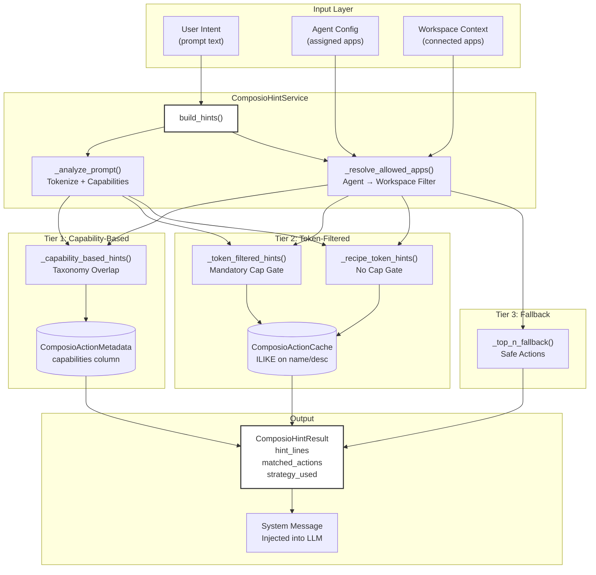
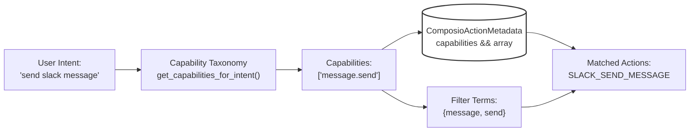
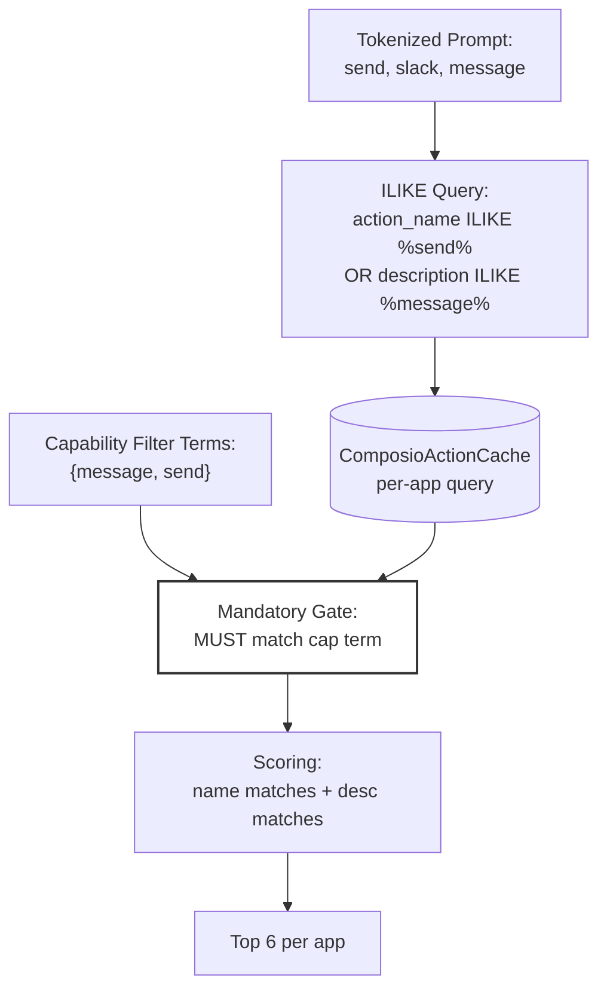
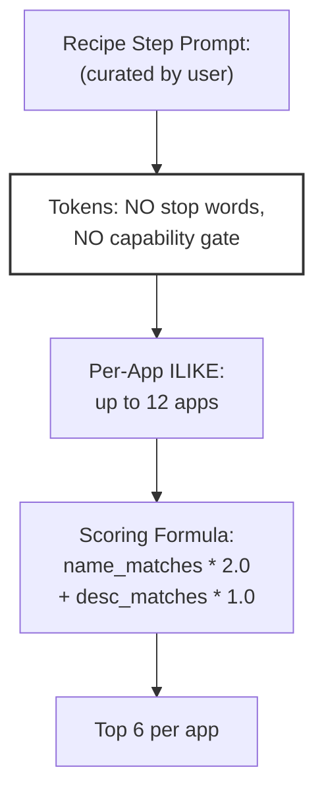
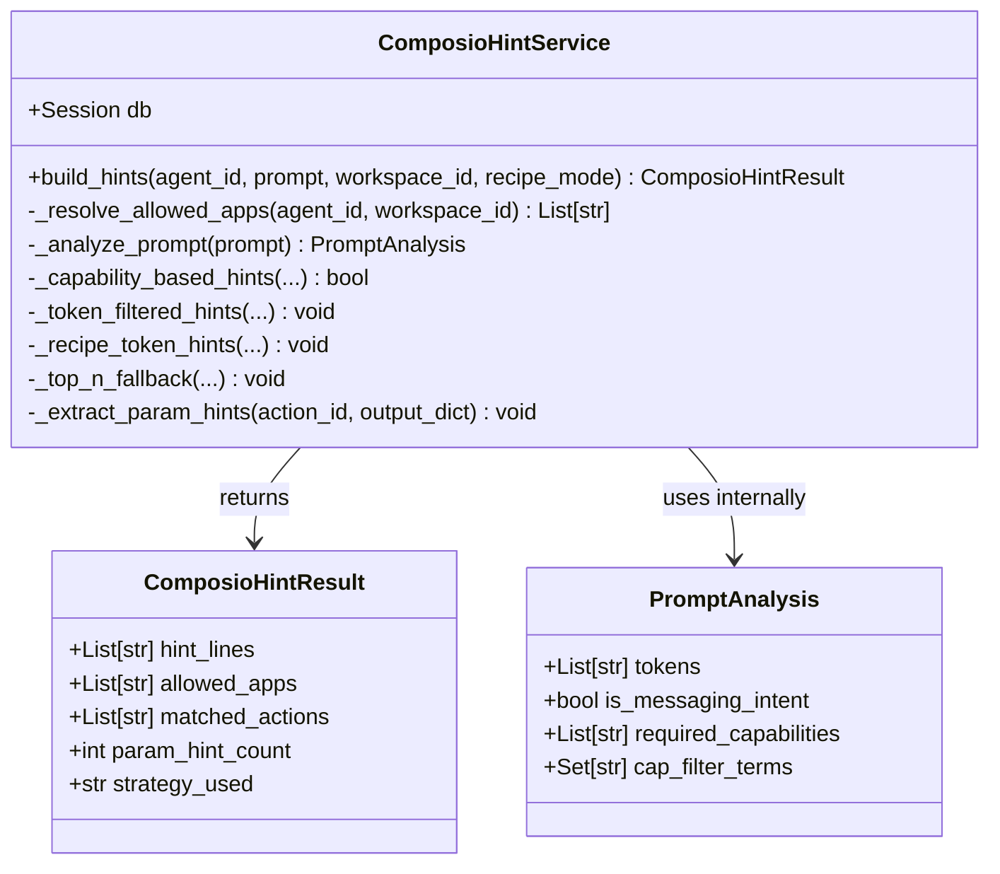
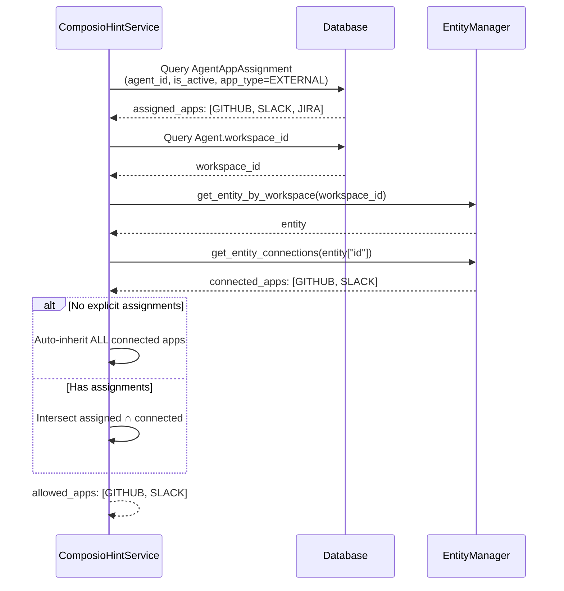
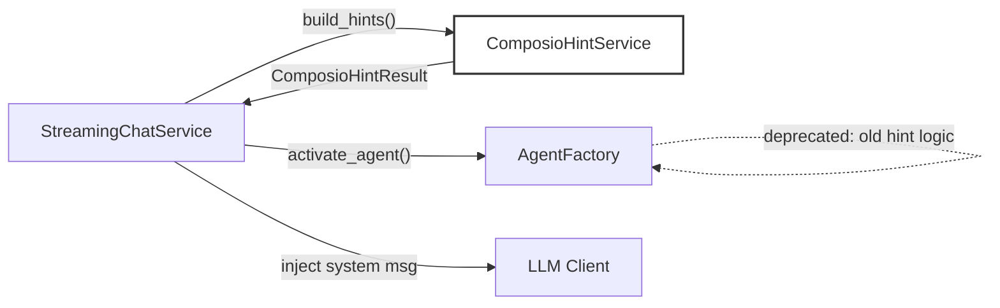
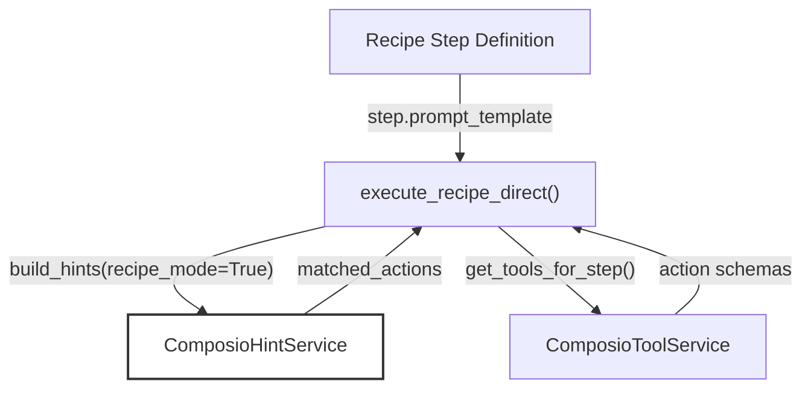
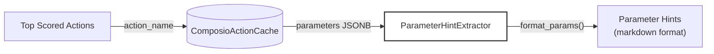

# Tool Hint Service

<details>
<summary>Relevant source files</summary>

The following files were used as context for generating this wiki page:

- [docs/DoctorsNotes.docx](docs/DoctorsNotes.docx)
- [orchestrator/api/tools.py](orchestrator/api/tools.py)
- [orchestrator/consumers/chatbot/tool_router.py](orchestrator/consumers/chatbot/tool_router.py)
- [orchestrator/core/composio/client.py](orchestrator/core/composio/client.py)
- [orchestrator/modules/tools/execution/unified_executor.py](orchestrator/modules/tools/execution/unified_executor.py)
- [orchestrator/modules/tools/registry/tool_registry.py](orchestrator/modules/tools/registry/tool_registry.py)
- [orchestrator/modules/tools/services/composio_hint_service.py](orchestrator/modules/tools/services/composio_hint_service.py)
- [orchestrator/modules/tools/services/composio_tool_service.py](orchestrator/modules/tools/services/composio_tool_service.py)
- [orchestrator/modules/tools/tool_router.py](orchestrator/modules/tools/tool_router.py)
- [orchestrator/services/metadata_sync_service.py](orchestrator/services/metadata_sync_service.py)

</details>


The Tool Hint Service generates system message hints for LLMs, listing candidate Composio actions that match user intent. This service acts as a pre-filtering layer before tool execution, helping the LLM select the most relevant actions from 880+ apps with 12,000+ actions. For actual tool execution, see [Tool Router & Execution](#6.3). For tool discovery and metadata, see [Tool Discovery & Resolution](#6.2).

---

## Purpose & Scope

The `ComposioHintService` is the single source of truth for generating action hints across all consumers (chatbot, recipe executor, workflow engine). It replaces three divergent implementations that previously existed:

- `consumers/chatbot/service.py` stream methods (token ILIKE only, no safety filtering)
- `modules/agents/factory/agent_factory.py` (3-tier with broken scoring)
- Recipe executor inline logic

The service outputs system message text that lists available Composio action names, which are then injected into LLM context to guide tool selection.

**Sources:** [orchestrator/modules/tools/services/composio_hint_service.py:1-22]()

---

## Architecture Overview



**Sources:** [orchestrator/modules/tools/services/composio_hint_service.py:89-212]()

---

## Three-Tier Resolution Strategy

The service uses a hierarchical fallback strategy to match actions to user intent:

| Tier | Strategy | Database Table | Fallback Condition |
|------|----------|----------------|-------------------|
| **Tier 1** | Capability-based | `ComposioActionMetadata` | Requires taxonomy match + metadata exists |
| **Tier 2** | Token-filtered | `ComposioActionCache` | Tier 1 returned 0 results + tokens extracted |
| **Tier 3** | Top-N fallback | `ComposioActionCache` | Tiers 1 & 2 returned 0 results (chatbot only) |

### Tier 1: Capability-Based Hints

Uses the capability taxonomy to match actions:



**Key Implementation Details:**

- Queries `ComposioActionMetadata` table with `capabilities.overlap()` operator
- Filters out destructive actions (`destructive = False`)
- Scores by: capability matches (40%) + keyword overlap (40%) + confidence (20%)
- Only activates when taxonomy returns **specific** capabilities (not generic fallback like `data.query`)

**Sources:** [orchestrator/modules/tools/services/composio_hint_service.py:316-392]()

### Tier 2: Token-Filtered Hints (Chatbot Mode)

When Tier 1 fails, uses prompt tokens with a **mandatory capability gate**:



**Critical Fix:** The capability terms act as a **mandatory gate**, not a score boost. This prevents irrelevant actions like `SLACK_CREATE_CHANNEL_BASED_CONVERSATION` from competing with `SLACK_SEND_MESSAGE` for messaging intents.

**Sources:** [orchestrator/modules/tools/services/composio_hint_service.py:433-550]()

### Tier 2 Alternative: Recipe Mode Token Hints

Recipe mode bypasses the taxonomy entirely, using **pure token matching**:



**Key Differences from Chatbot Mode:**

- **No taxonomy lookup** — scales to any number of tools without manual curation
- **No capability gate** — relies on the curated prompt being specific
- **Heavier name weighting** — `JIRA_GET_ISSUE` ranks high even if "get" ≠ "read"
- Used when `recipe_mode=True` flag is set

**Sources:** [orchestrator/modules/tools/services/composio_hint_service.py:397-432](), [orchestrator/modules/tools/services/composio_hint_service.py:152-159]()

### Tier 3: Top-N Fallback

**Only used in chatbot mode** when Tiers 1 & 2 both return zero results:

- Returns up to 10 safe actions per app (capped at 6 apps, 60 actions total)
- Filters destructive actions (`NOT ILIKE` on dangerous tokens: archive, delete, etc.)
- Orders by `action_name` ASC for consistency

**Sources:** [orchestrator/modules/tools/services/composio_hint_service.py:554-626]()

---

## Core Components

### ComposioHintService Class



**Sources:** [orchestrator/modules/tools/services/composio_hint_service.py:89-99](), [orchestrator/modules/tools/services/composio_hint_service.py:67-84]()

### Key Method: build_hints()

```python
def build_hints(
    self,
    agent_id: int,
    prompt: str,
    workspace_id=None,
    recipe_mode: bool = False,
) -> ComposioHintResult
```

**Parameters:**

| Parameter | Type | Description |
|-----------|------|-------------|
| `agent_id` | `int` | Agent whose app assignments to query |
| `prompt` | `str` | User prompt / task text to match actions against |
| `workspace_id` | `UUID` (optional) | Workspace UUID to filter by connected apps |
| `recipe_mode` | `bool` | When True, skips taxonomy gate and uses direct token matching |

**Returns:** `ComposioHintResult` with:
- `hint_lines`: List of strings for LLM system message
- `matched_actions`: Action names that were selected
- `strategy_used`: One of `"capability"`, `"token_filtered"`, `"recipe_token"`, `"fallback"`, `"none"`

**Sources:** [orchestrator/modules/tools/services/composio_hint_service.py:103-212]()

---

## App Resolution Flow

Before matching actions, the service determines which apps the agent can use:



**Auto-Inheritance Logic:** When an agent has **no explicit app assignments**, it inherits all workspace-connected apps. This prevents empty tool lists when agents haven't been configured yet.

**Sources:** [orchestrator/modules/tools/services/composio_hint_service.py:217-275]()

---

## Output Format

The service generates a system message with this structure:

```
You have these external apps connected (via Composio): GITHUB, SLACK, JIRA.
IMPORTANT: To interact with these apps, call `composio_execute` with the EXACT action name from the list below. Do NOT guess or invent action names — only use the exact names listed here. Do NOT use search_codebase to look for code when your task is to interact with external apps.
Usage: composio_execute({"action": "ACTION_NAME", "params": {<action-specific fields>}}). All action parameters (issue_key, channel, text, etc.) MUST go inside the `params` object.
- SLACK available actions (use these EXACT names): SLACK_SEND_MESSAGE, SLACK_LIST_CHANNELS, SLACK_GET_MESSAGE
- GITHUB available actions (use these EXACT names): GITHUB_CREATE_ISSUE, GITHUB_GET_ISSUE, GITHUB_LIST_REPOS

Parameter hints (pass these inside `params`):

SLACK_SEND_MESSAGE:
  - channel (string, required): Channel ID to send message to
  - text (string, required): Message text content

GITHUB_CREATE_ISSUE:
  - repo (string, required): Repository name (owner/repo)
  - title (string, required): Issue title
  - body (string, optional): Issue description

You MUST call `composio_execute` to fulfill the user's request. Do NOT describe the action in text — actually invoke the tool.
```

**Key Features:**

1. **Exact action names** — prevents LLM from inventing names
2. **Grouped by app** — easy to scan
3. **Parameter hints** — top 5-10 actions get full param schemas
4. **Strong directive** — triggers `tool_choice="required"` in OpenAI client (when the text contains "You MUST call")

**Sources:** [orchestrator/modules/tools/services/composio_hint_service.py:137-201]()

---

## Integration with Other Systems

### Usage in Chat Service



The chat service calls `ComposioHintService.build_hints()` early in the request flow (before agent activation), then injects the result as a system message.

**Sources:** [orchestrator/consumers/chatbot/service.py]() (referenced in comments)

### Usage in Recipe Executor



The recipe executor uses `recipe_mode=True` to bypass taxonomy and rely on the curated `prompt_template` for token matching.

**Sources:** [orchestrator/api/recipe_executor.py]() (referenced in comments)

---

## Constants & Configuration

### Token Limits

| Constant | Value | Purpose |
|----------|-------|---------|
| `MAX_QUERY_TOKENS` | 10 | Max tokens extracted from prompt |
| `MAX_APPS_SEARCH` | 12 | Max apps to query in ILIKE search |
| `MAX_DB_ROWS_PER_APP` | 100 | Max rows fetched per app from cache |
| `MAX_ACTIONS_PER_APP` | 6 | Max actions returned per app |
| `MAX_PARAM_HINT_ACTIONS` | 10 | Max actions with full param schemas |
| `MAX_PARAMS_PER_ACTION` | 5 | Max params shown per action |
| `MAX_APPS_FALLBACK` | 6 | Max apps in Tier 3 fallback |
| `MAX_FALLBACK_ROWS` | 10 | Max rows per app in fallback |

**Sources:** [orchestrator/modules/tools/services/composio_hint_service.py:54-61]()

### Safety Filters

```python
STOP_WORDS: Set[str] = {
    "the", "and", "for", "with", "from", "that", "this",
    "have", "has", "are", "you", "your",
}

DANGEROUS_TOKENS: Set[str] = {
    "archive", "delete", "remove", "revoke", "clear", "close",
    "disable", "ban", "kick", "deactivate", "destroy", "purge",
}
```

**Sources:** [orchestrator/modules/tools/services/composio_hint_service.py:44-51]()

---

## Database Schema Dependencies

### ComposioActionMetadata (Tier 1)

```sql
CREATE TABLE composio_action_metadata (
    id SERIAL PRIMARY KEY,
    app_id VARCHAR(100),
    action_id VARCHAR(255) UNIQUE,
    capabilities TEXT[],  -- Array for overlap operator
    intent_keywords TEXT[],
    classification_confidence FLOAT,
    destructive BOOLEAN DEFAULT FALSE,
    requires_confirmation BOOLEAN DEFAULT FALSE
);

CREATE INDEX idx_metadata_capabilities ON composio_action_metadata 
    USING GIN (capabilities);
```

**Sources:** [orchestrator/modules/tools/capabilities/models.py]() (referenced in code)

### ComposioActionCache (Tiers 2 & 3)

```sql
CREATE TABLE composio_actions_cache (
    id SERIAL PRIMARY KEY,
    app_name VARCHAR(100),
    action_name VARCHAR(255),
    display_name VARCHAR(255),
    description TEXT,
    parameters JSONB,
    response_schema JSONB,
    last_synced_at TIMESTAMP
);

CREATE INDEX idx_cache_app ON composio_actions_cache (app_name);
CREATE INDEX idx_cache_name ON composio_actions_cache (action_name);
```

**Sources:** [orchestrator/core/models/composio_cache.py:1-50]() (model definitions)

---

## Performance Characteristics

### Query Costs by Tier

| Tier | Database Queries | Typical Latency | Fallback Cost |
|------|------------------|-----------------|---------------|
| **Tier 1** | 1 query (metadata table) | ~10-30ms | No API calls |
| **Tier 2** | 1-12 queries (per-app cache) | ~50-150ms | No API calls |
| **Tier 3** | 1-6 queries (fallback cache) | ~30-80ms | No API calls |

**All tiers are local database queries** — no Composio API calls during hint generation. The metadata sync service ([see Metadata Sync](#6.1)) pre-populates both tables.

**Sources:** [orchestrator/modules/tools/services/composio_hint_service.py:1-22]() (design comments)

---

## Parameter Hint Extraction

The service extracts parameter schemas for the **top 5-10 actions** to provide inline documentation:



**Example Output:**

```
SLACK_SEND_MESSAGE:
  - channel (string, required): Channel ID to send message to
  - text (string, required): Message text content
  - thread_ts (string, optional): Timestamp of thread to reply to
```

**Sources:** [orchestrator/modules/tools/services/composio_hint_service.py:628-688](), [orchestrator/modules/tools/formatting/schema_detector.py:1-50]()

---

## Error Handling & Logging

### Graceful Degradation

```python
try:
    result = self._capability_based_hints(...)
except Exception as e:
    logger.warning(f"[ComposioHintService] Tier 1 failed: {e}")
    return False  # Fall through to Tier 2
```

Each tier catches exceptions and returns empty results, allowing fallback to the next tier. The service **never throws exceptions** to the caller.

### Debug Logging

```python
logger.info(
    f"[ComposioHintService] agent={agent_id} strategy={result.strategy_used} "
    f"apps={allowed_apps} matches={len(result.matched_actions)} "
    f"param_hints={result.param_hint_count}"
)
```

All hint generation is logged with:
- Agent ID
- Strategy used (capability / token_filtered / recipe_token / fallback / none)
- Allowed apps
- Number of matched actions
- Number of parameter hints

**Sources:** [orchestrator/modules/tools/services/composio_hint_service.py:203-212]()

---

## Relationship to ComposioToolService

The `ComposioHintService` is **distinct from** `ComposioToolService` ([see Tool Discovery](#6.2)):

| Aspect | ComposioHintService | ComposioToolService |
|--------|---------------------|---------------------|
| **Purpose** | Generate LLM hints (action selection) | Fetch action schemas for execution |
| **Output** | System message text | OpenAI function schemas |
| **Resolution** | 3-tier (capability → token → fallback) | 3-tier (explicit → SDK search → cache) |
| **When Called** | Before LLM invocation | During agent activation |
| **Mode** | Chatbot vs Recipe | Step execution only |

**Both services query the same database tables** (`ComposioActionMetadata`, `ComposioActionCache`) but with different filtering logic.

**Sources:** [orchestrator/modules/tools/services/composio_tool_service.py:1-22](), [orchestrator/modules/tools/services/composio_hint_service.py:1-22]()

---

## Usage Examples

### Chatbot Mode

```python
from modules.tools.services.composio_hint_service import ComposioHintService

hint_service = ComposioHintService(db_session)
result = hint_service.build_hints(
    agent_id=42,
    prompt="send a message to the team in slack",
    workspace_id=workspace_uuid,
    recipe_mode=False  # Chatbot mode
)

if result.hint_lines:
    # Inject into LLM context
    system_msg = {"role": "system", "content": "\n".join(result.hint_lines)}
    messages.insert(0, system_msg)
```

### Recipe Mode

```python
result = hint_service.build_hints(
    agent_id=42,
    prompt="Get the latest issue from PROJ-123 and summarize it",
    workspace_id=workspace_uuid,
    recipe_mode=True  # Skip taxonomy, use tokens directly
)

# Result uses "recipe_token" strategy, no capability gate
assert result.strategy_used == "recipe_token"
```

**Sources:** [orchestrator/modules/tools/services/composio_hint_service.py:103-212]()

---

## Future Enhancements

### Planned Improvements (from comments)

1. **Caching of capability extraction** — taxonomy lookup is repeated across requests with similar intents
2. **Per-action popularity scoring** — boost frequently-used actions in fallback tier
3. **Workspace-level action preferences** — learn which actions users prefer per workspace
4. **Token-level caching** — reuse ILIKE query results across similar prompts within a session

**Sources:** [orchestrator/modules/tools/services/composio_hint_service.py:1-40]() (design comments)

---