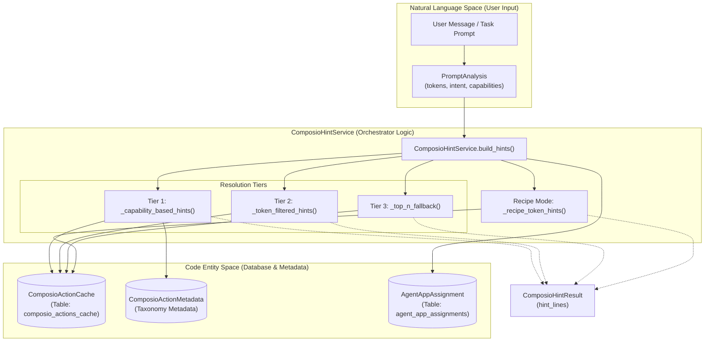
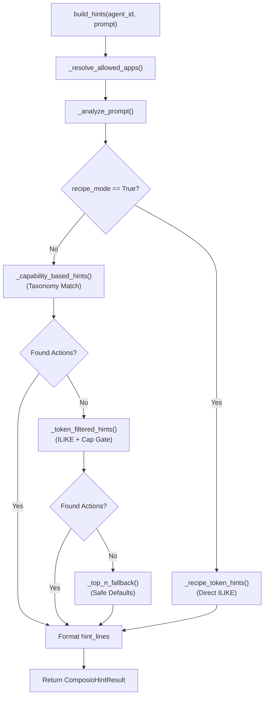

# Tool Hint Service

<details>
<summary>Relevant source files</summary>

The following files were used as context for generating this wiki page:

- [orchestrator/api/tools.py](orchestrator/api/tools.py)
- [orchestrator/core/composio/client.py](orchestrator/core/composio/client.py)
- [orchestrator/core/composio/tool_executor.py](orchestrator/core/composio/tool_executor.py)
- [orchestrator/modules/agents/factory/agent_factory.py](orchestrator/modules/agents/factory/agent_factory.py)
- [orchestrator/modules/tools/services/composio_hint_service.py](orchestrator/modules/tools/services/composio_hint_service.py)
- [orchestrator/modules/tools/services/composio_tool_service.py](orchestrator/modules/tools/services/composio_tool_service.py)
- [orchestrator/services/metadata_sync_service.py](orchestrator/services/metadata_sync_service.py)

</details>


The **Tool Hint Service** (`ComposioHintService`) is a unified system message generator that provides LLMs with curated lists of available Composio actions based on user intent. It replaces multiple divergent code paths with a single, intent-aware resolution strategy that prevents action mismatches (e.g., `SLACK_CREATE_CHANNEL` competing with `SLACK_SEND_MESSAGE` for messaging intents). [orchestrator/modules/tools/services/composio_hint_service.py:1-11]()

For broader tool execution and routing, see [Tool Router & Execution](8.3). For action capability validation at execution time, see [Permission & Validation System](8.5). For Composio integration details, see [Composio Integration](8.1).

---

## Purpose and Scope

The Tool Hint Service solves the **action hint generation problem**: given a user's intent and an agent's app assignments, which Composio actions should be injected into the LLM's system prompt?

### Problem Statement
Prior to this service, fragmented logic led to inconsistent tool discovery:
1. **Chat streaming** used simple token `ILIKE` filtering without safety checks. [orchestrator/modules/tools/services/composio_hint_service.py:8-9]()
2. **Agent execution** used a 3-tier strategy with broken scoring logic. [orchestrator/modules/tools/services/composio_hint_service.py:10-10]()
3. **Recipe execution** often lacked specific hints, causing the LLM to guess action names.

### Solution
A centralized service providing:
- **Three-tier resolution strategy**: Capability-based → Token-filtered → Top-N fallback. [orchestrator/modules/tools/services/composio_hint_service.py:12-15]()
- **Mandatory capability gate**: In Tier 2, actions MUST match at least one capability term to be included, preventing irrelevant tool suggestions. [orchestrator/modules/tools/services/composio_hint_service.py:17-21]()
- **Recipe mode**: A specialized path for curated prompts that uses direct token matching, bypassing the taxonomy for speed and scalability. [orchestrator/modules/tools/services/composio_hint_service.py:117-120]()
- **Parameter hints**: Uses `ParameterHintExtractor` to include schemas for top actions, reducing parameter errors in LLM calls. [orchestrator/modules/tools/services/composio_hint_service.py:37-38]()

Sources: [orchestrator/modules/tools/services/composio_hint_service.py:1-40]()

---

## System Architecture

### Component Integration
The `ComposioHintService` bridges the "Natural Language Space" (user prompts) to the "Code Entity Space" (Composio actions in the database).

**Diagram: Tool Hint Service Integration**



Sources: [orchestrator/modules/tools/services/composio_hint_service.py:89-160](), [orchestrator/core/models/composio_cache.py:25-35]()

---

## Data Models

### PromptAnalysis
Parsed prompt metadata used to drive the resolution tiers. [orchestrator/modules/tools/services/composio_hint_service.py:68-74]()

| Field | Type | Description |
|-------|------|-------------|
| `tokens` | `List[str]` | Cleaned query tokens (stopwords removed). |
| `is_messaging_intent` | `bool` | Detected via `MESSAGING_INTENT_RE`. |
| `required_capabilities` | `List[str]` | Capabilities resolved from taxonomy. |
| `cap_filter_terms` | `Set[str]` | Derived terms for mandatory capability gating. |

### ComposioHintResult
The structured output returned to the context builder. [orchestrator/modules/tools/services/composio_hint_service.py:77-84]()

| Field | Type | Description |
|-------|------|-------------|
| `hint_lines` | `List[str]` | Formatted strings for system message injection. |
| `allowed_apps` | `List[str]` | List of apps the agent is permitted to use. |
| `matched_actions` | `List[str]` | List of specific action names found. |
| `param_hint_count` | `int` | Number of actions with parameter schemas included. |
| `strategy_used` | `str` | Resolution tier identifier (e.g., `"capability"`). |

Sources: [orchestrator/modules/tools/services/composio_hint_service.py:68-84]()

---

## Three-Tier Resolution Strategy

The service uses a waterfall approach to find relevant actions. If a higher tier returns results, lower tiers are typically skipped to save tokens and maintain precision.

**Diagram: Tiered Resolution Flow**



### Tier 1: Capability-Based
Maps user intent to capabilities via `get_capabilities_for_intent(prompt)` from the taxonomy. It queries `ComposioActionMetadata` for actions matching those capabilities. This is the most precise tier. [orchestrator/modules/tools/services/composio_hint_service.py:275-353]()

### Tier 2: Token-Filtered with Mandatory Capability Gate
Uses keyword tokens from the prompt to filter `ComposioActionCache`. 
**Critical Constraint:** Actions must match at least one `cap_filter_term` (e.g., "message", "send") to be included. This prevents `SLACK_CREATE_CHANNEL` from appearing when the user simply wants to "send a message". [orchestrator/modules/tools/services/composio_hint_service.py:355-432]()

### Tier 3: Top-N Fallback
Ensures the LLM is aware of connected apps even if filtering returns zero results. It selects the most popular "safe" actions per app, excluding those with "dangerous" tokens like `delete`, `revoke`, or `purge`. [orchestrator/modules/tools/services/composio_hint_service.py:434-485]()

Sources: [orchestrator/modules/tools/services/composio_hint_service.py:103-212](), [orchestrator/modules/tools/services/composio_hint_service.py:275-485]()

---

## Recipe Mode vs Chatbot Mode

### Chatbot Mode (Default)
Employs the full 3-tier resolution strategy. It is optimized for unpredictable natural language input where semantic taxonomy matching is required to narrow down thousands of possible tools. [orchestrator/modules/tools/services/composio_hint_service.py:161-178]()

### Recipe Mode
Designed for `RecipeExecutor`. Since recipe steps are usually highly specific and curated (e.g., "Search for recent PRs on GitHub"), this mode skips taxonomy lookups and uses direct token matching (`ILIKE`) against the action cache. This allows it to scale to any number of tools without requiring manual taxonomy entries for every new tool added to the marketplace. [orchestrator/modules/tools/services/composio_hint_service.py:117-120](), [orchestrator/modules/tools/services/composio_hint_service.py:487-571]()

Sources: [orchestrator/modules/tools/services/composio_hint_service.py:117-120](), [orchestrator/modules/tools/services/composio_hint_service.py:487-571]()

---

## Parameter Hint Extraction

To reduce "hallucinated" parameters, the service includes schema details for the top matched actions. The `ParameterHintExtractor` parses the JSON schema stored in `ComposioActionCache` and formats it for the LLM. [orchestrator/modules/tools/services/composio_hint_service.py:573-659]()

**Example Hint Output:**
```text
You have these external apps connected (via Composio): SLACK, GMAIL.
Usage: composio_execute({"action": "ACTION_NAME", "params": {<fields>}}).

Matched Actions:
- SLACK_SEND_MESSAGE
- GMAIL_SEND_EMAIL

Parameter hints (pass these inside params):
SLACK_SEND_MESSAGE:
  - channel (required, string)
  - text (required, string)
```

Sources: [orchestrator/modules/tools/services/composio_hint_service.py:137-146](), [orchestrator/modules/tools/services/composio_hint_service.py:615-659]()

---

## Configuration Constants

The service uses several constants to manage the token budget and response size. [orchestrator/modules/tools/services/composio_hint_service.py:54-61]()

| Constant | Value | Description |
|----------|-------|-------------|
| `MAX_QUERY_TOKENS` | 10 | Max tokens extracted from the prompt for filtering. |
| `MAX_APPS_SEARCH` | 12 | Max apps to search across in a single hint generation. |
| `MAX_ACTIONS_PER_APP` | 6 | Limit on actions shown per individual app. |
| `MAX_PARAM_HINT_ACTIONS` | 10 | Limit on how many actions get detailed parameter schemas. |
| `MAX_PARAMS_PER_ACTION` | 5 | Limit on the number of parameters listed per action. |

Sources: [orchestrator/modules/tools/services/composio_hint_service.py:54-61]()

---