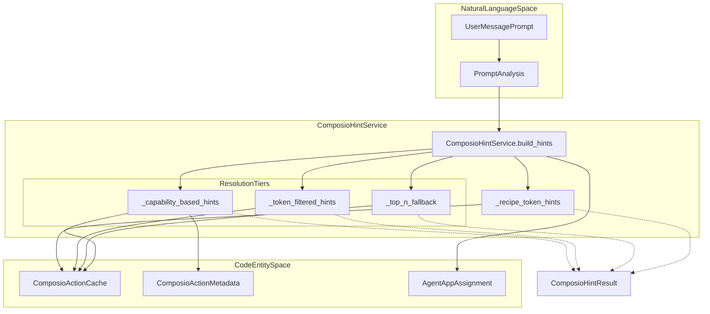
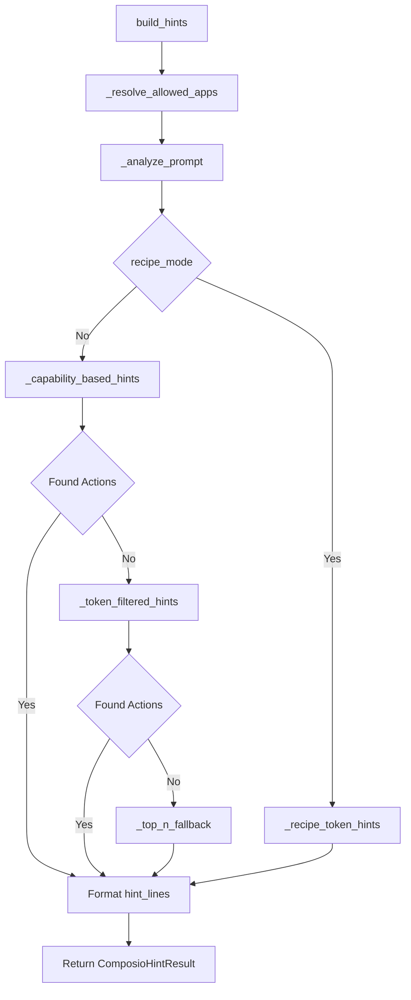

# Tool Hint Service

<details>
<summary>Relevant source files</summary>

The following files were used as context for generating this wiki page:

- [orchestrator/consumers/chatbot/tool_router.py](orchestrator/consumers/chatbot/tool_router.py)
- [orchestrator/modules/context/sections/platform_actions.py](orchestrator/modules/context/sections/platform_actions.py)
- [orchestrator/modules/context/sections/tools.py](orchestrator/modules/context/sections/tools.py)
- [orchestrator/modules/tools/discovery/action_registry.py](orchestrator/modules/tools/discovery/action_registry.py)
- [orchestrator/modules/tools/discovery/action_semantic_index.py](orchestrator/modules/tools/discovery/action_semantic_index.py)
- [orchestrator/modules/tools/execution/unified_executor.py](orchestrator/modules/tools/execution/unified_executor.py)
- [orchestrator/modules/tools/registry/tool_registry.py](orchestrator/modules/tools/registry/tool_registry.py)
- [orchestrator/modules/tools/services/composio_hint_service.py](orchestrator/modules/tools/services/composio_hint_service.py)
- [orchestrator/modules/tools/services/composio_tool_service.py](orchestrator/modules/tools/services/composio_tool_service.py)
- [orchestrator/modules/tools/tool_router.py](orchestrator/modules/tools/tool_router.py)
- [orchestrator/tests/test_action_registry_filtered.py](orchestrator/tests/test_action_registry_filtered.py)
- [orchestrator/tests/test_action_semantic_index.py](orchestrator/tests/test_action_semantic_index.py)
- [orchestrator/tests/test_platform_actions_section.py](orchestrator/tests/test_platform_actions_section.py)
- [orchestrator/tests/test_tool_router_semantic.py](orchestrator/tests/test_tool_router_semantic.py)

</details>


The **Tool Hint Service** (`ComposioHintService`) is a unified system message generator that provides LLMs with curated lists of available Composio actions based on user intent. It replaces multiple divergent code paths with a single, intent-aware resolution strategy that prevents action mismatches (e.g., `SLACK_CREATE_CHANNEL_BASED_CONVERSATION` competing with `SLACK_SEND_MESSAGE` for messaging intents) [orchestrator/modules/tools/services/composio_hint_service.py:1-21]().

For broader tool execution and routing, see [Tool Router & Execution](8.3). For action capability validation at execution time, see [Permission & Validation System](8.5). For Composio integration details, see [Composio Integration](8.1).

---

## Purpose and Scope

The Tool Hint Service solves the **action hint generation problem**: given a user's intent and an agent's app assignments, which Composio actions should be injected into the LLM's system prompt?

### Problem Statement
Prior to this service, three independent code paths generated hints:
1. **Chat streaming** (`consumers/chatbot/service.py`) — token `ILIKE` filtering only [orchestrator/modules/tools/services/composio_hint_service.py:8-9]().
2. **Agent execution** (`modules/agents/factory/agent_factory.py`) — 3-tier with broken scoring [orchestrator/modules/tools/services/composio_hint_service.py:10-10]().
3. **Recipe execution** — often lacked specific hints, causing discovery failures.

### Solution
A single service (`ComposioHintService`) with:
- **Three-tier resolution strategy**: Capability-based → Token-filtered → Top-N fallback [orchestrator/modules/tools/services/composio_hint_service.py:12-15]().
- **Mandatory capability gate** in Tier 2: Actions MUST match at least one capability term to be included, preventing irrelevant tool competition [orchestrator/modules/tools/services/composio_hint_service.py:17-21]().
- **Recipe mode**: Direct token-based hints for curated prompts, bypassing taxonomy for speed and scalability [orchestrator/modules/tools/services/composio_hint_service.py:117-120]().
- **Parameter hints**: Extracted schemas for top actions to reduce LLM parameter syntax errors [orchestrator/modules/tools/services/composio_hint_service.py:37-38]().

Sources: [orchestrator/modules/tools/services/composio_hint_service.py:1-40]()

---

## System Architecture

### Component Integration
The following diagram bridges the "Natural Language Space" (user prompts and analysis) to the "Code Entity Space" (Composio actions, database models, and metadata classes).

**Diagram: Tool Hint Service Integration**



Sources: [orchestrator/modules/tools/services/composio_hint_service.py:89-160](), [core/models/composio_cache.py:1-35]()

---

## Data Models

### PromptAnalysis
Parsed prompt metadata for hint resolution [orchestrator/modules/tools/services/composio_hint_service.py:68-74]().

| Field | Type | Description |
|-------|------|-------------|
| `tokens` | `List[str]` | Extracted query tokens (stopwords removed) [orchestrator/modules/tools/services/composio_hint_service.py:44-47](). |
| `is_messaging_intent` | `bool` | Detected via `MESSAGING_INTENT_RE` [orchestrator/modules/tools/services/composio_hint_service.py:52-52](). |
| `required_capabilities` | `List[str]` | Capabilities from taxonomy (e.g., `["messaging:send"]`). |
| `cap_filter_terms` | `Set[str]` | Derived terms for capability gate (e.g., `{"message", "send"}`). |

### ComposioHintResult
Output from `build_hints()` [orchestrator/modules/tools/services/composio_hint_service.py:77-84]().

| Field | Type | Description |
|-------|------|-------------|
| `hint_lines` | `List[str]` | System message lines for LLM injection. |
| `allowed_apps` | `List[str]` | Apps assigned to agent (e.g., `["SLACK", "GMAIL"]`). |
| `matched_actions` | `List[str]` | Action names resolved (e.g., `["SLACK_SEND_MESSAGE"]`). |
| `param_hint_count` | `int` | Number of parameter schemas included. |
| `strategy_used` | `str` | Resolution tier: `"capability"`, `"token_filtered"`, `"recipe_token"`, `"fallback"`, or `"none"`. |

Sources: [orchestrator/modules/tools/services/composio_hint_service.py:68-84]()

---

## Three-Tier Resolution Strategy

### Resolution Flow
The service uses a waterfall approach to find the most relevant actions while maintaining safety and token efficiency.

**Diagram: Tiered Resolution Flow**



Sources: [orchestrator/modules/tools/services/composio_hint_service.py:103-212]()

### Tier 1: Capability-Based
Maps user intent to capabilities via `get_capabilities_for_intent(prompt)` from the taxonomy. It then queries `ComposioActionMetadata` for actions matching those capabilities [orchestrator/modules/tools/services/composio_hint_service.py:275-353]().

### Tier 2: Token-Filtered with Mandatory Capability Gate
Capability terms are a **MANDATORY GATE**. Actions MUST match at least one `cap_filter_term` (e.g., "send", "message") to be included [orchestrator/modules/tools/services/composio_hint_service.py:355-432](). This prevents `SLACK_CREATE_CHANNEL_BASED_CONVERSATION` from appearing when the user intent is purely messaging [orchestrator/modules/tools/services/composio_hint_service.py:17-21]().

### Tier 3: Top-N Fallback
Ensures the LLM always has some actions available for connected apps, even if filtering returns zero results. It excludes "dangerous" tokens like `delete` or `revoke` [orchestrator/modules/tools/services/composio_hint_service.py:434-485]().

Sources: [orchestrator/modules/tools/services/composio_hint_service.py:275-485]()

---

## Recipe Mode vs Chatbot Mode

### Chatbot Mode (Default)
Uses the full 3-tier resolution. Suitable for natural language intents with varying specificity [orchestrator/modules/tools/services/composio_hint_service.py:161-178]().

### Recipe Mode
Designed for `RecipeExecutor`. Recipe steps have curated, specific prompts. This mode skips the taxonomy/capability gate and uses prompt tokens directly for `ILIKE` matching against `ComposioActionCache` [orchestrator/modules/tools/services/composio_hint_service.py:117-120](), [orchestrator/modules/tools/services/composio_hint_service.py:487-571]().

Sources: [orchestrator/modules/tools/services/composio_hint_service.py:117-120](), [orchestrator/modules/tools/services/composio_hint_service.py:487-571]()

---

## Parameter Hint Extraction

To reduce LLM parameter errors, the service extracts schema details for the top matched actions using `ParameterHintExtractor` [orchestrator/modules/tools/services/composio_hint_service.py:573-659]().

**Example Hint Output:**
```text
You have these external apps connected (via Composio): SLACK, GMAIL.
Usage: composio_execute({"action": "ACTION_NAME", "params": {<fields>}}).

Matched Actions:
- SLACK_SEND_MESSAGE
- GMAIL_SEND_EMAIL

Parameter hints (pass these inside params):
SLACK_SEND_MESSAGE:
  - channel (required, string)
  - text (required, string)
```

Sources: [orchestrator/modules/tools/services/composio_hint_service.py:137-146](), [orchestrator/modules/tools/services/composio_hint_service.py:615-659]()

---

## Configuration Constants

| Constant | Value | Description |
|----------|-------|-------------|
| `MAX_QUERY_TOKENS` | 10 | Max tokens extracted from prompt [orchestrator/modules/tools/services/composio_hint_service.py:54](). |
| `MAX_APPS_SEARCH` | 12 | Max apps to query per tier [orchestrator/modules/tools/services/composio_hint_service.py:55](). |
| `MAX_ACTIONS_PER_APP` | 6 | Max actions returned per app [orchestrator/modules/tools/services/composio_hint_service.py:57](). |
| `MAX_PARAM_HINT_ACTIONS` | 10 | Max actions to extract parameter hints for [orchestrator/modules/tools/services/composio_hint_service.py:58](). |
| `MAX_PARAMS_PER_ACTION` | 5 | Max parameters to show per action [orchestrator/modules/tools/services/composio_hint_service.py:59](). |

Sources: [orchestrator/modules/tools/services/composio_hint_service.py:54-59]()

---