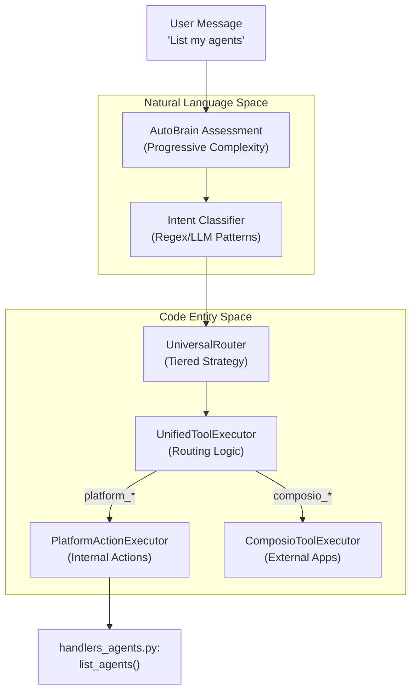
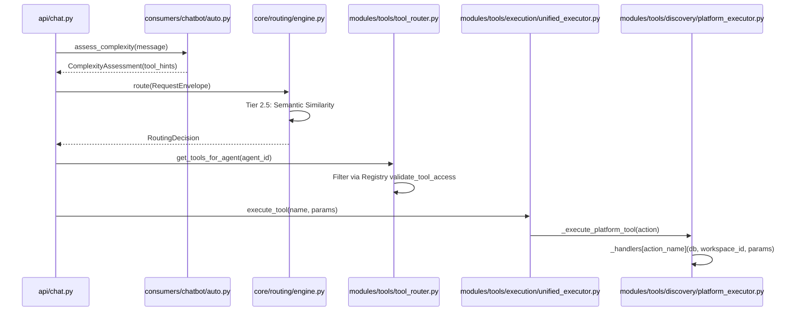

# Tool Router & Execution

Relevant source files

The following files were used as context for generating this wiki page:

- [docs/reviews/COMPOSIO-TOOL-REGRESSION-REVIEW.md](docs/reviews/COMPOSIO-TOOL-REGRESSION-REVIEW.md)
- [orchestrator/alembic/versions/prd123_tool_tier.py](orchestrator/alembic/versions/prd123_tool_tier.py)
- [orchestrator/api/chat.py](orchestrator/api/chat.py)
- [orchestrator/api/chat_voice.py](orchestrator/api/chat_voice.py)
- [orchestrator/consumers/__init__.py](orchestrator/consumers/__init__.py)
- [orchestrator/consumers/chatbot/__init__.py](orchestrator/consumers/chatbot/__init__.py)
- [orchestrator/consumers/chatbot/auto.py](orchestrator/consumers/chatbot/auto.py)
- [orchestrator/consumers/chatbot/intent_classifier.py](orchestrator/consumers/chatbot/intent_classifier.py)
- [orchestrator/consumers/chatbot/personality.py](orchestrator/consumers/chatbot/personality.py)
- [orchestrator/consumers/chatbot/service.py](orchestrator/consumers/chatbot/service.py)
- [orchestrator/consumers/chatbot/smart_tool_router.py](orchestrator/consumers/chatbot/smart_tool_router.py)
- [orchestrator/consumers/chatbot/tool_router.py](orchestrator/consumers/chatbot/tool_router.py)
- [orchestrator/core/llm/manager.py](orchestrator/core/llm/manager.py)
- [orchestrator/core/models/tools.py](orchestrator/core/models/tools.py)
- [orchestrator/core/routing/engine.py](orchestrator/core/routing/engine.py)
- [orchestrator/modules/orchestrator/service.py](orchestrator/modules/orchestrator/service.py)
- [orchestrator/modules/tools/__init__.py](orchestrator/modules/tools/__init__.py)
- [orchestrator/modules/tools/discovery/actions_analytics_enhanced.py](orchestrator/modules/tools/discovery/actions_analytics_enhanced.py)
- [orchestrator/modules/tools/discovery/handlers_analytics_enhanced.py](orchestrator/modules/tools/discovery/handlers_analytics_enhanced.py)
- [orchestrator/modules/tools/discovery/handlers_search.py](orchestrator/modules/tools/discovery/handlers_search.py)
- [orchestrator/modules/tools/discovery/platform_actions.py](orchestrator/modules/tools/discovery/platform_actions.py)
- [orchestrator/modules/tools/discovery/platform_executor.py](orchestrator/modules/tools/discovery/platform_executor.py)
- [orchestrator/modules/tools/execution/exec_platform.py](orchestrator/modules/tools/execution/exec_platform.py)
- [orchestrator/modules/tools/execution/unified_executor.py](orchestrator/modules/tools/execution/unified_executor.py)
- [orchestrator/modules/tools/registry/tool_registry.py](orchestrator/modules/tools/registry/tool_registry.py)
- [orchestrator/modules/tools/tool_router.py](orchestrator/modules/tools/tool_router.py)

This document covers the tool router service and tool execution subsystem, which processes LLM tool calls and routes them to the appropriate execution handlers. The tool router handles built-in tools, Composio integrations, deduplication, and result formatting for both chat and recipe execution contexts.

---

## Architecture Overview

The tool router acts as a central dispatcher that receives tool call requests from LLM responses and routes them to appropriate executors. It provides deduplication, tracking, and consistent result formatting across all tool types.

### From Natural Language to Execution
The following diagram illustrates the flow from a user's natural language request through complexity assessment to the final tool execution code entities.

**Natural Language to Code Entity Mapping**

**Sources:**
- [orchestrator/consumers/chatbot/auto.py:5-22]()
- [orchestrator/modules/tools/discovery/platform_executor.py:164-168]()
- [orchestrator/core/routing/engine.py:58-74]()
- [orchestrator/modules/tools/execution/unified_executor.py:67-73]()

---

## Tool Router & Execution Logic

The execution system is unified under the `UnifiedToolExecutor` [orchestrator/modules/tools/execution/unified_executor.py:67-73](), which serves as the single entry point for all tool execution, routing calls to specialized modules like `exec_platform`, `exec_research`, and `exec_composio` [orchestrator/modules/tools/execution/unified_executor.py:27-31]().

### Unified Routing Logic
The system uses a 3-tier assessment via `AutoBrain` to determine the complexity of a request [orchestrator/consumers/chatbot/auto.py:14-18]():
1. **Tier 1 (Redis):** Cache lookup for fast responses (<5ms).
2. **Tier 2 (Regex):** Fast-path heuristic patterns for greetings and platform keywords [orchestrator/consumers/chatbot/auto.py:91-113]().
3. **Tier 3 (LLM):** Classification for complex multi-agent or tool-heavy tasks.

The `UnifiedToolExecutor` maintains a `tool_routes` map that delegates to specific execution methods, including research tools, file operations, shell commands, and dynamically routed Composio tools [orchestrator/modules/tools/execution/unified_executor.py:105-166]().

### Platform Action Executor
The `PlatformActionExecutor` is a thin dispatcher that routes self-management actions to domain-specific handlers [orchestrator/modules/tools/discovery/platform_executor.py:1-9](). These actions allow agents to introspect and manage the platform itself.

| Category | Key Handlers | Source Reference |
| :--- | :--- | :--- |
| **Agents** | `list_agents`, `create_agent`, `delete_agent` | [orchestrator/modules/tools/discovery/platform_executor.py:19-25]() |
| **Recipes** | `list_playbooks`, `execute_playbook` | [orchestrator/modules/tools/discovery/platform_executor.py:26-37]() |
| **Analytics** | `get_llm_usage`, `get_cost_breakdown` | [orchestrator/modules/tools/discovery/platform_executor.py:38-43]() |
| **Workspace** | `get_workspace_info`, `store_memory` | [orchestrator/modules/tools/discovery/platform_executor.py:49-54]() |
| **Marketplace** | `browse_marketplace_agents`, `install_plugin` | [orchestrator/modules/tools/discovery/platform_executor.py:74-84]() |

**Sources:**
- [orchestrator/modules/tools/discovery/platform_executor.py:173-220]()
- [orchestrator/modules/tools/discovery/platform_actions.py:36-61]()

---

## Tool Loop Prevention

To prevent infinite tool loops and redundant API calls, the `ToolExecutionTracker` implements multi-tier deduplication [orchestrator/consumers/chatbot/service.py:78-85]().

### Deduplication Strategies
- **Exact Deduplication:** Prevents re-executing the same tool with identical arguments [orchestrator/consumers/chatbot/service.py:128-129]().
- **Semantic Deduplication:** Specifically for search tools (e.g., `search_knowledge`), it compares query strings to skip semantically similar requests [orchestrator/consumers/chatbot/service.py:131-138]().
- **Retry Limits:** Per-tool execution limits (e.g., `composio_execute` is limited to 2 calls per turn) [orchestrator/consumers/chatbot/service.py:93-104]().

**Sources:**
- [orchestrator/consumers/chatbot/service.py:106-155]()

---

## Tool Registry & Specification

The `ToolRegistry` provides a single source of truth for all platform tools [orchestrator/modules/tools/registry/tool_registry.py:157-167](). It manages `ToolSpec` objects which define the metadata, parameters, and security levels for each tool.

### Tool Categories and Security
Tools are organized into categories like `RESEARCH`, `FILE_OPERATIONS`, and `SHELL_COMMANDS` [orchestrator/modules/tools/registry/tool_registry.py:38-50](). Each tool is assigned a `SecurityLevel` [orchestrator/modules/tools/registry/tool_registry.py:52-57]():
- **SAFE:** Read-only queries.
- **CAUTIOUS:** Non-destructive writes.
- **DANGEROUS:** Deletes or shell commands.
- **CRITICAL:** System modifications.

The registry also handles the conversion of tool specifications into OpenAI function calling format [orchestrator/modules/tools/registry/tool_registry.py:110-128]().

**Sources:**
- [orchestrator/modules/tools/registry/tool_registry.py:90-108]()
- [orchestrator/modules/tools/registry/tool_registry.py:170-180]()

---

## Tool Execution Lifecycle

The following diagram bridges the high-level routing logic with the specific code paths in the `chatbot` and `routing` modules.

**Tool Execution Data Flow**

**Sources:**
- [orchestrator/consumers/chatbot/auto.py:59-82]()
- [orchestrator/core/routing/engine.py:129-136]()
- [orchestrator/modules/tools/tool_router.py:129-172]()
- [orchestrator/modules/tools/execution/unified_executor.py:105-166]()
- [orchestrator/modules/tools/discovery/platform_executor.py:173-220]()

---