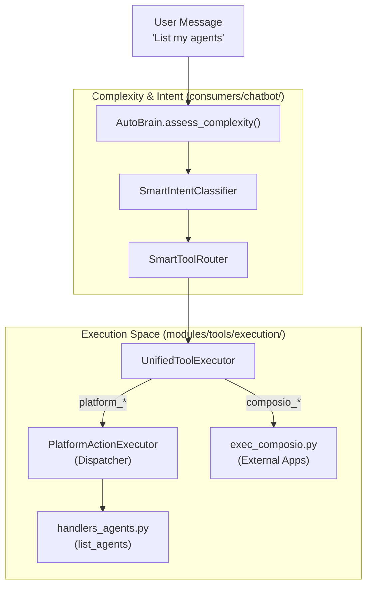
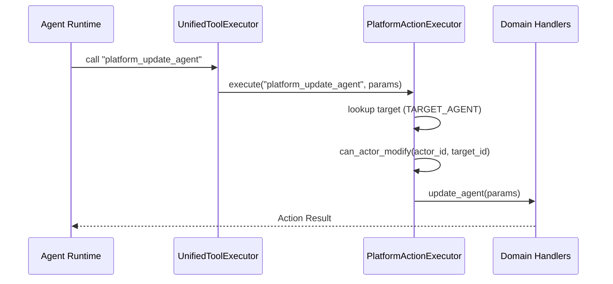

# Tool Router & Execution

Relevant source files

The following files were used as context for generating this wiki page:

- [orchestrator/consumers/chatbot/auto.py](orchestrator/consumers/chatbot/auto.py)
- [orchestrator/consumers/chatbot/intent_classifier.py](orchestrator/consumers/chatbot/intent_classifier.py)
- [orchestrator/consumers/chatbot/personality.py](orchestrator/consumers/chatbot/personality.py)
- [orchestrator/consumers/chatbot/smart_tool_router.py](orchestrator/consumers/chatbot/smart_tool_router.py)
- [orchestrator/consumers/chatbot/tool_router.py](orchestrator/consumers/chatbot/tool_router.py)
- [orchestrator/core/security/rate_limiter.py](orchestrator/core/security/rate_limiter.py)
- [orchestrator/core/services/auto_reporting.py](orchestrator/core/services/auto_reporting.py)
- [orchestrator/core/services/notification_dispatcher.py](orchestrator/core/services/notification_dispatcher.py)
- [orchestrator/modules/tools/discovery/actions_auto_reporting.py](orchestrator/modules/tools/discovery/actions_auto_reporting.py)
- [orchestrator/modules/tools/discovery/handlers_auto_reporting.py](orchestrator/modules/tools/discovery/handlers_auto_reporting.py)
- [orchestrator/modules/tools/discovery/platform_actions.py](orchestrator/modules/tools/discovery/platform_actions.py)
- [orchestrator/modules/tools/discovery/platform_executor.py](orchestrator/modules/tools/discovery/platform_executor.py)
- [orchestrator/modules/tools/execution/exec_platform.py](orchestrator/modules/tools/execution/exec_platform.py)
- [orchestrator/modules/tools/execution/unified_executor.py](orchestrator/modules/tools/execution/unified_executor.py)
- [orchestrator/modules/tools/registry/tool_registry.py](orchestrator/modules/tools/registry/tool_registry.py)
- [orchestrator/modules/tools/services/composio_hint_service.py](orchestrator/modules/tools/services/composio_hint_service.py)
- [orchestrator/modules/tools/services/composio_tool_service.py](orchestrator/modules/tools/services/composio_tool_service.py)
- [orchestrator/tests/test_prd128_notification_dispatcher.py](orchestrator/tests/test_prd128_notification_dispatcher.py)

This page documents the **Unified Tool Execution** architecture and the **AutoBrain** complexity assessment engine. These systems work in tandem to resolve natural language intents into specific tool calls and execute them across diverse environments—including internal platform actions, research tools, and external SaaS integrations via Composio.

---

## Architecture Overview

The tool subsystem bridges the gap between high-level agent reasoning and low-level code execution. It is governed by two primary components:
1.  **AutoBrain (Progressive Complexity Assessor)**: Receives every message to determine complexity (Atom → Organism) and provides tool hints [orchestrator/consumers/chatbot/auto.py:5-22]().
2.  **UnifiedToolExecutor**: Routes specific tool calls (e.g., `read_file`, `composio_execute`) to the correct execution module [orchestrator/modules/tools/execution/unified_executor.py:5-15]().

### Natural Language to Code Entity Mapping
The following diagram illustrates how a user's intent is transformed into executable code within the system.

**Intent Resolution & Execution Flow**

**Sources:**
- [orchestrator/consumers/chatbot/auto.py:14-22]()
- [orchestrator/modules/tools/execution/unified_executor.py:69-75]()
- [orchestrator/modules/tools/discovery/platform_executor.py:1-9]()

---

## Progressive Complexity & Intent

The system uses **AutoBrain** to perform a 3-tier assessment (Redis cache, regex fast-paths, and LLM classification) to determine the complexity of a request [orchestrator/consumers/chatbot/auto.py:14-17]().

### Complexity Levels (PRD-68)
| Level | Scope | Description |
| :--- | :--- | :--- |
| **ATOM** | Simple | Greetings, factual chitchat; no tools or memory [orchestrator/consumers/chatbot/auto.py:44](). |
| **MOLECULE**| Single Tool | Needs a specific agent skill or single tool call [orchestrator/consumers/chatbot/auto.py:45](). |
| **CELL** | Reasoning | Requires memory, tools, and reasoning steps [orchestrator/consumers/chatbot/auto.py:46](). |
| **ORGAN** | Multi-Agent| Requires coordination between multiple agents [orchestrator/consumers/chatbot/auto.py:47](). |
| **ORGANISM**| Pipeline | Full PRD-59 Neural Swarm pipelines [orchestrator/consumers/chatbot/auto.py:48](). |

### Intent Classification
The `SmartIntentClassifier` maps messages to `Intent` categories like `DATA_QUERY`, `EXTERNAL_ACTION`, or `MEMORY_RECALL` [orchestrator/consumers/chatbot/intent_classifier.py:23-34](). This drives the `SmartToolRouter` to filter the available toolset to avoid overwhelming the LLM [orchestrator/consumers/chatbot/smart_tool_router.py:43-48]().

**Sources:**
- [orchestrator/consumers/chatbot/auto.py:59-83]()
- [orchestrator/consumers/chatbot/intent_classifier.py:48-56]()
- [orchestrator/consumers/chatbot/smart_tool_router.py:115-128]()

---

## Unified Tool Executor

The `UnifiedToolExecutor` [orchestrator/modules/tools/execution/unified_executor.py:69-75]() is the central hub for all tool execution. It maintains a `tool_routes` map [orchestrator/modules/tools/execution/unified_executor.py:107-168]() that delegates calls to specialized modules.

### Key Execution Modules
*   **exec_platform**: Handles research tools like `search_knowledge` and `search_codebase` [orchestrator/modules/tools/execution/unified_executor.py:109-111]().
*   **exec_file_ops**: Manages filesystem interactions (`read_file`, `write_file`) [orchestrator/modules/tools/execution/unified_executor.py:126-130]().
*   **exec_composio**: Executes actions for external apps via the Composio SDK [orchestrator/modules/tools/execution/unified_executor.py:142]().
*   **exec_planning**: Executes planning tools like `create_implementation_plan` [orchestrator/modules/tools/execution/unified_executor.py:154]().

**Sources:**
- [orchestrator/modules/tools/execution/unified_executor.py:28-36]()
- [orchestrator/modules/tools/execution/unified_executor.py:107-168]()

---

## Platform Action System (PRD-64)

Platform actions (prefixed with `platform_`) allow agents to introspect and manage the platform. The `PlatformActionExecutor` acts as a thin dispatcher routing these to domain-specific handlers [orchestrator/modules/tools/discovery/platform_executor.py:1-9]().

### Hierarchy Permissions (PRD-140)
Mutating platform actions are protected by a hierarchy check. The `can_actor_modify` check ensures that an agent (the actor) has permission to modify a target entity (e.g., another agent, a playbook, or a task) [orchestrator/modules/tools/discovery/platform_executor.py:183-207]().

**Platform Execution Logic**

**Sources:**
- [orchestrator/modules/tools/discovery/platform_executor.py:19-177]()
- [orchestrator/modules/tools/discovery/platform_executor.py:209-226]()
- [orchestrator/modules/tools/discovery/platform_actions.py:38-65]()

---

## Composio Tool Resolution

Composio actions are resolved into OpenAI function-calling schemas via the `ComposioToolService` [orchestrator/modules/tools/services/composio_tool_service.py:63-70]().

### Hinting & Discovery
The `ComposioHintService` [orchestrator/modules/tools/services/composio_hint_service.py:89-98]() uses a 3-tier strategy to provide action hints in the system prompt:
1.  **Tier 1: Capability-based**: Matches intent taxonomy against action metadata [orchestrator/modules/tools/services/composio_hint_service.py:163-167]().
2.  **Tier 2: Token-filtered**: Uses `ILIKE` matching with a mandatory capability gate to prevent irrelevant tool competition [orchestrator/modules/tools/services/composio_hint_service.py:17-21]().
3.  **Tier 3: Top-N Fallback**: Provides safe, common actions for connected apps [orchestrator/modules/tools/services/composio_hint_service.py:15-16]().

**Sources:**
- [orchestrator/modules/tools/services/composio_hint_service.py:12-21]()
- [orchestrator/modules/tools/services/composio_tool_service.py:108-113]()
- [orchestrator/modules/tools/registry/tool_registry.py:182-193]()

---

## Notification Dispatching (PRD-128)

The `NotificationDispatcher` [orchestrator/core/services/notification_dispatcher.py:76-77]() is the unified entry point for platform events (e.g., `task_complete`, `agent_error`). It fans out events to `in_app`, `telegram`, `slack`, or `webhook` destinations based on workspace preferences [orchestrator/core/services/notification_dispatcher.py:1-7]().

**Sources:**
- [orchestrator/core/services/notification_dispatcher.py:45-57]()
- [orchestrator/core/services/notification_dispatcher.py:87-111]()
- [orchestrator/core/services/notification_dispatcher.py:164-186]()

---