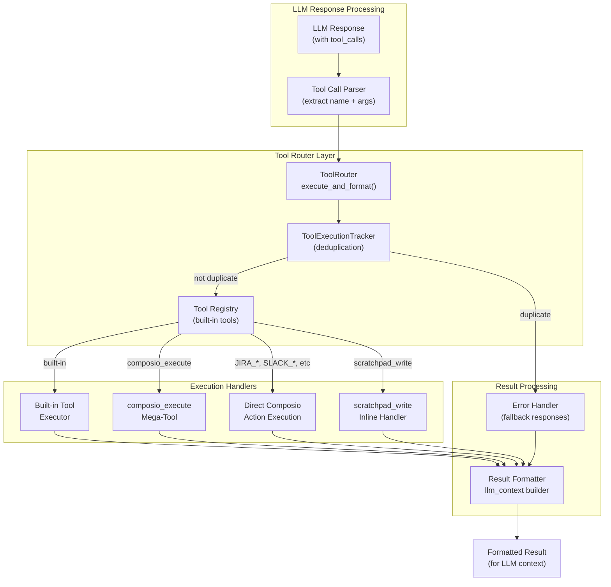
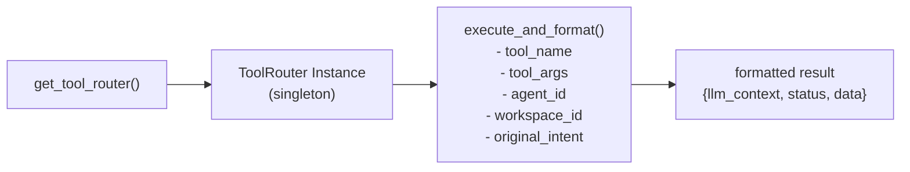
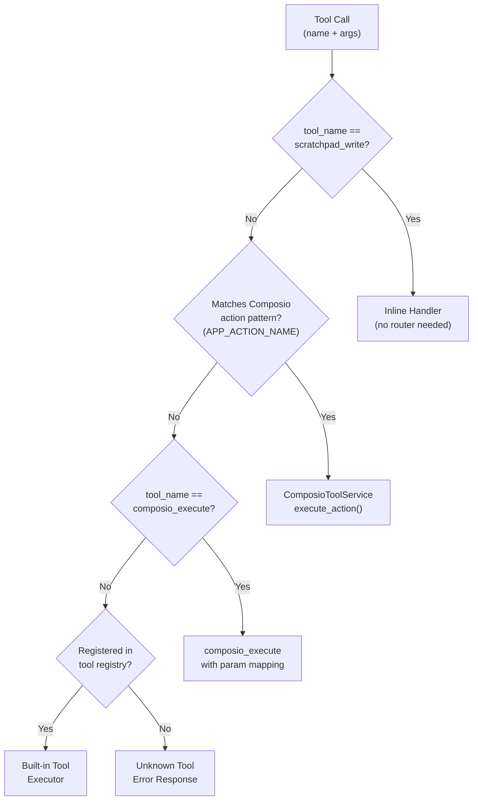
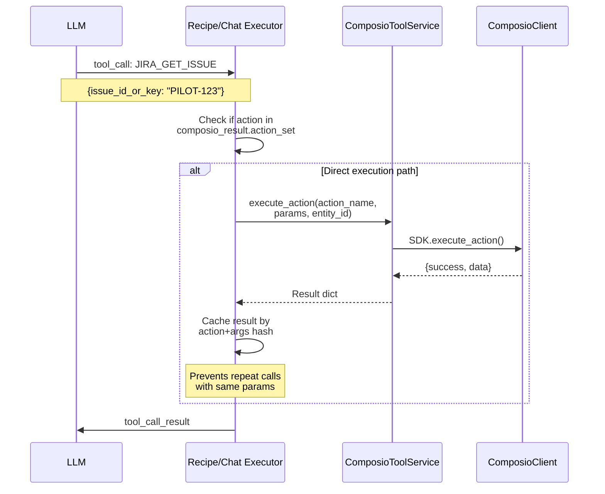
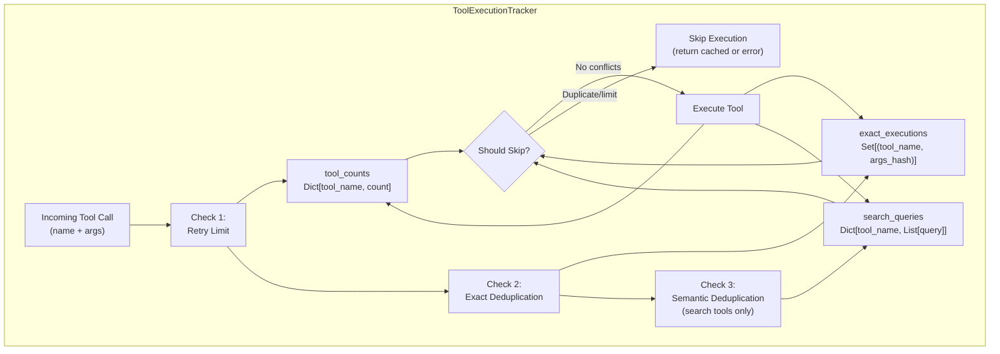
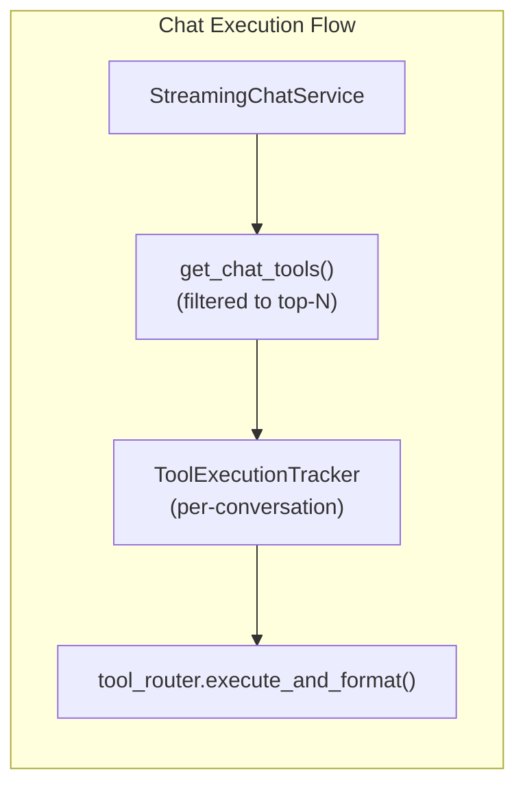
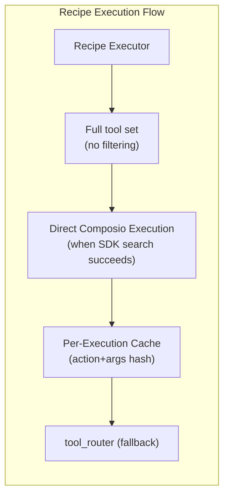
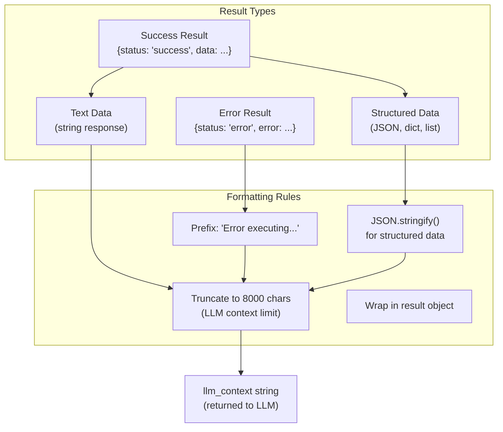
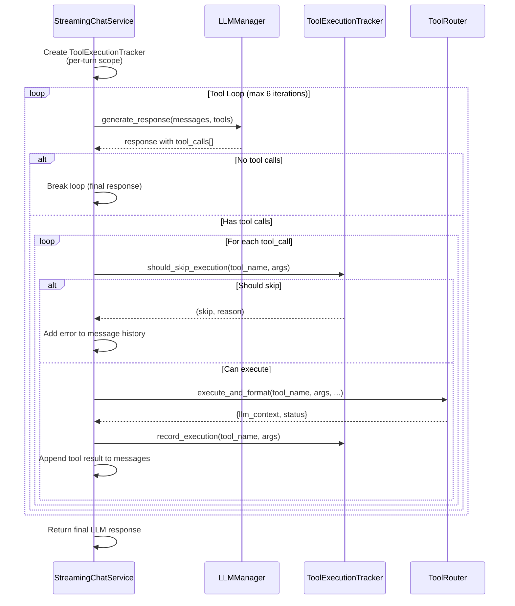
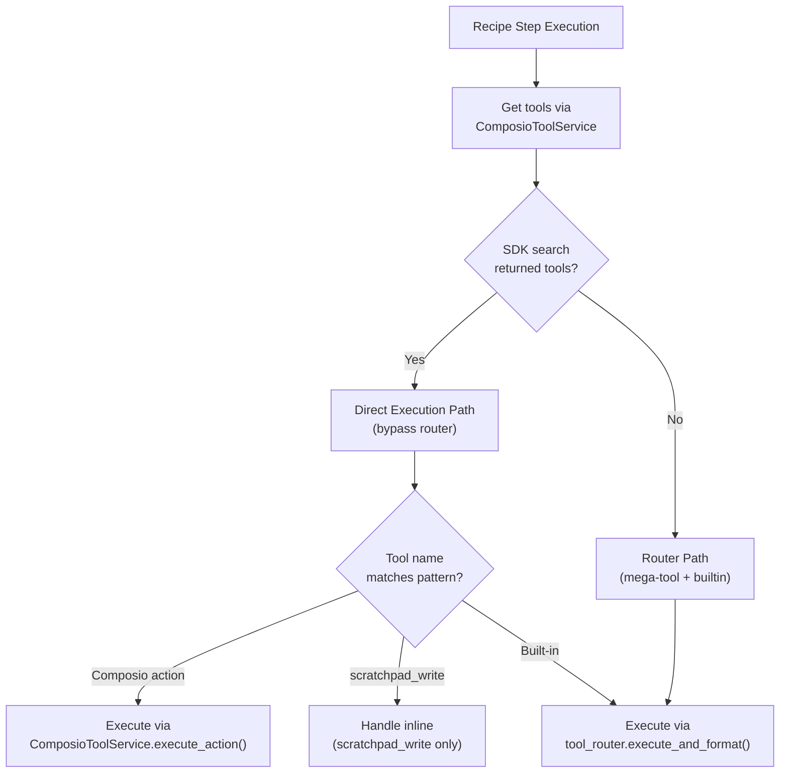

# Tool Router & Execution

<details>
<summary>Relevant source files</summary>

The following files were used as context for generating this wiki page:

- [docs/DoctorsNotes.docx](docs/DoctorsNotes.docx)
- [orchestrator/api/tools.py](orchestrator/api/tools.py)
- [orchestrator/consumers/chatbot/tool_router.py](orchestrator/consumers/chatbot/tool_router.py)
- [orchestrator/core/composio/client.py](orchestrator/core/composio/client.py)
- [orchestrator/modules/tools/execution/unified_executor.py](orchestrator/modules/tools/execution/unified_executor.py)
- [orchestrator/modules/tools/registry/tool_registry.py](orchestrator/modules/tools/registry/tool_registry.py)
- [orchestrator/modules/tools/services/composio_hint_service.py](orchestrator/modules/tools/services/composio_hint_service.py)
- [orchestrator/modules/tools/services/composio_tool_service.py](orchestrator/modules/tools/services/composio_tool_service.py)
- [orchestrator/modules/tools/tool_router.py](orchestrator/modules/tools/tool_router.py)
- [orchestrator/services/metadata_sync_service.py](orchestrator/services/metadata_sync_service.py)

</details>


This document covers the tool router service and tool execution subsystem, which processes LLM tool calls and routes them to the appropriate execution handlers. The tool router handles built-in tools, Composio integrations, deduplication, and result formatting for both chat and recipe execution contexts.

For information about how tools are resolved and selected for LLM context, see [Tool Resolution Strategies](#6.2). For details on Composio-specific integration patterns, see [Composio Integration](#6.1).

---

## Architecture Overview

The tool router acts as a central dispatcher that receives tool call requests from LLM responses and routes them to appropriate executors. It provides deduplication, tracking, and consistent result formatting across all tool types.



**Sources:**
- [orchestrator/consumers/chatbot/service.py:34-34]()
- [orchestrator/api/recipe_executor.py:207-332]()
- [orchestrator/modules/agents/factory/agent_factory.py:1-520]()

---

## Tool Router Service

### Core Interface

The tool router is accessed via `get_tool_router()` which returns a singleton instance:



The `execute_and_format()` method is the primary interface for tool execution:

| Parameter | Type | Purpose |
|-----------|------|---------|
| `tool_name` | `str` | Name of the tool to execute (e.g. `"read_file"`, `"JIRA_GET_ISSUE"`) |
| `tool_args` | `Dict[str, Any]` | Tool arguments as parsed from LLM response |
| `agent_id` | `int` | Agent ID for permission checks and tracking |
| `workspace_id` | `UUID` | Workspace ID for multi-tenancy and Composio entity resolution |
| `original_intent` | `str` | Original user prompt for context-aware error messages |

Returns a dictionary with:
- `llm_context`: Formatted string result for LLM message history
- `status`: Execution status (`"success"` or `"error"`)
- `data`: Structured result data (optional)

**Sources:**
- [orchestrator/consumers/chatbot/service.py:34]()
- [orchestrator/api/recipe_executor.py:314-332]()

---

## Tool Execution Strategies

The tool router supports multiple execution strategies, automatically selected based on the tool name:

### Strategy Selection Logic



### Direct Composio Action Execution (Primary Path)

When SDK search returns per-action tools (see [Tool Resolution Strategies](#6.2)), the recipe executor and chat service use direct execution to bypass the `composio_execute` mega-tool and its parameter mapping overhead:



The deduplication cache in recipes prevents identical calls within the same execution:

**Key Implementation Details:**
- Cache key: `f"{tool_name}|{json.dumps(tool_args, sort_keys=True, default=str)}"`
- Cache scope: Per-execution (not persistent)
- Cache hit: Returns cached result, logs `"Composio dedup hit"`
- Applies to: All Composio actions in recipe execution

**Sources:**
- [orchestrator/api/recipe_executor.py:256-312]()
- [orchestrator/modules/tools/services/composio_tool_service.py:193-212]()

### Built-in Tools

Built-in tools (e.g., `read_file`, `search_knowledge`, `query_database`) are registered in the tool registry and executed directly:

| Tool Category | Examples | Handler Location |
|--------------|----------|------------------|
| File Operations | `read_file`, `write_file`, `list_directory` | Tool executor modules |
| RAG/Search | `search_knowledge`, `semantic_search`, `search_codebase` | RAG service |
| Database | `query_database`, `smart_query_database` | NL2SQL module |
| Scratchpad | `scratchpad_write` | Inline handler (recipes only) |

**Sources:**
- [orchestrator/modules/agents/factory/agent_factory.py:54-230]()
- [orchestrator/api/recipe_executor.py:236-254]()

### Scratchpad Tool (Recipe-Specific)

The `scratchpad_write` tool is handled inline during recipe execution, bypassing the tool router entirely:

```python
# Inline handling in recipe executor
if tool_name == SCRATCHPAD_TOOL_NAME and scratchpad:
    result_text = handle_scratchpad_write(
        key=tool_args.get("key", "unknown"),
        value=tool_args.get("value", ""),
        scratchpad=scratchpad,
        step_order=step_order,
    )
    # No tool_router.execute_and_format() call
```

This tool allows agents to explicitly export key-value pairs to the recipe scratchpad for downstream steps. See [Recipe Scratchpad](#4.6) for details.

**Sources:**
- [orchestrator/api/recipe_executor.py:236-254]()
- [orchestrator/core/services/recipe_scratchpad.py:144-161]()

---

## Deduplication & Loop Prevention

The `ToolExecutionTracker` class implements three-tier deduplication to prevent infinite tool loops:

### Deduplication Strategies



### Implementation Details

**Per-Tool Retry Limits:**

| Tool Type | Limit | Rationale |
|-----------|-------|-----------|
| `composio_execute` | 2 | Expensive API calls; fail fast |
| Search tools (`search_knowledge`, `semantic_search`, etc.) | 2 | Prevent query loops |
| `query_database`, `smart_query_database` | 2 | Database load protection |
| File operations (`read_file`, `write_file`) | 3 or 2 | Moderate retry tolerance |
| Default (unlisted tools) | 3 | Conservative limit |

**Exact Deduplication:**

Uses MD5 hash of JSON-serialized arguments (sorted keys) to detect identical calls:

```python
def _hash_args(self, tool_args: Dict[str, Any]) -> str:
    return hashlib.md5(json.dumps(tool_args, sort_keys=True).encode()).hexdigest()
```

**Semantic Deduplication (Search Tools Only):**

For search tools (`search_knowledge`, `semantic_search`, `search_codebase`, etc.), compares normalized query strings using `SequenceMatcher` with a 0.75 similarity threshold:

```python
def _queries_are_similar(query1: str, query2: str, threshold: float = 0.75) -> bool:
    norm1 = _normalize_query(query1)  # Lowercase, strip punctuation
    norm2 = _normalize_query(query2)
    
    if norm1 == norm2:
        return True
    
    ratio = SequenceMatcher(None, norm1, norm2).ratio()
    return ratio >= threshold
```

This prevents scenarios like:
1. `search_knowledge("Python async patterns")`
2. `search_knowledge("python async patterns")` ← Blocked as similar
3. `search_knowledge("async patterns in python")` ← Blocked if ratio ≥ 0.75

**Sources:**
- [orchestrator/consumers/chatbot/service.py:88-186]()
- [orchestrator/consumers/chatbot/service.py:44-86]()

---

## Execution Context Differences

Tool execution behaves differently in chat vs. recipe contexts due to different requirements:

### Chat Context



**Characteristics:**
- Tool list filtered to top 25 relevant tools using `rank_tools_for_query()`
- `ToolExecutionTracker` scoped to single conversation turn
- All tool execution via `tool_router.execute_and_format()`
- Composio tools use mega-tool pattern or per-action tools based on SDK search results
- Tool results inserted into message history with `role: "tool"`

**Sources:**
- [orchestrator/consumers/chatbot/service.py:492-850]()
- [orchestrator/consumers/chatbot/service.py:544-585]()

### Recipe Context



**Characteristics:**
- No tool filtering (recipe steps are curated)
- Direct Composio action execution when SDK search returns per-action tools
- Per-execution deduplication cache (action+args hash)
- `tool_router` used only for built-in tools
- `scratchpad_write` handled inline (no router)
- No persistent `ToolExecutionTracker` (single-step execution)

**Sources:**
- [orchestrator/api/recipe_executor.py:44-364]()
- [orchestrator/api/recipe_executor.py:256-312]()

---

## Result Formatting

The tool router formats all tool execution results into a consistent `llm_context` string suitable for LLM message history:

### Standard Format



### Example Formatting

**Success with structured data:**
```python
# Input (from Composio execution)
{
    "success": True,
    "data": {
        "issue_key": "PILOT-123",
        "summary": "Implement feature X",
        "status": "In Progress"
    }
}

# Formatted llm_context
'{"issue_key": "PILOT-123", "summary": "Implement feature X", "status": "In Progress"}'
```

**Error:**
```python
# Input (from failed tool call)
{
    "success": False,
    "error": "Authentication failed: Invalid credentials"
}

# Formatted llm_context
'Error executing JIRA_GET_ISSUE: Authentication failed: Invalid credentials'
```

**Truncation:**
- Applied to final `llm_context` string
- Limit: 8000 characters for message history, 4000 for tool result storage
- Prevents context window overflow

**Sources:**
- [orchestrator/api/recipe_executor.py:287-311]()
- [orchestrator/consumers/chatbot/service.py:314-332]()

---

## Integration Points

### Chat Service Integration

The chat service uses the tool router within a tool execution loop, processing multiple tool calls per LLM response:



**Sources:**
- [orchestrator/consumers/chatbot/service.py:640-850]()
- [orchestrator/consumers/chatbot/service.py:130-164]()

### Recipe Executor Integration

Recipe execution uses selective tool router integration, preferring direct Composio execution when per-action tools are available:



**Key Difference from Chat:**
- No persistent `ToolExecutionTracker` (steps execute independently)
- Per-execution deduplication cache (action+args hash)
- Inline `scratchpad_write` handling
- Direct Composio execution when SDK search succeeds

**Sources:**
- [orchestrator/api/recipe_executor.py:206-332]()
- [orchestrator/api/recipe_executor.py:256-312]()

---

## Code Entity Reference

### Primary Classes and Functions

| Entity | Location | Purpose |
|--------|----------|---------|
| `get_tool_router()` | `consumers/chatbot/tool_router.py` | Factory function returning singleton ToolRouter instance |
| `ToolRouter.execute_and_format()` | `consumers/chatbot/tool_router.py` | Primary tool execution interface |
| `ToolExecutionTracker` | `consumers/chatbot/service.py:88-186` | Deduplication and loop prevention for chat |
| `ComposioToolService.execute_action()` | `modules/tools/services/composio_tool_service.py:193-212` | Direct Composio action execution |
| `get_chat_tools()` | `consumers/chatbot/tool_router.py` | Returns available tool schemas for chat context |
| `handle_scratchpad_write()` | `modules/tools/builtin/scratchpad_tool.py` | Inline handler for scratchpad exports in recipes |

### Tool Execution Sites

| Context | File | Lines | Notes |
|---------|------|-------|-------|
| Chat tool loop | `consumers/chatbot/service.py` | 640-850 | Uses ToolExecutionTracker + tool_router |
| Recipe tool loop | `api/recipe_executor.py` | 206-332 | Direct Composio + selective router use |
| Direct Composio exec | `api/recipe_executor.py` | 256-312 | Bypasses router for per-action tools |
| Built-in tools | Various tool modules | - | Registered in tool registry |

**Sources:**
- [orchestrator/consumers/chatbot/service.py:88-186]()
- [orchestrator/api/recipe_executor.py:44-364]()
- [orchestrator/modules/tools/services/composio_tool_service.py:1-301]()

---