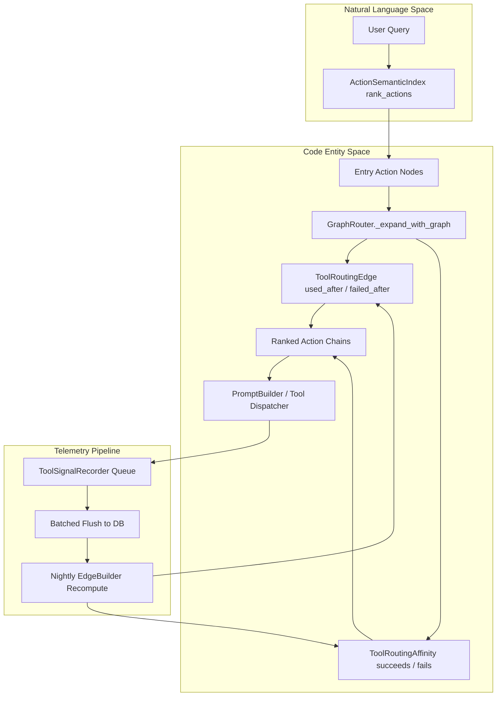
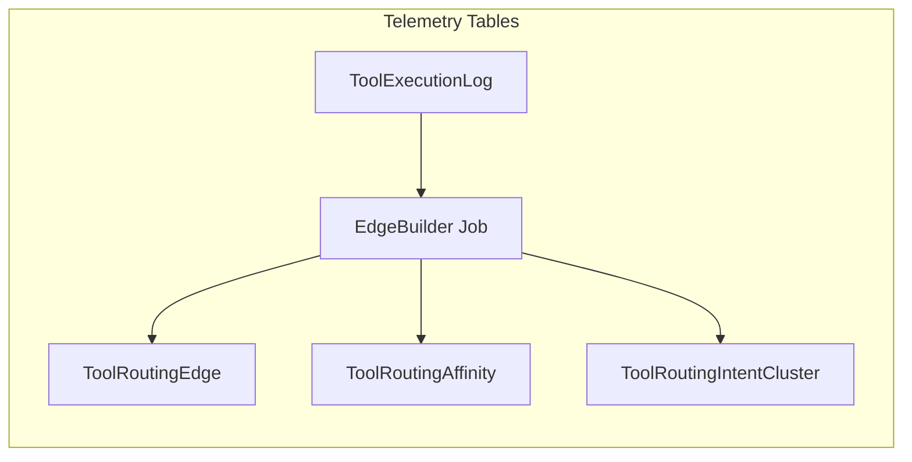
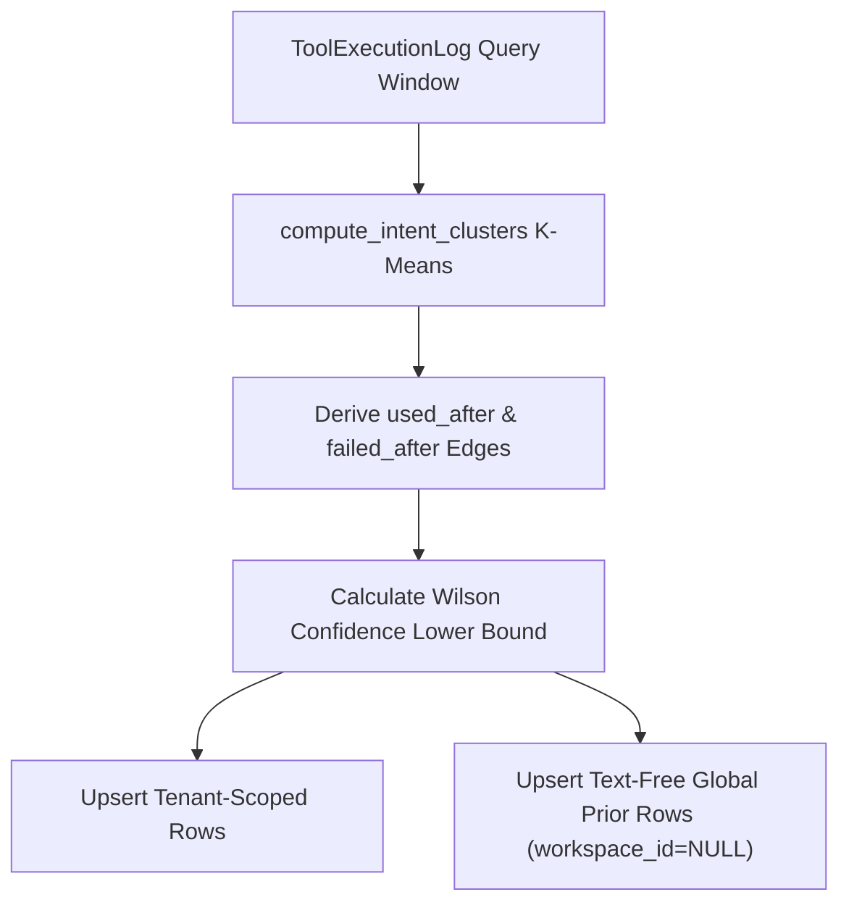
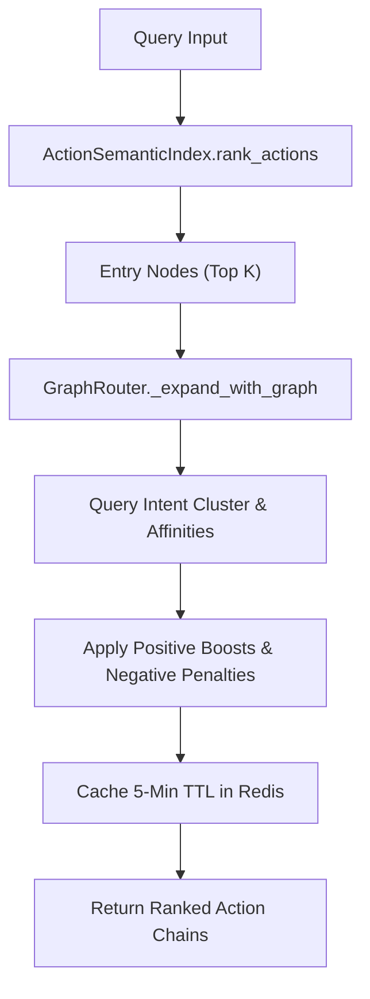
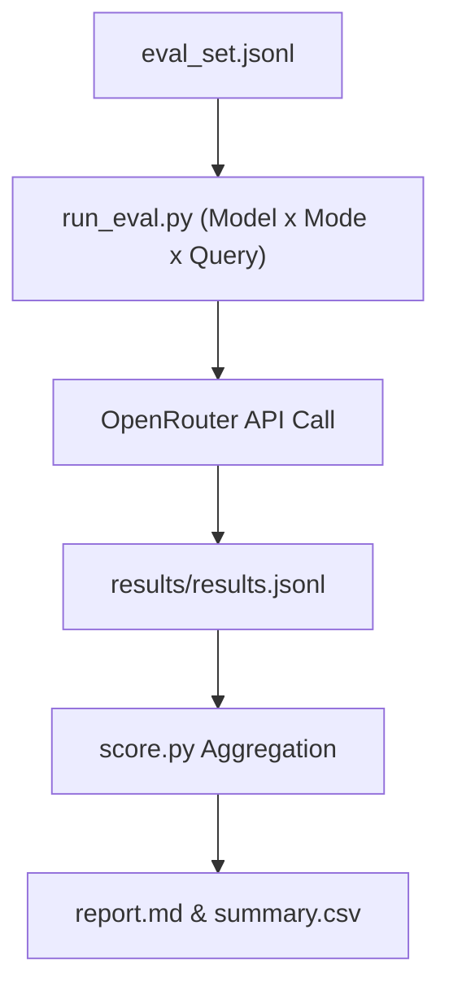

# Tool Routing Graph & Telemetry

Relevant source files

The following files were used as context for generating this wiki page:

- [docs/PRDS/PRD-232-INTENT-GRAPH.md](docs/PRDS/PRD-232-INTENT-GRAPH.md)
- [orchestrator/alembic/versions/prd139_tool_routing_graph.py](orchestrator/alembic/versions/prd139_tool_routing_graph.py)
- [orchestrator/alembic/versions/prd139_tool_routing_telemetry.py](orchestrator/alembic/versions/prd139_tool_routing_telemetry.py)
- [orchestrator/alembic/versions/prd232_cluster_provenance.py](orchestrator/alembic/versions/prd232_cluster_provenance.py)
- [orchestrator/core/models/tool_routing.py](orchestrator/core/models/tool_routing.py)
- [orchestrator/core/seeds/utterances/analytics.yaml](orchestrator/core/seeds/utterances/analytics.yaml)
- [orchestrator/core/seeds/utterances/api_keys.yaml](orchestrator/core/seeds/utterances/api_keys.yaml)
- [orchestrator/core/services/edge_builder.py](orchestrator/core/services/edge_builder.py)
- [orchestrator/core/services/intent_clustering.py](orchestrator/core/services/intent_clustering.py)
- [orchestrator/modules/tools/discovery/graph_router.py](orchestrator/modules/tools/discovery/graph_router.py)
- [orchestrator/modules/tools/discovery/signal_recorder.py](orchestrator/modules/tools/discovery/signal_recorder.py)
- [orchestrator/modules/tools/execution/exec_composio.py](orchestrator/modules/tools/execution/exec_composio.py)
- [orchestrator/scripts/eval/tool_routing/README.md](orchestrator/scripts/eval/tool_routing/README.md)
- [orchestrator/scripts/eval/tool_routing/__init__.py](orchestrator/scripts/eval/tool_routing/__init__.py)
- [orchestrator/scripts/eval/tool_routing/_registry_bootstrap.py](orchestrator/scripts/eval/tool_routing/_registry_bootstrap.py)
- [orchestrator/scripts/eval/tool_routing/eval_seed.yaml](orchestrator/scripts/eval/tool_routing/eval_seed.yaml)
- [orchestrator/scripts/eval/tool_routing/eval_set.jsonl](orchestrator/scripts/eval/tool_routing/eval_set.jsonl)
- [orchestrator/scripts/eval/tool_routing/prompt_builder.py](orchestrator/scripts/eval/tool_routing/prompt_builder.py)
- [orchestrator/scripts/eval/tool_routing/run_eval.py](orchestrator/scripts/eval/tool_routing/run_eval.py)
- [orchestrator/scripts/eval/tool_routing/score.py](orchestrator/scripts/eval/tool_routing/score.py)
- [orchestrator/scripts/eval/tool_routing/seed_eval_set.py](orchestrator/scripts/eval/tool_routing/seed_eval_set.py)
- [orchestrator/scripts/eval/tool_routing/seed_telemetry.py](orchestrator/scripts/eval/tool_routing/seed_telemetry.py)
- [orchestrator/scripts/seed_tool_routing_graph.py](orchestrator/scripts/seed_tool_routing_graph.py)
- [orchestrator/tests/test_graph_router.py](orchestrator/tests/test_graph_router.py)
- [orchestrator/tests/test_graph_router_negative.py](orchestrator/tests/test_graph_router_negative.py)
- [orchestrator/tests/test_platform_actions_section_graph.py](orchestrator/tests/test_platform_actions_section_graph.py)
- [orchestrator/tests/test_prd139_edge_builder.py](orchestrator/tests/test_prd139_edge_builder.py)
- [orchestrator/tests/test_prd143_graph_seed.py](orchestrator/tests/test_prd143_graph_seed.py)
- [orchestrator/tests/test_prd143_selection_at_scale.py](orchestrator/tests/test_prd143_selection_at_scale.py)
- [orchestrator/tests/test_prd143_su_surface.py](orchestrator/tests/test_prd143_su_surface.py)
- [orchestrator/tests/test_prd177_graph_router_tenant.py](orchestrator/tests/test_prd177_graph_router_tenant.py)
- [orchestrator/tests/test_seed_telemetry.py](orchestrator/tests/test_seed_telemetry.py)
- [orchestrator/tests/test_tool_routing_hardening.py](orchestrator/tests/test_tool_routing_hardening.py)
- [orchestrator/tests/test_tool_routing_models.py](orchestrator/tests/test_tool_routing_models.py)

## Purpose and Scope

This section details the Tool Routing Graph and Telemetry architecture introduced under **PRD-139** and **PRD-232**. The intent graph subsystem replaces pure vector-only semantic search with a multi-layered routing model. It combines embedding-based entry node selection, historical tool execution transition edges (`used_after`, `failed_after`), intent clustering, affinity tracking (`succeeds_for_intent`, `fails_for_intent`, `agent_prefers`), intra-day signal recording, and a rigorous evaluation harness.

---

## 1. Architectural Overview & Intent Graph Principles

The intent graph bridges natural language queries to discrete code execution entities (`ActionDefinition`). When a user submits a prompt, the system queries an action semantic index to find initial entry tools, then traverses learned graph edges to surface multi-step tool chains while penalizing paths with historical failures.

Sources: [orchestrator/modules/tools/discovery/graph_router.py:1-40]()

---

## 2. Telemetry Schema & Data Models

The routing subsystem persists graph structure and execution telemetry across three primary database models defined in `core/models/tool_routing.py` and deployed via Alembic migrations:

* **`ToolRoutingEdge`**: Represents directed transitions between actions (`from_action` to `to_action`) with edge types `used_after`, `failed_after`, and `meta_sibling`. Includes Wilson lower bound confidence and sample counts.
* **`ToolRoutingAffinity`**: Records statistical association between action names, intent clusters, and agent preferences (`succeeds_for_intent`, `fails_for_intent`, `agent_prefers`).
* **`ToolRoutingIntentCluster`**: Centroids of clustered natural language queries mapped to hot action sets, enabling intent-based query matching.

Sources: [orchestrator/core/models/tool_routing.py](), [orchestrator/core/services/edge_builder.py:43-48]()

---

## 3. Edge Builder & Intent Clustering Engine

The nightly edge builder service (`core/services/edge_builder.py`) processes historical execution logs to build deterministic routing edges and affinities.

* **Idempotency & Determinism**: K-means clustering operates with a fixed `random_state=42`. Upserts prevent duplicate key violations across unique constraints (`uq_tre_full_key`, `uq_tra_full_key`).
* **Confidence Scoring**: Uses the Wilson lower bound (95% confidence interval) rather than raw frequencies.
* **Two-Layer Graph (PRD-232 §6.5)**: 
  * Tenant-specific rows (`workspace_id == X`) operate at full weight.
  * A text-free global prior (`workspace_id IS NULL`) aggregates cross-tenant counts at a reduced weight factor (`TOOL_ROUTING_GRAPH_GLOBAL_PRIOR_FACTOR`). This allows zero-telemetry tenants to benefit from global routing priors without exposing tenant-specific data or raw user queries.

Sources: [orchestrator/core/services/edge_builder.py:1-95](), [orchestrator/core/services/intent_clustering.py]()

---

## 4. Graph Router Implementation

`GraphRouter` (`modules/tools/discovery/graph_router.py`) ranks tool chains by blending cosine similarity from embedding search with graph edge confidence, positive affinities, and negative penalties.

* **Scoring Formula**:
  $$\text{score} = \text{cosine} \times \text{edge\_confidence} + \text{boost} - \text{penalty}$$
* **Negative Affinity Penalties**: Historical failures (`fails_for_intent` or `failed_after` edges) subtract positive penalty magnitudes, ensuring unreliable tools drop in ranking.
* **Caching**: Traversal results are cached in `CacheService` for 5 minutes, keyed on query embedding hash, agent ID, top-$k$, and workspace ID.

Sources: [orchestrator/modules/tools/discovery/graph_router.py:48-115](), [orchestrator/tests/test_graph_router_negative.py:1-22]()

---

## 5. Intra-Day Signal Recorder

`ToolSignalRecorder` (`modules/tools/discovery/signal_recorder.py`) provides batched, incremental intra-day telemetry logging without exhausting connection pools.

* **Non-Blocking Queue**: Tool execution outcomes are enqueued via non-blocking `put_nowait()` on an in-process `asyncio.Queue`.
* **Single Drain Task**: A background singleton flushes accumulated signals in a single database session per batch.
* **Null-Safe Upsert**: Uses `UPDATE ... WHERE col IS NOT DISTINCT FROM :col` to handle nullable keys (`workspace_id`, `agent_id`, `intent_cluster_id`) properly in PostgreSQL.
* **Clean Shutdown**: `stop()` halts the drain loop and flushes remaining queued signals to prevent data loss during graceful termination.

Sources: [orchestrator/modules/tools/discovery/signal_recorder.py:1-60]()

---

## 6. Seed Utterances & Corpus Bootstrapping

To solve cold-start problems before sufficient production telemetry accumulates, the platform loads domain-specific seed utterances and evaluation sets.

* **Seed Files**: Located under `core/seeds/utterances/` (e.g., `analytics.yaml`, `api_keys.yaml`).
* **Bootstrap Script**: `scripts/eval/tool_routing/seed_telemetry.py` generates synthetic `ToolExecutionLog` rows from eval queries with realistic agent biases, success/failure ratios (~80/20), and multi-action pairing sequences.

Sources: [orchestrator/scripts/eval/tool_routing/seed_telemetry.py:1-68]()

---

## 7. Tool-Routing Evaluation Harness

The evaluation harness under `scripts/eval/tool_routing/` measures routing precision, token efficiency, and execution cost across different prompt assembly modes.

* **Runner (`run_eval.py`)**: Iterates through the cartesian product of models, evaluation modes, and test queries, interacting with OpenRouter and logging results to `results/results.jsonl`.
* **Scoring (`score.py`)**: Computes top-1 accuracy, in-set hit rates, token consumption, latency percentiles, and cost per correct call using `models.yaml`.
* **Prompt Builder (`prompt_builder.py`)**: Supports four evaluation modes:
  1. `full`: Complete action catalog dump.
  2. `filtered`: Semantic index narrowing.
  3. `filtered_schema`: Semantic index narrowing + tool schema `enum` restriction.
  4. `graph`: Graph-augmented router ranking with chain hints.

Sources: [orchestrator/scripts/eval/tool_routing/run_eval.py:1-38](), [orchestrator/scripts/eval/tool_routing/score.py:1-22](), [orchestrator/scripts/eval/tool_routing/prompt_builder.py:1-47]()

---