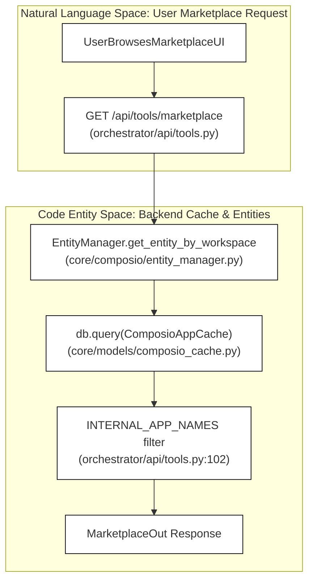

# Tools API Reference

Relevant source files

The following files were used as context for generating this wiki page:

- [frontend/components/settings/DynamicCredentialForm.tsx](frontend/components/settings/DynamicCredentialForm.tsx)
- [frontend/components/workflows/execution-kitchen.tsx](frontend/components/workflows/execution-kitchen.tsx)
- [frontend/lib/api/credentials.ts](frontend/lib/api/credentials.ts)
- [orchestrator/api/composio.py](orchestrator/api/composio.py)
- [orchestrator/api/credentials.py](orchestrator/api/credentials.py)
- [orchestrator/api/recipe_executor.py](orchestrator/api/recipe_executor.py)
- [orchestrator/api/skills.py](orchestrator/api/skills.py)
- [orchestrator/api/tools.py](orchestrator/api/tools.py)
- [orchestrator/api/webhooks.py](orchestrator/api/webhooks.py)
- [orchestrator/api/workflow_recipes.py](orchestrator/api/workflow_recipes.py)
- [orchestrator/core/composio/client.py](orchestrator/core/composio/client.py)
- [orchestrator/core/composio/linkedin_image_workaround.py](orchestrator/core/composio/linkedin_image_workaround.py)
- [orchestrator/core/composio/tool_executor.py](orchestrator/core/composio/tool_executor.py)
- [orchestrator/core/credentials/integration_bridges/__init__.py](orchestrator/core/credentials/integration_bridges/__init__.py)
- [orchestrator/core/credentials/integration_bridges/base.py](orchestrator/core/credentials/integration_bridges/base.py)
- [orchestrator/core/credentials/integration_bridges/shopify.py](orchestrator/core/credentials/integration_bridges/shopify.py)
- [orchestrator/core/credentials/service.py](orchestrator/core/credentials/service.py)
- [orchestrator/core/credentials/tester.py](orchestrator/core/credentials/tester.py)
- [orchestrator/core/credentials/types.py](orchestrator/core/credentials/types.py)
- [orchestrator/core/database/credential_types_seed.json](orchestrator/core/database/credential_types_seed.json)
- [orchestrator/core/models/credentials.py](orchestrator/core/models/credentials.py)
- [orchestrator/core/routing/ingestors/webhook.py](orchestrator/core/routing/ingestors/webhook.py)
- [orchestrator/services/metadata_sync_service.py](orchestrator/services/metadata_sync_service.py)
- [orchestrator/services/webhook_dedup.py](orchestrator/services/webhook_dedup.py)
- [orchestrator/tests/test_p2w0_service_imports_resolve.py](orchestrator/tests/test_p2w0_service_imports_resolve.py)
- [orchestrator/tests/test_p2w2_credentials_null_workspace.py](orchestrator/tests/test_p2w2_credentials_null_workspace.py)
- [orchestrator/tests/test_p2w2_webhook_dedup.py](orchestrator/tests/test_p2w2_webhook_dedup.py)
- [orchestrator/tests/test_p2w2_webhook_signature_reject.py](orchestrator/tests/test_p2w2_webhook_signature_reject.py)

This page documents the REST API endpoints and core service logic for **tool management, marketplace discovery, connected applications, skills, credentials testing, and workspace integration** across the platform. These endpoints provide programmatic access to the Composio marketplace, local app caches, credential validation stores, and skill assignment subsystems.

---

## 1. Marketplace & Stats Endpoints (`/api/tools/*`)

The tools marketplace router acts as the primary interface for browsing external app integrations (`880+` applications) using a cache-first architecture that eliminates expensive remote API calls on page loads [orchestrator/api/tools.py:6-8]().

### Marketplace Discovery
- **GET `/api/tools/marketplace`**: Returns available apps from local cache tables (`ComposioAppCache`, `ComposioActionCache`) [orchestrator/api/tools.py:157-164](). Supports filtering by `category`, fuzzy search via `search`, and standard pagination (`limit`/`offset`) [orchestrator/api/tools.py:158-161](). Internal platform systems (`RAG`, `MEMORY`, `NL2SQL`, `CODEGRAPH`) are filtered out via `INTERNAL_APP_NAMES` [orchestrator/api/tools.py:102]().
- **GET `/api/tools/stats`**: Computes ecosystem statistics for the active workspace, querying `connected_apps` counts against local database caches [orchestrator/api/tools.py:128-134]().

Title: **Marketplace and Stats Data Flow**

*Sources:* [orchestrator/api/tools.py:7-102](), [orchestrator/api/tools.py:128-164](), [orchestrator/api/tools.py:182]()

---

## 2. Connected Apps & Workspace Management

App connections map a workspace to external third-party services using hosted authentication flows or instant "No-Auth" activations.

### Connection Endpoints & Lifecycle
- **Connection Initiation**: Handled via `InitiateConnectionRequest`, returning OAuth redirect URLs or auth configuration IDs [orchestrator/api/composio.py:81-97]().
- **Credential Bridges**: Specialized integration bridges (such as the Shopify bridge) translate saved n8n-style credentials into active Composio connected accounts [orchestrator/core/credentials/integration_bridges/shopify.py:2-10]().
- **Workspace Association**: Adding or removing an app from a workspace updates `composio_connections` rows through the `EntityManager` persistence layer [orchestrator/core/composio/client.py:146-164]().

Title: **Connection and Workspace Bridge Flow**

```mermaid
graph LR
    subgraph "Natural Language Space: Connect App Action"
        UserAction["UserClicksConnectApp"] --> ConnectEP["POST /api/tools/connect<br/>(orchestrator/api/tools.py)"]
    end
    
    subgraph "Code Entity Space: Execution & Bridges"
        ConnectEP --> BridgeDispatcher["BridgeContext / Registry<br/>(core/credentials/integration_bridges/)"]
        BridgeDispatcher --> ShopifyBridge["shopify_access_token()<br/>(core/credentials/integration_bridges/shopify.py)"]
        ShopifyBridge --> EntityManagerAdd["EntityManager.add_connection()<br/>(core/composio/entity_manager.py)"]
        EntityManagerAdd --> ComposioClientSDK["ComposioClient.initiate_connection()<br/>(core/composio/client.py)"]
    end

    classDef default fill:#fff,stroke:#000,stroke-width:1px;
```

*Sources:* [orchestrator/api/tools.py:147-156](), [orchestrator/core/credentials/integration_bridges/shopify.py:115-131](), [orchestrator/core/composio/client.py:68-75]()

---

## 3. Skills Management API (`/api/v1/skills`)

The skills system manages reusable agent capabilities, Git skill sources, and file-level resource loading.

### Key Endpoints & Validation Rules
- **Skill Source Sync**: `GitSkillSourceCreate` manages external repository synchronization for custom skill bundles [orchestrator/api/skills.py:48-54]().
- **Tenant Isolation**: Global skills (`workspace_id IS NULL`) are readable across workspaces, while tenant-scoped skills enforce strict workspace isolation via `_skill_visible_to()` [orchestrator/api/skills.py:161-172]().
- **Agent Attachment**: `_assert_agent_in_workspace()` ensures 404 existence-hiding when attaching skills to agents across tenant boundaries [orchestrator/api/skills.py:174-184]().
- **Token Estimation**: Endpoints return `estimated_tokens` to warn users of prompt context consumption before agent attachment [orchestrator/api/skills.py:107-115]().

*Sources:* [orchestrator/api/skills.py:43-116](), [orchestrator/api/skills.py:149-184]()

---

## 4. Credentials Testing & Management (`/api/credentials`)

Secure credential storage, encryption, and provider testing are handled through dedicated management routes.

### Architecture & Endpoints
- **Credential Store**: `CredentialStore` handles encrypted CRUD operations for API keys, OAuth tokens, and database secrets [orchestrator/api/credentials.py:53-55]().
- **Types & Categories**: `GET /api/credentials/types` exposes over 400 dynamic form definitions categorized by service provider [orchestrator/api/credentials.py:90-110]().
- **BOLA Protection**: `_check_credential_workspace()` enforces strict access control, denying unauthenticated or mismatched workspace queries with an existence-hiding `404 Not Found` response [orchestrator/api/credentials.py:66-84]().

*Sources:* [orchestrator/api/credentials.py:53-110](), [orchestrator/api/credentials.py:66-84]()

---

## 5. Tool Execution & Safety

All tool invocations route through the centralized execution pipeline.

### Execution Subsystems
- **UnifiedToolExecutor**: Routes tool calls to appropriate specialized sub-executors [orchestrator/core/composio/tool_executor.py:5-12]().
- **File Upload Resolution**: `resolve_file_uploads()` converts external URLs or workspace file paths into Composio `FileUploadable` objects before executing media actions (e.g., Twitter or LinkedIn media posts) [orchestrator/core/composio/tool_executor.py:124-133]().
- **LinkedIn Workaround**: Bypasses missing Composio image-posting capabilities by dispatching `LINKEDIN_CREATE_LINKED_IN_POST` directly to LinkedIn's Community Management API using stored credentials [orchestrator/core/composio/linkedin_image_workaround.py:4-16]().

*Sources:* [orchestrator/core/composio/tool_executor.py:1-12](), [orchestrator/core/composio/tool_executor.py:124-133](), [orchestrator/core/composio/linkedin_image_workaround.py:1-16]()

---