# Tools API Reference

<details>
<summary>Relevant source files</summary>

The following files were used as context for generating this wiki page:

- [docs/DoctorsNotes.docx](docs/DoctorsNotes.docx)
- [frontend/app/admin/plugins/page.tsx](frontend/app/admin/plugins/page.tsx)
- [frontend/lib/api-client.ts](frontend/lib/api-client.ts)
- [orchestrator/.env.example](orchestrator/.env.example)
- [orchestrator/api/agent_plugins.py](orchestrator/api/agent_plugins.py)
- [orchestrator/api/tools.py](orchestrator/api/tools.py)
- [orchestrator/config.py](orchestrator/config.py)
- [orchestrator/consumers/chatbot/tool_router.py](orchestrator/consumers/chatbot/tool_router.py)
- [orchestrator/core/composio/client.py](orchestrator/core/composio/client.py)
- [orchestrator/core/database/load_seed_data.py](orchestrator/core/database/load_seed_data.py)
- [orchestrator/core/seeds/seed_personas.py](orchestrator/core/seeds/seed_personas.py)
- [orchestrator/core/seeds/seed_plugin_categories.py](orchestrator/core/seeds/seed_plugin_categories.py)
- [orchestrator/core/services/plugin_cache.py](orchestrator/core/services/plugin_cache.py)
- [orchestrator/main.py](orchestrator/main.py)
- [orchestrator/modules/tools/execution/unified_executor.py](orchestrator/modules/tools/execution/unified_executor.py)
- [orchestrator/modules/tools/registry/tool_registry.py](orchestrator/modules/tools/registry/tool_registry.py)
- [orchestrator/modules/tools/services/composio_hint_service.py](orchestrator/modules/tools/services/composio_hint_service.py)
- [orchestrator/modules/tools/services/composio_tool_service.py](orchestrator/modules/tools/services/composio_tool_service.py)
- [orchestrator/modules/tools/tool_router.py](orchestrator/modules/tools/tool_router.py)
- [orchestrator/services/metadata_sync_service.py](orchestrator/services/metadata_sync_service.py)
- [scripts/ralph/prd.json](scripts/ralph/prd.json)

</details>


This page documents the REST API endpoints for **tool management** across the platform. These endpoints provide programmatic access to:

- **Composio App Marketplace**: Browse and connect 880+ external apps (GitHub, Slack, Jira, etc.)
- **Agent Plugin Assignments**: Assign marketplace plugins to agents for extended capabilities
- **Tool Configuration**: Enable/disable specific actions per workspace
- **Metadata Synchronization**: Sync app/action metadata from Composio API to local cache

For information about the Composio integration architecture and entity management, see [Composio Integration](#6.1). For the unified tool execution system, see [Tool Router & Execution](#6.3). For UI components and user workflows, see [Connecting Apps](#6.4).

---

## Overview

The Tools API is composed of two main routers:

### `/api/tools/*` - Composio Marketplace

Manages external app integrations via Composio:

- **Marketplace Browsing**: List 880+ available apps from cached metadata
- **Connection Management**: Initiate OAuth flows and manage connection states
- **Action Configuration**: Enable/disable specific Composio actions per workspace
- **Metadata Synchronization**: Sync app/action metadata from Composio API to local cache
- **Workspace Isolation**: Scope tool assignments and configurations per workspace

### `/api/agents/{id}/plugins` - Agent Plugin Assignments

Manages plugin assignments to individual agents:

- **Plugin Discovery**: List plugins assigned to an agent
- **Assignment Management**: Add/remove plugins from agents
- **Context Assembly**: Get assembled agent context (persona + plugin skills + tools)

All endpoints require workspace context via hybrid authentication (see [Authentication Flow](#12.1)).

**Sources:** [orchestrator/api/tools.py:1-31](), [orchestrator/api/agent_plugins.py:1-28]()

---

## Architecture Overview

The Tools API implements a **cache-first architecture** for Composio integrations and a **registry-based architecture** for plugin assignments.

### Composio Marketplace Architecture

Title: **Composio Marketplace Data Flow**

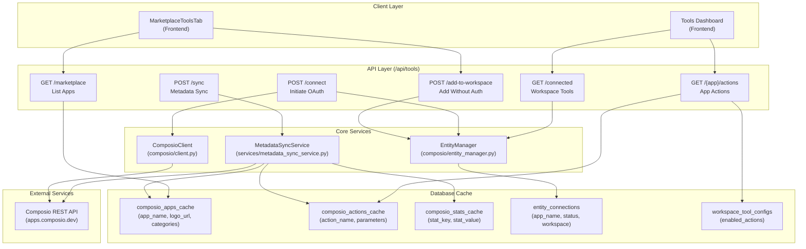

### Agent Plugin Assignment Architecture

Title: **Agent Plugin Assignment Flow**

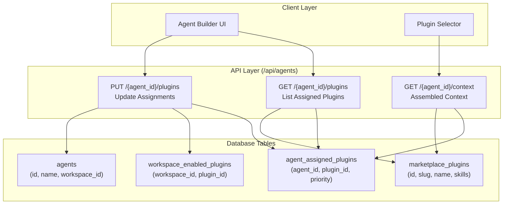

**Key Design Principles:**

1. **Cache-First Reads**: All Composio listing endpoints (`/marketplace`, `/connected`, `/{app}/actions`) read from database cache tables, not external APIs
2. **Lazy Sync**: Metadata syncing occurs only via explicit `POST /sync` calls, not on page loads
3. **Workspace Isolation**: Entity connections, tool configs, and plugin assignments are scoped per workspace via `workspace_id`
4. **Status Lifecycle**: Connection status transitions: `added` → `pending` → `active` (no deletion, only status updates)
5. **Plugin Validation**: Plugins must be workspace-enabled before agent assignment (enforced via foreign key)

**Sources:** [orchestrator/api/tools.py:77-171](), [orchestrator/api/tools.py:201-259](), [orchestrator/api/tools.py:606-619](), [orchestrator/api/agent_plugins.py:68-124]()

---

## Data Models

### Composio Tools API Models

#### Request Models

```python
# Pydantic models from tools.py
class ConnectIn(BaseModel):
    app_name: str
    callback_url: Optional[str] = None
```

#### Response Models

```python
class AppOut(BaseModel):
    id: int
    app_name: str
    display_name: str
    description: Optional[str] = None
    logo_url: Optional[str] = None
    categories: List[str] = Field(default_factory=list)
    auth_schemes: List[str] = Field(default_factory=list)
    action_count: int = 0
    trigger_count: int = 0
    status: str = "ACTIVE"
    is_connected: bool = False
    triggers: List[Dict[str, Any]] = Field(default_factory=list)

class MarketplaceOut(BaseModel):
    apps: List[AppOut]
    total_apps: int
    total_actions: int
    categories: Dict[str, Any]
    last_synced: Optional[str] = None

class StatsOut(BaseModel):
    total_apps: int
    total_actions: int
    connected_apps: int
    categories: Dict[str, Any]
    last_synced: Optional[str] = None
```

### Agent Plugin API Models

#### Request Models

```python
# Pydantic models from agent_plugins.py
class UpdateAgentPluginsBody(BaseModel):
    plugin_ids: List[UUID]
```

#### Response Models

```python
class AgentPluginOut(BaseModel):
    plugin_id: str
    slug: str
    name: str
    version: str
    description: Optional[str] = None
    skills_count: int = 0
    commands_count: int = 0
    token_estimate: int = 0
    priority: int = 0
    assigned_at: Optional[str] = None

class AssembledContextOut(BaseModel):
    agent_id: int
    model: str
    temperature: float
    system_prompt: str
    persona: Dict[str, Any]
    plugins_loaded: List[str]
    tools: List[Dict[str, Any]]
    token_estimate: int
```

**Sources:** [orchestrator/api/tools.py:41-69](), [orchestrator/api/agent_plugins.py:33-61]()

---

## Composio Tools API Endpoints

### GET /api/tools/marketplace

List available Composio apps from cached metadata. Supports category filtering, search, and pagination.

**Query Parameters:**
| Parameter | Type | Default | Description |
|-----------|------|---------|-------------|
| `category` | string | None | Filter by category (e.g., "CRM", "Communication") |
| `search` | string | None | Search by app name or description |
| `limit` | integer | 100 | Max results (1-1000) |
| `offset` | integer | 0 | Pagination offset |

**Response:** `MarketplaceOut`

**Flow Diagram:**

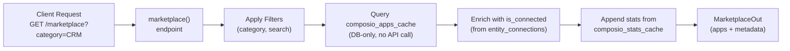

**Implementation Details:**
- **PERFORMANCE FIX**: This endpoint does NOT sync pending connections. Pending sync was removed to eliminate 48+ Composio API calls on page loads (see line 88-91 comment).
- Internal tools (`RAG`, `MEMORY`, `NL2SQL`, `CODEGRAPH`) are excluded via `~ComposioAppCache.app_name.in_(INTERNAL_APP_NAMES)` filter.
- Triggers are extracted from `app_metadata` JSONB field, which is populated during sync.

**Example Request:**
```bash
GET /api/tools/marketplace?category=Communication&limit=20&offset=0
```

**Example Response:**
```json
{
  "apps": [
    {
      "id": 42,
      "app_name": "SLACK",
      "display_name": "Slack",
      "description": "Team collaboration platform",
      "logo_url": "https://logo.clearbit.com/slack.com",
      "categories": ["Communication", "Productivity"],
      "auth_schemes": ["OAUTH2"],
      "action_count": 127,
      "trigger_count": 8,
      "status": "ACTIVE",
      "is_connected": true,
      "triggers": [
        {"name": "new_message", "description": "Triggered when new message posted"}
      ]
    }
  ],
  "total_apps": 1,
  "total_actions": 4500,
  "categories": {"Communication": 12, "CRM": 8},
  "last_synced": "2024-01-15T10:30:00Z"
}
```

**Sources:** [orchestrator/api/tools.py:77-171]()

---

### GET /api/tools/stats

Get aggregated statistics about tools, categories, and action counts.

**Response:** `StatsOut`

**Implementation:**
- Reads from `composio_stats_cache` table (populated by `/sync` endpoint)
- Counts connected apps by querying `entity_connections` where `status = 'active'`

**Example Response:**
```json
{
  "total_apps": 450,
  "total_actions": 4500,
  "connected_apps": 12,
  "categories": {
    "CRM": 8,
    "Communication": 12,
    "Development": 25
  },
  "last_synced": "2024-01-15T10:30:00Z"
}
```

**Sources:** [orchestrator/api/tools.py:174-198]()

---

### GET /api/tools/connected

Get all apps connected or added to the current workspace.

**Response:**
```json
{
  "apps": [
    {
      "id": 42,
      "app_name": "GITHUB",
      "status": "active",
      "connected_at": "2024-01-10T08:00:00Z",
      "connection_id": "conn_xyz",
      "display_name": "GitHub",
      "description": "Code hosting and collaboration",
      "logo_url": "https://logo.clearbit.com/github.com",
      "categories": ["Development"],
      "action_count": 234,
      "trigger_count": 15,
      "triggers": []
    }
  ],
  "total": 1
}
```

**Status Values:**
- `active`: OAuth completed, fully connected
- `added`: Added to workspace but not authenticated
- `pending`: OAuth in progress (awaiting callback)

**PERFORMANCE NOTE**: This endpoint reads connection status from database only. It does NOT call Composio API. Pending connections are synced via manual `/refresh-connections` endpoint (see line 214 comment).

**Sources:** [orchestrator/api/tools.py:201-259]()

---

### GET /api/tools/{app_name}/actions

Get available actions for a specific app, with enabled state for the current workspace.

**Path Parameters:**
| Parameter | Type | Description |
|-----------|------|-------------|
| `app_name` | string | Composio app name (e.g., "GITHUB") |

**Query Parameters:**
| Parameter | Type | Default | Description |
|-----------|------|---------|-------------|
| `search` | string | None | Filter actions by name/description |
| `limit` | integer | 5000 | Max results (1-20000) |
| `offset` | integer | 0 | Pagination offset |

**Response:**
```json
[
  {
    "name": "GITHUB_CREATE_ISSUE",
    "display_name": "Create Issue",
    "description": "Creates a new issue in repository",
    "app_name": "GITHUB",
    "parameters": {
      "type": "object",
      "properties": {
        "title": {"type": "string"},
        "body": {"type": "string"}
      },
      "required": ["title"]
    },
    "enabled": true
  }
]
```

**Implementation Flow:**

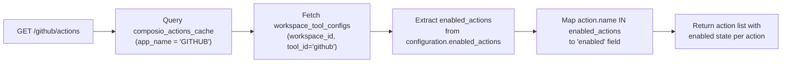

**High Limit Rationale**: Default limit is 5000 (not 500) because many apps like GitHub have 500+ actions. This avoids forcing frontend to implement pagination for "show all actions" use cases (see line 266-268 comment).

**Sources:** [orchestrator/api/tools.py:262-309]()

---

### GET /api/tools/{app_name}/triggers

Get available triggers (webhooks/events) for a specific app.

**Path Parameters:**
| Parameter | Type | Description |
|-----------|------|-------------|
| `app_name` | string | Composio app name |

**Response:**
```json
[
  {
    "name": "github_push_event",
    "display_name": "Push Event",
    "description": "Triggered when code is pushed",
    "config": {
      "repo": "owner/repo",
      "branch": "main"
    }
  }
]
```

**Implementation:**
- Reads from `composio_apps_cache.app_metadata["triggers"]` JSONB field
- Triggers are synced during `POST /sync` to avoid schema changes
- Returns empty array if app not found or triggers not synced

**Sources:** [orchestrator/api/tools.py:312-329]()

---

### POST /api/tools/{app_name}/actions

Save enabled actions for an app in the current workspace. This configures which actions agents can use when this tool is assigned.

**Path Parameters:**
| Parameter | Type | Description |
|-----------|------|-------------|
| `app_name` | string | Composio app name |

**Request Body:**
```json
{
  "actions": [
    "GITHUB_CREATE_ISSUE",
    "GITHUB_CREATE_PR",
    "GITHUB_MERGE_PR"
  ]
}
```

**Response:**
```json
{
  "status": "success",
  "enabled_count": 3,
  "app_name": "GITHUB"
}
```

**Implementation:**
- Creates or updates `workspace_tool_configs` record
- Stores enabled actions in `configuration.enabled_actions` JSONB field
- Tool ID is normalized to lowercase (e.g., "GITHUB" → "github")

**Sources:** [orchestrator/api/tools.py:332-367]()

---

### POST /api/tools/connect

Initiate OAuth connection flow for an app. Returns redirect URL for user authorization.

**Request Body:**
```json
{
  "app_name": "GITHUB",
  "callback_url": "https://app.automatos.ai/tools/callback"
}
```

**Response:**
```json
{
  "redirect_url": "https://api.composio.dev/v1/oauth/authorize?...",
  "app_name": "GITHUB"
}
```

**Flow Diagram:**

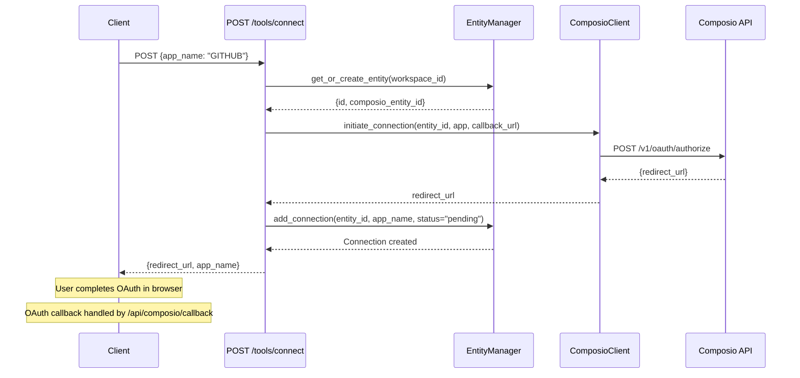

**Implementation Details:**
- Delegates OAuth flow to `ComposioClient.initiate_connection()`
- Creates `entity_connections` record with `status="pending"`
- Status transitions to `active` after OAuth callback completes (see [Composio Integration](#6.1))

**Sources:** [orchestrator/api/tools.py:370-393]()

---

### GET /api/tools/workspace

Get ALL tools in workspace (both connected and added, but not yet connected).

**Response:**
```json
{
  "apps": [
    {
      "id": 42,
      "app_name": "SLACK",
      "status": "active",
      "connected_at": "2024-01-10T08:00:00Z",
      "connection_id": "conn_abc"
    },
    {
      "id": 43,
      "app_name": "GITHUB",
      "status": "added",
      "connected_at": null,
      "connection_id": null
    }
  ],
  "total": 2
}
```

**Difference from `/connected`:**
- `/connected` returns only active connections
- `/workspace` returns active, added, and pending (all workspace interactions)

**Sources:** [orchestrator/api/tools.py:396-448]()

---

### POST /api/tools/add-to-workspace

Add an app to workspace without OAuth. Creates `added` status connection record. User can later click "Connect" to initiate OAuth.

**Request Body:**
```json
{
  "app_name": "GITHUB",
  "callback_url": null
}
```

**Response:**
```json
{
  "status": "success",
  "message": "GITHUB added to workspace. Click Connect to authorize.",
  "app_name": "GITHUB"
}
```

**Status Transition Diagram:**

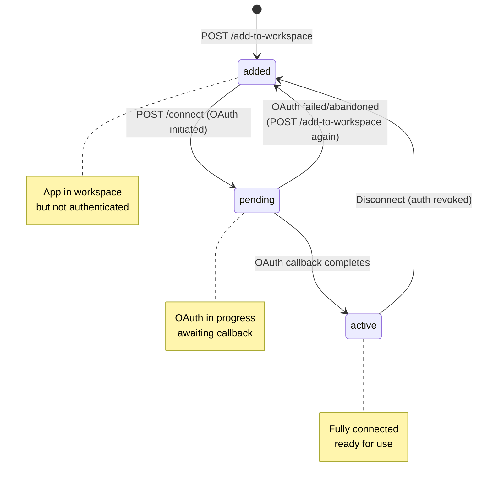

**Special Cases:**
- If connection with `status="pending"` exists, it overwrites to `added` (allows retry of failed OAuth)
- If `active` or `added` connection exists, returns `already_added` status
- Commits immediately to ensure database consistency

**Sources:** [orchestrator/api/tools.py:451-528]()

---

### DELETE /api/tools/remove-from-workspace/{app_name}

Remove an app from workspace. Deletes the connection record (works for any status).

**Path Parameters:**
| Parameter | Type | Description |
|-----------|------|-------------|
| `app_name` | string | App name to remove |

**Authentication:**
- Requires workspace admin/owner role (enforced by `_assert_workspace_admin()`)

**Response:**
```json
{
  "status": "success",
  "message": "GITHUB removed from workspace"
}
```

**Error Responses:**
- `403 Forbidden`: User lacks admin permissions
- `404 Not Found`: App not found in workspace or no entity exists

**Implementation:**
- Calls `EntityManager.remove_connection(entity_id, app_name)`
- Does NOT revoke OAuth tokens in Composio (connection can be re-added)

**Sources:** [orchestrator/api/tools.py:566-595]()

---

### POST /api/tools/sync

Synchronize app and action metadata from Composio API to local cache. Populates `composio_apps_cache`, `composio_actions_cache`, and `composio_stats_cache` tables.

**Query Parameters:**
| Parameter | Type | Default | Description |
|-----------|------|---------|-------------|
| `sync_type` | string | "full" | "full" or "incremental" |

**Authentication:**
- No admin check required (any authenticated workspace can sync)

**Response:**
```json
{
  "status": "success",
  "synced_apps": 450,
  "synced_actions": 4500,
  "duration_ms": 12500,
  "sync_type": "full"
}
```

**Sync Types:**

| Type | Behavior |
|------|----------|
| `full` | Fetch all apps and actions from Composio API, rebuild entire cache |
| `incremental` | Fetch only new/updated apps since last sync (based on `updated_at`) |

**Sync Architecture:**

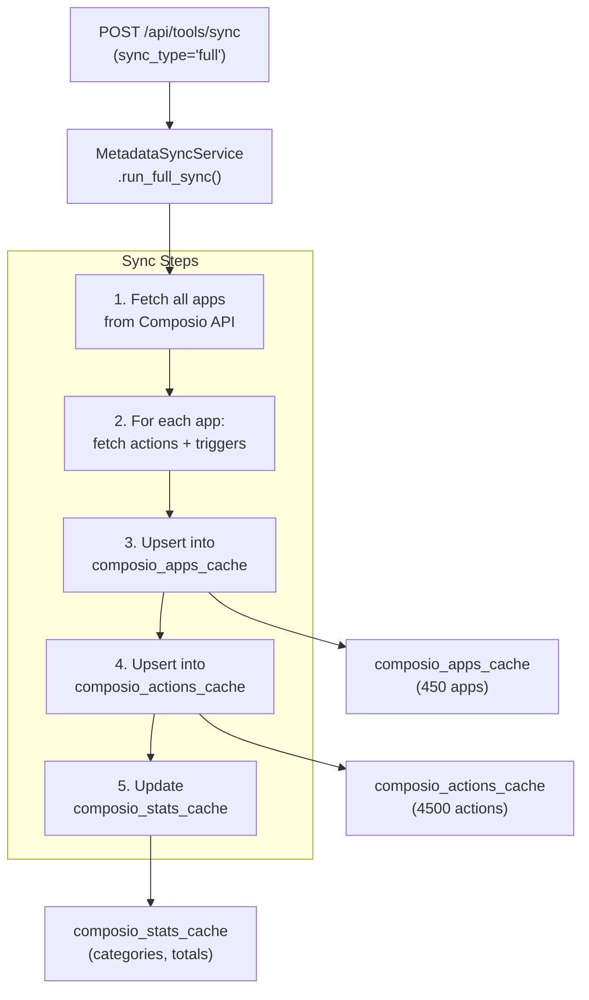

**Performance Characteristics:**
- Full sync typically takes 10-15 seconds for 450 apps
- Recommended frequency: Once per day or on-demand
- Frontend should NOT call this on page loads (performance bottleneck)

**Sources:** [orchestrator/api/tools.py:606-619]()

---

### POST /api/tools/refresh-connections

Manually refresh pending connections from Composio API. Checks all workspace connections with `status="pending"` and updates to `active` if OAuth completed.

**Response:**
```json
{
  "synced": 3,
  "updated": 2,
  "message": "Synced 3 pending connections"
}
```

**When to Use:**
- After OAuth callback completes
- When UI shows stale pending status
- NOT on every page load (see performance note in code)

**Flow:**

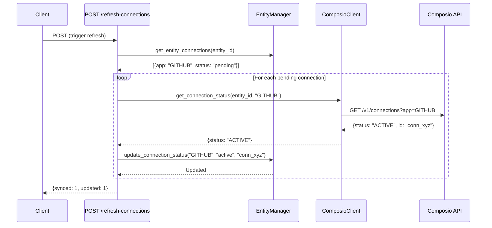

**IMPORTANT**: This endpoint makes external API calls and should be used sparingly. The marketplace and connected endpoints were optimized to NOT call this on page loads (removed in performance fix).

**Sources:** [orchestrator/api/tools.py:622-685]()

---

## Frontend Integration

### MarketplaceToolsTab Component

The primary UI for browsing and adding Composio apps.

**Key Features:**
- Category filtering via horizontal scroll buttons
- Search by app name/description
- Pagination (40 items per page)
- Tool card display with connect/disconnect actions
- Status badges (Connected, Added)

**State Flow:**

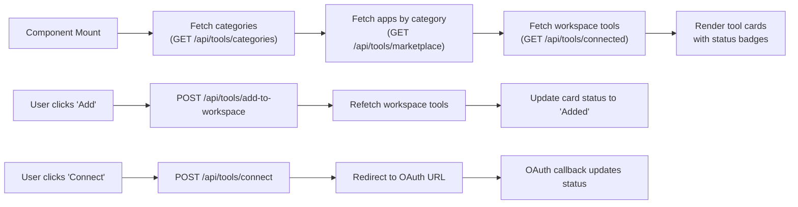

**Component Hierarchy:**

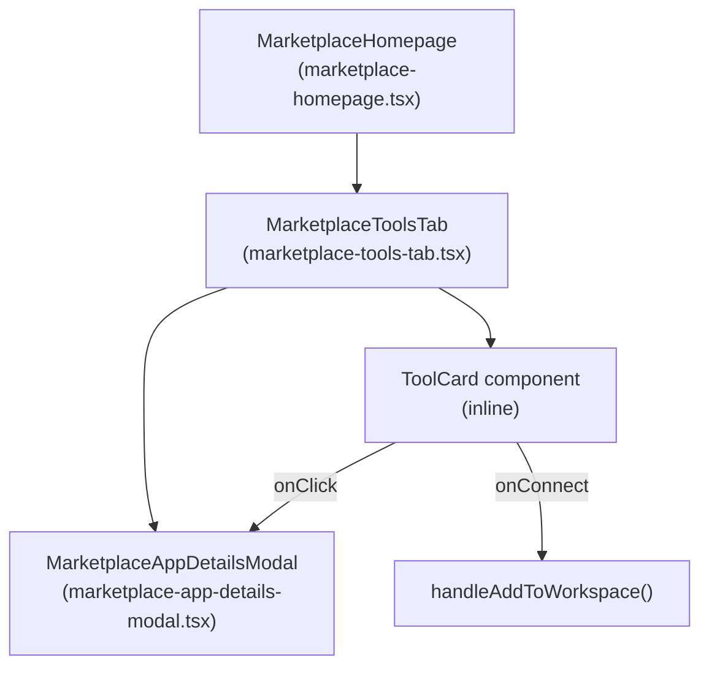

**Performance Optimizations:**
- Category filter triggers new backend call with `category` param (server-side filtering)
- Search filter applies client-side for instant feedback
- Apps are paginated to show 40 per page (prevents DOM overload)
- Tool logos cached with `ToolLogo` component

**Sources:** [frontend/components/marketplace/marketplace-tools-tab.tsx:72-495]()

---

## Database Schema

### composio_apps_cache

Stores metadata for all available Composio apps.

| Column | Type | Description |
|--------|------|-------------|
| `id` | integer | Primary key |
| `app_name` | string | Uppercase app identifier (e.g., "GITHUB") |
| `app_slug` | string | Lowercase slug for URLs |
| `display_name` | string | Human-readable name |
| `description` | text | App description |
| `logo_url` | string | URL to app logo |
| `categories` | jsonb | Array of category strings |
| `auth_schemes` | jsonb | Array of supported auth methods |
| `action_count` | integer | Total available actions |
| `trigger_count` | integer | Total available triggers |
| `status` | string | "ACTIVE", "DEPRECATED", etc. |
| `app_metadata` | jsonb | Additional metadata (includes triggers) |
| `created_at` | timestamp | Cache creation time |
| `updated_at` | timestamp | Last sync time |

**Indexes:**
- `app_name` (unique)
- `status`
- `categories` (GIN index for JSONB containment queries)

### composio_actions_cache

Stores metadata for all actions across all apps.

| Column | Type | Description |
|--------|------|-------------|
| `id` | integer | Primary key |
| `app_name` | string | Foreign key to apps (uppercase) |
| `action_name` | string | Unique action identifier |
| `display_name` | string | Human-readable name |
| `description` | text | Action description |
| `parameters` | jsonb | JSON Schema for action inputs |
| `response_schema` | jsonb | JSON Schema for action outputs |
| `created_at` | timestamp | Cache creation time |
| `updated_at` | timestamp | Last sync time |

**Indexes:**
- `(app_name, action_name)` (composite unique)
- `action_name` (for fast search)

### composio_stats_cache

Stores aggregated statistics (total apps, actions, categories).

| Column | Type | Description |
|--------|------|-------------|
| `id` | integer | Primary key |
| `stat_key` | string | Stat identifier (e.g., "total_apps", "categories") |
| `stat_value` | jsonb | Stat data (count, timestamp, breakdown) |
| `updated_at` | timestamp | Last update time |

**Example Rows:**
```json
{
  "stat_key": "total_apps",
  "stat_value": {"count": 450, "timestamp": "2024-01-15T10:30:00Z"}
}
```

```json
{
  "stat_key": "categories",
  "stat_value": {"CRM": 8, "Communication": 12, "Development": 25}
}
```

### entity_connections

Stores workspace-level app connections (managed by EntityManager).

| Column | Type | Description |
|--------|------|-------------|
| `id` | integer | Primary key |
| `entity_id` | integer | Foreign key to entities table |
| `app_name` | string | Uppercase app name |
| `status` | string | "added", "pending", "active" |
| `connection_id` | string | Composio connection ID (null until active) |
| `connected_at` | timestamp | When OAuth completed |
| `created_at` | timestamp | When added to workspace |

**Status Lifecycle:**
1. `added` - App added to workspace, not authenticated
2. `pending` - OAuth initiated, awaiting callback
3. `active` - OAuth completed, connection established

**Important**: Connections are NEVER deleted, only status transitions. This prevents data loss from temporary OAuth failures.

### workspace_tool_configs

Stores per-workspace configuration for tools (which actions are enabled).

| Column | Type | Description |
|--------|------|-------------|
| `id` | integer | Primary key |
| `workspace_id` | uuid | Foreign key to workspaces |
| `tool_id` | string | Lowercase app name (e.g., "github") |
| `display_name` | string | Human-readable tool name |
| `enabled` | boolean | Whether tool is active |
| `configuration` | jsonb | Config data (includes `enabled_actions`) |
| `created_at` | timestamp | Creation time |
| `updated_at` | timestamp | Last modification time |

**Example Configuration:**
```json
{
  "enabled_actions": [
    "GITHUB_CREATE_ISSUE",
    "GITHUB_CREATE_PR",
    "GITHUB_MERGE_PR"
  ]
}
```

### marketplace_plugins

Stores plugins available in the marketplace (both global and workspace-scoped).

| Column | Type | Description |
|--------|------|-------------|
| `id` | uuid | Primary key |
| `slug` | string | URL-friendly identifier (unique) |
| `name` | string | Human-readable name |
| `version` | string | Semantic version (e.g., "1.0.0") |
| `description` | text | Plugin description |
| `author` | string | Plugin author |
| `source_type` | string | "s3", "github", "local" |
| `workspace_id` | uuid | NULL for global, UUID for workspace-scoped |
| `skills_count` | integer | Number of skills in plugin |
| `commands_count` | integer | Number of commands in plugin |
| `token_estimate` | integer | Estimated token usage |
| `content_metadata` | jsonb | Skills, commands, dependencies |
| `created_at` | timestamp | Creation time |

### agent_assigned_plugins

Junction table mapping agents to their assigned plugins.

| Column | Type | Description |
|--------|------|-------------|
| `id` | integer | Primary key |
| `agent_id` | integer | Foreign key to agents |
| `plugin_id` | uuid | Foreign key to marketplace_plugins |
| `priority` | integer | Load order (0 = highest priority) |
| `assigned_at` | timestamp | Assignment timestamp |

**Indexes:**
- `(agent_id, plugin_id)` (composite unique - prevents duplicate assignments)
- `agent_id` (for fast agent plugin lookups)

### workspace_enabled_plugins

Tracks which plugins are enabled for a workspace (required before agent assignment).

| Column | Type | Description |
|--------|------|-------------|
| `id` | integer | Primary key |
| `workspace_id` | uuid | Foreign key to workspaces |
| `plugin_id` | uuid | Foreign key to marketplace_plugins |
| `enabled_at` | timestamp | When enabled |
| `enabled_by` | string | User ID who enabled it |

**Constraint Enforcement:**

```python
# From agent_plugins.py:156-165
# Plugin must be workspace-enabled before agent assignment
enabled = db.query(WorkspaceEnabledPlugin).filter(
    WorkspaceEnabledPlugin.workspace_id == workspace_id,
    WorkspaceEnabledPlugin.plugin_id == plugin.id,
).first()

if not enabled:
    raise HTTPException(status_code=400, detail="Plugin not enabled for workspace")
```

**Sources:** [orchestrator/core/models/composio_cache.py]() (referenced), [orchestrator/core/models/tool_assignments.py]() (referenced), [orchestrator/core/models/marketplace_plugins.py]() (referenced)

---

## Error Handling

### Common Error Responses

| Status | Scenario | Response Body |
|--------|----------|---------------|
| 400 Bad Request | Invalid app_name format | `{"detail": "Invalid app name"}` |
| 403 Forbidden | Non-admin tries admin endpoint | `{"detail": "Insufficient permissions"}` |
| 404 Not Found | App not found in cache | `{"detail": "App not found"}` |
| 503 Service Unavailable | Composio API unavailable | `{"detail": "Failed to initiate OAuth: <error>"}` |

### Rate Limiting

The API does NOT implement rate limiting at the endpoint level. However, Composio API has its own rate limits:
- Free tier: 100 requests/minute
- Paid tier: 1000 requests/minute

Exceeding these limits during `/sync` will result in 429 errors from Composio.

### Retry Logic

- `/sync` endpoint implements exponential backoff for failed API calls
- `/refresh-connections` retries pending connections up to 3 times
- `/connect` does NOT retry OAuth initiation (user must retry manually)

**Sources:** [orchestrator/api/tools.py:370-393](), [orchestrator/api/tools.py:606-685]()

---

## Authentication & Authorization

All endpoints use **hybrid authentication** (Clerk JWT or API keys). See [Authentication Flow](#9.1) for details.

### Workspace Context Resolution

Every request resolves `workspace_id` via:
1. `x-workspace-id` header (priority 1)
2. `workspace_id` query param (priority 2)
3. `WORKSPACE_ID` env var (priority 3)
4. Default tenant UUID (priority 4)

Connections and configurations are scoped per workspace, ensuring multi-tenant isolation.

### Admin Endpoints

The following endpoints require workspace admin/owner role:
- `DELETE /api/tools/remove-from-workspace/{app_name}`
- `GET /api/tools/debug/connections` (debug only)

Admin check enforced via `_assert_workspace_admin(ctx: RequestContext)` helper.

**Sources:** [orchestrator/api/tools.py:32-36](), [orchestrator/api/tools.py:539-563]()

---

## Testing & Debugging

### Debug Endpoint

`GET /api/tools/debug/connections` (Admin only)

Shows all connection records for the current workspace, useful for diagnosing status issues.

**Response:**
```json
{
  "workspace_id": "550e8400-e29b-41d4-a716-446655440000",
  "entity_id": 123,
  "connections": [
    {
      "app_name": "GITHUB",
      "status": "active",
      "created_at": "2024-01-10T08:00:00Z",
      "connected_at": "2024-01-10T08:05:00Z",
      "connection_id": "conn_xyz"
    }
  ],
  "total": 1
}
```

### Manual Testing Flow

1. **Add app to workspace:**
   ```bash
   curl -X POST http://localhost:8000/api/tools/add-to-workspace \
     -H "Content-Type: application/json" \
     -d '{"app_name": "GITHUB"}'
   ```

2. **Initiate OAuth:**
   ```bash
   curl -X POST http://localhost:8000/api/tools/connect \
     -H "Content-Type: application/json" \
     -d '{"app_name": "GITHUB", "callback_url": "http://localhost:3000/tools/callback"}'
   ```

3. **Complete OAuth in browser** (use returned `redirect_url`)

4. **Refresh connection status:**
   ```bash
   curl -X POST http://localhost:8000/api/tools/refresh-connections
   ```

5. **Verify connection:**
   ```bash
   curl http://localhost:8000/api/tools/connected
   ```

**Sources:** [orchestrator/api/tools.py:531-563]()

---

## Agent Plugin Assignment Endpoints

### GET /api/agents/{agent_id}/plugins

List all plugins assigned to an agent, with metadata from the marketplace.

**Path Parameters:**
| Parameter | Type | Description |
|-----------|------|-------------|
| `agent_id` | integer | Agent ID |

**Response:**
```json
{
  "items": [
    {
      "plugin_id": "550e8400-e29b-41d4-a716-446655440000",
      "slug": "code-reviewer",
      "name": "Code Review Assistant",
      "version": "1.0.0",
      "description": "Automated code review and quality checks",
      "skills_count": 5,
      "commands_count": 3,
      "token_estimate": 2500,
      "priority": 0,
      "assigned_at": "2024-01-15T10:30:00Z"
    }
  ]
}
```

**Implementation Flow:**

Title: **Plugin Assignment Query**

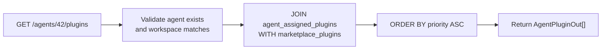

**Authorization:**
- Validates agent exists in database
- Enforces workspace isolation (agent.workspace_id must match ctx.workspace_id)
- Returns 403 if workspace mismatch, 404 if agent not found

**Sources:** [orchestrator/api/agent_plugins.py:68-124]()

---

### PUT /api/agents/{agent_id}/plugins

Update plugin assignments for an agent. Replaces all existing assignments with the provided list.

**Path Parameters:**
| Parameter | Type | Description |
|-----------|------|-------------|
| `agent_id` | integer | Agent ID |

**Request Body:**
```json
{
  "plugin_ids": [
    "550e8400-e29b-41d4-a716-446655440000",
    "660e8400-e29b-41d4-a716-446655440001"
  ]
}
```

**Response:**
```json
{
  "status": "success",
  "assigned": 2,
  "removed": 1,
  "agent_id": 42
}
```

**Implementation Steps:**

1. **Validation:**
   - Agent exists and belongs to current workspace
   - Deduplicate plugin_ids while preserving order
   - Each plugin_id resolves to a valid `marketplace_plugins` record
   - Each plugin is workspace-enabled (exists in `workspace_enabled_plugins`)

2. **Assignment Update:**
   - Delete all existing `agent_assigned_plugins` records for this agent
   - Insert new records with priority based on list order (0, 1, 2, ...)
   - Commit transaction atomically

3. **Error Handling:**
   - 403 if workspace mismatch
   - 404 if agent not found
   - 400 if plugin not found or not workspace-enabled

**Key Constraint:**
```python
# From agent_plugins.py:156-165
if not enabled:
    raise HTTPException(
        status_code=400,
        detail=f"Plugin {plugin.slug} ({plugin.name}) not enabled for workspace. "
               f"Admin must enable it first in marketplace."
    )
```

Plugins MUST be workspace-enabled before assignment. This prevents agents from accessing plugins that haven't been vetted by workspace admins.

**Sources:** [orchestrator/api/agent_plugins.py:126-208]()

---

### GET /api/agents/{agent_id}/context

Get the fully assembled agent context, including persona, plugin skills, and tools. Used by the Agent Factory when activating an agent.

**Path Parameters:**
| Parameter | Type | Description |
|-----------|------|-------------|
| `agent_id` | integer | Agent ID |

**Response:**
```json
{
  "agent_id": 42,
  "model": "gpt-4-turbo-preview",
  "temperature": 0.7,
  "system_prompt": "You are a senior engineer assistant...",
  "persona": {
    "name": "Senior Engineer",
    "voice_description": "Technical, precise, patient",
    "suggested_temperature": 0.5
  },
  "plugins_loaded": ["code-reviewer", "test-generator"],
  "tools": [
    {
      "name": "review_code",
      "description": "Perform automated code review",
      "parameters": {...}
    }
  ],
  "token_estimate": 5000
}
```

**Assembly Process:**

Title: **Agent Context Assembly**

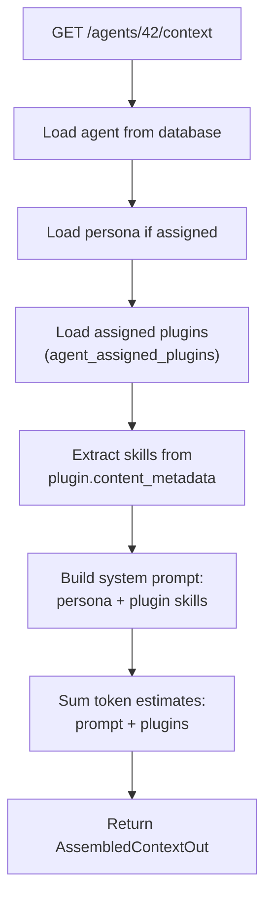

**Token Estimation:**
- Base system prompt: ~500 tokens
- Persona description: ~200 tokens per persona
- Plugin skills: plugin.token_estimate (pre-calculated during scan)
- Total = sum of all components

**Use Case:**
This endpoint is called by the Agent Factory when activating an agent for execution. It provides all the context needed to construct the LLM system message, including persona voice and plugin-provided skills.

**Sources:** [orchestrator/api/agent_plugins.py:211-281]()

---

## Performance Considerations

### Cache Hit Ratio

The cache-first architecture achieves near 100% cache hit ratio for listing endpoints:
- `/marketplace`: Always reads from cache (no external calls)
- `/connected`: Reads from database only
- `/{app}/actions`: Reads from cache (no external calls)

Only `/connect` and `/sync` make external API calls.

### Database Query Optimization

**Indexes Used:**
- `composio_apps_cache.app_name` (unique, B-tree)
- `composio_apps_cache.status` (B-tree)
- `composio_apps_cache.categories` (GIN, for `@>` containment queries)
- `composio_actions_cache(app_name, action_name)` (composite unique)
- `entity_connections(entity_id, app_name)` (composite, for workspace lookups)

**Query Patterns:**
```sql
-- Marketplace listing with category filter
SELECT * FROM composio_apps_cache
WHERE status = 'ACTIVE'
  AND NOT app_name = ANY('{RAG,MEMORY,NL2SQL,CODEGRAPH}')
  AND categories @> '["CRM"]'
ORDER BY action_count DESC
LIMIT 100 OFFSET 0;
```

### Frontend Pagination

The frontend uses client-side pagination after fetching filtered results:
- 40 items per page (hardcoded in `pageSize` const)
- Resets to page 1 on filter/search change
- Uses `EnhancedPagination` component for UI

This avoids backend pagination complexity while maintaining performance (DB query still limited to 1000 apps).

**Sources:** [frontend/components/marketplace/marketplace-tools-tab.tsx:82-248]()

---

## Related Endpoints

### Composio Integration Router

The `/api/composio/*` endpoints handle OAuth callbacks and entity management:
- `GET /api/composio/callback` - OAuth callback handler
- `POST /api/composio/disconnect` - Revoke OAuth tokens
- `GET /api/composio/entities` - List Composio entities

See [Composio Integration](#6.1) for details.

### Agent Tool Assignments

The `/api/agents/{id}/tools` endpoints assign tools to specific agents:
- `GET /api/agents/{id}/tools` - Get assigned tools for agent
- `PUT /api/agents/{id}/tools` - Update tool assignments
- `POST /api/agents/{id}/tools/bulk` - Bulk assign/unassign

See [Agent API Reference](#3.6) for details.

**Sources:** [orchestrator/api/tools.py:1-700]()

---