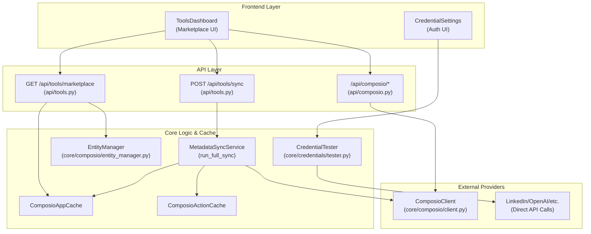
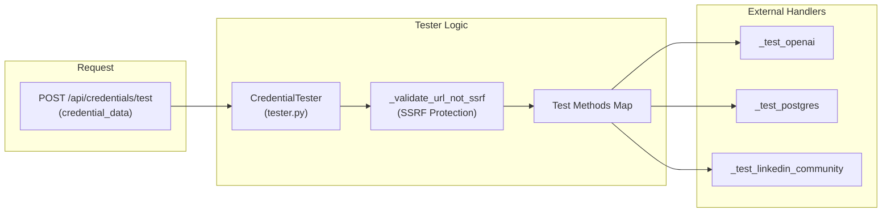

# Tools API Reference

Relevant source files

The following files were used as context for generating this wiki page:

- [orchestrator/api/composio.py](orchestrator/api/composio.py)
- [orchestrator/api/tools.py](orchestrator/api/tools.py)
- [orchestrator/core/composio/client.py](orchestrator/core/composio/client.py)
- [orchestrator/core/composio/linkedin_image_workaround.py](orchestrator/core/composio/linkedin_image_workaround.py)
- [orchestrator/core/composio/tool_executor.py](orchestrator/core/composio/tool_executor.py)
- [orchestrator/core/credentials/tester.py](orchestrator/core/credentials/tester.py)
- [orchestrator/core/credentials/types.py](orchestrator/core/credentials/types.py)
- [orchestrator/core/database/credential_types_seed.json](orchestrator/core/database/credential_types_seed.json)
- [orchestrator/services/metadata_sync_service.py](orchestrator/services/metadata_sync_service.py)

This page documents the REST API endpoints and core service logic for **tool management** across the platform. These endpoints provide programmatic access to the Composio marketplace, agent plugin assignments, tool discovery (hints), and the metadata synchronization system.

The Tools API is the primary interface for the **Tools Dashboard** and the **Agent Builder**, enabling users to discover, connect, and configure 880+ external applications.

---

## Overview

The Tools system is divided into three primary functional areas:

### 1. Composio Marketplace API (`/api/tools/*`)
Manages the lifecycle of external app integrations. It uses a **cache-first architecture** where app metadata (logos, descriptions, actions) is stored locally to ensure sub-millisecond page loads [orchestrator/api/tools.py:7-8]().
- **Marketplace Browsing**: Filter and search 880+ apps by category via `ComposioAppCache` [orchestrator/api/tools.py:138-141]().
- **Connection Management**: Handle OAuth flows and "No-Auth" workspace additions using the `EntityManager` [orchestrator/api/tools.py:119-121]().
- **Metadata Sync**: Background synchronization of the local database with the Composio registry via `MetadataSyncService` [orchestrator/services/metadata_sync_service.py:42-47]().

### 2. Tool Execution & File Handling
The `ComposioToolExecutor` handles the invocation of external actions. A critical feature is the **Automatic File Resolution** pipeline, which intercepts URL or workspace file references in tool parameters and converts them into Composio-compatible `FileUploadable` objects [orchestrator/core/composio/tool_executor.py:123-132]().

### 3. Credential Management
For tools requiring direct API access outside of the Composio OAuth flow (e.g., the LinkedIn Image Workaround), the platform utilizes a `CredentialStore`. This includes a `CredentialTester` that performs n8n-style validation calls to verify API keys and tokens before they are saved [orchestrator/core/credentials/tester.py:69-72]().

**Sources:** [orchestrator/api/tools.py:4-8](), [orchestrator/core/composio/tool_executor.py:5-12](), [orchestrator/core/credentials/tester.py:1-10]()

---

## System Architecture

### Tool Discovery and Data Flow
The system prioritizes local database performance. The `MetadataSyncService` acts as the bridge between the external Composio registry and the internal cache tables.

Title: **Tools Metadata and Connection Flow**

**Sources:** [orchestrator/api/tools.py:104-112](), [orchestrator/services/metadata_sync_service.py:42-62](), [orchestrator/core/composio/client.py:54-79](), [orchestrator/core/credentials/tester.py:69-110]()

---

## API Endpoints: Marketplace & Stats

### GET `/api/tools/marketplace`
Lists available apps from the local cache.

**Query Parameters:**
- `category` (string): Filter by app category [orchestrator/api/tools.py:106]().
- `search` (string): Fuzzy search on display name, app name, or description [orchestrator/api/tools.py:144-150]().
- `limit/offset`: Standard pagination (default limit 100) [orchestrator/api/tools.py:108-109]().

**Implementation Detail:**
Internal tools (`RAG`, `MEMORY`, `NL2SQL`, `CODEGRAPH`) are explicitly excluded from the marketplace list via `INTERNAL_APP_NAMES` [orchestrator/api/tools.py:65](), [orchestrator/api/tools.py:138-141]().

### GET `/api/tools/stats`
Returns high-level statistics about the tool ecosystem for the current workspace.
- `total_apps`: Total apps available in the global cache [orchestrator/api/tools.py:226]().
- `connected_apps`: Number of active connections for the specific `workspace_id` [orchestrator/api/tools.py:217-223]().

**Sources:** [orchestrator/api/tools.py:104-199](), [orchestrator/api/tools.py:202-233]()

---

## Tool Execution & File Resolution

The `ComposioToolExecutor` manages the lifecycle of an action execution. A key technical challenge addressed is handling files (images/videos) that agents produce or reference.

### Automatic File Resolution
When an agent calls an action listed in `UPLOAD_ACTIONS` (e.g., `TWITTER_UPLOAD_MEDIA`, `LINKEDIN_CREATE_IMAGE_POST`), the executor runs `resolve_file_uploads` [orchestrator/core/composio/tool_executor.py:123-137]().

1.  **Detection**: It scans parameters for URLs or workspace paths (`/files/...`) [orchestrator/core/composio/tool_executor.py:57-66]().
2.  **Download**: If it's a workspace path, it uses `WorkspaceClient` to download the bytes [orchestrator/core/composio/tool_executor.py:97-105]().
3.  **S3 Upload**: It converts the file into a `FileUploadable` object, which the Composio SDK then uploads to its S3-backed storage for the external app to consume [orchestrator/core/composio/tool_executor.py:112-118]().

### LinkedIn Image Workaround
Due to known issues with Composio's LinkedIn image handling, the system includes a direct bypass module `linkedin_image_workaround.py` [orchestrator/core/composio/linkedin_image_workaround.py:4-6](). This module uses the platform's internal `CredentialStore` to fetch OAuth2 tokens and calls the LinkedIn Community Management API directly [orchestrator/core/composio/linkedin_image_workaround.py:61-66]().

**Sources:** [orchestrator/core/composio/tool_executor.py:38-48](), [orchestrator/core/composio/tool_executor.py:123-132](), [orchestrator/core/composio/linkedin_image_workaround.py:1-24]()

---

## Credential Validation

The platform supports 400+ credential types [orchestrator/core/credentials/types.py:10](). To ensure reliability, the `CredentialTester` provides n8n-style validation.

Title: **Credential Validation Logic**

### SSRF Protection
All credential tests involving a `base_url` (like OpenAI or Anthropic) are passed through `_validate_url_not_ssrf` to prevent agents or users from probing internal network metadata or services [orchestrator/core/credentials/tester.py:39-50]().

**Sources:** [orchestrator/core/credentials/tester.py:55-72](), [orchestrator/core/credentials/tester.py:129-140](), [orchestrator/core/credentials/types.py:1-10]()

---

## Metadata Synchronization

The `MetadataSyncService` ensures the local cache stays up to date with the Composio registry.

### Full Sync Process
1.  **Fetch Apps**: Retrieves all available toolkits/apps via `client.get_available_apps()` [orchestrator/services/metadata_sync_service.py:61]().
2.  **Bulk Fetch Actions**: Fetches all action schemas in paged batches (e.g., 1000 per page) via `get_all_actions_bulk` to avoid the N+1 query problem [orchestrator/services/metadata_sync_service.py:75]().
3.  **Orphan Cleanup**: Deletes local actions that no longer exist in the remote registry via `_delete_orphaned_actions` [orchestrator/services/metadata_sync_service.py:119]().
4.  **Stat Recalculation**: Updates `ComposioStatsCache` with total counts and category distributions [orchestrator/services/metadata_sync_service.py:151-164]().

**Sources:** [orchestrator/services/metadata_sync_service.py:42-53](), [orchestrator/services/metadata_sync_service.py:73-86](), [orchestrator/services/metadata_sync_service.py:108-121]()

---

## Database Models

### Composio Cache Tables
| Table | Purpose | Key Columns |
|-------|---------|-------------|
| `ComposioAppCache` | Marketplace Metadata | `app_name`, `logo_url`, `categories`, `app_metadata` [orchestrator/api/tools.py:139-142]() |
| `ComposioActionCache` | Action Schemas | `action_name`, `app_name`, `parameters` (JSONB) [orchestrator/api/tools.py:131-132]() |
| `ComposioStatsCache` | Global Stats | `stat_key`, `stat_value` [orchestrator/api/tools.py:132-134]() |

**Sources:** [orchestrator/api/tools.py:25-26](), [orchestrator/services/metadata_sync_service.py:25-30]()

---