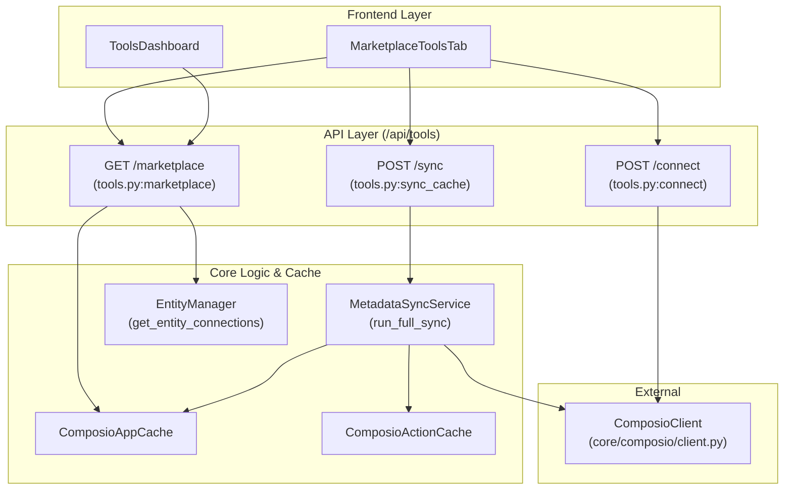
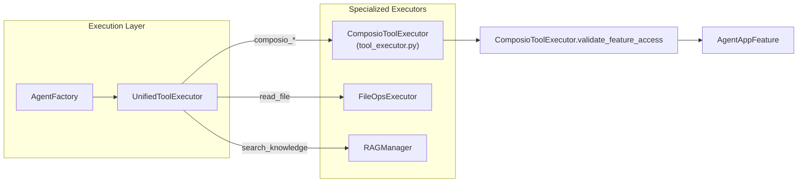

# Tools API Reference

Relevant source files

The following files were used as context for generating this wiki page:

- [orchestrator/api/tools.py](orchestrator/api/tools.py)
- [orchestrator/core/composio/client.py](orchestrator/core/composio/client.py)
- [orchestrator/core/composio/tool_executor.py](orchestrator/core/composio/tool_executor.py)
- [orchestrator/modules/agents/factory/agent_factory.py](orchestrator/modules/agents/factory/agent_factory.py)
- [orchestrator/modules/tools/services/composio_hint_service.py](orchestrator/modules/tools/services/composio_hint_service.py)
- [orchestrator/modules/tools/services/composio_tool_service.py](orchestrator/modules/tools/services/composio_tool_service.py)
- [orchestrator/services/metadata_sync_service.py](orchestrator/services/metadata_sync_service.py)

This page documents the REST API endpoints for **tool management** across the platform. These endpoints provide programmatic access to the Composio marketplace, agent plugin assignments, and the metadata synchronization system.

The Tools API is the primary interface for the **Tools Dashboard** and the **Agent Builder**, enabling users to discover, connect, and configure 880+ external applications.

---

## Overview

The Tools system is divided into two primary functional areas:

### 1. Composio Marketplace API (`/api/tools/*`)
Manages the lifecycle of external app integrations. It uses a **cache-first architecture** where app metadata (logos, descriptions, actions) is stored locally to ensure sub-millisecond page loads.
- **Marketplace Browsing**: Filter and search 880+ apps by category via `ComposioAppCache` [orchestrator/api/tools.py:113-116]().
- **Connection Management**: Handle OAuth flows and "No-Auth" workspace additions using the `EntityManager` [orchestrator/api/tools.py:94-104]().
- **Action Configuration**: Granularly enable/disable specific actions per workspace.
- **Metadata Sync**: Background synchronization of the local database with the Composio registry via `MetadataSyncService` [orchestrator/api/tools.py:26-28]().

### 2. Agent Plugin API (`/api/agents/{id}/plugins`)
Manages the assignment of specialized capabilities to specific agents.
- **Assignment**: Link marketplace plugins to agents via `AgentAppAssignment` [orchestrator/modules/agents/factory/agent_factory.py:27-28]().
- **Context Assembly**: Generate the final system prompt by merging the agent persona with plugin-provided skills and tools.

**Sources:** [orchestrator/api/tools.py:1-31](), [orchestrator/modules/agents/factory/agent_factory.py:1-11](), [orchestrator/core/composio/client.py:1-12]()

---

## System Architecture

### Tool Discovery and Data Flow
The system prioritizes local database performance over live API calls. The `MetadataSyncService` acts as the bridge between the external Composio registry and the internal `ComposioAppCache`.

Title: **Tools Metadata and Connection Flow**

**Sources:** [orchestrator/api/tools.py:79-110](), [orchestrator/services/metadata_sync_service.py:37-54](), [orchestrator/core/composio/client.py:54-79]()

---

## API Endpoints: Marketplace & Stats

### GET `/api/tools/marketplace`
Lists available apps from the local cache.

**Query Parameters:**
- `category` (string): Filter by app category [orchestrator/api/tools.py:81-81]().
- `search` (string): Fuzzy search on display name or description [orchestrator/api/tools.py:82-82]().
- `limit/offset`: Standard pagination (default limit 100) [orchestrator/api/tools.py:83-84]().

**Implementation Detail:**
Internal tools like `RAG`, `MEMORY`, `NL2SQL`, and `CODEGRAPH` are explicitly filtered out from this view to prevent users from accidentally modifying core system tools via the marketplace UI [orchestrator/api/tools.py:40-41](), [orchestrator/api/tools.py:113-116]().

**Response Model (`MarketplaceOut`):**
- `apps`: List of `AppOut` objects including `is_connected` status [orchestrator/api/tools.py:58-64]().
- `total_apps`: Total count in the current filter.
- `categories`: Map of category names to app counts [orchestrator/api/tools.py:171-171]().

### GET `/api/tools/stats`
Returns high-level statistics about the tool ecosystem.
- `total_apps`: Count of all apps in cache [orchestrator/api/tools.py:195-195]().
- `connected_apps`: Number of active connections for the current workspace [orchestrator/api/tools.py:186-192]().

**Sources:** [orchestrator/api/tools.py:79-173](), [orchestrator/api/tools.py:176-201]()

---

## Tool Discovery & Hinting

The platform uses a sophisticated hinting system to provide LLMs with relevant tool schemas without exceeding token limits.

### Composio Hint Service
The `ComposioHintService` implements a 3-tier resolution strategy for building system message hints [orchestrator/modules/tools/services/composio_hint_service.py:12-16]():
1.  **Tier 1: Capability-based**: Matches intent keywords to the `ComposioActionMetadata` taxonomy [orchestrator/modules/tools/services/composio_hint_service.py:162-166]().
2.  **Tier 2: Token-filtered**: Uses `ILIKE` queries against `ComposioActionCache` with a mandatory capability gate to ensure semantic relevance [orchestrator/modules/tools/services/composio_hint_service.py:168-172]().
3.  **Tier 3: Top-N Fallback**: Provides a safe default set of actions per connected app if no specific intent is detected [orchestrator/modules/tools/services/composio_hint_service.py:15-15]().

### Composio Tool Service
The `ComposioToolService` resolves high-level requests into concrete OpenAI function-calling schemas [orchestrator/modules/tools/services/composio_tool_service.py:5-7]().
- **Exact Lookup**: If the prompt contains explicit action names (e.g., `GITHUB_CREATE_ISSUE`), it fetches exact schemas [orchestrator/modules/tools/services/composio_tool_service.py:141-144]().
- **Hint-to-App Mapping**: Maps generic terms like "email" to specific providers like `gmail` to scope searches [orchestrator/modules/tools/services/composio_tool_service.py:80-95]().

**Sources:** [orchestrator/modules/tools/services/composio_hint_service.py:1-21](), [orchestrator/modules/tools/services/composio_tool_service.py:1-22]()

---

## Connection & Workspace Management

### POST `/api/tools/connect`
Initiates an OAuth flow for an external application.

**Data Flow:**
1. Resolves the `ComposioEntity` for the current workspace [orchestrator/api/tools.py:94-95]().
2. Calls `ComposioClient.initiate_connection` to get a redirect URL [orchestrator/core/composio/client.py:69-72]().
3. Returns the `redirect_url` to the frontend, which opens a popup.

### DELETE `/api/tools/remove-from-workspace/{app_name}`
Removes the app connection from the workspace. Requires `admin` or `owner` role via `_assert_workspace_admin` [orchestrator/api/tools.py:34-39]().

**Sources:** [orchestrator/api/tools.py:34-39](), [orchestrator/core/composio/client.py:54-79]()

---

## Tool Execution & Safety

The `UnifiedToolExecutor` serves as the single entry point for all tool calls during agent execution.

Title: **Unified Execution Routing**

### Tool Execution Logic
The `ComposioToolExecutor` handles the actual invocation of Composio SDK actions:
- **Feature Access Validation**: Checks if an agent is permitted to use a specific action via the `AgentAppFeature` model [orchestrator/core/composio/tool_executor.py:66-71]().
- **Action Normalization**: Derives the correct `app_name` and `action_name` even if the LLM provides partial identifiers [orchestrator/core/composio/tool_executor.py:165-180]().
- **Execution Tracking**: Metrics like `execution_count` and `total_tokens_used` are updated after every tool call [orchestrator/modules/agents/factory/agent_factory.py:173-191]().

**Sources:** [orchestrator/core/composio/tool_executor.py:30-46](), [orchestrator/core/composio/tool_executor.py:141-163](), [orchestrator/modules/agents/factory/agent_factory.py:155-171]()

---

## Database Models

### Composio Cache Tables
| Table | Purpose | Key Columns |
|-------|---------|-------------|
| `ComposioAppCache` | Marketplace Metadata | `app_name`, `logo_url`, `categories`, `app_metadata` (JSONB) [orchestrator/api/tools.py:25-25]() |
| `ComposioActionCache` | Action Schemas | `action_name`, `app_name`, `parameters` (JSONB) [orchestrator/api/tools.py:25-25]() |
| `ComposioStatsCache` | Global Stats | `stat_key`, `stat_value` [orchestrator/api/tools.py:25-25]() |

### Workspace & Agent Tables
| Table | Purpose | Key Columns |
|-------|---------|-------------|
| `AgentAppAssignment` | Tool Linkage | `agent_id`, `app_name`, `workspace_id` [orchestrator/modules/agents/factory/agent_factory.py:27-28]() |
| `AgentAppFeature` | Granular Permissions | `agent_id`, `app_name`, `action_name`, `enabled` [orchestrator/core/composio/tool_executor.py:94-101]() |

**Sources:** [orchestrator/api/tools.py:107-108](), [orchestrator/core/models/composio_cache.py:1-30](), [orchestrator/core/composio/tool_executor.py:94-120]()

---