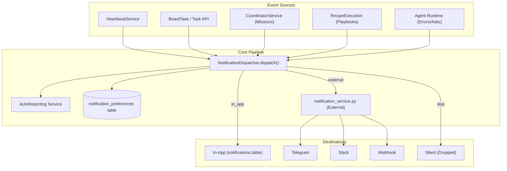

# Unified Notification System

Relevant source files

The following files were used as context for generating this wiki page:

- [frontend/app/layout.tsx](frontend/app/layout.tsx)
- [frontend/components/activity/widgets/command-centre-dashboard.tsx](frontend/components/activity/widgets/command-centre-dashboard.tsx)
- [frontend/components/activity/widgets/decisions-needed-widget.tsx](frontend/components/activity/widgets/decisions-needed-widget.tsx)
- [frontend/components/activity/widgets/playbook-metrics-widget.tsx](frontend/components/activity/widgets/playbook-metrics-widget.tsx)
- [frontend/components/activity/widgets/self-learning-health-widget.tsx](frontend/components/activity/widgets/self-learning-health-widget.tsx)
- [frontend/hooks/use-kpi-api.ts](frontend/hooks/use-kpi-api.ts)
- [frontend/hooks/use-learning-api.ts](frontend/hooks/use-learning-api.ts)
- [orchestrator/api/kpi_api.py](orchestrator/api/kpi_api.py)
- [orchestrator/core/services/auto_reporting.py](orchestrator/core/services/auto_reporting.py)
- [orchestrator/core/services/notification_dispatcher.py](orchestrator/core/services/notification_dispatcher.py)
- [orchestrator/modules/memory/tool_outcome_capture.py](orchestrator/modules/memory/tool_outcome_capture.py)
- [orchestrator/modules/tools/discovery/actions_auto_reporting.py](orchestrator/modules/tools/discovery/actions_auto_reporting.py)
- [orchestrator/modules/tools/discovery/handlers_auto_reporting.py](orchestrator/modules/tools/discovery/handlers_auto_reporting.py)
- [orchestrator/tests/test_p2w2_ask_notification.py](orchestrator/tests/test_p2w2_ask_notification.py)
- [orchestrator/tests/test_tool_outcome_capture.py](orchestrator/tests/test_tool_outcome_capture.py)

The **Unified Notification System** (PRD-128) provides a centralized pipeline for capturing, routing, and surfacing events across the Automatos AI platform. It consolidates notification logic from heartbeats, tasks, missions, playbooks, and agent errors into a single `NotificationDispatcher` service. This system enables users to receive real-time updates via an in-app "bell" dropdown or external channels (Telegram, Slack, Webhooks) based on per-workspace and per-user preferences.

## System Architecture

The notification architecture follows a "fire-and-forget" fan-out pattern. Event sources invoke the dispatcher, which resolves routing logic and distributes messages to one or more destinations.

### Notification Flow

**Sources:** [orchestrator/core/services/notification_dispatcher.py:1-28](), [orchestrator/modules/tools/discovery/handlers_auto_reporting.py:57-64]()

## Core Components

### NotificationDispatcher
The `NotificationDispatcher` is the central entry point for all notification events [orchestrator/core/services/notification_dispatcher.py:93-94](). It is designed to be non-blocking; the caller owns the transaction, ensuring notification writes roll back if the primary work fails [orchestrator/core/services/notification_dispatcher.py:11-13](). It handles the resolution of workspace-level defaults and user-specific overrides to determine exactly where a message should be sent [orchestrator/core/services/notification_dispatcher.py:18-21]().

For technical details on fan-out logic and transaction handling, see [NotificationDispatcher](#23.1).

### Notification API & Settings
The system provides a RESTful interface for fetching unread counts, marking notifications as read, and managing routing preferences for over 20 event types (e.g., `task_complete`, `agent_error`, `mission_budget_paused`) [orchestrator/core/services/notification_dispatcher.py:45-74]().

For API specifications and event type definitions, see [Notification API & Settings](#23.2).

### Notification Bell UI
The user-facing interface consists of a real-time notification bell in the navbar. It polls for unread updates and provides a popover list of recent events. Each notification is actionable, containing deep links to the relevant entity (e.g., a specific mission or task).

For details on the React components and polling logic, see [Notification Bell UI](#23.3).

## Event Vocabulary

The system supports a wide range of events across different platform modules:

| Category | Event Types |
| :--- | :--- |
| **Tasks** | `task_complete`, `task_failed`, `task_sla_breach` |
| **Missions** | `mission_plan_ready`, `mission_complete`, `mission_failed`, `mission_budget_paused` |
| **Playbooks** | `playbook_step_complete`, `playbook_complete`, `playbook_failed`, `playbook_benched` |
| **System** | `heartbeat_complete`, `agent_error`, `approval_pending`, `report_submitted`, `question_pending`, `trigger_fired` |
| **Observability** | `watch_verdict`, `watch_action`, `watch_escalation` |

**Sources:** [orchestrator/core/services/notification_dispatcher.py:45-74](), [orchestrator/tests/test_p2w2_ask_notification.py:121-127]()

## Auto-Reporting & Quiet Hours

Wave 2 of the notification system introduced `auto_reporting` settings stored in `workspace.settings` [orchestrator/core/services/auto_reporting.py:6-23](). This layer provides:
*   **Primary/Fallback Channels:** Workspace-wide defaults for all notifications [orchestrator/core/services/auto_reporting.py:42-55]().
*   **Quiet Hours:** Logic to funnel non-urgent traffic to `in_app` during specified windows to prevent external noise (e.g., Slack/Telegram pings at night) [orchestrator/core/services/auto_reporting.py:99-105]().
*   **Severity Overrides:** Urgent and security-related events bypass quiet hours [orchestrator/core/services/notification_dispatcher.py:165-178]().

**Sources:** [orchestrator/core/services/auto_reporting.py:1-27](), [orchestrator/core/services/notification_dispatcher.py:129-141]()

## Implementation Constraints
*   **Non-Blocking Delivery:** External delivery is delegated to `send_workspace_notification` and wrapped in try/except blocks to ensure platform stability [orchestrator/core/services/notification_dispatcher.py:25-27, 206-215]().
*   **Outcome Noise Gate:** Tool outcomes are filtered; trivial successes are gated out, while notable successes (e.g., resource creation) and all failures are captured [orchestrator/modules/memory/tool_outcome_capture.py:132-146]().
*   **Deduping:** Identical outcomes are deduped by content-hash to prevent notification spam [orchestrator/modules/memory/tool_outcome_capture.py:164-173]().

**Sources:** [orchestrator/core/services/notification_dispatcher.py:190-215](), [orchestrator/modules/memory/tool_outcome_capture.py:1-15]()

---