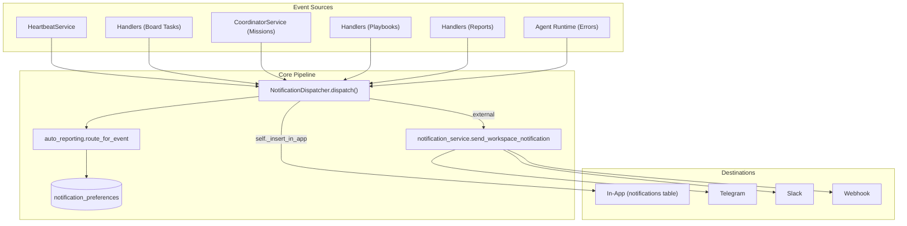
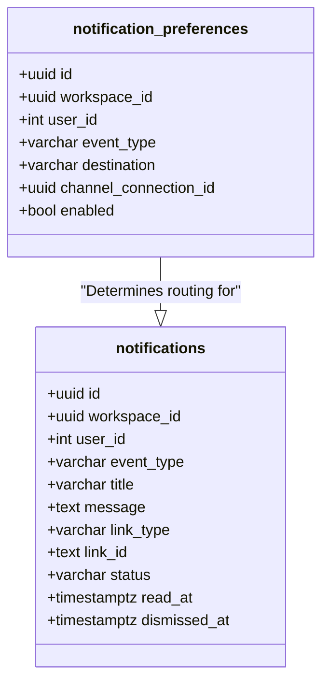

# Unified Notification System

Relevant source files

The following files were used as context for generating this wiki page:

- [docs/PRDS/128-UNIFIED-NOTIFICATION-SYSTEM.md](docs/PRDS/128-UNIFIED-NOTIFICATION-SYSTEM.md)
- [docs/PRDS/129-WORKSPACE-OUTPUTS-HUB.md](docs/PRDS/129-WORKSPACE-OUTPUTS-HUB.md)
- [orchestrator/alembic/versions/prd128_notifications.py](orchestrator/alembic/versions/prd128_notifications.py)
- [orchestrator/api/shopify.py](orchestrator/api/shopify.py)
- [orchestrator/consumers/chatbot/auto.py](orchestrator/consumers/chatbot/auto.py)
- [orchestrator/core/security/rate_limiter.py](orchestrator/core/security/rate_limiter.py)
- [orchestrator/core/seeds/seed_shopify_agents.py](orchestrator/core/seeds/seed_shopify_agents.py)
- [orchestrator/core/services/auto_reporting.py](orchestrator/core/services/auto_reporting.py)
- [orchestrator/core/services/notification_dispatcher.py](orchestrator/core/services/notification_dispatcher.py)
- [orchestrator/modules/tools/discovery/actions_auto_reporting.py](orchestrator/modules/tools/discovery/actions_auto_reporting.py)
- [orchestrator/modules/tools/discovery/handlers_auto_reporting.py](orchestrator/modules/tools/discovery/handlers_auto_reporting.py)
- [orchestrator/modules/tools/discovery/platform_actions.py](orchestrator/modules/tools/discovery/platform_actions.py)
- [orchestrator/modules/tools/discovery/platform_executor.py](orchestrator/modules/tools/discovery/platform_executor.py)
- [orchestrator/tests/test_prd128_notification_dispatcher.py](orchestrator/tests/test_prd128_notification_dispatcher.py)

The **Unified Notification System** (PRD-128) provides a centralized pipeline for capturing, routing, and surfacing events across the Automatos AI platform. It consolidates fragmented notification logic from heartbeats, tasks, missions, and playbooks into a single `NotificationDispatcher` service. This system enables users to receive real-time updates via an in-app "bell" dropdown or external channels (Telegram, Slack, Webhooks) based on per-workspace and per-user preferences.

## System Architecture

The notification architecture follows a "fire-and-forget" fan-out pattern. Event sources invoke the dispatcher, which resolves routing logic and distributes messages to one or more destinations.

### Notification Flow

**Sources:** [orchestrator/core/services/notification_dispatcher.py:1-28](), [orchestrator/core/services/notification_dispatcher.py:87-111](), [orchestrator/core/services/auto_reporting.py:127-154]()

## Core Components

### NotificationDispatcher
The `NotificationDispatcher` is the central entry point for all notification events [orchestrator/core/services/notification_dispatcher.py:76-77](). It is designed to be non-blocking; the caller owns the transaction, and notification writes roll back if the main work fails [orchestrator/core/services/notification_dispatcher.py:11-13](). It handles the resolution of workspace-level defaults and user-specific overrides to determine exactly where a message should be sent.

For technical details on fan-out logic and transaction handling, see **[NotificationDispatcher](#24.1)**.

### Notification API & Settings
The system provides a RESTful interface for the frontend to interact with notification data. This includes endpoints for fetching unread counts, marking notifications as read or dismissed, and managing routing preferences for nine specific event types (e.g., `task_complete`, `agent_error`). The system also supports an `auto_reporting` configuration stored in `workspace.settings` for advanced routing and quiet hours [orchestrator/core/services/auto_reporting.py:6-23]().

For API specifications and event type definitions, see **[Notification API & Settings](#24.2)**.

### Notification Bell UI
The user-facing interface consists of a real-time notification bell in the navbar. It polls for unread updates and provides a popover list of recent events. Each notification is actionable, containing deep links mapped via `link_type` (e.g., `report`, `task`, `mission`) [orchestrator/alembic/versions/prd128_notifications.py:64-65]().

For details on the React components and polling logic, see **[Notification Bell UI](#24.3)**.

## Event Types and Defaults

The system categorizes events into 9 distinct types [orchestrator/core/services/notification_dispatcher.py:45-57]().

| Event Type | Default Behavior | Trigger Source |
| :--- | :--- | :--- |
| `heartbeat_complete` | `in_app` | Proactive heartbeat cycle finished |
| `task_complete` | `in_app` | Board task marked "done" |
| `mission_complete` | `in_app` | Mission reached terminal state |
| `mission_step_complete`| `silent` | Individual step progress (noisy) |
| `playbook_complete` | `in_app` | Playbook execution finished |
| `playbook_step_complete`| `silent` | Individual step progress (noisy) |
| `trigger_fired` | `in_app` | External tool trigger received |
| `report_submitted` | `in_app` | Agent generated a report |
| `agent_error` | `in_app` | Agent encountered a runtime error |

**Sources:** [orchestrator/core/services/notification_dispatcher.py:45-57](), [orchestrator/alembic/versions/prd128_notifications.py:152-162]()

## Data Model Integration

The system uses two primary tables to manage state and preferences.

**Sources:** [orchestrator/alembic/versions/prd128_notifications.py:32-42](), [orchestrator/alembic/versions/prd128_notifications.py:57-72]()

## Implementation Constraints
*   **Transaction Safety:** The dispatcher performs `INSERT` operations using `self.db.execute` but does not commit, ensuring notifications are atomic with the event that triggered them [orchestrator/core/services/notification_dispatcher.py:11-13]().
*   **User Overrides:** User-specific preference rows (where `user_id` is not null) take precedence over workspace defaults for the same destination [orchestrator/core/services/notification_dispatcher.py:18-21]().
*   **Quiet Hours:** If `auto_reporting` is enabled, non-urgent traffic is funneled to `in_app` during configured quiet windows [orchestrator/core/services/notification_dispatcher.py:147-160](), [orchestrator/core/services/auto_reporting.py:99-125]().
*   **Platform Tools:** Agents can interact with the system via `platform_send_notification` and `platform_update_auto_reporting_prefs` tools [orchestrator/modules/tools/discovery/actions_auto_reporting.py:38-154]().

**Sources:** [orchestrator/core/services/notification_dispatcher.py:1-28](), [orchestrator/core/services/auto_reporting.py:1-27](), [orchestrator/modules/tools/discovery/handlers_auto_reporting.py:57-108]()

---