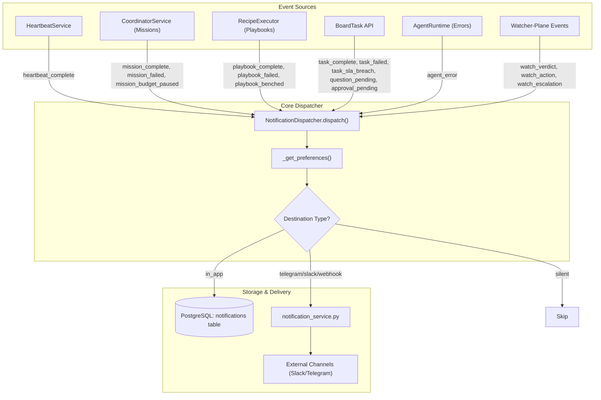
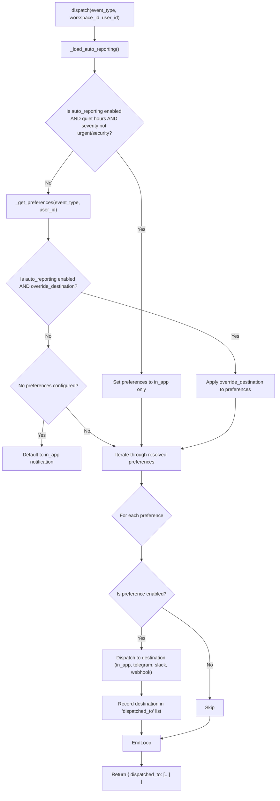

# Notification API & Settings

Relevant source files

The following files were used as context for generating this wiki page:

- [frontend/app/layout.tsx](frontend/app/layout.tsx)
- [frontend/components/activity/widgets/command-centre-dashboard.tsx](frontend/components/activity/widgets/command-centre-dashboard.tsx)
- [frontend/components/activity/widgets/decisions-needed-widget.tsx](frontend/components/activity/widgets/decisions-needed-widget.tsx)
- [frontend/components/activity/widgets/playbook-metrics-widget.tsx](frontend/components/activity/widgets/playbook-metrics-widget.tsx)
- [frontend/components/activity/widgets/self-learning-health-widget.tsx](frontend/components/activity/widgets/self-learning-health-widget.tsx)
- [frontend/components/context/configure-rag-modal.tsx](frontend/components/context/configure-rag-modal.tsx)
- [frontend/components/documents/delete-confirmation-modal.tsx](frontend/components/documents/delete-confirmation-modal.tsx)
- [frontend/components/documents/document-details-modal.tsx](frontend/components/documents/document-details-modal.tsx)
- [frontend/components/documents/team-multi-select.tsx](frontend/components/documents/team-multi-select.tsx)
- [frontend/components/documents/upload-provider-modal.tsx](frontend/components/documents/upload-provider-modal.tsx)
- [frontend/hooks/use-context-management-api.ts](frontend/hooks/use-context-management-api.ts)
- [frontend/hooks/use-document-api.ts](frontend/hooks/use-document-api.ts)
- [frontend/hooks/use-kpi-api.ts](frontend/hooks/use-kpi-api.ts)
- [frontend/hooks/use-learning-api.ts](frontend/hooks/use-learning-api.ts)
- [frontend/hooks/use-notifications-api.ts](frontend/hooks/use-notifications-api.ts)
- [frontend/hooks/use-teams.ts](frontend/hooks/use-teams.ts)
- [frontend/hooks/use-template-api.ts](frontend/hooks/use-template-api.ts)
- [orchestrator/alembic/versions/prd158_cloud_default_team.py](orchestrator/alembic/versions/prd158_cloud_default_team.py)
- [orchestrator/api/kpi_api.py](orchestrator/api/kpi_api.py)
- [orchestrator/core/models/cloud_sync.py](orchestrator/core/models/cloud_sync.py)
- [orchestrator/core/services/auto_reporting.py](orchestrator/core/services/auto_reporting.py)
- [orchestrator/core/services/notification_dispatcher.py](orchestrator/core/services/notification_dispatcher.py)
- [orchestrator/modules/memory/tool_outcome_capture.py](orchestrator/modules/memory/tool_outcome_capture.py)
- [orchestrator/modules/rag/chunking/semantic_chunker.py](orchestrator/modules/rag/chunking/semantic_chunker.py)
- [orchestrator/modules/rag/services/cloud_file_downloader.py](orchestrator/modules/rag/services/cloud_file_downloader.py)
- [orchestrator/modules/rag/services/cloud_sync_service.py](orchestrator/modules/rag/services/cloud_sync_service.py)
- [orchestrator/modules/tools/discovery/actions_auto_reporting.py](orchestrator/modules/tools/discovery/actions_auto_reporting.py)
- [orchestrator/modules/tools/discovery/handlers_auto_reporting.py](orchestrator/modules/tools/discovery/handlers_auto_reporting.py)
- [orchestrator/tests/test_p2w2_ask_notification.py](orchestrator/tests/test_p2w2_ask_notification.py)
- [orchestrator/tests/test_tool_outcome_capture.py](orchestrator/tests/test_tool_outcome_capture.py)

The Notification API and Settings system (PRD-128) provides a centralized pipeline for capturing, routing, and managing events across the Automatos AI platform. It consolidates events from diverse sources—such as heartbeat cycles, task completions, and mission milestones—into a unified delivery mechanism that supports in-app notifications and external channel fan-out (Telegram, Slack, Webhooks) based on workspace and user preferences [orchestrator/core/services/notification_dispatcher.py:1-7]().

## System Architecture & Data Flow

The system follows a non-blocking "fire-and-forget" pattern where event sources invoke a central dispatcher. The dispatcher resolves routing logic and persists notifications or forwards them to external services.

### Notification Event Propagation

The following diagram illustrates the flow from an event trigger to the final delivery destination.

**Notification Event Propagation**

Sources: [orchestrator/core/services/notification_dispatcher.py:3-7](), [orchestrator/core/services/notification_dispatcher.py:93-116](), [orchestrator/core/services/notification_dispatcher.py:45-77]()

### Code Entity Mapping

| System Name | Code Entity | File Path |
|:---|:---|:---|
| **Dispatcher** | `NotificationDispatcher` | [orchestrator/core/services/notification_dispatcher.py:93-93]() |
| **Notification Router** | `router` (notifications) | [orchestrator/api/notifications.py:24-24]() |
| **External Service** | `send_workspace_notification` | [orchestrator/core/services/notification_service.py:38-38]() |
| **Event Validator** | `VALID_EVENT_TYPES` | [orchestrator/core/services/notification_dispatcher.py:45-74]() |

## Event Types & Default Routing

The system recognizes 20+ distinct event types. If no specific preferences are configured for a workspace, the system defaults to `in_app` delivery to ensure critical events are not lost [orchestrator/core/services/notification_dispatcher.py:22-24]().

| Event Type | Category | Description |
|:---|:---|:---|
| `heartbeat_complete` | Heartbeat | Triggered when a heartbeat cycle finishes. |
| `task_complete` | Tasks | Fired when a board task is marked "done". |
| `task_failed` | Tasks | Fired when a board task fails. |
| `task_sla_breach` | Tasks | Fired when a board task breaches its Service Level Agreement. |
| `approval_pending` | Tasks | Fired when an action requires human approval. |
| `question_pending` | Tasks | Fired when an agent raises a free-text question requiring human input. |
| `mission_plan_ready` | Missions | Fired when a mission plan is ready for review. |
| `mission_step_complete`| Missions | Progress updates for individual mission steps. |
| `mission_complete` | Missions | Fired when a mission reaches a terminal state. |
| `mission_failed` | Missions | Fired when a mission fails. |
| `mission_budget_paused` | Missions | Fired when a mission is paused due to budget constraints. |
| `playbook_step_complete`| Playbooks | Progress updates for individual playbook steps. |
| `playbook_complete` | Playbooks | Fired when a playbook execution finishes. |
| `playbook_failed` | Playbooks | Fired when a playbook execution fails. |
| `playbook_benched` | Playbooks | Fired when a scheduled playbook is skipped due to an open breaker. |
| `watch_verdict` | Watcher-Plane | Fired when a watcher-plane event generates a verdict. |
| `watch_action` | Watcher-Plane | Fired when a watcher-plane event triggers a corrective action. |
| `watch_escalation` | Watcher-Plane | Fired when a watcher-plane event escalates. |
| `trigger_fired` | Triggers | Fired when an external Composio trigger is received. |
| `report_submitted` | Reports | Triggered when an agent submits a structured report. |
| `agent_error` | System | Fired when an agent execution fails or raises an error. |

Sources: [orchestrator/core/services/notification_dispatcher.py:45-77](), [orchestrator/core/services/notification_dispatcher.py:153-162]()

## Notification API Reference

The API is divided into management of the notifications themselves and the configuration of preferences. All endpoints are workspace-scoped via hybrid authentication [orchestrator/api/notifications.py:24-24]().

### Notification Management (`/api/notifications`)

*   **GET `/`**: Returns a paginated list of notifications for the user/workspace, ordered by creation date [orchestrator/api/notifications.py:76-76]().
*   **GET `/unread-count`**: Returns the count of notifications where `read_at` is null [orchestrator/api/notifications.py:108-108]().
*   **POST `/{id}/read`**: Marks a specific notification as read by setting the `read_at` timestamp [orchestrator/api/notifications.py:126-126]().
*   **POST `/mark-all-read`**: Bulk updates all unread notifications for the user in the current workspace [orchestrator/api/notifications.py:154-154]().
*   **POST `/{id}/dismiss`**: Sets `dismissed_at`, effectively archiving the notification from the UI [orchestrator/api/notifications.py:177-177]().

### Notification Preferences (`/api/notification-preferences`)

*   **GET `/`**: Retrieves a merged view of notification settings, combining workspace-wide defaults with user-specific overrides [orchestrator/api/notifications.py:210-210]().
*   **PUT `/`**: Performs a bulk upsert of preferences for the current user/workspace [orchestrator/api/notifications.py:255-255]().

Sources: [orchestrator/api/notifications.py:76-295]()

## Implementation Details

### The NotificationDispatcher
The `NotificationDispatcher` class handles the logic of "who gets what". When `dispatch()` is called, it performs the following:
1.  **Preference Resolution**: It queries the `notification_preferences` table. If a user-specific row exists for a `(event_type, destination)` pair, it shadows the workspace default (`user_id IS NULL`) [orchestrator/core/services/notification_dispatcher.py:18-21]().
2.  **Auto-Reporting Overrides**: If `auto_reporting` is enabled in workspace settings, it can override per-event preferences or force traffic to `in_app` during "quiet hours" unless the severity is `urgent` or `security` [orchestrator/core/services/notification_dispatcher.py:129-140](), [orchestrator/core/services/notification_dispatcher.py:165-178]().
3.  **Transactional Integrity**: The dispatcher **does not commit** the database transaction. It uses `db.execute` for in-app rows, but the caller owns the transaction. Notification writes roll back if the main work fails [orchestrator/core/services/notification_dispatcher.py:11-13]().
4.  **Multi-Destination Fan-out**: One event can trigger multiple rows (e.g., `in_app` and `telegram`). The dispatcher iterates through all enabled rows [orchestrator/core/services/notification_dispatcher.py:181-205]().

### Scoping and Security
The system enforces strict multi-tenancy:
*   **Workspace Scoping**: Every query includes `workspace_id` filtering [orchestrator/core/services/notification_dispatcher.py:96-100]().
*   **User Scoping**: Notifications and preferences are isolated by `user_id` where applicable [orchestrator/core/services/notification_dispatcher.py:114-114]().

**Preference Resolution Logic**

Sources: [orchestrator/core/services/notification_dispatcher.py:93-185]()

### Data Models
The system relies on two primary tables:
1.  **`notification_preferences`**: Stores the routing rules. Columns include `event_type`, `destination`, `enabled`, and `channel_connection_id` [orchestrator/core/services/notification_dispatcher.py:142-152]().
2.  **`notifications`**: Stores the actual in-app alerts. Key fields include `link_type` and `link_id` (used by the frontend to navigate to the relevant entity), `agent_id`, and `status` [orchestrator/core/services/notification_dispatcher.py:192-205]().

Sources: [orchestrator/core/services/notification_dispatcher.py:142-205]()

---