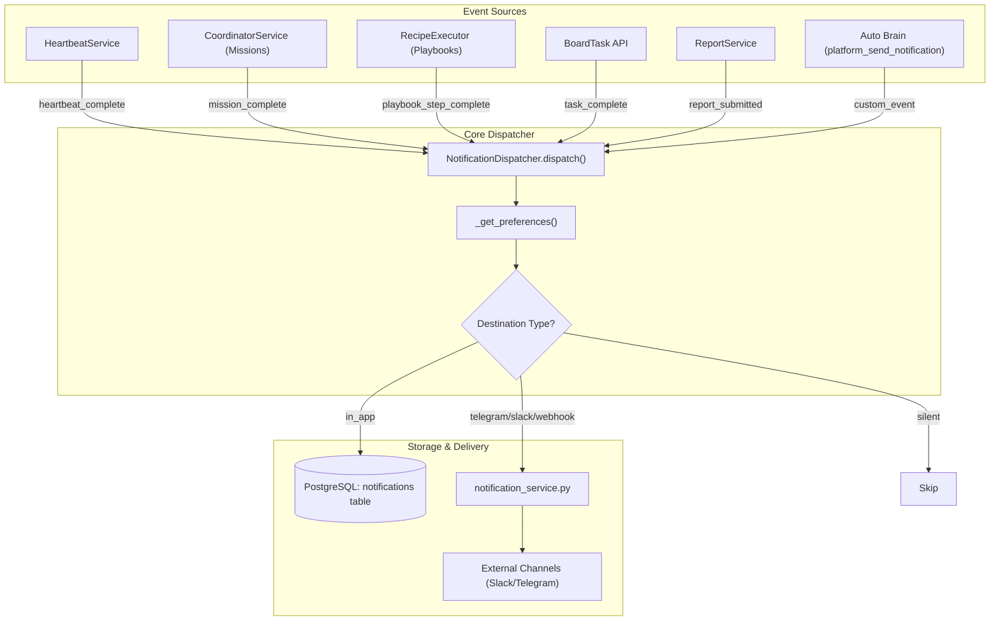
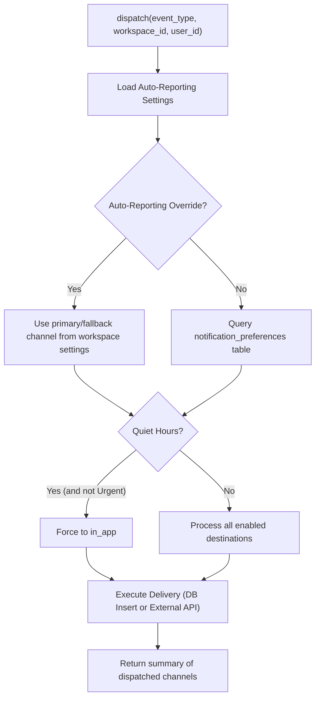

# Notification API & Settings

Relevant source files

The following files were used as context for generating this wiki page:

- [docs/PRDS/128-UNIFIED-NOTIFICATION-SYSTEM.md](docs/PRDS/128-UNIFIED-NOTIFICATION-SYSTEM.md)
- [docs/PRDS/129-WORKSPACE-OUTPUTS-HUB.md](docs/PRDS/129-WORKSPACE-OUTPUTS-HUB.md)
- [orchestrator/alembic/versions/prd128_notifications.py](orchestrator/alembic/versions/prd128_notifications.py)
- [orchestrator/api/shopify.py](orchestrator/api/shopify.py)
- [orchestrator/consumers/chatbot/auto.py](orchestrator/consumers/chatbot/auto.py)
- [orchestrator/core/security/rate_limiter.py](orchestrator/core/security/rate_limiter.py)
- [orchestrator/core/seeds/seed_shopify_agents.py](orchestrator/core/seeds/seed_shopify_agents.py)
- [orchestrator/core/services/auto_reporting.py](orchestrator/core/services/auto_reporting.py)
- [orchestrator/core/services/notification_dispatcher.py](orchestrator/core/services/notification_dispatcher.py)
- [orchestrator/modules/tools/discovery/actions_auto_reporting.py](orchestrator/modules/tools/discovery/actions_auto_reporting.py)
- [orchestrator/modules/tools/discovery/handlers_auto_reporting.py](orchestrator/modules/tools/discovery/handlers_auto_reporting.py)
- [orchestrator/modules/tools/discovery/platform_actions.py](orchestrator/modules/tools/discovery/platform_actions.py)
- [orchestrator/modules/tools/discovery/platform_executor.py](orchestrator/modules/tools/discovery/platform_executor.py)
- [orchestrator/tests/test_prd128_notification_dispatcher.py](orchestrator/tests/test_prd128_notification_dispatcher.py)

The Notification API and Settings system (PRD-128) provides a centralized pipeline for capturing, routing, and managing events across the Automatos AI platform. It consolidates events from diverse sources—such as heartbeat cycles, task completions, and mission milestones—into a unified delivery mechanism that supports in-app notifications and external channel fan-out (Telegram, Slack, Webhooks) based on workspace and user preferences [docs/PRDS/128-UNIFIED-NOTIFICATION-SYSTEM.md:19-23]().

## System Architecture & Data Flow

The system follows a non-blocking pattern where event sources invoke a central dispatcher. The dispatcher resolves routing logic and persists notifications or forwards them to external services. It is designed to be transactionally safe: the dispatcher never commits, allowing the caller to own the transaction so that notifications roll back if the main work fails [core/services/notification_dispatcher.py:11-13]().

### Notification Event Propagation

The following diagram illustrates the flow from an event trigger to the final delivery destination.

**Notification Event Propagation**

Sources: [core/services/notification_dispatcher.py:76-111](), [docs/PRDS/128-UNIFIED-NOTIFICATION-SYSTEM.md:20-23](), [modules/tools/discovery/handlers_auto_reporting.py:57-104]()

### Code Entity Mapping

| System Name | Code Entity | File Path |
|:---|:---|:---|
| **Dispatcher** | `NotificationDispatcher` | [core/services/notification_dispatcher.py:76-76]() |
| **Auto Reporting Logic** | `is_quiet_hours`, `route_for_event` | [core/services/auto_reporting.py:99-154]() |
| **Platform Action Handler** | `send_notification` | [modules/tools/discovery/handlers_auto_reporting.py:57-57]() |
| **Platform Tool Definition**| `platform_send_notification` | [modules/tools/discovery/actions_auto_reporting.py:95-95]() |
| **External Service** | `send_workspace_notification` | [core/services/notification_service.py:38-38]() |

## Event Types & Default Routing

The system recognizes 9 distinct event types. Upon workspace provisioning, default preferences are seeded to ensure immediate functionality [core/services/notification_dispatcher.py:45-57]().

| Event Type | Default Destination | Description |
|:---|:---|:---|
| `heartbeat_complete` | `in_app` | Triggered when a heartbeat cycle finishes. |
| `task_complete` | `in_app` | Fired when a board task is marked "done". |
| `mission_step_complete` | `silent` | High-frequency progress updates for mission steps. |
| `mission_complete` | `in_app` | Fired when a mission reaches a terminal state. |
| `playbook_step_complete`| `silent` | High-frequency progress updates for playbook steps. |
| `playbook_complete` | `in_app` | Fired when a playbook execution finishes. |
| `trigger_fired` | `in_app` | Fired when an external trigger (e.g. webhook) is received. |
| `report_submitted` | `in_app` | Triggered when an agent submits a structured report. |
| `agent_error` | `in_app` | Fired when an agent execution fails or raises an error. |

Sources: [core/services/notification_dispatcher.py:45-57](), [docs/PRDS/128-UNIFIED-NOTIFICATION-SYSTEM.md:152-162]()

## Notification API Reference

The API supports listing, marking as read, and bulk preference updates. All endpoints are workspace-scoped for multi-tenant isolation [alembic/versions/prd128_notifications.py:34-35]().

### Notification Management (`/api/notifications`)

*   **GET `/`**: Returns a paginated list of notifications for the workspace, ordered by `created_at DESC` [alembic/versions/prd128_notifications.py:84-87]().
*   **GET `/unread-count`**: Returns the count of notifications where `read_at` is NULL and `dismissed_at` is NULL [alembic/versions/prd128_notifications.py:84-87]().
*   **POST `/{id}/read`**: Marks a specific notification as read by updating the `read_at` timestamp [alembic/versions/prd128_notifications.py:69-69]().
*   **POST `/mark-all-read`**: Bulk updates all unread notifications for the user/workspace.
*   **POST `/{id}/dismiss`**: Sets `dismissed_at`, hiding the notification from the standard UI view [alembic/versions/prd128_notifications.py:70-70]().

### Notification Preferences (`/api/notification-preferences`)

*   **GET `/`**: Retrieves effective settings. It merges workspace-wide defaults with user-specific overrides from the `notification_preferences` table [core/services/notification_dispatcher.py:18-21]().
*   **PUT `/`**: Bulk upsert of preferences. Accepts a list of event types and their desired destinations (in_app, telegram, slack, webhook, silent) [core/services/notification_dispatcher.py:168-170]().

## Implementation Details

### The NotificationDispatcher
The `NotificationDispatcher` handles multi-destination fan-out. If a workspace has no preferences configured for an event, it defaults to a single `in_app` row to ensure no events are silently dropped [core/services/notification_dispatcher.py:22-24]().

**Preference Resolution Logic**

Sources: [core/services/notification_dispatcher.py:112-162](), [core/services/auto_reporting.py:99-125]()

### Auto-Reporting & Quiet Hours (Wave 2)
Wave 2 introduced `auto_reporting` settings stored directly in `workspace.settings` [core/services/auto_reporting.py:6-23]().
*   **Quiet Hours**: When enabled, non-urgent traffic is funneled to `in_app` during specified times (e.g., 22:00 to 08:00) [core/services/auto_reporting.py:99-105]().
*   **Routing Aliases**: Users can define "primary" and "fallback" channels, which are resolved to concrete destinations like Slack or Telegram at dispatch time [core/services/auto_reporting.py:167-184]().
*   **Severity-based Routing**: Routes can be specific to event/severity pairs (e.g., `agent_error:urgent` -> `telegram`) [core/services/auto_reporting.py:132-138]().

### Data Models
1.  **`notification_preferences`**: Routing rules. Multiple rows can exist for one event type to allow multi-channel fan-out [alembic/versions/prd128_notifications.py:32-42]().
2.  **`notifications`**: The in-app inbox. Includes `link_type` (report, task, mission, etc.) and `link_id` for frontend deep-linking [alembic/versions/prd128_notifications.py:57-72]().

Sources: [alembic/versions/prd128_notifications.py:32-88](), [core/services/notification_dispatcher.py:174-186]()

---