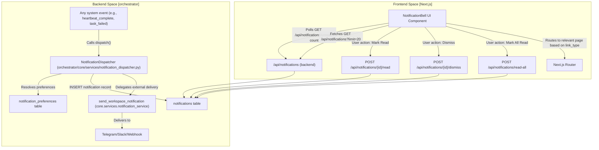
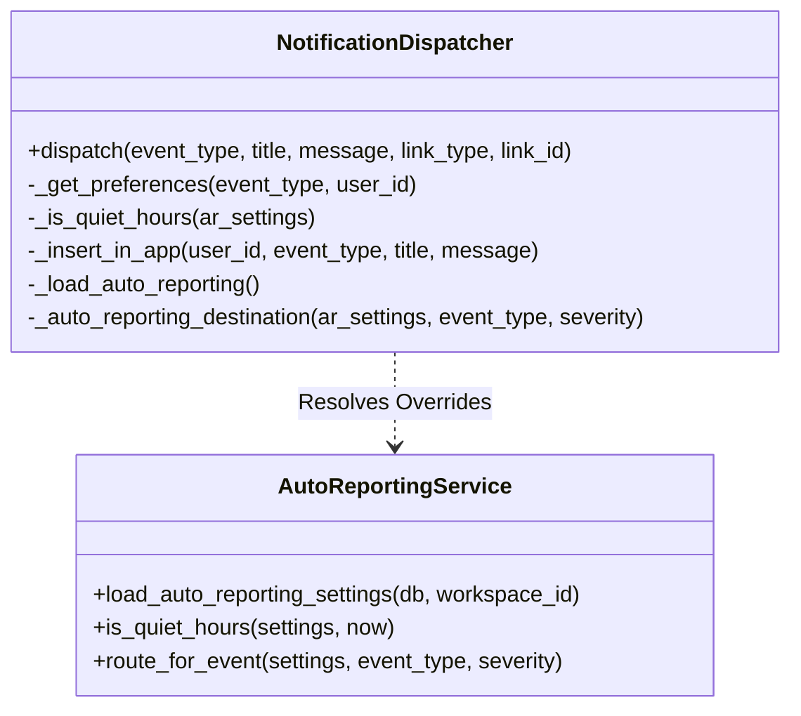

# Notification Bell UI

Relevant source files

The following files were used as context for generating this wiki page:

- [SPRINT0_OVERNIGHT_REPORT.md](SPRINT0_OVERNIGHT_REPORT.md)
- [frontend/app/deliverables/explorer/page.tsx](frontend/app/deliverables/explorer/page.tsx)
- [frontend/app/deliverables/page.tsx](frontend/app/deliverables/page.tsx)
- [frontend/app/layout.tsx](frontend/app/layout.tsx)
- [frontend/app/marketplace/developer/page.tsx](frontend/app/marketplace/developer/page.tsx)
- [frontend/app/marketplace/publish/page.tsx](frontend/app/marketplace/publish/page.tsx)
- [frontend/app/settings/notifications/page.tsx](frontend/app/settings/notifications/page.tsx)
- [frontend/app/settings/profile/page.tsx](frontend/app/settings/profile/page.tsx)
- [frontend/components/activity/widgets/command-centre-dashboard.tsx](frontend/components/activity/widgets/command-centre-dashboard.tsx)
- [frontend/components/activity/widgets/decisions-needed-widget.tsx](frontend/components/activity/widgets/decisions-needed-widget.tsx)
- [frontend/components/activity/widgets/playbook-metrics-widget.tsx](frontend/components/activity/widgets/playbook-metrics-widget.tsx)
- [frontend/components/activity/widgets/self-learning-health-widget.tsx](frontend/components/activity/widgets/self-learning-health-widget.tsx)
- [frontend/components/auth/require-role.tsx](frontend/components/auth/require-role.tsx)
- [frontend/components/settings/ApiKeyManager.tsx](frontend/components/settings/ApiKeyManager.tsx)
- [frontend/components/settings/NotificationsSettingsTab.tsx](frontend/components/settings/NotificationsSettingsTab.tsx)
- [frontend/hooks/use-kpi-api.ts](frontend/hooks/use-kpi-api.ts)
- [frontend/hooks/use-learning-api.ts](frontend/hooks/use-learning-api.ts)
- [frontend/stores/index.ts](frontend/stores/index.ts)
- [orchestrator/alembic/versions/prd195_drop_authz_fossil_tables.py](orchestrator/alembic/versions/prd195_drop_authz_fossil_tables.py)
- [orchestrator/api/kpi_api.py](orchestrator/api/kpi_api.py)
- [orchestrator/core/services/auto_reporting.py](orchestrator/core/services/auto_reporting.py)
- [orchestrator/core/services/notification_dispatcher.py](orchestrator/core/services/notification_dispatcher.py)
- [orchestrator/modules/memory/tool_outcome_capture.py](orchestrator/modules/memory/tool_outcome_capture.py)
- [orchestrator/modules/tools/discovery/actions_auto_reporting.py](orchestrator/modules/tools/discovery/actions_auto_reporting.py)
- [orchestrator/modules/tools/discovery/handlers_auto_reporting.py](orchestrator/modules/tools/discovery/handlers_auto_reporting.py)
- [orchestrator/tests/test_p2w2_ask_notification.py](orchestrator/tests/test_p2w2_ask_notification.py)
- [orchestrator/tests/test_tool_outcome_capture.py](orchestrator/tests/test_tool_outcome_capture.py)

The Notification Bell UI is a centralized frontend component for the **Unified Notification System (PRD-128)**. It provides real-time awareness of platform events through 30-second unread-count polling, a scrollable popover of recent notifications, and deep-linking to the relevant entities (missions, tasks, heartbeats, etc.) based on the event's `link_type`.

## Architecture & Data Flow

The UI operates by interacting with the `notifications` and `notification_preferences` tables through the FastAPI backend. Notifications are generated by the `NotificationDispatcher` service when events occur in the orchestrator or agent runtimes.

The `NotificationDispatcher` acts as the single entry point for all platform events, reading preferences for the current workspace/user and fanning out to `in_app` or external destinations like Telegram and Slack [orchestrator/core/services/notification_dispatcher.py:1-7]().

### Data Flow Diagram

The following diagram illustrates the flow from a system event to the UI update:

**Notification Lifecycle**

Sources: [orchestrator/core/services/notification_dispatcher.py:93-128](), [orchestrator/core/services/notification_dispatcher.py:38-38]()

## Key Components

### 1. NotificationBell React Component
The primary entry point located in the navigation bar. It manages the following state and behaviors:
*   **Unread Count Polling:** Polls the `/api/notifications/unread-count` endpoint to update the red badge count.
*   **Recent Notifications Popover:** On click, fetches the 20 most recent notifications via `GET /api/notifications?limit=20`.
*   **Action Handling:**
    *   **Mark Read:** Triggered when a notification row is clicked, calling `POST /api/notifications/{id}/read`.
    *   **Mark All Read:** A bulk action in the popover header calling `POST /api/notifications/read-all`.
    *   **Dismiss:** An "x" button on each row that calls `POST /api/notifications/{id}/dismiss` to remove it from the view.

### 2. Navigation Logic (`linkFor`)
The UI uses a mapping function to resolve the `link_type` and `link_id` stored in the database into a frontend route. The `NotificationDispatcher` accepts these fields during dispatch to facilitate deep-linking [orchestrator/core/services/notification_dispatcher.py:109-110]().

| `link_type` | Target Route | Description |
| :--- | :--- | :--- |
| `mission` | `/missions/{link_id}` | Navigates to the Mission Detail Page |
| `task` | `/board?task={link_id}` | Opens the task on the Kanban board |
| `heartbeat` | `/agents/{agent_id}/heartbeats/{link_id}` | Shows specific heartbeat analysis |
| `playbook` | `/playbooks/history/{link_id}` | Navigates to execution logs |
| `report` | `/outputs/reports/{link_id}` | Opens the generated report |
| `deliverable` | `/deliverables?tab=outputs&artifact_type={link_id}` | Navigates to the Deliverables page, filtered by artifact type [frontend/app/deliverables/page.tsx:48-51]() |
| `explorer` | `/deliverables/explorer?path={link_id}` | Navigates to the Workspace Explorer, opening a specific path [frontend/app/deliverables/explorer/page.tsx:29-30]() |
| `profile` | `/settings/profile` | Navigates to the user's profile settings [frontend/app/settings/profile/page.tsx:24-26]() |
| `api_key` | `/settings/api-keys` | Navigates to the API Key Manager [frontend/components/settings/ApiKeyManager.tsx:154-155]() |

Sources: [orchestrator/core/services/notification_dispatcher.py:104-116](), [frontend/app/deliverables/page.tsx:48-51](), [frontend/app/deliverables/explorer/page.tsx:29-30](), [frontend/app/settings/profile/page.tsx:24-26](), [frontend/components/settings/ApiKeyManager.tsx:154-155]()

### 3. NotificationsSettingsTab
Located at `/settings/notifications`, this component allows users to manage their delivery preferences.
*   **Bulk Editor:** Uses `GET /api/notification-preferences` to retrieve a merged list of workspace defaults and user-specific overrides.
*   **Auto-Reporting Integration:** Surfaces settings from `workspace.settings.auto_reporting`, including quiet hours and channel routing overrides [orchestrator/core/services/auto_reporting.py:6-23]().

Sources: [frontend/app/settings/notifications/page.tsx:10-12](), [frontend/components/settings/NotificationsSettingsTab.tsx:1-3]()

## Implementation Details

### Backend API Support
The UI is backed by the `NotificationDispatcher` which handles complex logic like **Quiet Hours** (funneling non-urgent traffic to `in_app` during specified windows) [orchestrator/core/services/notification_dispatcher.py:164-178]() and **Auto-Reporting** overrides [orchestrator/core/services/notification_dispatcher.py:133-142]().

**API Logic Space**

Sources: [orchestrator/core/services/notification_dispatcher.py:93-102](), [orchestrator/core/services/auto_reporting.py:99-125](), [orchestrator/core/services/notification_dispatcher.py:133-142]()

### Event Types Handled in UI
The UI renders distinct icons and formatting for the core event types defined in the dispatcher [orchestrator/core/services/notification_dispatcher.py:45-74]():

*   `heartbeat_complete` / `task_complete` / `task_failed`
*   `approval_pending`: Used when a tool requires human confirmation [orchestrator/tests/test_p2w2_ask_notification.py:8-12]().
*   `mission_plan_ready` / `mission_complete` / `mission_failed`
*   `playbook_complete` / `playbook_failed`
*   `trigger_fired` / `report_submitted` / `agent_error`
*   `question_pending`: An agent raised a free-text question that parks its subject until a human answers [orchestrator/core/services/notification_dispatcher.py:51-54]().
*   `mission_budget_paused`: A mission was paused due to budget constraints [orchestrator/core/services/notification_dispatcher.py:61-62]().
*   `playbook_benched`: Scheduler skipped a cron fire on an open breaker [orchestrator/core/services/notification_dispatcher.py:66-68]().
*   `watch_verdict`, `watch_action`, `watch_escalation`: Events from the watcher-plane [orchestrator/core/services/notification_dispatcher.py:70-72]().

Sources: [orchestrator/core/services/notification_dispatcher.py:45-74](), [orchestrator/tests/test_p2w2_ask_notification.py:8-12]()

### Tool Outcome Capture
The system also captures notable tool outcomes (failures and resource creation) into memory as `tool_outcome` facts, which can trigger notifications if configured [orchestrator/modules/memory/tool_outcome_capture.py:1-7](). This includes cases where a tool requires confirmation, which is treated as an "ask" outcome [orchestrator/modules/memory/tool_outcome_capture.py:107-130]().

Sources: [orchestrator/modules/memory/tool_outcome_capture.py:1-7](), [orchestrator/modules/memory/tool_outcome_capture.py:107-130]()

## Technical Summary Table

| Feature | Implementation | File Reference |
| :--- | :--- | :--- |
| **Dispatcher Service** | `NotificationDispatcher` | [orchestrator/core/services/notification_dispatcher.py:93]() |
| **Status Icons** | ✅ (ok), ⚠️ (warn), ❌ (error) | [orchestrator/core/services/notification_dispatcher.py:76-83]() |
| **Quiet Hours** | `workspace.settings.auto_reporting.quiet_hours` | [orchestrator/core/services/auto_reporting.py:12-17]() |
| **Polling Interval** | 30 Seconds (Frontend default) | [frontend/hooks/use-learning-api.ts:50-50]() |
| **Fetch Limit** | 20 Notifications (Backend default) | [orchestrator/core/services/notification_dispatcher.py:87-87]() |
| **Approval Event** | `approval_pending` | [orchestrator/tests/test_p2w2_ask_notification.py:121-127]() |
| **Tool Outcome Capture** | `build_tool_outcome` function | [orchestrator/modules/memory/tool_outcome_capture.py:87]() |

Sources: [orchestrator/core/services/notification_dispatcher.py:1-128](), [orchestrator/core/services/auto_reporting.py:1-55](), [orchestrator/modules/memory/tool_outcome_capture.py:1-35](), [frontend/hooks/use-learning-api.ts:50-50]()

---