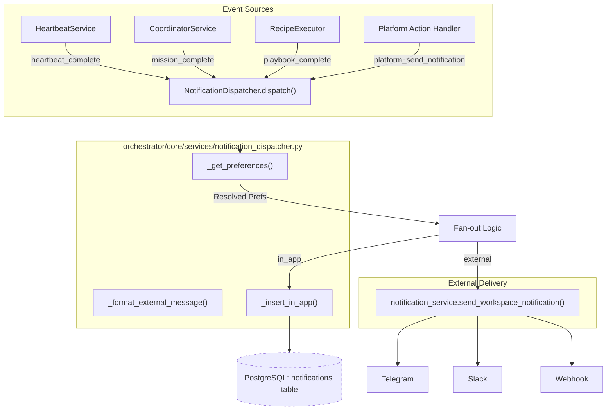
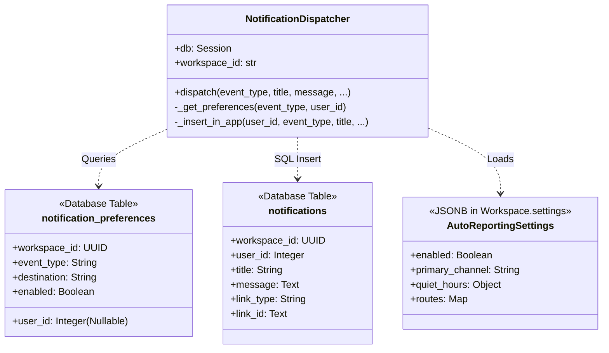

# NotificationDispatcher

<details>
<summary>Relevant source files</summary>

The following files were used as context for generating this wiki page:

- [orchestrator/consumers/chatbot/auto.py](orchestrator/consumers/chatbot/auto.py)
- [orchestrator/core/security/rate_limiter.py](orchestrator/core/security/rate_limiter.py)
- [orchestrator/core/services/auto_reporting.py](orchestrator/core/services/auto_reporting.py)
- [orchestrator/core/services/notification_dispatcher.py](orchestrator/core/services/notification_dispatcher.py)
- [orchestrator/modules/tools/discovery/actions_auto_reporting.py](orchestrator/modules/tools/discovery/actions_auto_reporting.py)
- [orchestrator/modules/tools/discovery/handlers_auto_reporting.py](orchestrator/modules/tools/discovery/handlers_auto_reporting.py)
- [orchestrator/modules/tools/discovery/platform_actions.py](orchestrator/modules/tools/discovery/platform_actions.py)
- [orchestrator/modules/tools/discovery/platform_executor.py](orchestrator/modules/tools/discovery/platform_executor.py)
- [orchestrator/tests/test_prd128_notification_dispatcher.py](orchestrator/tests/test_prd128_notification_dispatcher.py)

</details>


The `NotificationDispatcher` is the central service responsible for the unified notification pipeline in Automatos AI. It captures completion events from diverse sources—including heartbeats, board tasks, missions, playbooks, and agent errors—and routes them to various destinations based on per-workspace and per-user preferences [orchestrator/core/services/notification_dispatcher.py:1-7]().

## Architecture Overview

The dispatcher follows a "fire-and-forget" non-blocking pattern to ensure that notification delivery never interferes with the primary execution flow of agents or workflows. It is designed to be transaction-aware, where in-app notification records are staged but not committed by the dispatcher itself [orchestrator/core/services/notification_dispatcher.py:9-13]().

### Dispatch Flow
1.  **Event Capture**: A service (e.g., `CoordinatorService` or `HeartbeatService`) calls the `dispatch()` method [orchestrator/core/services/notification_dispatcher.py:87-111]().
2.  **Preference Resolution**: The dispatcher fetches a merged list of preferences via `_get_preferences()`, resolving overrides where user-specific settings take precedence over workspace defaults [orchestrator/core/services/notification_dispatcher.py:125-135]().
3.  **Fan-out**: The event is fanned out to all enabled destinations: `in_app`, `telegram`, `slack`, or `webhook` [orchestrator/core/services/notification_dispatcher.py:164-210]().
4.  **Transaction Handling**: For `in_app` notifications, the dispatcher executes a raw SQL insert via `_insert_in_app()` but **does not commit**. The caller owns the transaction, ensuring that if the main work fails, the notification is rolled back [orchestrator/core/services/notification_dispatcher.py:11-13]().

### Notification Pipeline Diagram
This diagram maps the logical flow from event sources to the code entities within the `NotificationDispatcher`.


Sources: [orchestrator/core/services/notification_dispatcher.py:76-210](), [orchestrator/modules/tools/discovery/handlers_auto_reporting.py:57-104]()

## Key Implementation Details

### Preference Resolution Logic
The `_get_preferences` method implements a specific override hierarchy [orchestrator/core/services/notification_dispatcher.py:255-275]():
*   **Workspace Defaults**: Stored with `user_id IS NULL`.
*   **User Overrides**: If a user-specific row exists for the same destination, it shadows the workspace default [orchestrator/core/services/notification_dispatcher.py:18-21]().
*   **Multi-Destination**: The preference table allows multiple destinations per event type (e.g., one `in_app` row AND one `telegram` row) [orchestrator/core/services/notification_dispatcher.py:14-17]().
*   **Default Fallback**: If no preferences are configured, the system defaults to a single `in_app` notification [orchestrator/core/services/notification_dispatcher.py:136-145]().

### Auto-Reporting & Quiet Hours (Wave 2)
The dispatcher integrates with `AutoReporting` settings stored in `workspace.settings.auto_reporting` [orchestrator/core/services/auto_reporting.py:6-23]():
*   **Routes Override**: Specific event types can be routed to `primary` or `fallback` channels [orchestrator/core/services/auto_reporting.py:127-154]().
*   **Quiet Hours**: Non-urgent traffic (anything not `urgent` or `security`) is funneled to `in_app` during the workspace's configured quiet window [orchestrator/core/services/notification_dispatcher.py:147-160]().

### Supported Event Types
The system currently recognizes 9 core event types [orchestrator/core/services/notification_dispatcher.py:45-57]():

| Event Type | Default | Description |
| :--- | :--- | :--- |
| `heartbeat_complete` | `in_app` | Heartbeat cycle finished |
| `task_complete` | `in_app` | Board task marked complete |
| `mission_step_complete`| `silent` | Per-step mission progress |
| `mission_complete` | `in_app` | Mission terminal state |
| `playbook_step_complete`| `silent` | Per-step playbook progress |
| `playbook_complete` | `in_app` | Playbook finished |
| `trigger_fired` | `in_app` | Composio trigger fired |
| `report_submitted` | `in_app` | Agent submitted a report |
| `agent_error` | `in_app` | Agent raised an error |

Sources: [orchestrator/core/services/notification_dispatcher.py:45-57]()

## Platform Action Integration

Agents can introspect and trigger notifications using the `platform_send_notification` tool, which routes through the `send_notification` handler [orchestrator/modules/tools/discovery/handlers_auto_reporting.py:57-64]().

```python
# orchestrator/modules/tools/discovery/handlers_auto_reporting.py:90-104
dispatcher = NotificationDispatcher(db, workspace_id)
result = await dispatcher.dispatch(
    event_type=event_type,
    title=title,
    message=params.get("message"),
    link_type=params.get("link_type"),
    link_id=params.get("link_id"),
    agent_id=params.get("_agent_id"),
    agent_name=params.get("_agent_name"),
    status=status,
    severity=severity,
)
db.commit() # Handlers commit explicitly
```

### Entity Mapping Diagram
This diagram shows how code entities and database structures interact within the dispatcher.


Sources: [orchestrator/core/services/notification_dispatcher.py:76-84](), [orchestrator/core/services/auto_reporting.py:42-55](), [orchestrator/core/services/notification_dispatcher.py:255-300]()

## Non-Blocking Pattern
Every fan-out operation in `dispatch()` is wrapped in a `try/except` block. This ensures that failures in external delivery—such as a network timeout to Telegram or a Slack API error—never crash the primary task or roll back the database transaction unless the `in_app` insert itself fails [orchestrator/core/services/notification_dispatcher.py:173-210]().

Sources:
* [orchestrator/core/services/notification_dispatcher.py:1-300]()
* [orchestrator/core/services/auto_reporting.py:1-156]()
* [orchestrator/modules/tools/discovery/handlers_auto_reporting.py:57-109]()
* [orchestrator/modules/tools/discovery/actions_auto_reporting.py:95-154]()

---