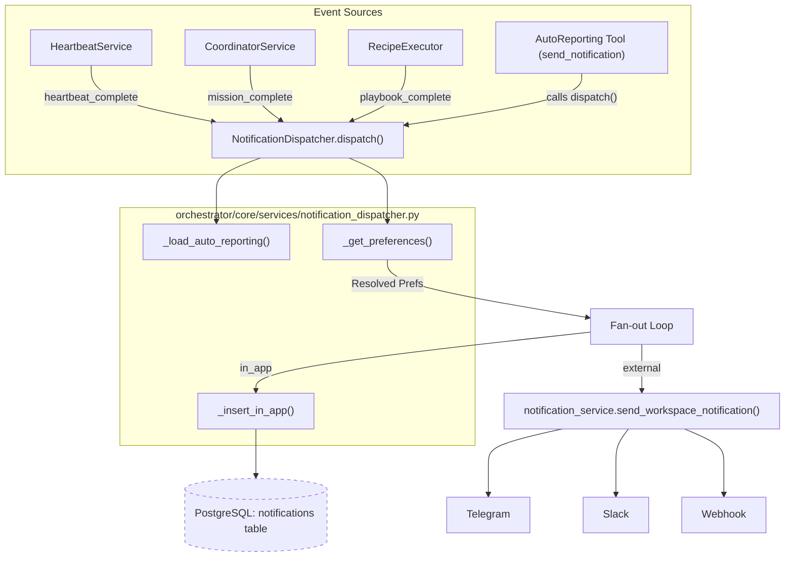
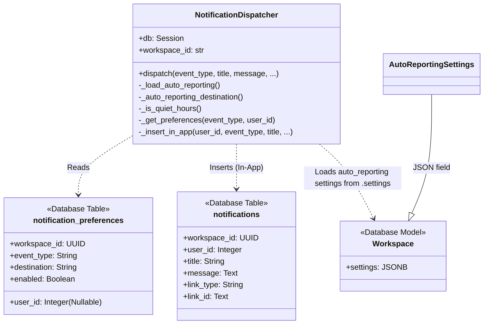

# NotificationDispatcher

Relevant source files

The following files were used as context for generating this wiki page:

- [frontend/app/layout.tsx](frontend/app/layout.tsx)
- [frontend/components/activity/widgets/command-centre-dashboard.tsx](frontend/components/activity/widgets/command-centre-dashboard.tsx)
- [frontend/components/activity/widgets/decisions-needed-widget.tsx](frontend/components/activity/widgets/decisions-needed-widget.tsx)
- [frontend/components/activity/widgets/playbook-metrics-widget.tsx](frontend/components/activity/widgets/playbook-metrics-widget.tsx)
- [frontend/components/activity/widgets/self-learning-health-widget.tsx](frontend/components/activity/widgets/self-learning-health-widget.tsx)
- [frontend/hooks/use-kpi-api.ts](frontend/hooks/use-kpi-api.ts)
- [frontend/hooks/use-learning-api.ts](frontend/hooks/use-learning-api.ts)
- [orchestrator/api/kpi_api.py](orchestrator/api/kpi_api.py)
- [orchestrator/core/services/auto_reporting.py](orchestrator/core/services/auto_reporting.py)
- [orchestrator/core/services/notification_dispatcher.py](orchestrator/core/services/notification_dispatcher.py)
- [orchestrator/modules/memory/tool_outcome_capture.py](orchestrator/modules/memory/tool_outcome_capture.py)
- [orchestrator/modules/tools/discovery/actions_auto_reporting.py](orchestrator/modules/tools/discovery/actions_auto_reporting.py)
- [orchestrator/modules/tools/discovery/handlers_auto_reporting.py](orchestrator/modules/tools/discovery/handlers_auto_reporting.py)
- [orchestrator/tests/test_p2w2_ask_notification.py](orchestrator/tests/test_p2w2_ask_notification.py)
- [orchestrator/tests/test_tool_outcome_capture.py](orchestrator/tests/test_tool_outcome_capture.py)

The `NotificationDispatcher` is the central service responsible for the unified notification pipeline in Automatos AI. It captures completion events from diverse sources—including heartbeats, board tasks, missions, playbooks, and agent errors—and routes them to various destinations based on per-workspace and per-user preferences [orchestrator/core/services/notification_dispatcher.py:1-7]().

## Architecture Overview

The dispatcher follows a "fire-and-forget" non-blocking pattern to ensure that notification delivery never interferes with the primary execution flow of agents or workflows [orchestrator/core/services/notification_dispatcher.py:9-28]().

### Dispatch Flow
1.  **Event Capture**: A service calls `dispatch()` with an `event_type` and metadata [orchestrator/core/services/notification_dispatcher.py:108-120]().
2.  **Auto-Reporting Resolution (Wave 2)**: The dispatcher checks `workspace.settings.auto_reporting` for global overrides, quiet hours, and specific routing rules [orchestrator/core/services/notification_dispatcher.py:137-145](). The `_load_auto_reporting` method is used to retrieve these settings [orchestrator/core/services/notification_dispatcher.py:137]().
3.  **Preference Resolution**: If no auto-reporting override exists, the dispatcher fetches a merged list of preferences from the `notification_preferences` table, resolving overrides where user-specific settings take precedence over workspace defaults [orchestrator/core/services/notification_dispatcher.py:147-167]().
4.  **Fan-out**: The event is fanned out to every enabled destination (In-App, Telegram, Slack, Webhook) [orchestrator/core/services/notification_dispatcher.py:183-226]().
5.  **Transaction Handling**: For `in_app` notifications, the dispatcher inserts rows via `db.execute` but **does not commit**. It relies on the caller's database transaction to ensure atomicity [orchestrator/core/services/notification_dispatcher.py:11-13]().

### Notification Pipeline Diagram
This diagram maps the logical flow from event sources to the code entities within the `NotificationDispatcher`.

Sources: [orchestrator/core/services/notification_dispatcher.py:9-28](), [orchestrator/core/services/notification_dispatcher.py:108-226](), [orchestrator/modules/tools/discovery/handlers_auto_reporting.py:57-90]()

## Key Implementation Details

### Preference Resolution Logic
The `_get_preferences` method implements a specific override hierarchy [orchestrator/core/services/notification_dispatcher.py:18-24]():
*   **Workspace Defaults**: Seeded during workspace provisioning with `user_id IS NULL`.
*   **User Overrides**: If a user has a specific preference for a destination, it shadows the workspace default for that specific destination [orchestrator/core/services/notification_dispatcher.py:18-21]().
*   **Default Fallback**: If no preferences are configured at all, the system defaults to a single `in_app` notification to prevent silent drops [orchestrator/core/services/notification_dispatcher.py:158-167]().

### Auto-Reporting Overrides (Wave 2)
The `auto_reporting` system (managed in `core.services.auto_reporting`) provides a higher-level configuration layer [orchestrator/core/services/auto_reporting.py:6-27]():
*   **Quiet Hours**: During configured quiet hours, non-urgent traffic is funneled exclusively to `in_app` [orchestrator/core/services/notification_dispatcher.py:169-182](). The `_is_quiet_hours` method determines if quiet hours are active [orchestrator/core/services/notification_dispatcher.py:173]().
*   **Specific Routing**: Workspaces can route specific `event_type:severity` combinations to specific channels (e.g., "security" always to Telegram) [orchestrator/core/services/auto_reporting.py:127-154](). The `_auto_reporting_destination` method handles this routing [orchestrator/core/services/notification_dispatcher.py:142]().

### Supported Event Types
The system currently recognizes a broad vocabulary of platform events defined in `VALID_EVENT_TYPES` [orchestrator/core/services/notification_dispatcher.py:45-74]():

| Event Type | Category | Description |
| :--- | :--- | :--- |
| `heartbeat_complete` | Heartbeat | Proactive check cycle finished |
| `task_complete` | Tasks | Board task marked done |
| `task_failed` | Tasks | Board task failed |
| `task_sla_breach` | Tasks | Board task breached SLA |
| `approval_pending` | Tools | Agent requires human grant to proceed |
| `question_pending` | Agents | Agent raised a free-text question |
| `mission_plan_ready` | Missions | Mission plan is ready for review |
| `mission_step_complete` | Missions | A step in a mission completed |
| `mission_complete` | Missions | Multi-agent mission finished |
| `mission_failed` | Missions | Mission failed |
| `mission_budget_paused`| Missions | Mission stopped due to cost limits |
| `playbook_step_complete` | Playbooks | A step in a playbook completed |
| `playbook_complete` | Playbooks | Automated recipe execution finished |
| `playbook_failed` | Playbooks | Playbook failed |
| `playbook_benched` | Playbooks | Breaker open, cron fire skipped |
| `watch_verdict` | Watcher | Watcher-plane S5/S6 events |
| `watch_action` | Watcher | Watcher-plane S7/S8 corrective actions |
| `watch_escalation` | Watcher | Watcher-plane escalations |
| `trigger_fired` | Triggers | A configured trigger fired |
| `report_submitted` | Reports | A report was submitted |
| `agent_error` | System | Agent encountered a runtime error |

Sources: [orchestrator/core/services/notification_dispatcher.py:45-74](), [orchestrator/tests/test_p2w2_ask_notification.py:121-127]()

## Service Integration

### Tool Integration
Agents can trigger notifications directly via the `send_notification` handler in the auto-reporting module, which wraps the dispatcher [orchestrator/modules/tools/discovery/handlers_auto_reporting.py:57-108](). This handler validates the `event_type`, `title`, `severity`, and `status` before calling `NotificationDispatcher.dispatch()` [orchestrator/modules/tools/discovery/handlers_auto_reporting.py:66-100]().

### Entity Mapping Diagram
This diagram shows how code entities and database structures interact within the dispatcher.

Sources: [orchestrator/core/services/notification_dispatcher.py:93-101](), [orchestrator/core/services/auto_reporting.py:6-27](), [orchestrator/core/services/notification_dispatcher.py:191-205]()

## Non-Blocking Pattern
Every external delivery is delegated to `send_workspace_notification` and wrapped in `try/except` blocks. Failures in external delivery (e.g., Telegram API timeout) are logged but do not propagate to the caller, ensuring that the primary agent task or mission execution remains uninterrupted [orchestrator/core/services/notification_dispatcher.py:214-226]().

Sources:
* [orchestrator/core/services/notification_dispatcher.py:1-226]()
* [orchestrator/core/services/auto_reporting.py:1-208]()
* [orchestrator/modules/tools/discovery/handlers_auto_reporting.py:57-108]()
* [orchestrator/tests/test_p2w2_ask_notification.py:121-205]()

---