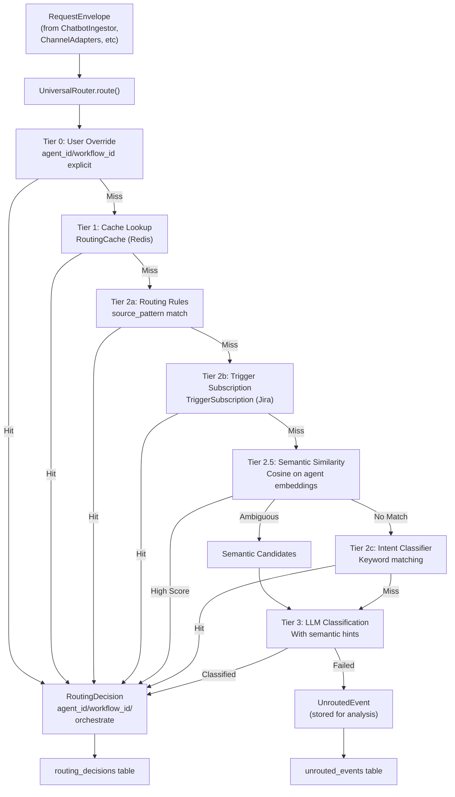
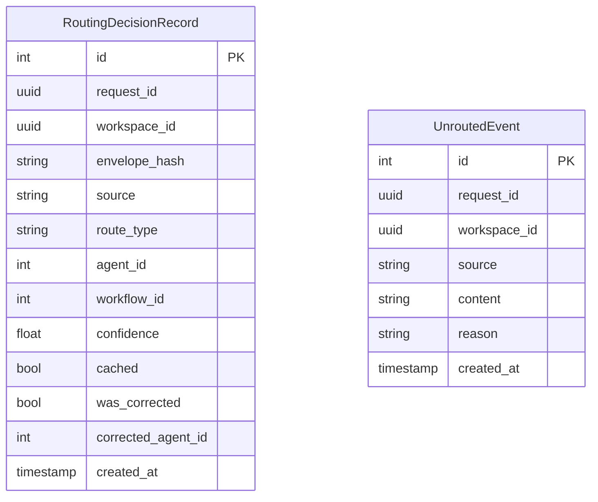
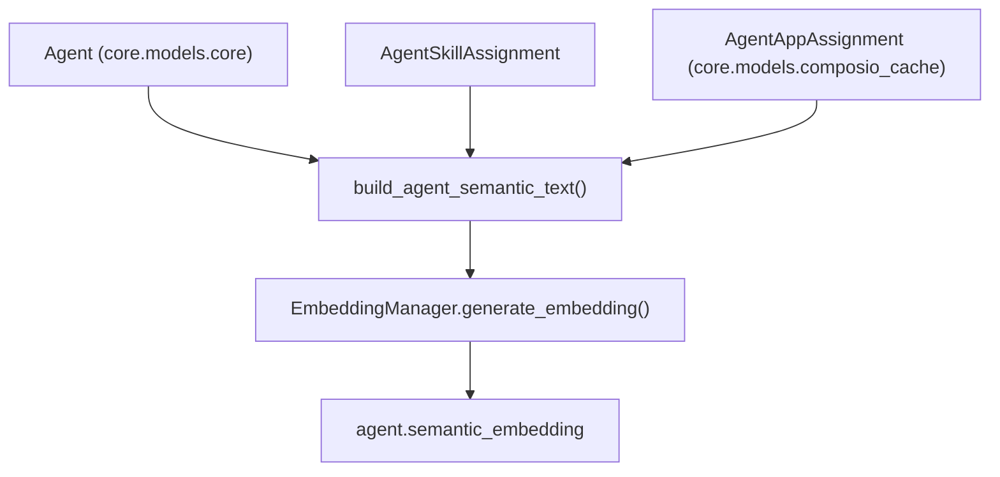

# Universal Router

Relevant source files

The following files were used as context for generating this wiki page:

- [docs/PRDS/58-PROMPT-MANAGEMENT-FUTUREAGI-INTEGRATION.md](docs/PRDS/58-PROMPT-MANAGEMENT-FUTUREAGI-INTEGRATION.md)
- [docs/PRDS/59-WORKFLOW-ENGINE-V2-NEURAL-SWARM-BRIDGE.md](docs/PRDS/59-WORKFLOW-ENGINE-V2-NEURAL-SWARM-BRIDGE.md)
- [docs/PRDS/60-RAG-V3-TOP10-COMPETITIVE-UPGRADE.md](docs/PRDS/60-RAG-V3-TOP10-COMPETITIVE-UPGRADE.md)
- [docs/PRDS/61-NL2SQL-V2-COMPETITIVE-UPGRADE.md](docs/PRDS/61-NL2SQL-V2-COMPETITIVE-UPGRADE.md)
- [docs/PRDS/62-CODEGRAPH-V2-COMPETITIVE-UPGRADE.md](docs/PRDS/62-CODEGRAPH-V2-COMPETITIVE-UPGRADE.md)
- [docs/reviews/COMPOSIO-TOOL-REGRESSION-REVIEW.md](docs/reviews/COMPOSIO-TOOL-REGRESSION-REVIEW.md)
- [frontend/app/tools/callback/page.tsx](frontend/app/tools/callback/page.tsx)
- [frontend/components/composio/app-connection-button.tsx](frontend/components/composio/app-connection-button.tsx)
- [frontend/components/tools/composio-apps-section.tsx](frontend/components/tools/composio-apps-section.tsx)
- [frontend/components/tools/tool-config-modal.tsx](frontend/components/tools/tool-config-modal.tsx)
- [orchestrator/api/chat.py](orchestrator/api/chat.py)
- [orchestrator/api/chat_voice.py](orchestrator/api/chat_voice.py)
- [orchestrator/api/composio.py](orchestrator/api/composio.py)
- [orchestrator/api/routing.py](orchestrator/api/routing.py)
- [orchestrator/consumers/chatbot/auto.py](orchestrator/consumers/chatbot/auto.py)
- [orchestrator/consumers/chatbot/intent_classifier.py](orchestrator/consumers/chatbot/intent_classifier.py)
- [orchestrator/consumers/chatbot/personality.py](orchestrator/consumers/chatbot/personality.py)
- [orchestrator/consumers/chatbot/service.py](orchestrator/consumers/chatbot/service.py)
- [orchestrator/consumers/chatbot/smart_tool_router.py](orchestrator/consumers/chatbot/smart_tool_router.py)
- [orchestrator/core/composio/entity_manager.py](orchestrator/core/composio/entity_manager.py)
- [orchestrator/core/llm/manager.py](orchestrator/core/llm/manager.py)
- [orchestrator/core/routing/engine.py](orchestrator/core/routing/engine.py)
- [orchestrator/modules/orchestrator/service.py](orchestrator/modules/orchestrator/service.py)
- [orchestrator/modules/tools/discovery/actions_analytics_enhanced.py](orchestrator/modules/tools/discovery/actions_analytics_enhanced.py)
- [orchestrator/modules/tools/discovery/handlers_analytics_enhanced.py](orchestrator/modules/tools/discovery/handlers_analytics_enhanced.py)
- [orchestrator/modules/tools/discovery/handlers_search.py](orchestrator/modules/tools/discovery/handlers_search.py)
- [orchestrator/modules/tools/discovery/platform_actions.py](orchestrator/modules/tools/discovery/platform_actions.py)
- [orchestrator/modules/tools/discovery/platform_executor.py](orchestrator/modules/tools/discovery/platform_executor.py)
- [orchestrator/modules/tools/tool_router.py](orchestrator/modules/tools/tool_router.py)
- [orchestrator/scripts/setup_jira_trigger.py](orchestrator/scripts/setup_jira_trigger.py)

The Universal Router is Automatos AI's intelligent message routing system that determines which agent or workflow should handle an incoming request. It implements a 7-tier routing strategy that progressively escalates from fast, deterministic rules to semantic similarity and LLM-based classification, ensuring optimal routing accuracy while minimizing latency and cost.

For information about complexity assessment (which precedes routing), see [Complexity Assessment (AutoBrain)](#9.2). For context assembly after routing, see [Context Service](#4).

---

## Routing Architecture

The Universal Router operates on a normalized input (`RequestEnvelope`) and produces a routing decision (`RoutingDecision`) by evaluating the request through a series of tiers until a match is found.

### High-Level Flow

**Sources:** [orchestrator/core/routing/engine.py:79-163]()

---

### RequestEnvelope

The `RequestEnvelope` is the normalized input to the router, containing:

| Field | Type | Description |
|-------|------|-------------|
| `id` | `UUID` | Unique request identifier |
| `workspace_id` | `UUID` | Workspace context |
| `source` | `ChannelSource` | Origin channel (chatbot, slack, telegram, jira_trigger, etc.) |
| `content` | `str` | Normalized message text |
| `override_agent_id` | `Optional[int]` | Explicit agent selection (Tier 0) |
| `override_workflow_id` | `Optional[int]` | Explicit workflow selection (Tier 0) |
| `metadata` | `Dict` | Channel-specific metadata (e.g., trigger_name for Jira) |

Envelopes are created by **ingestors** that normalize messages from different sources. For details, see [Routing Architecture](#10.1).

**Sources:** [orchestrator/core/models/routing.py](), [orchestrator/core/routing/engine.py:37]()

---

### RoutingDecision

The `RoutingDecision` is the output, specifying how to handle the request:

| Field | Type | Description |
|-------|------|-------------|
| `route_type` | `str` | "agent", "workflow", or "orchestrate" |
| `agent_id` | `Optional[int]` | Target agent ID (if route_type=agent) |
| `workflow_id` | `Optional[int]` | Target workflow ID (if route_type=workflow) |
| `confidence` | `float` | Routing confidence (0.0–1.0) |
| `reasoning` | `str` | Human-readable explanation |

**Route Types:**

- **`agent`** — Route to a specific agent (most common).
- **`workflow`** — Route to a workflow/recipe (Tier 2b triggers, or explicit rules).
- **`orchestrate`** — No clear match; use orchestrator LLM (fallback when confidence < threshold).

**Sources:** [orchestrator/core/models/routing.py](), [orchestrator/core/routing/engine.py:38-42]()

---

### Decision Logging

All routing decisions are logged to the `routing_decisions` table for analytics and learning via `RoutingDecisionRecord`.

User corrections update `was_corrected` and `corrected_agent_id`, which feed into the cache learning loop.

**Sources:** [orchestrator/core/models/routing.py](), [orchestrator/core/routing/engine.py:39-41](), [orchestrator/api/routing.py:63-79]()

---

## Tier 0: User Overrides

When the user explicitly selects an agent or workflow, routing bypasses all other tiers. This is handled by `_tier0_override` in the routing engine.

**Confidence:** Always 1.0 (user decision is authoritative). For details, see [Tier 0: User Overrides](#10.2).

**Sources:** [orchestrator/core/routing/engine.py:169-184]()

---

## Tier 1: Cache Lookup

The `RoutingCache` stores recent routing decisions in Redis, keyed by `(workspace_id, content_hash, source)`.

**Normalization:** Content is lowercased and whitespace-stripped before hashing to improve hit rate via `_normalize_content`.

**Hit Rate:** Cache hits are ~5ms; misses proceed to Tier 2a. For details, see [Tier 1: Cache Lookup](#10.3).

**Sources:** [orchestrator/core/routing/cache.py:43](), [orchestrator/core/routing/engine.py:103-107]()

---

## Tier 2: Rule-Based Routing

Workspace admins can define routing rules in the `routing_rules` table. This tier includes:
- **Tier 2a**: Direct source pattern matching.
- **Tier 2b**: `TriggerSubscription` for external events like Jira webhooks.
- **Tier 2c**: Keyword matching via `IntentClassifier`.

For details, see [Tier 2: Rule-Based Routing](#10.4).

**Sources:** [orchestrator/core/routing/engine.py:109-122](), [orchestrator/api/routing.py:23-27]()

---

## Tier 2.5: Semantic Similarity

This tier uses agent embeddings to find the best match via cosine similarity. It embeds agent capabilities (description, skills, tools) into a vector space using the `EmbeddingManager`.

**Thresholds:**
- `SIMILARITY_DIRECT_ROUTE = 0.95`
- `SIMILARITY_CANDIDATE_MIN = 0.40`

For details, see [Tier 2.5: Semantic Similarity](#10.5).

**Sources:** [orchestrator/core/routing/engine.py:123-136](), [orchestrator/core/llm/manager.py:36]()

---

## Tier 3: LLM Classification

When all previous tiers fail, the router uses an LLM to classify the request. It utilizes the `ROUTER` context mode to assemble a prompt containing available agents and semantic hints from Tier 2.5.

For details, see [Tier 3: LLM Classification](#10.6).

**Sources:** [orchestrator/core/routing/engine.py:148-158](), [orchestrator/modules/context/__init__.py]()

---

## Routing Corrections & Learning

Users can correct routing decisions via the `POST /api/routing/corrections` endpoint. This records the correction in `RoutingDecisionRecord` and updates the `RoutingCache`.

**Threshold:** The system auto-updates the cache after **2+ corrections** for the same content hash. For details, see [Routing Corrections & Learning](#10.7).

**Sources:** [orchestrator/api/routing.py:290-343](), [orchestrator/core/routing/cache.py:112-152]()

---

## Management & Child Pages

This is a high-level overview. For deep dives into specific components, refer to the following child pages:

- **[Routing Architecture](#10.1)** — Detailed schema of `RequestEnvelope` and `RoutingDecision`.
- **[Tier 0: User Overrides](#10.2)** — How explicit UI selections bypass the engine.
- **[Tier 1: Cache Lookup](#10.3)** — Implementation of the Redis-based `RoutingCache`.
- **[Tier 2: Rule-Based Routing](#10.4)** — Managing `RoutingRule` and `TriggerSubscription`.
- **[Tier 2.5: Semantic Similarity](#10.5)** — The `SemanticIndexer` and cosine similarity logic.
- **[Tier 3: LLM Classification](#10.6)** — The `ROUTER` context mode and classification prompts.
- **[Routing Corrections & Learning](#10.7)** — The feedback loop that improves routing over time.

---